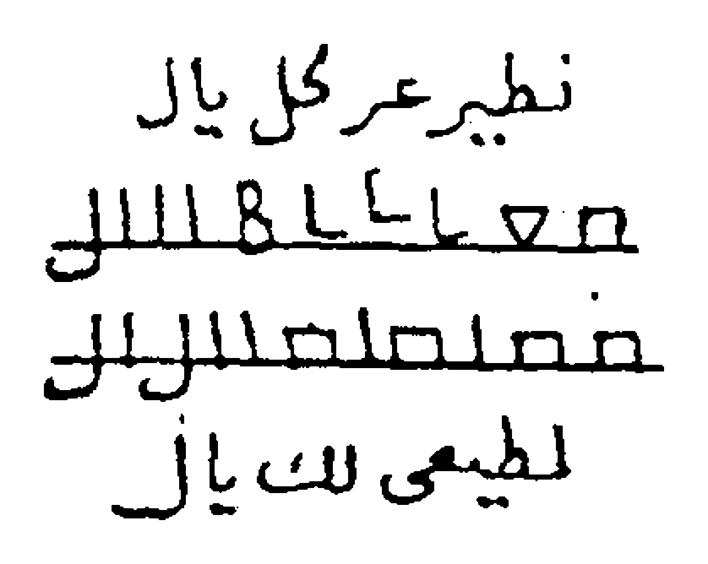

# BATCH 01 — Halaman PDF 1–5

> **الأسرار السليمانية في العلوم الروحانية** — Dr. Abdullah al-Jundi · al-Mathba'ah ats-Tsaqafiyyah, Bairut
> Sumber: `kitab/asrorul-sulaimaniyah.pdf` · Edisi kajian · Batch 1 dari 21 (hal. PDF 1–5)

**Catatan penyunting (berlaku untuk seluruh batch):**

- Penomoran: 1 halaman PDF = 1 halaman cetak. PDF hal. 1 = sampul; PDF hal. 2 = cetak 1; dan seterusnya (cetak = PDF − 1). Header berjalan dan footer (nomor telepon penulis) bukan isi kitab dan tidak diterjemahkan.
- Teks cetak tidak berharakat. Harakat, tanda baca, dan transliterasi ditambahkan oleh AI, bukan dari naskah; mohon dikoreksi nahwu/sharaf.
- Ejaan cetak yang tidak baku (ى/ه/ا) disesuaikan ke ejaan baku agar harakat bisa diberikan. Salah cetak tidak diperbaiki diam-diam: ditandai `[المطبوع: …]` (= yang tercetak) atau `[كذا]` (= demikian adanya).
- Transliterasi mengikuti bacaan washal (sambung): i'rab dibaca di tengah kalimat, waqf (tanpa i'rab/tanwin) di akhir kalimat atau koma. ث=ts, ذ=dz, ظ=zh, ض=dh, ص=sh, ط=th, ش=sy; tanda ' = hamzah/'ain.
- Nama-nama non-Arab (nama malaikat/seruan) tidak diterjemahkan; harakat dan bacaannya dugaan, ditandai (؟) pada teks Arab dan (?) pada teks Latin.
- Edisi kajian: teks diterjemahkan sebagai dokumen; klaim kitab disampaikan sebagai klaim penulis, bukan anjuran praktik.

---

## Halaman PDF 1 (= sampul)

### Bagian 1 — Judul, pengarang, dan penerbit

**[Teks Arab Asli]**

**الأَسْرَارُ السُّلَيْمَانِيَّةُ فِي العُلُومِ الرُّوحَانِيَّةِ**

تَأْلِيفُ العَالِمِ الرُّوحَانِيِّ الدُّكْتُورِ عَبْدِ اللَّهِ الجُنْدِيِّ

المَطْبَعَةُ الثَّقَافِيَّةُ، بَيْرُوتُ

**[Transliterasi Latin Fonetik]**

**Al-Asraarus-Sulaimaaniyyatu fil-'uluumir-ruuhaaniyyah**

*Ta'liiful-'aalimir-ruuhaaniyyid-duktuuri 'Abdillaahil-Jundiyy*

*Al-Math-ba'atuts-Tsaqaafiyyah, Bairuut*

**[Terjemahan Indonesia]**

**Rahasia-Rahasia Sulaimaniyah dalam Ilmu-Ilmu Ruhani**

Karya sang ahli ilmu ruhani (*al-'alim ar-ruhani*), Dr. Abdullah al-Jundi.

Percetakan Ats-Tsaqafiyyah (Percetakan Kebudayaan), Beirut.

**[Syarah]**

> Nisbat «Sulaimaniyyah» mengaitkan isi kitab dengan Nabi Sulaiman 'alaihis-salam, yang menurut Al-Qur'an dikaruniai kekuasaan atas angin, jin, dan burung (lih. QS. An-Naml: 17; Saba': 12). Dalam tradisi «ilmu hikmah/ruhani» populer, nisbat semacam ini lazim dipakai sebagai klaim asal-usul, bukan sebagai sanad yang teruji; terjemahan ini hanya mendokumentasikan teksnya. Judul pada sampul berupa kaligrafi dekoratif.

---

## Halaman PDF 2 (= cetak 1)

### Bagian 1 — Basmalah

**[Teks Arab Asli]**

**بِسْمِ اللَّهِ الرَّحْمَنِ الرَّحِيمِ**

**[Transliterasi Latin Fonetik]**

**Bismillaahir-Rahmaanir-Rahiim**

**[Terjemahan Indonesia]**

**Dengan nama Allah Yang Maha Pengasih lagi Maha Penyayang.**

### Bagian 2 — Hamdalah dan shalawat

**[Teks Arab Asli]**

الحَمْدُ لِلَّهِ رَبِّ العَالَمِينَ، حَمْدًا كَثِيرًا يُوَافِي نِعَمَهُ، قَاهِرِ الجَبَابِرِ وَالمُتَمَرِّدِينَ، وَقَاطِعِ دَابِرِ الظَّالِمِينَ وَالمُعْتَدِينَ، بِسَيْفِ جَبَرُوتِهِ وَسَطْوَتِهِ، وَسِهَامِ اقْتِدَارِهِ وَقُوَّتِهِ. وَالسَّلَامُ عَلَى سَيْفِ اللَّهِ المَسْلُولِ سَيِّدِنَا مُحَمَّدٍ، أَكْرَمِ نَبِيٍّ وَرَسُولٍ، وَعَلَى آلِهِ شُمُوسِ العَدَالَةِ، وَأَصْحَابِهِ نُجُومِ الهِدَايَةِ وَالدَّلَالَةِ.

**[Transliterasi Latin Fonetik]**

*Al-hamdu lillaahi rabbil-'aalamiin, hamdan katsiiran yuwaafii ni'amah, qaahiril-jabaabiri wal-mutamarridiin, wa qaathi'i daabirizh-zhaalimiina wal-mu'tadiin, bisaifi jabaruutihi wa sathwatih, wa sihaamiqtidaarihi wa quwwatih. Was-salaamu 'alaa saifillaahil-masluuli sayyidinaa Muhammad, akrami nabiyyin wa rasuul, wa 'alaa aalihi syumuusil-'adaalah, wa ash-haabihi nujuumil-hidaayati wad-dalaalah.*

**[Terjemahan Indonesia]**

Segala puji bagi Allah, Tuhan semesta alam, puji yang banyak yang setimpal dengan nikmat-nikmat-Nya; (Allah) Penakluk para penguasa lalim dan para pembangkang, Pemutus akar orang-orang zalim dan para pelampau batas, dengan pedang keperkasaan dan kedahsyatan-Nya, serta panah-panah kuasa dan kekuatan-Nya. Salam sejahtera atas pedang Allah yang terhunus, junjungan kami Muhammad, nabi dan rasul yang paling mulia; juga atas keluarganya yang bagaikan matahari-matahari keadilan, dan para sahabatnya yang bagaikan bintang-bintang petunjuk dan bimbingan.

**[Syarah]**

> Pembukaan berupa hamdalah dengan sifat-sifat Allah yang menekankan kekuasaan (*al-Qahir*, *Qathi' ad-dabir*). Julukan «pedang Allah yang terhunus» (*Saifullah al-maslul*) umumnya dikenal sebagai gelar Khalid bin al-Walid; penulis memakainya untuk Nabi Muhammad ﷺ, sebagaimana tertulis.

### Bagian 3 — Maksud penulisan kitab

**[Teks Arab Asli]**

وَبَعْدُ، فَهَذَا كِتَابُ الأَسْرَارِ السُّلَيْمَانِيَّةِ فِي العُلُومِ الرُّوحَانِيَّةِ، جَمَعَ مِنَ الفَوَائِدِ وَالأَبْوَابِ الرُّوحَانِيَّةِ القَدِيمَةِ الَّتِي أَطْلَعَنِي عَلَيْهَا اللَّهُ عَزَّ وَجَلَّ مِنَ الأَسْرَارِ السُّلَيْمَانِيَّةِ القَدِيمَةِ فِي العُلُومِ الرُّوحَانِيَّةِ.

**[Transliterasi Latin Fonetik]**

*Wa ba'du, fa-haadzaa kitaabul-asraaris-Sulaimaaniyyati fil-'uluumir-ruuhaaniyyah, jama'a minal-fawaaidi wal-abwaabir-ruuhaaniyyatil-qadiimatillatii ath-la'anii 'alaihallaahu 'azza wa jalla minal-asraaris-Sulaimaaniyyatil-qadiimati fil-'uluumir-ruuhaaniyyah.*

**[Terjemahan Indonesia]**

Amma ba'du: inilah kitab *Al-Asrar as-Sulaimaniyyah fil-'Ulum ar-Ruhaniyyah* (Rahasia-Rahasia Sulaimaniyah dalam Ilmu-Ilmu Ruhani), yang menghimpun sebagian faedah dan bab-bab ruhani kuno yang diperlihatkan Allah 'Azza wa Jalla (Yang Mahaperkasa lagi Mahaagung) kepadaku, dari rahasia-rahasia Sulaimaniyah kuno dalam ilmu-ilmu ruhani.

**[Syarah]**

> Kata «جمع» tercetak tanpa harakat; dapat dibaca *jama'a* («[kitab ini] menghimpun») atau *jam'un* («himpunan»), maknanya sama. Dalam tradisi populer, istilah «ilmu-ilmu ruhani» dipakai untuk ilmu hikmah (nama-nama, malaikat/jin, rajah, khatam/cincin, waktu astrologis), bukan semata ilmu tasawuf akhlak.

### Bagian 4 — Penamaan kitab dan doa penulis

**[Teks Arab Asli]**

وَقَدْ سَمَّيْتُ هَذَا الكِتَابَ بِالأَسْرَارِ السُّلَيْمَانِيَّةِ فِي العُلُومِ الرُّوحَانِيَّةِ، وَأَنَا الفَقِيرُ الذَّلِيلُ إِلَى اللَّهِ عَزَّ وَجَلَّ، عَبْدُ اللَّهِ الجُنْدِيُّ، وَفَّقَنِي اللَّهُ وَالمُسْلِمِينَ [المطبوع: والملسمين] لِمَا فِيهِ رِضَاهُ.

**[Transliterasi Latin Fonetik]**

*Wa qad sammaitu haadzal-kitaaba bil-asraaris-Sulaimaaniyyati fil-'uluumir-ruuhaaniyyah, wa anal-faqiirudz-dzaliilu ilallaahi 'azza wa jalla, 'Abdullaahil-Jundiyy, waffaqanillaahu wal-muslimiina limaa fiihi ridhaah.*

**[Terjemahan Indonesia]**

Dan aku telah menamai kitab ini *Al-Asrar as-Sulaimaniyyah fil-'Ulum ar-Ruhaniyyah*. Aku adalah hamba yang faqir lagi hina di hadapan Allah 'Azza wa Jalla, 'Abdullah al-Jundi. Semoga Allah memberi taufik kepadaku dan kaum muslimin menuju apa yang di dalamnya terdapat keridaan-Nya.

**[Syarah]**

> Cetakan memuat salah ketik «والملسمين» (terbaca *wal-mulsimiin*); dikoreksi menjadi «والمسلمين» («dan kaum muslimin») sesuai konteks doa, dan ditampakkan di teks Arab dengan kurung siku [المطبوع: …]. Kata ganti «aku» menunjukkan penulis menyebut dirinya sebagai penghimpun kitab.

### Bagian 5 — Pengenalan penulis

**[Teks Arab Asli]**

**تَعْرِيفُ المُؤَلِّفِ**

هُوَ العَالِمُ الرُّوحَانِيُّ الكَبِيرُ الدُّكْتُورُ عَبْدُ اللَّهِ الجُنْدِيُّ، الجِنْسِيَّةُ مِصْرِيٌّ. حَاصِلٌ عَلَى دُكْتُورَاه فِي عُلُومِ البَارَاسِيكُولُوجِي وَعُلُومِ مَا وَرَاءِ الطَّبِيعَةِ، وَحَاصِلٌ عَلَى أَكْثَرَ مِنْ عِشْرِينَ شَهَادَةَ دُكْتُورَاه دَوْلِيَّةً فِي عُلُومِ الفَلَكِ وَالتَّنْجِيمِ وَالطَّاقَةِ مِنْ فَرَنْسَا

**[Transliterasi Latin Fonetik]**

**Ta'riiful-mu'allif**

*Huwal-'aalimur-ruuhaaniyyul-kabiirud-duktuuru 'Abdullaahil-Jundiyy, al-jinsiyyatu mishriyy. Haashilun 'alaa duktuuraah fii 'uluumil-baaraasiikuuluujii wa 'uluumi maa waraa'ith-thabii'ah, wa haashilun 'alaa aktsara min 'isyriina syahaadata duktuuraah dauliyyatan fii 'uluumil-falaki wat-tanjiimi wath-thaaqati min Faransaa*

**[Terjemahan Indonesia]**

**Pengenalan Penulis**

Beliau adalah ahli ilmu ruhani yang agung, Dr. Abdullah al-Jundi, berkebangsaan Mesir. Beliau meraih gelar doktor dalam ilmu parapsikologi dan ilmu metafisika (ilmu tentang apa yang ada di balik alam fisik), serta meraih lebih dari dua puluh ijazah doktor internasional dalam ilmu falak, astrologi (*tanjim*), dan energi dari Prancis.

**[Syarah]**

> Gelar dan ijazah di atas adalah keterangan penulis tentang dirinya sendiri; penerjemah tidak memverifikasinya. Kalimat berhenti pada «dari Prancis» di halaman ini; halaman berikutnya memulai pasal baru.

---

## Halaman PDF 3 (= cetak 2)

### Bagian 1 — Nama-nama yang tertulis di dahi Jibril

**[Teks Arab Asli]**

**أَسْرَارُ الأَسْمَاءِ المَكْتُوبَةِ عَلَى جَبِينِ جِبْرَائِيلَ عَلَيْهِ السَّلَامُ**

فِي الأَسْمَاءِ المَكْتُوبَاتِ عَلَى جَبِينِ جِبْرَائِيلَ عَلَيْهِ السَّلَامُ، الوَاقِفِ عَلَى شِمَالِ القُدْرَةِ مُنْتَظِرًا مَا يُؤْمَرُ بِهِ مِنَ الوَحْيِ الإِلَهِيِّ. وَهِيَ عَلَى المَلَائِكَةِ المُخْتَصِّينَ بِاللَّوْحِ المُحِيطِ بِكُلِّ عِلْمٍ وَالعِلْمِ الرَّفِيعِ، مَتَى دَعَوْتَهُمْ بِهَا أَجَابُوا سَمْعًا وَطَاعَةَ اللَّهِ عَزَّ وَجَلَّ، وَبِأَسْمَائِهِ وَبِهَا خَلَقَهُمْ، وَهِيَ مَكْتُوبَةٌ عَلَى جَبِينِ جِبْرِيلَ عَلَيْهِ السَّلَامُ، وَهِيَ الَّتِي كَانَ يَتَكَلَّمُ بِهَا عِيسَى بْنُ مَرْيَمَ عَلَيْهِ السَّلَامُ عِنْدَ مُهِمَّاتِ الأَمْرِ، وَهِيَ هَذِهِ: طَشْ طَشْ طَشْطْ طَشَهْ يُوهَنِيطْ هُومِيَاطْ هُوثَاوُطْ (؟)، جَلَّ اللَّهُ عَزَّ وَجَلَّ، وَهُوَ عَلَى كُلِّ شَيْءٍ قَدِيرٌ.

**[Transliterasi Latin Fonetik]**

**Asraarul-asmaa'il-maktuubati 'alaa jabiini Jibraa'iila 'alaihis-salaam**

*Fil-asmaa'il-maktuubaati 'alaa jabiini Jibraa'iila 'alaihis-salaam, al-waaqifi 'alaa syimaalil-qudrati muntazhiran maa yu'maru bihi minal-wahyil-ilaahiyy. Wa hiya 'alal-malaa'ikatil-mukhtashshiina bil-lauhil-muhiithi bikulli 'ilmin wal-'ilmir-rafii', mataa da'autahum bihaa ajaabuu sam'an wa thaa'atallaahi 'azza wa jalla, wa bi-asmaa'ihi wa bihaa khalaqahum, wa hiya maktuubatun 'alaa jabiini Jibriila 'alaihis-salaam, wa hiyallatii kaana yatakallamu bihaa 'Iisabnu Maryama 'alaihis-salaam 'inda muhimmaatil-amr, wa hiya haadzihi: Thasy thasy thasyth thasyah yuuhaniith huumiyaath huutsaawuth (?), jallallaahu 'azza wa jalla, wa huwa 'alaa kulli syai'in qadiir.*

**[Terjemahan Indonesia]**

**Rahasia Nama-Nama yang Tertulis di Dahi Jibril 'alaihis-salam**

Tentang nama-nama yang tertulis di dahi Jibril 'alaihis-salam, yang berdiri di sisi kiri Qudrah (Kekuasaan Ilahi) seraya menanti apa yang diperintahkan kepadanya dari wahyu Ilahi. Nama-nama itu berkaitan dengan para malaikat yang dikhususkan pada Lauh yang meliputi segala ilmu dan ilmu yang luhur: apabila engkau menyeru mereka dengan nama-nama itu, mereka menyahut dengan patuh dan taat kepada Allah 'Azza wa Jalla, dan dengan nama-nama-Nya pula; dan dengan nama-nama itulah Dia menciptakan mereka. Nama-nama itu tertulis di dahi Jibril 'alaihis-salam, dan itulah yang diucapkan 'Isa putra Maryam 'alaihis-salam ketika menghadapi urusan-urusan penting. Nama-nama itu ialah: Thasy thasy thasyth thasyah yuuhaniith huumiyaath huutsaawuth (?) (nama-nama non-Arab, tidak diterjemahkan). Mahaagung Allah 'Azza wa Jalla, dan Dia Mahakuasa atas segala sesuatu.

**[Syarah]**

> Penulis menyatakan nama-nama ini «dahulu diucapkan Nabi Isa putra Maryam» — klaim penulis tanpa rujukan. Tujuh nama non-Arab (Thasy … Huutsaawuth) tidak diterjemahkan; harakat dan bacaannya dugaan. *Al-Lauh* = Lauh (umumnya dipahami sebagai Lauh Mahfuzh); *al-Qudrah* = Kekuasaan Ilahi.

### Bagian 2 — Tafsir nama-nama itu dalam bahasa Arab

**[Teks Arab Asli]**

تَفْسِيرُهَا بِالعَرَبِيَّةِ: سُبْحَانَكَ يَا حَيُّ، سُبْحَانَكَ يَا قَيُّومُ، سُبْحَانَكَ يَا صَمَدُ [المطبوع: عمد]، سُبْحَانَكَ يَا مَنْ لَمْ يَلِدْ وَلَمْ يُولَدْ، وَلَمْ يَكُنْ لَهُ كُفُوًا أَحَدٌ. لَا إِلَهَ إِلَّا أَنْتَ، وَلَا قَادِرَ غَيْرُكَ، وَلَا مَعْبُودَ سِوَاكَ.

**[Transliterasi Latin Fonetik]**

*Tafsiiruhaa bil-'arabiyyah: Subhaanaka yaa Hayy, subhaanaka yaa Qayyuum, subhaanaka yaa Shamad, subhaanaka yaa man lam yalid wa lam yuulad, wa lam yakul-lahuu kufuwan ahad. Laa ilaaha illaa anta, wa laa qaadira ghairuka, wa laa ma'buuda siwaaka.*

**[Terjemahan Indonesia]**

Tafsirnya dalam bahasa Arab: Mahasuci Engkau, wahai Yang Maha Hidup; Mahasuci Engkau, wahai Yang Maha Berdiri Sendiri (*Qayyum*); Mahasuci Engkau, wahai Ash-Shamad (tempat bergantung segala sesuatu) [tercetak: *'amad*]; Mahasuci Engkau, wahai Yang tidak beranak dan tidak diperanakkan, dan tidak ada satu pun yang setara dengan-Nya. Tiada tuhan selain Engkau, tiada yang berkuasa selain Engkau, dan tiada yang disembah selain Engkau.

**[Syarah]**

> Cetakan: «يا عمد» (terbaca *yaa 'amad*). Dikoreksi menjadi «يا صمد» karena urutan kalimatnya mengikuti Surat al-Ikhlas (al-Ikhlas: 2–4); kata yang tercetak tetap ditampakkan di kurung siku. «Tafsir» ini memberi makna nama-nama asing tadi dalam bentuk rangkaian tasbih berbahasa Arab: al-Hayy, al-Qayyum, ash-Shamad, dan ayat al-Ikhlas.

### Bagian 3 — Tasbih Mikail (bersambung ke halaman berikutnya)

**[Teks Arab Asli]**

**أَسْرَارُ تَسْبِيحِ مِيكَائِيلَ عَلَيْهِ السَّلَامُ**

وَهِيَ سَبْعَةُ أَسْمَاءٍ، وَعَلَّمَهَا اللَّهُ تَعَالَى مِيكَائِيلَ عَلَيْهِ السَّلَامُ، يُسَبِّحُ بِهَا هُوَ وَجَمِيعُ المَلَائِكَةِ الوَاقِفِينَ عَلَى الرَّفِيعِ السَّابِعِ، بَيْنَ اللَّوْحِ وَالعَرْشِ. تَخْدِمُهَا مَلَائِكَةٌ مِنَ النُّورِ، وَهُمْ أَهْلُ النُّصْرَةِ لِجَمِيعِ الأَنْبِيَاءِ، بِأَيْدِيهِمْ حِرَابٌ مِنَ النُّورِ، تَذْهَبُ اشْتِعَالًا عَلَى مَنْ عَصَى مِنَ المَلَائِكَةِ الرُّوحَانِيِّينَ وَالأَرْضِيِّينَ. مَتَى دَعَوْتَهُمْ بِهَا أَجَابُوا، يَتَصَرَّفُونَ فِي كُلِّ …

**[Transliterasi Latin Fonetik]**

**Asraaru tasbiihi Miikaa'iila 'alaihis-salaam**

*Wa hiya sab'atu asmaa'in, wa 'allamahallaahu ta'aalaa Miikaa'iila 'alaihis-salaam, yusabbihu bihaa huwa wa jamii'ul-malaa'ikatil-waaqifiina 'alar-rafii'is-saabi', bainal-lauhi wal-'arsy. Takhdimuhaa malaa'ikatun minan-nuur, wa hum ahlun-nushrati lijamii'il-anbiyaa', bi-aidiihim hiraabun minan-nuur, tadzhabusyti'aalan 'alaa man 'ashaa minal-malaa'ikatir-ruuhaaniyyiina wal-ardhiyyiin. Mataa da'autahum bihaa ajaabuu, yatasharrafuuna fii kulli …*

**[Terjemahan Indonesia]**

**Rahasia Tasbih Mikail 'alaihis-salam**

Ia terdiri dari tujuh nama yang diajarkan Allah Ta'ala kepada Mikail 'alaihis-salam. Ia dan seluruh malaikat yang berdiri di «ar-Rafi' yang ketujuh», di antara Lauh dan 'Arsy, bertasbih dengannya. Nama-nama itu dilayani para malaikat dari cahaya, yang menjadi penolong bagi seluruh nabi; di tangan mereka ada tombak-tombak dari cahaya yang melesat menyala-nyala menimpa siapa pun yang durhaka dari kalangan malaikat ruhani dan malaikat bumi. Bila engkau menyeru mereka dengan nama-nama itu, mereka menyahut; mereka bertindak atas segala …

**[Syarah]**

> Penulis menyusun urutan malaikat: nama-nama di dahi Jibril, tujuh nama Mikail, lalu malaikat «dari cahaya» yang melayani nama-nama itu (klaim penulis, tanpa rujukan dalil). «الرفيع السابع» kemungkinan dibaca «الرقيع السابع» (*raqi'* = langit; lih. ungkapan klasik *sab'ah arqi'ah* «tujuh langit»), yaitu langit ketujuh; teks dipertahankan sebagaimana tercetak. Kalimat bersambung ke halaman berikutnya.

---

## Halaman PDF 4 (= cetak 3)

### Bagian 1 — Sambungan tasbih Mikail dan tujuh namanya

**[Teks Arab Asli]**

… شَيْءٍ مِنْ أَعْمَالِ البِرِّ وَالتَّقْوَى، وَاسْتِنْزَالِ الشَّاقُوفَاتِ الَّتِي بِأَقْطَارِ الأَرْضِ. وَهِيَ هَذِهِ الأَسْمَاءُ الطَّاهِرَةُ الشَّرِيفَةُ، المُطَهَّرَةُ المَكْتُوبَةُ عَلَى جَبْهَةِ مِيكَائِيلَ عَلَيْهِ السَّلَامُ:

شَهَا شُوِينْ كُنُوفِشْ لُونِيمْ كِيلِيمْ يَعْطِيشْ بَالَهْ (؟).

**[Transliterasi Latin Fonetik]**

*… syai'in min a'maalil-birri wat-taqwaa, wastinzaalisy-Syaaquufaatillatii bi-aqthaaril-ardh. Wa hiya haadzihil-asmaa'uth-thaahiratusy-syariifah, al-muthahharatul-maktuubatu 'alaa jabhati Miikaa'iila 'alaihis-salaam:*

*Syahaa Syuwiin Kunuufisy Luuniim Kiiliim Ya'thiisy Baalah (?).*

**[Terjemahan Indonesia]**

… segala sesuatu berupa amal kebajikan dan ketakwaan, serta menurunkan asy-Syaaquufaat (istilah tidak jelas) yang berada di penjuru-penjuru bumi. Itulah nama-nama yang suci lagi mulia dan disucikan, yang tertulis di dahi Mikail 'alaihis-salam:

(Nama-nama non-Arab; tidak diterjemahkan.)

**[Syarah]**

> «الشاقوفات» (*asy-Syaaquufaat*) tidak dikenal dalam kamus umum; dari konteks, ia sesuatu yang «berada di penjuru bumi» dan «diturunkan» melalui nama-nama ini. Maknanya belum dapat dipastikan, sehingga dipertahankan sebagai transliterasi. Tujuh nama berikutnya non-Arab; harakat dan bacaannya dugaan.

### Bagian 2 — Tafsir nama-nama Mikail dalam bahasa Arab

**[Teks Arab Asli]**

تَفْسِيرُهَا بِالعَرَبِيَّةِ: سُبْحَانَكَ يَا اللَّهُ يَا جَبَّارُ، سُبْحَانَكَ يَا اللَّهُ يَا قَهَّارُ، سُبْحَانَكَ يَا مَنْ يَعْلَمُ مَا يَتَسَاقَطُ مِنْ وَرَقِ الأَشْجَارِ، سُبْحَانَكَ يَا مَنْ تَرَدَّى بِالكِبْرِيَاءِ وَالوَقَارِ، سُبْحَانَكَ يَا مَنْ أَحْصَى جَمِيعَ الأَعْمَارِ، تَعَالَيْتَ رَبِّي عَمَّا يَقُولُ الظَّالِمُونَ عُلُوًّا كَبِيرًا.

**[Transliterasi Latin Fonetik]**

*Tafsiiruhaa bil-'arabiyyah: Subhaanaka yaa Allaahu yaa Jabbaar, subhaanaka yaa Allaahu yaa Qahhaar, subhaanaka yaa man ya'lamu maa yatasaaqathu min waraqil-asyjaar, subhaanaka yaa man taraddaa bil-kibriyaa'i wal-waqaar, subhaanaka yaa man ahshaa jamii'al-a'maar, ta'aalaita rabbii 'ammaa yaquuluzh-zhaalimuuna 'uluwwan kabiiraa.*

**[Terjemahan Indonesia]**

Tafsirnya dalam bahasa Arab: Mahasuci Engkau, wahai Allah, wahai Yang Maha Perkasa (*al-Jabbar*); Mahasuci Engkau, wahai Allah, wahai Yang Maha Menundukkan (*al-Qahhar*); Mahasuci Engkau, wahai Yang mengetahui apa yang berguguran dari daun-daun pepohonan; Mahasuci Engkau, wahai Yang berselimut kebesaran dan kewibawaan; Mahasuci Engkau, wahai Yang menghitung seluruh umur; Mahatinggi Engkau, ya Tuhanku, dari apa yang dikatakan orang-orang zalim, dengan ketinggian yang sangat besar.

**[Syarah]**

> Tasbih ini memuat sifat Allah al-Jabbar dan al-Qahhar; ilmu-Nya atas gugurnya daun (lih. QS. al-An'am: 59); kebesaran dan kewibawaan sebagai «pakaian» Allah (lih. hadits qudsi tentang *al-kibriya'* sebagai *rida'* Allah); dan penutup yang sejalan dengan QS. al-Isra': 43.

### Bagian 3 — Malaikat «Ashhabuth-Tha'n» dan daya yang disebutkan

**[Teks Arab Asli]**

اعْلَمْ، وَفَّقَكَ اللَّهُ، أَنَّكَ إِذَا تَكَلَّمْتَ بِهَا نَزَلَتْ لَكَ مَلَائِكَةٌ مِنَ النُّورِ، بِأَيْدِيهِمْ سُيُوفٌ مِنَ النُّورِ، عَلَى خَيْلٍ مِنَ النُّورِ. وَهُمْ أَصْحَابُ الطَّعْنِ، يَتَصَرَّفُونَ فِي كُلِّ شَيْءٍ مِنَ الزَّجْرِ وَالنَّشْرِ وَالحَجْبِ وَالإِحْرَاقِ وَالخَطْفِ وَعَقْدِ الأَلْسِنَةِ، وَاسْتِحْثَاثِ المَلَائِكَةِ الرُّوحَانِيَّةِ وَالأَرْضِيَّةِ، يَتَصَرَّفُونَ فِي كُلِّ شَيْءٍ بِإِذْنِ اللَّهِ تَعَالَى.

**[Transliterasi Latin Fonetik]**

*I'lam, waffaqakallaahu, annaka idzaa takallamta bihaa nazalat laka malaa'ikatun minan-nuur, bi-aidiihim suyuufun minan-nuur, 'alaa khailin minan-nuur. Wa hum ash-haabuth-tha'ni, yatasharrafuuna fii kulli syai'in minaz-zajri wan-nasyri wal-hajbi wal-ihraaqi wal-khathfi wa 'aqdil-alsinah, wastihtsaatsil-malaa'ikatir-ruuhaaniyyati wal-ardhiyyah, yatasharrafuuna fii kulli syai'in bi-idznillaahi ta'aalaa.*

**[Terjemahan Indonesia]**

Ketahuilah — semoga Allah memberimu taufik — bahwa apabila engkau mengucapkannya, turunlah untukmu malaikat-malaikat dari cahaya, di tangan mereka pedang-pedang dari cahaya, menunggang kuda-kuda dari cahaya. Mereka adalah «para pemilik tikaman» (*Ashhabuth-Tha'n*). Mereka bertindak atas segala hal berupa: *az-zajr* (menghardik/menolak), *an-nasyr* (menyebarkan/menguraikan), *al-hajb* (menutup/menghalangi), *al-ihraq* (membakar), *al-khathf* (menyambar), dan *'aqd al-alsinah* (mengikat lidah), serta menggerakkan malaikat-malaikat ruhani dan malaikat bumi; mereka bertindak atas segala sesuatu dengan izin Allah Ta'ala.

**[Faedah]**

> Klaim kitab: bila nama-nama di atas diucapkan, turun malaikat «Ashhabuth-Tha'n» dari cahaya (bersenjata pedang dan menunggang kuda dari cahaya) yang berkuasa atas hal-hal yang disebutkan — semuanya «dengan izin Allah». Sebagian daya yang disebut bersifat menyakiti; di sini disampaikan hanya sebagai klaim teks. Halaman ini tidak memuat tata cara tambahan (tidak ada waktu, bilangan, atau bahan).

### Bagian 4 — Nama-nama «Ashhabul-Bathsy»

**[Teks Arab Asli]**

**أَسْرَارُ أَسْمَاءِ أَصْحَابِ البَطْشِ**

بَخْطَا صِيطَا عَجَا عَلْيُونْ هَانِيطْ سَمْعَا شَعِيتَا (؟).

**[Transliterasi Latin Fonetik]**

**Asraaru asmaa'i ash-haabil-bathsy**

*Bakhthaa Shiithaa 'Ajaa 'Alyuun Haaniith Sam'aa Sya'iitaa (?).*

**[Terjemahan Indonesia]**

**Rahasia Nama-Nama Ashhabul-Bathsy (Para Pemilik Kekuatan Menghantam)**

(Nama-nama non-Arab; tidak diterjemahkan.)

**[Syarah]**

> «أصحاب البطش» = para pemilik kekuatan/hantaman. «عليون» bisa menyerupai *Elyon* (Ibrani: «Yang Mahatinggi») atau *'Illiyyun* (QS. al-Muthaffifin: 18–19); tidak dapat dipastikan. Tujuh nama non-Arab; harakat dan bacaannya dugaan.

### Bagian 5 — Tafsir nama-nama itu (terpotong di akhir halaman)

**[Teks Arab Asli]**

تَفْسِيرُهَا بِالعَرَبِيَّةِ: سُبْحَانَكَ يَا مُعْتِقَ الرِّقَابِ، سُبْحَانَكَ يَا مُسَبِّبَ الأَسْبَابِ، سُبْحَانَكَ يَا مُنَزِّلَ الكِتَابِ، سُبْحَانَكَ يَا كَرِيمُ يَا وَهَّابُ. سُبْحَانَكَ يَا حَيُّ لَا يَمُوتُ، سُبْحَانَكَ يَا إِلَهِي وَإِلَهَ النَّاسُوتِ. خَلَقْتَنِي …

**[Transliterasi Latin Fonetik]**

*Tafsiiruhaa bil-'arabiyyah: Subhaanaka yaa Mu'tiqar-riqaab, subhaanaka yaa Musabbibal-asbaab, subhaanaka yaa Munazzilal-kitaab, subhaanaka yaa Kariim yaa Wahhaab. Subhaanaka yaa Hayyu laa yamuut, subhaanaka yaa Ilaahii wa Ilaahan-Naasuut. Khalaqtanii …*

**[Terjemahan Indonesia]**

Tafsirnya dalam bahasa Arab: Mahasuci Engkau, wahai Pembebas leher-leher (para hamba sahaya); Mahasuci Engkau, wahai Penyebab segala sebab; Mahasuci Engkau, wahai Penurun kitab; Mahasuci Engkau, wahai Yang Maha Mulia lagi Maha Pemberi. Mahasuci Engkau, wahai Yang Maha Hidup, yang tidak mati; Mahasuci Engkau, wahai Tuhanku dan Tuhan alam manusia (*an-nasut*). Engkau telah menciptakanku … (terpotong; bersambung ke halaman berikutnya).

**[Syarah]**

> «الناسوت» (*an-nasut*) = alam/sifat kemanusiaan (lawan *lahut*, sifat ketuhanan) dalam istilah tasawuf; «إله الناسوت» diterjemahkan «Tuhan alam manusia». Kalimat terpotong di akhir halaman («خلقتني …»); lanjutannya ada di halaman berikutnya (di luar batch ini).

---

## Halaman PDF 5 (= cetak 4)

### Bagian 1 — Pembuatan cincin (khatam) Mitharun

**[Teks Arab Asli]**

**صِنَاعَةُ خَاتَمٍ لِمِيطَرُونَ**

إِذَا أَرَدْتَ اسْتِخْدَامَ هَذَا المَلَكِ، فَاصْنَعْ خَاتَمًا مِنْ ذَهَبٍ فَصُّهُ مِنْ عَقِيقٍ أَحْمَرَ، يَكُونُ صِيَاغَتُهُ وَنَقْشُهُ فِي يَوْمِ الجُمُعَةِ، وَالزُّهَرَةُ فِي شَرَفِهَا وَهُوَ الحُوتُ فِي شَرَفِهِ، أَوْ يَوْمِ السَّبْتِ وَزُحَلُ فِي المِيزَانِ، أَوْ يَوْمِ الأَحَدِ وَالشَّمْسُ فِي الحَمَلِ، أَوْ يَوْمِ الِاثْنَيْنِ وَالقَمَرُ فِي الثَّوْرِ، أَوْ يَوْمِ الخَمِيسِ وَالمُشْتَرِي فِي السَّرَطَانِ خَالٍ مِنَ الجَوْزَهَرِ. وأيما دار ما درى [كذا] صَنَعْتَ ذَلِكَ فِي وَقْتِهِ يَكُونُ خَالِيًا مِنَ النُّحُوسِ، وَيَكُونُ ذَلِكَ فِي أَشْهُرِ العَرَبِ خَالِيًا مِنْ أَشْهُرِ الحُرُمِ، ثُمَّ تَنْقُشُهُ نَقْشًا حَسَنًا، وَتَغْسِلُهُ بَعْدَ ذَلِكَ بِمَاءٍ جَارٍ وَمِلْحٍ، ثُمَّ بِمَاءِ وَرْدٍ وَمِسْكٍ، ثُمَّ تَصْنَعُ لَهُ مَحْفَظَةً مِنْ حَرِيرٍ أَخْضَرَ. وَتَأَهَّبْ بِإِذْنِ اللَّهِ فِي الوُقُوفِ إِلَيْهِ.

**[Transliterasi Latin Fonetik]**

**Shinaa'atu khaatamin li-Miitharuun**

*Idzaa aradtastikhdaama haadzal-malaki, fashna' khaatiman min dzahabin fashshuhu min 'aqiiqin ahmara, yakuunu shiyaaghatuhu wa naqsyuhu fii yaumil-jumu'ati, waz-Zuharatu fii syarafihaa wa huwal-huutu fii syarafihi, au yaumis-sabti wa Zuhalu fil-miizaani, au yaumil-ahadi wasy-Syamsu fil-hamali, au yaumil-itsnaini wal-Qamaru fits-Tsauri, au yaumil-khamiisi wal-Musytarii fis-saratani khaalin minal-jauzahar. Wa ayyumaa daara maa daraa [kadzaa] shana'ta dzaalika fii waqtihi yakuunu khaaliyan minan-nuhuus, wa yakuunu dzaalika fii asyhuril-'arabi khaaliyan min asyhuril-hurumi, tsumma tanqusyuhu naqsyan hasanan, wa taghsiluhu ba'da dzaalika bimaa'in jaarin wa milhin, tsumma bimaa'i wardin wa miskin, tsumma tashna'u lahu mahfazhatan min hariirin akhdhar. Wa ta'ahhab bi-idznillaahi fil-wuquufi ilaihi.*

**[Terjemahan Indonesia]**

**Pembuatan Cincin untuk Mitharun (kemungkinan Metatron)**

Apabila engkau hendak memanfaatkan malaikat ini, buatlah sebuah cincin dari emas dengan mata cincin dari akik merah. Pembuatan dan pengukirannya dilakukan pada hari Jumat ketika Venus (*az-Zuharah*) berada pada kedudukan puncaknya (*syaraf*), yaitu di buruj Hut (Pisces) pada puncaknya; atau pada hari Sabtu ketika Saturnus (*Zuhal*) di buruj Mizan (Libra); atau hari Ahad ketika Matahari di buruj Hamal (Aries); atau hari Senin ketika Bulan di buruj Tsaur (Taurus); atau hari Kamis ketika Jupiter (*al-Musytari*) di buruj Saratan (Cancer), dalam keadaan bebas dari *al-Jawzahar* (titik simpul Bulan). Dan [kalimat «wa ayyumaa daara maa daraa» tidak jelas, tampaknya rusak dalam cetakan]; bila engkau membuatnya pada waktunya, ia bebas dari kesialan-kesialan; dan hendaknya itu dilakukan pada bulan-bulan (kalender) Arab, di luar bulan-bulan haram. Kemudian ukirlah dengan ukiran yang baik; lalu cuci setelah itu dengan air mengalir dan garam, kemudian dengan air mawar dan misik; kemudian buatlah untuknya sebuah wadah dari sutra hijau. Dan bersiaplah — dengan izin Allah — untuk menghadap kepadanya.

**[Syarah]**

> Istilah falak: «الشرف» (*syaraf*) = kedudukan puncak planet pada buruj tertentu (Venus di Hut/Pisces, Saturnus di Mizan/Libra, Matahari di Hamal/Aries, Bulan di Tsaur/Taurus, Jupiter di Saratan/Cancer); «الجوزهر» (*al-Jawzahar*) = titik simpul orbit Bulan (kepala dan ekor naga); «النحوس» = saat atau pengaruh yang dianggap sial; «أشهر الحرم» = Muharram, Rajab, Dzulqa'dah, dan Dzulhijjah. «ميطرون» kemungkinan padanan «Metatron» (nama malaikat dalam tradisi mistik Yahudi); teks tidak menjelaskan. Kalimat «وأيما دار ما درى» tampak rusak dalam cetakan sehingga dibiarkan tanpa harakat dan ditandai [كذا]; arti umum kalimat sesudahnya: bila dibuat pada waktu yang tepat, cincin bebas dari kesialan.

**[Faedah]**

> Ringkasan tata cara menurut teks:
>
> - Bahan: cincin emas dengan mata (*fass*) dari akik merah.
> - Waktu membuat dan mengukir (pilih salah satu): Jumat (Venus di Hut), Sabtu (Saturnus di Mizan), Ahad (Matahari di Hamal), Senin (Bulan di Tsaur), atau Kamis (Jupiter di Saratan); bebas dari Jawzahar dan dari waktu-waktu sial; pada bulan Arab di luar bulan haram.
> - Setelah diukir: dicuci dengan air mengalir dan garam, lalu dengan air mawar dan misik.
> - Wadah: kantong dari sutra hijau.
> - Penutup: «bersiaplah — dengan izin Allah — untuk menghadap kepadanya» (kepada malaikat tersebut).

### Bagian 2 — Rupa cincin

**[Teks Arab Asli]**

وَهَذِهِ صِفَةُ الخَاتَمِ لِمِيطَرُونَ كَمَا تَرَى:

**[Transliterasi Latin Fonetik]**

*Wa haadzihi shifatul-khaatami li-Miitharuun kamaa taraa:*

**[Terjemahan Indonesia]**

Dan inilah rupa cincin untuk Mitharun, sebagaimana yang engkau lihat:

*Keterangan rajah: empat baris tulisan pada permukaan cincin. Baris ke-1 dan ke-4 berhuruf Arab bergaya tulisan tangan (bacaan tidak dipastikan, tidak ditebak); baris ke-2 dan ke-3 berupa aksara simbol yang masing-masing digarisbawahi. Kitab hanya menyatakan «sebagaimana engkau lihat» dan tidak memberi cara baca. Gambar dipotong dari pindaian dengan latar putih; ketajamannya mengikuti pindaian (bukan 300 DPI asli).*
