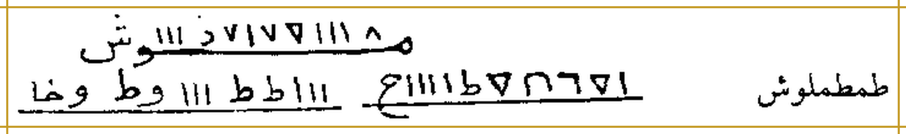
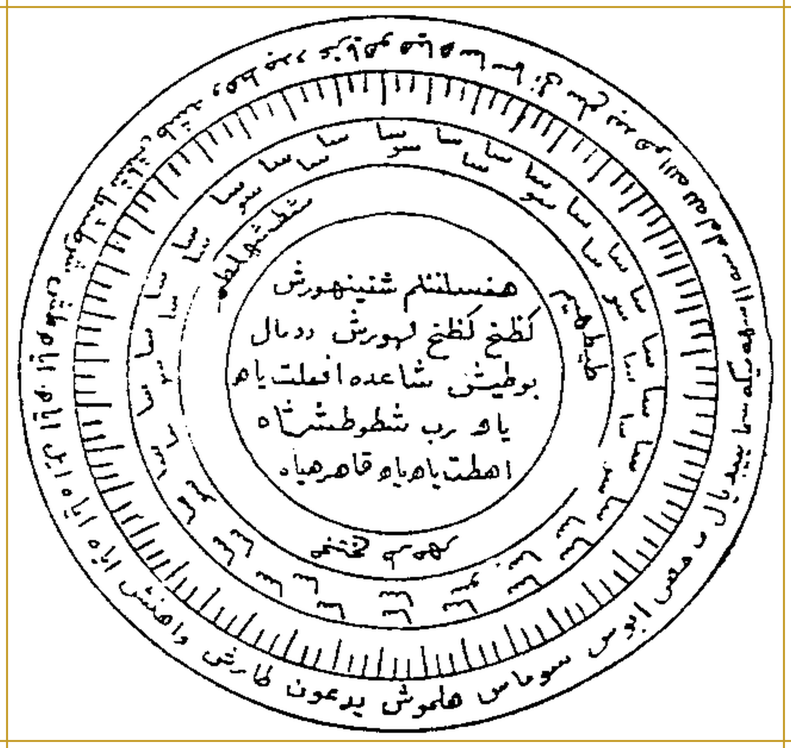

# BATCH 03 — Halaman PDF 11–15

> **الأسرار السليمانية في العلوم الروحانية** — Dr. Abdullah al-Jundi · al-Mathba'ah ats-Tsaqafiyyah, Bairut
> Sumber: `kitab/asrorul-sulaimaniyah.pdf` · Edisi kajian · Batch 3 dari 21 (hal. PDF 11–15)

---

## Halaman PDF 11 (= cetak 10)

### Bagian 1 — Judul: nama-nama yang membunuh semua raja

**[Teks Arab Asli]**

**أَسْمَاءُ تَقْتُلُ جَمِيعَ المُلُوكِ**

إِذَا عَصَى عَلَيْكَ مَلِكٌ مِنَ المُلُوكِ أَوْ عَارِضٌ مِنَ العَوَارِضِ وَأَرَدْتَ قَتْلَهُ، اكْتُبْ هَذِهِ الأَسْمَاءَ فِي وَرَقَةٍ إِنْ أَمْكَنَكَ [المطبوع: أَمْكَتْكَ]، أَوْ فِي الأَرْضِ، وَتَعْمَلُ عَلَيْهَا حَرْبَةَ يَمُونَ [الصيغة مطابقة للمطبوع مع غرابة تركيبها؛ لا تُصحح بلا شاهد أوضح]، فَكُلُّ مَا تَصْنَعُ فِيهَا يُصْنَعُ بِهِ. وَتَدْعُو بِأَيِّ مَلِكٍ شِئْتَ فَيُمْتَثَلُ [المطبوع: فَيُمَثِّلُ] أَمْرُكَ، وَهِيَ هَذِهِ: طَمْطَمْلُوشْ [ضبط الاسم غير محسوم؛ حروفه محفوظة وفق الطباعة]

**[Transliterasi Latin Fonetik]**

**Asmaa-un taqtulu jamii'al-muluuk**

*Idzaa 'ashaa 'alaika malikun minal-muluuki au 'aaridhun minal-'awaaridhi wa aradta qatlah, uktub haadzihil-asmaa'a fii waraqatin in amkanaka [al-mathbu': amkatka], au fil-ardh, wa ta'malu 'alaiha harabata Yamuuna [تسلسل مطبوع غير منتظم، محفوظ بلا تصحيح], fakullu maa tashna'u fiihaa yushna'u bih. Wa tad'uu bi-ayyi malikin syi'ta fayumtatsalu [al-mathbu': fayumatsilu] amruk, wa hiya haadzihi: Thamthamluusy [القراءة محتملة، والحروف محفوظة على رسم المطبوع - qiraatuhu muhtamalah].*

**[Terjemahan Indonesia]**

**Nama-Nama yang Membunuh Seluruh Raja**

Apabila seorang raja dari para raja atau seorang penghalang dari para penghalang membangkang kepadamu dan engkau hendak membunuhnya, tuliskan nama-nama ini pada kertas jika engkau mampu, atau di atas tanah, dan engkau buat padanya «harbatu yamun» [istilah tidak jelas]; maka segala yang engkau perbuat padanya akan diperlakukan kepadanya. Dan engkau menyeru raja mana pun yang engkau kehendaki, maka perintahmu dipatuhi; yaitu ini: Thamthamlusy.

*Keterangan rajah: dua deret goresan bergaris bawah. Deret ke-1 memuat ±12 goresan (di antaranya bentuk menyerupai angka Arab ٦، ٧، ٨ dan huruf و/ش pada kedua ujungnya); deret ke-2 terdiri atas dua penggal bergaris bawah berisi goresan simbol; di sebelah kanan deret ke-2 tertulis nama «طمطملوش» berhuruf Arab. Bacaan deret simbol tidak dipastikan dan tidak ditebak. Gambar dipotong dari pindaian, latar dibersihkan menjadi putih, diperbesar halus ke 300 DPI (metadata), dibingkai emas #c59b27; ketajaman mengikuti pindaian (bukan 300 DPI asli).*

**[Syarah]**

> Bagian pertama kelompok «nama-nama pembunuh» ditujukan kepada «para raja» (raja jin, lih. batch 2) dan «'awaridh» (para penghalang/pengganggu). Frasa «حربة يمون» tidak jelas maknanya (kemungkinan nama alat atau istilah teknis); dibiarkan berharakat sebagaimana dibaca dan dicatat dengan keterangan bahwa bentuk cetaknya tidak lazim dan dipertahankan. «فيمثل أمرك» tercetak demikian; dibaca «فَيُمْتَثَلُ أَمْرُكَ» (perintahmu dipatuhi); ditandai `[المطبوع: فيمثل]`. Nama «طمطملوش» non-Arab; bacaan dugaan.

### Bagian 2 — Bab mengikat, menyalib, dan membuat jin berbicara

**[Teks Arab Asli]**

**فَصْلٌ فِي تَكْتِيفِ الجَانِّ وَصَلْبِهِ وَاسْتِنْطَاقِهِ**

إِذَا أَتَاكَ مُصَابٌ وَبِهِ رِيحٌ مِنَ الجَانِّ، فَاكْتُبْ لَهُ وَصَارِعْهُ. فَإِذَا انْصَرَعَ تَأْمُرُ بِتَكْتِيفِهِ فَتَقُولُ: لَنَا لَنَا هِي هَفْيَهْ آيْ هِي بِرَهِي، اخْضَعْ بِحَقِّ الغَالِبِ عَلَيْكَ، وَبِحَقِّ عَشِيرٍ ظَهْرَشْ كَفْهُ يَا مَيْمُونُ [ضبط الاسم غير محسوم؛ حروفه محفوظة وفق الطباعة].

**[Transliterasi Latin Fonetik]**

**Fashlun fii taktiifil-jaanni wa shalbihi wastinthaaqih**

*Idzaa ataaka mushaabun wa bihi riihun minal-jaann, faktub lahu wa shaari'hu. Fa-idzanshara'a ta'muru bitaktiifihi fataquulu: Lanaa Lanaa Hii Hafyah Aay Hii Birahi, ikhdha' bihaqqil-ghaalibi 'alaik, wa bihaqqi 'Asyirin Zhaharasy Kaffahu yaa Maimuun [القراءة محتملة، والحروف محفوظة على رسم المطبوع - qiraatuhu muhtamalah].*

**[Terjemahan Indonesia]**

**Bab Mengikat, Menyalib, dan Membuat Jin Berbicara**

Apabila datang kepadamu orang yang terkena (musibah) dan padanya ada «angin» (pengaruh) dari jin, maka tuliskanlah untuknya dan pergumulkanlah dia. Maka apabila ia telah kalah bergumul, engkau perintahkan mengikatnya, lalu engkau katakan: Lana Lana Hi Hafyah Ay Hi Birahi — tunduklah dengan hak Dzat yang mengalahkanmu, dan dengan hak 'Asyir Zhaharasy Kaffahu, wahai Maimun.

**[Syarah]**

> «تكتيف» = mengikat (kedua tangan); «صلب» = menyalib/memaku (maksudnya menahan tubuh); «استنطاق» = membuat berbicara. «الريخ/الريح من الجان» = pengaruh jin pada orang yang kesurupan menurut paham teks. Seruan «tunduklah dengan hak Dzat yang mengalahkanmu» dirigida kepada jin yang telah kalah pergumul; «ميمون» nama pelayan jin yang lazim dalam literatur hikmah populer. Nama-nama seruan non-Arab; bacaan dugaan.

### Bagian 3 — Membuat jin berbicara

**[Teks Arab Asli]**

**اسْتِنْطَاقٌ**

إِذَا أَرَدْتَ أَنْ يَتَكَلَّمَ [المطبوع: تَكَلَّمَ] الجِنُّ فَاسْجَنْهُ فِي الجُبَّةِ، تَقُولُ: حَبَسْتُكَ بِهَنْطَشْ بِكَهْيَصْ وَحَمِّ عَشَقْ [ضبط الاسم غير محسوم؛ حروفه محفوظة وفق الطباعة].

**[Transliterasi Latin Fonetik]**

**Istinthaaq**

*Idzaa aradta an yatakallama [al-mathbu': takallama] al-jinnu fasjunhu fil-jubbah, taquulu: Habastuka bi-Hanthasy bi-Kahyash wa Hammi 'Asyaq [القراءة محتملة، والحروف محفوظة على رسم المطبوع - qiraatuhu muhtamalah].*

**[Terjemahan Indonesia]**

**Membuat Berbicara**

Apabila engkau hendak jin itu berbicara, maka penjarakanlah ia dalam «al-jubbah» (lubang/bejana), engkau katakan: «Aku menahanmu dengan Hanthasy, dengan Kahyash, dan Hammi 'Asyaq».

**[Syarah]**

> «الجبة» di sini gelap: dapat berarti bejana/lubang perangkap atau pakaian; konteks memenjarkan jin menunjuk wadah/perangkap. Rangkaian «حبستك بـ…» memakai pola penahanan dengan nama-nama asing (bandingkan deret penahan pada hal. 10). Seluruh nama non-Arab; bacaan dugaan.

---

## Halaman PDF 12 (= cetak 11)

### Bagian 1 — Judul: syarah «al-Balathah», haikal perjanjian para ruh

**[Teks Arab Asli]**

**شَرْحُ البَلَاطَةِ**

وَهِيَ البَلَاطَةُ الَّتِي كَانَتْ بَيْنَ يَدَيْ سُلَيْمَانَ بْنِ دَاوُدَ، وَهُوَ الهَيْكَلُ العَظِيمُ الَّذِي عَاهَدَ عَلَيْهِ الأَرْوَاحَ، وَالَّتِي قَعَدَ عَلَيْهَا جِبْرِيلُ وَمِيكَائِيلُ وَإِسْرَائِيلُ وَعِزْرَائِيلُ يَوْمَ عَاهَدَ الأَرْوَاحَ.

**[Transliterasi Latin Fonetik]**

**Syarhul-balaathah**

*Wa hiyal-balaathatul-latii kaanat baina yadai Sulaimaana bni Daawud, wa huwal-haikarul-'azhiimul-ladzii 'aahada 'alaihil-arwaah, wallatii qa'ada 'alaihaa Jibriilu wa Miikaa-iilu wa Israa-iilu wa 'Izraa-iilu yauma 'aahadal-arwaah.*

**[Terjemahan Indonesia]**

**Syarah «Al-Balathah» (Lempeng/Papan)**

Ia adalah «al-balathah» yang berada di hadapan Sulaiman bin Dawud, yaitu haikal (struktur) agung yang atasnya ia mengikat perjanjian dengan para ruh, dan yang atasnya duduk Jibril, Mikail, Israfil, dan 'Izrail pada hari perjanjian dengan para ruh itu.

**[Syarah]**

> «البلاطة» (balathah) = lempeng/papan batu atau logam; di sini dipakai untuk benda bertulis (jimat besar) milik Sulaiman. «الهَيْكَل» = bangunan/struktur agung (kata yang sama dipakai untuk Bait Suci dalam literatur Arab). Klaim bahwa empat malaikat besar duduk atasnya «pada hari perjanjian dengan para ruh» merupakan kisahan penulis yang menyambung tradisi perjanjian Sulaiman dengan jin/ruh (bandingkan hal. 9 dan 14).

### Bagian 2 — Nama-nama yang diturunkan kepada Sulaiman

**[Teks Arab Asli]**

نُزِّلَتْ هَذِهِ الأَسْمَاءُ عَلَى سُلَيْمَانَ بْنِ دَاوُدَ

**[Transliterasi Latin Fonetik]**

*Nuzzilat haadzihil-asmaa'u 'alaa Sulaimaana bni Daawud*

**[Terjemahan Indonesia]**

Nama-nama ini diturunkan kepada Sulaiman bin Dawud.

### Bagian 3 — Bahasa rahib dan daya nama-nama itu

**[Teks Arab Asli]**

بِاللِّسَانِ الرُّهْبَانِيِّ تَعْجَزُ عَنْهَا كَهَنَةُ الجِنِّ وَالإِنْسِ، وَتَحْمِلُ مِنْهَا الجِنُّ أَمْرًا عَظِيمًا. فَكَانَ إِذَا أَرَادَ قَتْلَ عِفْرِيتٍ طَاغٍ بَسَطَهَا، فَيُبْعَدُ كُلُّ مَنْ حَوْلَهُ مِنَ الإِنْسِ وَالجِنِّ وَالطَّيْرِ، تَزُفُّهَا المَلَائِكَةُ الرُّوحَانِيُّونَ عَنْ يَمِينِكَ وَيَسَارِكَ. وَلَا تُخْرِجْهَا إِلَّا عِنْدَ الذِّكْرِ، وَلَا تَسْرَعْ فِي صَرْفِهَا فَتُؤْذِيَ نَفْسَكَ، فَإِنَّهُ يَخْدُمُهَا اثْنَا عَشَرَ مَلَكًا مِنَ المَلَائِكَةِ، وَهِيَ الَّتِي ذَكَرَ فِيهَا ابْنُ بَاعُورَا الفَارِسِيُّ أَنَّهَا [المطبوع: أَنَّهُمَا] كَانَتْ فِي لُوَاءِ سُلَيْمَانَ بْنِ دَاوُدَ، فَكَانَ إِذَا خَمَدَتِ الرِّيحُ نَشَرَهَا، فَتَهُبُّ الرِّيحُ فِي كُلِّ مَكَانٍ يُرِيدُ.

**[Transliterasi Latin Fonetik]**

*Bil-lisaanir-ruhaaniyyi ta'jazu 'anhaa kahnatul-jinni wal-ins, wa tahmilu minhal-jinnu amran 'azhiimaa. Fakaana idzaa araada qatla 'ifriitin thaaghin basathahaa, fayub'adu kullu man haulahu minal-insi wal-jinni wath-thair, tazuffuhal-malaa'ikatur-ruhaaniyyuuna 'an yamiinika wa yasaarik. Wa laa tukhrijhaa illaa 'indadz-dzikr, wa laa tasra' fii sharfihaa fatu'dziya nafsak, fa-innahu yakhdimuhats-naa 'asyara malakan minal-malaa-ikah, wa hiyal-latii dzakara fiihabnu Baa'uuraa al-Faarisiyyu annahaa [al-mathbu': annahumaa] kaanat fii liwaa-i Sulaimaana bni Daawud, fakaana idzaa khamadatir-riihu nasyarahaa, fatahubbur-riihu fii kulli makaanin yuriid.*

**[Terjemahan Indonesia]**

Dengan bahasa rahib (rubbani); para dukun jin dan manusia tidak mampu mengatasinya, dan jin memikul dari nama-nama itu urusan yang besar. Maka apabila ia (Sulaiman) hendak membunuh 'ifrit yang lalim, ia membentangkannya; maka dijauhkanlah segala yang di sekelilingnya dari manusia, jin, dan burung, sedangkan para malaikat ruhani mengusung lembaran itu di kanan dan kirimu. Janganlah engkau mengeluarkannya kecuali saat dzikir, dan jangan tergesa dalam memakainya sehingga engkau menyakiti dirimu sendiri; sebab ia dilayani dua belas malaikat dari para malaikat. Inilah yang disebutkan oleh Ibn Ba'ura al-Farisi bahwa ia (lembaran itu) berada dalam bendera Sulaiman bin Dawud; maka apabila angin padam, ia membentangkannya, lalu bertiuplah angin ke setiap tempat yang ia kehendaki.

**[Syarah]**

> «اللسان الرهباني» = bahasa para rahib (bandingkan «لسان رهْباني» dalam literatur hikmah sebagai bahasa rahasia). «ابن باعورا الفارسي» menyerupai tokoh Ba'ura/Balam dalam tradisi Islam-Yahudi (pemilik nama yang dimurtadkan/diwariskan); nisbat «al-Farisi» tidak dapat dipastikan. «أنهما» tercetak demikian (dual), padahal yang dibicarakan satu lembaran; dibaca «أَنَّهَا» dan ditandai `[المطبوع: أَنَّهُمَا]`. Klaim «dua belas malaikat pelayan» dan angin yang bertiup sesuai bendera menyambung kisah kekuasaan Sulaiman atas angin (lih. QS. al-Anbiya': 81; Shad: 36).

### Bagian 4 — Cara membuatnya (bersambung ke hal. 13)

**[Teks Arab Asli]**

إِذَا أَرَدْتَ صَنْعَهَا تَضَعُهَا فِي خِرْقَةِ حَرِيرٍ حَمْرَاءَ أَوْ بَيْضَاءَ، وَتَجْعَلُهَا فِي عَصًا مِنْ عَوْسَجٍ أَوْ مِنْ رُمَّانٍ أَوْ مِنْ سَفَرْجَلٍ، وَانْشُرْهَا تَرَ [المطبوع: تَر] العَجَبَ. فَإِنْ كَانَ لَيْلًا فَقِدْ تَحْتَهَا سَبْعَ شَمْعَاتٍ، وَاضْرِبْ عَلَيْهَا سَبْعَةَ أَخْبِيَةٍ، وَاجْعَلْ فِي كُلِّ خَبَاءٍ لُوَاءً عَلَى شَكْلِ …

**[Transliterasi Latin Fonetik]**

*Idzaa aradta shan'ahaa tadha'uhaa fii khirqati hariirin hamraa-a au baidhaa', wa taj'aluhaa fii 'ashaan min 'awsajin au min rummaanin au min safarjal, wansyurhaa tara [al-mathbu': tar] al-'ajab. Fa-in kaana lailan faqid tahtahaa sab'a syam'aat, wadhrib 'alaihaa sab'ata akhbiyah, waj'al fii kulli khabaa-in liwaa-an 'alaa syakli …*

**[Terjemahan Indonesia]**

Apabila engkau hendak membuatnya, engkau letakkan ia pada kain sutra merah atau putih, dan engkau jadikan ia pada tongkat dari 'ausaj (duri), atau dari delima, atau dari safarjal (quince); lalu bentangkanlah ia, niscaya engkau melihat keajaiban. Bila malam, maka nyalakanlah di bawahnya tujuh lilin, dan dirikanlah atasnya tujuh tenda, dan jadikanlah pada setiap tenda satu bendera berbentuk …

**[Syarah]**

> Tata cara paralel dengan pembuatan cincin/khatam pada batch sebelumnya: kain sutra berwarna, kayu tertentu ('ausaj = pohon berduri; rumman = delima; safarjal = quince), bilangan tujuh (lilin dan tenda — bandingkan tujuh raja pada hal. 9). «وانشرها تر العجب» tercetak «تر»; dibaca «تَرَ» (niscaya engkau melihat) dan ditandai `[المطبوع: تَر]`. «فقِدْ» dari «أوقد/قاد» (nyalakanlah).

**[Faedah]**

> Ringkasan tata cara menurut teks (klaim penulis): (1) lembaran disimpan dalam kain sutra merah/putih; (2) ditempatkan pada tongkat dari 'ausaj/delima/quince; (3) bila dikerjakan malam: tujuh lilin dinyalakan di bawahnya dan tujuh tenda didirikan, masing-masing dengan bendera (sambung ke hal. 13); (4) larangan: mengeluarkan lembaran selain saat dzikir dan tergesa memakainya. Disampaikan sebagai dokumen kajian.

---

## Halaman PDF 13 (= cetak 12)

### Bagian 1 — Sambungan: tempat, kehati-hatian, dan perlindungan saat membuatnya

**[Teks Arab Asli]**

… صَاحِبِهِ. وَإِنْ كَانَ فِي النَّهَارِ، فَاجْعَلْ ذَلِكَ فِي مَكَانٍ مُنْعَزِلٍ عَنِ النَّاسِ، وَلَا تُؤْذِ شَيْئًا. وَيَكُونُ المَوْضِعُ ظَاهِرًا نَقِيًا، وَيَكُونُ الثِّيَابُ عَلَى طَهَارَةٍ. وَإِنْ صَنَعْتَهَا يَكُونُ أَمَامَكَ بِسَاطٌ مُرْتَفِعٌ عَنِ الأَرْضِ عَلَى أَرْبَعِ قَوَائِمَ كَذَلِكَ، فَإِنْ تَعَاصَى عَلَيْكَ عَارِضٌ قَوِيٌّ، وَحَصَلَ بَيْنَكَ وَبَيْنَ مَلِكٍ مِنْ مُلُوكِ الرُّوحَانِيَّةِ مُشَادَّةٌ، أَوْ تَحَزَّبَ عَلَيْكَ مَلِكٌ مِنَ المُلُوكِ، أَوْ تَحَزَّبَتْ عَلَيْكَ جُيُوشٌ مِنَ الجِنِّ، وَخِفْتَ عَلَى نَفْسِكَ، أَوْ سُلِّطَ عَلَيْكَ حَكِيمٌ مِنَ العُلَمَاءِ أَرْوَاحًا لِيُؤْذِيَكَ بِهَا، أَوْ كَانَ لَكَ أَمْرٌ مُهِمٌّ عِنْدَ مَلِكٍ مِنْ مُلُوكِ الجِنِّ وَالإِنْسِ، مِنَ الحَوَائِجِ العَلِيَّةِ أَوْ إِطْلَاقِ مَحْبُوسٍ اسْتَوْجَبَ القَتْلَ، أَوْ إِزَالَةِ أَحَدٍ مِنْ مَرْتَبَتِهِ، أَوْ تَجْرِبَةِ أَحَدٍ عَنْ مَمْلَكَتِهِ، فَابْرِزْ إِلَى الانْقِطَاعِ عَنِ العِمَارَةِ فِي ذَلِكَ كُلِّهِ وَلَا تَخَفْ، وَاضْرِبْ عَلَى نَفْسِكَ مُنْدَلًا عَلَى مَرْآةٍ وَاسِطُهَا بَيْنَ يَدَيْكَ، وَاسْتَدْعِ الرُّوحَانِيَّةَ العُلْوِيَّةَ المُوَكَّلِينَ بِالأَفْلَاكِ كُلِّهَا، أَوْ تَكْتُبُ لِنَفْسِكَ حِجَابًا وَصُرُوفَاتٍ فِي صَحَائِفَ، وَتَمْحِيهَا بِالمَاءِ وَتُرَشُّ الأَرْضَ، تَفْعَلُ ذَلِكَ حَتَّى تَبْتَلَّ، وَذَلِكَ [المطبوع: وَتَدَلَّكَ] خَوْفًا مِنَ الغَوَاصِينَ. وَتَكْتُبُ لِنَفْسِكَ حِجَابًا عَنْ يَمِينِكَ وَعَنْ شِمَالِكَ وَعَلَى رَأْسِكَ وَتَحْتَكَ، فَإِذَا حَضَرُوا بِأَبْدَانِهِمْ [المطبوع: أَبْدَانَاهُمْ] الأَمْرُ إِلَيْكَ، وَسَلْ عَنْ حَاجَتِكَ فَإِنَّ اللَّهَ يَقْضِيهَا لَكَ. وَإِنْ أَرَدْتَ قَتْلَ عِفْرِيتٍ طَاغٍ مِنَ المُلُوكِ فَأَمْضِ فِيهِ أَمْرَكَ، وَالْتَزِمِ التَّقْوَى وَتَجَنَّبِ النَّجَاسَةَ، وَالْتَزِمِ الطَّهَارَةَ وَالخُشُوعَ وَالحِلْمَ، وَإِيَّاكَ وَالْعَجَبَ فَإِنَّ فِيهِ زَلَّةَ القَدَمِ. وَاشْكُرِ اللَّهَ تَعَالَى عَلَى مَا أَوْلَاكَ فِيهِ.

**[Transliterasi Latin Fonetik]**

*… shaahibih. Wa in kaana fin-nahaar, faj'al dzaalika fii makaanin mun'azilin 'anin-naas, wa laa tu'dzi syai-aa. Wa yakuunul-maudhi'u zhaahiran naqiyyaa, wa yakuunuts-tsiyaabu 'alaa thahaarah. Wa in shana'tahaa yakuunu amaamaka bisaathun murtafi'un 'anil-ardhi 'alaa arba'i qawaa-ima kadzaalik, fa-in ta'aashaa 'alaika 'aaridhun qawiyy, wa hashala bainaka wa baina malikin min muluukir-ruhaaniyyati musyaaddah, au tahazzaba 'alaika malikun minal-muluuk, au tahazzabat 'alaika juyuusun minal-jinn, wa khifta 'alaa nafsik, au sullitha 'alaika hakiimun minal-'ulamaa-i arwaahan li-yu'dziyaka bihaa, au kaana laka amrun muhimmin 'inda malikin min mulukil-jinni wal-ins, minal-hawaa-ijil-'aliyyati au ithlaaqi mahbuusin istaujabal-qatl, au izaalati ahadin min martabatih, au tajribati ahadin 'an mamlakatih, fabriz ilal-inqithaa'i 'anil-'imaarati fii dzaalika kullihi wa laa takhaf, wadhrib 'alaa nafsika mundalan 'alaa mir-aatin waasithuhaa baina yadaik, wastadi'ir-ruhaaniyyatal-'ulwiyyatal-muwakkaliina bil-aflaaki kullihaa, au taktubu linafsika hijaaban wa shuruufaatin fii shahaa-if, wa tamhiihaa bil-maa-i wa turasyysyul-ardh, taf'alu dzaalika hattaa tabtall, wa dzaalika [al-mathbu': wa tadallaka] khaufan minal-ghawaashiin. Wa taktubu linafsika hijaaban 'an yamiinika wa 'an syimaalika wa 'alaa ra'sika wa tahtak, fa-idzaa hadharuu bi-abdaanihim [al-mathbu': abdaanaahum] al-amru ilaik, was-al 'an haajatika fa-innallaaha yaqdhihaa lak. Wa in aradta qatla 'ifriitin thaaghin minal-muluuki fa-amdh fihi amrak, wal-tazimit-taqwaa wa tajannabin-najaasah, wal-tazimith-thahaarata wal-khusyu'u wal-hilm, wa iyyaaka wal-'ajaba fa-inna fiihi zallatal-qadam. Wasykurillaaha ta'aalaa 'alaa maa awlaaka fiih.*

**[Terjemahan Indonesia]**

… pemiliknya. Dan bila pada siang hari, maka lakukanlah itu di tempat yang terpencil dari orang banyak, dan janganlah engkau menyakiti sesuatu. Hendaklah tempat itu terbuka lagi bersih, dan pakaian dalam keadaan suci. Dan bila engkau membuatnya, hendaknya di hadapanmu ada hamparan yang terangkat dari tanah di atas empat kaki demikian pula. Maka apabila seorang penghalang yang kuat membangkang kepadamu, dan terjadi antara engkau dan seorang raja dari para raja ruhani perbantahan, atau seorang raja dari para raja bersekutu melawan engkau, atau pasukan-pasukan jin bersekutu melawan engkau dan engkau takut atas dirimu, atau seorang hakim dari para ulama dikuasakan atas dirimu dengan ruh-ruh untuk menyakitimu dengannya, atau engkau mempunyai urusan penting di sisi seorang raja dari raja-raja jin dan manusia — berupa hajat-hajat yang tinggi, atau melepaskan tahanan yang telah patut dihukum bunuh, atau menurunkan seseorang dari kedudukannya, atau menguji seseorang dari kerajaannya — maka keluarlah kepada keterputusan dari keramaian dalam semua itu dan janganlah takut; dan pukulkanlah atas dirimu «mandal» di atas cermin yang tengahnya di hadapan kedua tanganmu, dan panggillah ruh-ruh ruhani yang tinggi yang diserahi seluruh langit; atau engkau tuliskan untuk dirimu hijab dan shurufat pada lembaran-lembaran, lalu engkau menghapusnya dengan air dan tanah diciprati; engkau lakukan itu sampai basah — dan itu [yang tercetak: «wa tadallaka»] karena takut kepada para penyelam (al-ghawashin). Dan engkau tuliskan untuk dirimu hijab di kananmu, di kirimu, di atas kepalamu, dan di bawahmu; maka apabila mereka hadir dengan badan-badan mereka, urusan terserah kepadamu — dan tanyakanlah hajatmu, maka sesungguhnya Allah menunaikannya bagimu. Dan apabila engkau hendak membunuh 'ifrit yang lalim dari para raja, maka jalankanlah perintahmu padanya; dan lazimkanlah takwa dan jauhilah najis, dan lazimkanlah kesucian, khusyuk, dan kelemahlembutan; dan awaslah engkau dari 'ajab (takjub pada diri), karena padanya ada ketergelinciran kaki. Dan bersyukurlah kepada Allah Ta'ala atas apa yang Dia anugerahkan kepadamu dalamnya.

**[Syarah]**

> «مندل» (mandal) = praktik cermin/permukaan berkilau untuk memanggil penampakan (dikenal dalam magie populer Mesir sebagai «mandal» dengan anak sebagai perantara); di sini digabung dengan cermin «yang tengahnya di hadapan kedua tanganmu». «الغواصون» = para penyelam, yaitu golongan jin penyelam dalam kisah Sulaiman (lih. QS. Shad: 37 «dan setan-setan semuanya, tukang bangunan dan penyelam») — dicemaskan mengganggu pekerjaan. «صروفات» jamak «sharf»/«sharifah» = jimat penolak/pengalih. Kata «وتدلك» tercetak demikian; dari konteks diduga «وذلك» (dan itu karena takut…); ditandai `[المطبوع: وتدلك]`. «أبداناهم» tercetak demikian; diduga «بِأَبْدَانِهِمْ» (dengan badan-badan mereka); ditandai. Penutup berupa pesan moral (takwa, suci, khusyuk, hindari 'ujub) — nada yang sama dengan nasihat pada batch sebelumnya.

**[Faedah]**

> Ringkasan perlindungan menurut teks (klaim penulis): (1) tempat kerja: terpencil, terbuka, bersih, pakaian suci; siang hari di tempat terpisah; (2) bila menghadapi penentang kuat (raja jin, pasukan jin, atau tukang sihir): mengasingkan diri, memakai «mandal» cermin, memanggil ruhani pelayan langit, atau menulis hijab dan shurufat yang dihapus dengan air dan dicipratkan ke tanah sampai basah — karena takut «para penyelam»; (3) hijab pelindung ditulis di kanan, kiri, atas kepala, dan bawah; (4) adab: takwa, menjauhi najis, kesucian, khusyuk, lemah lembut, dan meninggalkan 'ujub.

---

## Halaman PDF 14 (= cetak 13)

### Bagian 1 — Sambungan: kemanfaatan balathah dan perjanjian dengan raja jin

**[Teks Arab Asli]**

… الزِّيَادَةِ. وَإِنْ أَرَدْتَ أَنْ تَعْلَمَ الأَخْبَارَ مِنَ المَشْرِقِ إِلَى المَغْرِبِ، فَاطْلُبِ المُخْتَرِقِينَ فِي أَقْطَارِ الأَرْضِ يُعَلِّمُوكَ بِذَلِكَ. وَإِنْ أَرَدْتَ أَنْ يَسِيرُوا بِكَ مَسِيرَةَ سَنَةٍ فِي لَحْظَةٍ وَاحِدَةٍ، فَاصْنَعْهَا بِسَاطًا تَحْتَكَ، وَتَكَلَّمْ بِأَسْمَاءِ الرُّوحَانِيَّةِ. وَإِنْ أَرَدْتَ أَنْ تَنْصُرَ أَهْلَ إِقْلِيمِكَ عَلَى خَصْمٍ لَا يُطِيقُونَهُ، فَاسْتَدِعْ بِهِ وَسَلِّطْ عَلَيْهِ مَنْ شِئْتَ. وَإِنْ أَرَدْتَ أَنْ تَتَحَالَفَ مَعَ أَحَدٍ مِنْ مُلُوكِ الجِنِّ، فَتُحْضِرُهُ وَتَقُولُ: شَاهْ شَاهْ اشْ لِيَالْ لِيَالْ حَالِفْ حَالِفْ [ضبط الاسم غير محسوم؛ حروفه محفوظة وفق الطباعة]، وَإِذْ أَخَذَ رَبُّكَ مِنْ بَنِي آدَمَ مِنْ ظُهُورِهِمْ ذُرِّيَّاتِهِمْ، وَأَشْهَدَهُمْ عَلَى أَنْفُسِهِمْ أَلَسْتُ بِرَبِّكُمْ قَالُوا بَلَى، شَهِدْنَا شَهِدْنَا. فَإِنْ أَجَابُوا العَهْدَ، وَإِلَّا فَتَكَلَّمْ بِالأَسْمَاءِ الَّتِي فِي قَلْبِ البَلَاطَةِ، وَانْفَخْ عَلَيْهِمْ يَحْتَرِقُونَ. وَقَدْ أَرَدْتَ الاخْتِصَارَ خِيفَةَ التَّطْوِيلِ، فَإِنَّهَا تَتَصَرَّفُ فِي أَلْفِ بَابٍ مِنَ المَنَافِعِ، وَهِيَ الطَّاعَةُ الكُبْرَى الَّتِي كَانَ سُلَيْمَانُ بْنُ دَاوُدَ يَعْمَلُ بِهَا، وَكَانَ يَنْزِلُ بِهَا مِنْ إِقْلِيمٍ إِلَى إِقْلِيمٍ، وَهِيَ القَهْرُ عَلَى جَمِيعِ أَهْلِ الأَرْضِ. فَاحْفَظْ مَا قَدْ صَارَ إِلَيْكَ أَيُّهَا العَالِمُ، وَلَا تُبْدِهِ لِجَاهِلٍ فَيَصْرَفَهُ فِيمَا لَا يَرْضَاهُ اللَّهُ تَعَالَى، فَاحْفَظْهَا كَمَا ذَكَرْتُ لَكَ.

**[Transliterasi Latin Fonetik]**

*… az-ziyaadah. Wa in aradta an ta'lamal-akhbaara minal-masyriqi ilal-maghrib, fathlubil-mukhtariqiina fii aqthaaril-ardhi yu'allimuuka bidzaalik. Wa in aradta an yasiiruu bika masiirata sanatin fii lahzhatin waahidah, fashna'haa bisaathan tahtak, wa takallam bi-asmaa'ir-ruhaaniyyah. Wa in aradta an tansyura ahla iqliimika 'alaa khashmin laa yuthiiquunah, fastadi' bihi wa sallith 'alaihi man syi't. Wa in aradta an tatahaalafa ma'a ahadin min mulukil-jinn, fatuhdhiruhu wa taquulu: Syaah Syaah Asy Liyaal Liyaal Haalif Haalif [القراءة محتملة، والحروف محفوظة على رسم المطبوع - qiraatuhu muhtamalah], wa idz akhadza rabbuka min banii aadama min zhuhuurihim dzurriyyaatihim, wa asyhadahum 'alaa anfusihim a-lastu birabbikum qaaluu balaa, syahidnaa syahidnaa. Fa-in ajaabul-'ahd, wa illaa fatakallem bil-asmaa'il-latii fii qalbil-balaathah, wanfakh 'alaihim yahtariquun. Wa qad aradtal-ikhtishaara khiifatath-tathwiil, fa-innahaa tatasyarrafu fii alfi baabin minal-manaafi', wa hiyath-thaa'atul-kubrallatii kaana Sulaimaanu bnu Daawuda ya'malu bihaa, wa kaana yanzilu bihaa min iqliimin ilaa iqliim, wa hiyal-qahru 'alaa jamii'i ahlil-ardh. Fahfazh maa qad shaara ilaika ayyuhal-'aalim, wa laa tubdihi lijaahilin fayashrafahu fiimaa laa yardhaahullaahu ta'aalaa, fahfazhhaa kamaa dzakartu lak.*

**[Terjemahan Indonesia]**

… tambahan. Dan apabila engkau hendak mengetahui berita-berita dari timur sampai barat, maka carilah para penembus (penjelajah) di penjuru-penjuru bumi, niscaya mereka mengajarmu dengan itu. Dan apabila engkau hendak mereka membawamu berjalan sejauh perjalanan satu tahun dalam satu kejapan, maka jadikanlah ia (balathah) hamparan di bawahmu dan berbicaralah dengan nama-nama ruhani. Dan apabila engkau hendak menolong penduduk wilayahmu atas lawan yang tidak mereka sanggupi, maka panggillah dengannya dan kuasakanlah atasnya siapa yang engkau kehendaki. Dan apabila engkau hendak bersekutu dengan seorang dari raja-raja jin, maka engkau hadirkan dia dan katakan: Syah Syah Asy Liyal Liyal Halif Halif — dan (ingatlah) ketika Tuhanmu mengambil dari anak-anak Adam, dari punggung mereka, keturunan mereka, dan mempersaksikan mereka atas diri mereka sendiri: «Bukankah Aku Tuhanmu?» Mereka berkata: «Benar, kami menyaksikan, kami menyaksikan.» Maka apabila mereka menjawab perjanjian itu (baik); jika tidak, berbicaralah dengan nama-nama yang ada di jantung balathah, dan tiupkanlah atas mereka, niscaya mereka terbakar. Dan engkau menghendaki ringkas karena takut panjang lebar; maka sesungguhnya ia bertindak dalam seribu pintu kemanfaatan; dan ia adalah «ketaatan besar» yang dahulu dipakai Sulaiman bin Dawud, dan ia turun dengannya dari wilayah ke wilayah; dan ia adalah penaklukan atas seluruh penduduk bumi. Maka jagalah apa yang telah sampai kepadamu, wahai orang alim, dan jangan engkau perlihatkan kepada orang bodoh sehingga ia memakainya pada apa yang tidak diridai Allah Ta'ala; maka jagalah ia sebagaimana telah kusebutkan kepadamu.

**[Syarah]**

> Daftar kemanfaatan balathah: kabar timur–barat lewat «al-mukhtariqun» (para penembus jarak), perjalanan setahun dalam sekejap (balathah dijadikan «bisath» = hamparan, menggema permadani Sulaiman), pertolongan wilayah, dan persekutuan dengan raja jin. Rumusan perjanjian memakai gema QS. al-A'raf: 172 («أَلَسْتُ بِرَبِّكُمْ قَالُوا بَلَى») sebagai formula sumpah primordial; bila perjanjian dilanggar, nama-nama «di jantung balathah» dipakai dan «tiupan» membakar — klaim teks. «شاه شاه اش ليال ليال حالف حالف» nama/seruan non-Arab («syah» Persia = raja); bacaan dugaan. Penutup berupa wasiat kerahasiaan («jangan diperlihatkan kepada orang bodoh»).

---

## Halaman PDF 15 (= cetak 14)

### Bagian 1 — Rupa balathah (daira berlapis) dan cara menggambar di رق (bersambung ke hal. 16)

*Keterangan rajah: daira (lingkaran) berlapis empat. Cincin terluar memuat tulisan Arab mengikuti keliling (sebagian terbaca: «…سوماس هاموش ييمون خارش واهنش اذا هو…» pada busur bawah, dan seruan berawal «بسم الله…» pada busur kanan); cincin ke-2 berupa deret garis-garis pendek rapat; cincin ke-3 memuat pengulangan «سا» berselang-seling dengan goresan huruf; lingkaran pusat memuat lima baris nama (bacaan dugaan, tidak dipastikan): (1) Hamsaltam Syanihurasy, (2) Kazhakh Kazhakh Labuurasy Dadaal, (3) Buthiitsy Syaa'idah Aflat Yaah, (4) Yaaw Rabb Syuthuthasynaah, (5) Ashth Yaah Uuqaahiriyaad [القراءة محتملة، والحروف محفوظة على رسم المطبوع - qiraatuhu muhtamalah]. Di antara cincin terdapat serpihan nama lain («مشقد عبدالله» [القراءة محتملة، والحروف محفوظة على رسم المطبوع - qiraatuhu muhtamalah] pada busur kiri-dalam, «كهم ق[حرف أخير غير واضح]» pada busur bawah-dalam).*

**[Teks Arab Asli]**

فَإِذَا أَرَدْتَ قَتْلَ مَلِكٍ مِنَ المُلُوكِ، فَارْسُمْ بَلَاطَةً فِي رَقٍّ نَقِيٍّ، وَاكْتُبِ الصُّورَةَ فِي وَسَطِهَا، وَاكْتُبِ السَّطْرَ الأَوَّلَ فِي عُنُقِهَا، وَهُوَ الَّذِي فِي أَعْلَى وَسَطِ الدَّائِرَةِ، وَالسَّطْرُ الأَيْمَنُ عَلَى يَمِينِهَا، وَالأَيْسَرُ عَلَى يَسَارِهَا، وَاجْعَلِ الاسْمَيْنِ اللَّذَيْنِ فِي قَلْبِ الدَّائِرَةِ مِنْ أَسْفَلِهَا اجْعَلْهُمَا فِي جَوْفِ الصُّورَةِ، وَأْمُرْ بِمَا شِئْتَ. وَإِنْ أَرَدْتَ القَتْلَ، فَصَوِّرْ صُورَتَهُ …

**[Transliterasi Latin Fonetik]**

*Fa-idzaa aradta qatla malikin minal-muluuk, farsum balaathan fii raqqin naqiyy, waktubish-shuurata fii wasathihaa, waktubis-sathral-awwala fii 'unuqihaa, wa huwal-ladzii fii a'laa wasathid-daa-irah, was-sathrul-aymanu 'alaa yamiinihaa, wal-aysaru 'alaa yasaarihaa, waj'alil-ismainil-ladzaini fii qalbid-daa-irati min asfalihaa ij'alhumaa fii jawfish-shuurah, wa'mur bimaa syi't. Wa in aradtal-qatl, fashawwir shuuratahu …*

**[Terjemahan Indonesia]**

Maka apabila engkau hendak membunuh seorang raja dari para raja, gambarlah sebuah balathah pada رق (perkamen/kulit halus) yang bersih; tuliskan gambar (rupa) di tengahnya; tuliskan baris pertama pada «leher»nya, yaitu yang berada di atas-tengah daira; baris kanan pada kanannya dan baris kiri pada kirinya; dan dua nama yang berada di jantung daira sebelah bawahnya, jadikan keduanya di dalam rongga gambar; lalu perintahkanlah apa yang engkau kehendaki. Dan apabila engkau menghendaki pembunuhan, maka gambarkanlah rupanya …

**[Syarah]**

> Petunjuk pemasangan: «رق» = perkamen/kulit halus untuk menulis; «عنق» (leher) = bagian atas daira; baris-baris nama daira dipindahkan ke posisi masing-masing pada rupa (gambar) yang dibuat, dan dua nama pusat daira ditempatkan «di dalam rongga gambar». Fungsi yang diklaim: perintah apa pun terlaksana; untuk pembunuhan, rupa pihak yang dituju digambar (bersambung ke halaman berikutnya, di luar jilid ini). Bentuk daira berlapis (lingkaran nama + garis + pengulangan «سا») lazim dalam wafaq/rajah tradisi hikmah; pengulangan «سا» kemungkinan singkatan seruan atau pemisah magis. Lima baris pusat berhuruf Arab naskh namun berisi nama-nama non-Arab; transkripsi pada keterangan gambar dugaan semata (disertai catatan bahwa pelafalannya tentatif) dan tidak dipakai sebagai bacaan pasti.

---
