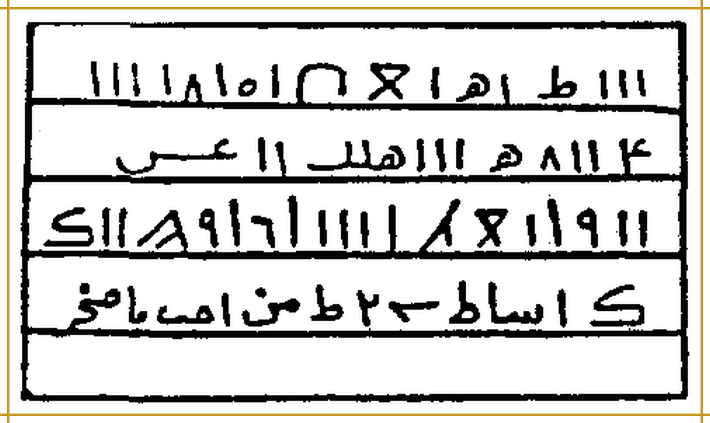

# TERJEMAHAN_MATAN_MURNI — الأسرار السليمانية في العلوم الروحانية

> Gabungan Batch 01–35, dibangun otomatis oleh `tools/bangun_panel.py`. Jangan disunting di sini; ubah `BATCH_NN.md` lalu bangun ulang.

---

# BATCH 01 — Halaman PDF 1–5

## Halaman PDF 1 (= sampul)

### Bagian 1 — Judul, pengarang, dan penerbit

**[Teks Arab Asli]**

**الأَسْرَارُ السُّلَيْمَانِيَّةُ فِي العُلُومِ الرُّوحَانِيَّةِ**

تَأْلِيفُ العَالِمِ الرُّوحَانِيِّ الدُّكْتُورِ عَبْدِ اللَّهِ الجُنْدِيِّ

المَطْبَعَةُ الثَّقَافِيَّةُ، بَيْرُوتُ

**[Transliterasi Latin Fonetik]**

**Al-Asraarus-Sulaimaaniyyatu fil-'uluumir-ruuhaaniyyah**

*Ta'liiful-'aalimir-ruuhaaniyyid-duktuuri 'Abdillaahil-Jundiyy*

*Al-Math-ba'atuts-Tsaqaafiyyah, Bairuut*

**[Terjemahan Indonesia]**

**Rahasia-Rahasia Sulaimaniyah dalam Ilmu-Ilmu Ruhani**

Karya sang ahli ilmu ruhani (*al-'alim ar-ruhani*), Dr. Abdullah al-Jundi.

Percetakan Ats-Tsaqafiyyah (Percetakan Kebudayaan), Beirut.

## Halaman PDF 2 (= cetak 1)

### Bagian 1 — Basmalah

**[Teks Arab Asli]**

**بِسْمِ اللَّهِ الرَّحْمَنِ الرَّحِيمِ**

**[Transliterasi Latin Fonetik]**

**Bismillaahir-Rahmaanir-Rahiim**

**[Terjemahan Indonesia]**

**Dengan nama Allah Yang Maha Pengasih lagi Maha Penyayang.**

### Bagian 2 — Hamdalah dan shalawat

**[Teks Arab Asli]**

الحَمْدُ لِلَّهِ رَبِّ العَالَمِينَ، حَمْدًا كَثِيرًا يُوَافِي نِعَمَهُ، قَاهِرِ الجَبَابِرِ وَالمُتَمَرِّدِينَ، وَقَاطِعِ دَابِرِ الظَّالِمِينَ وَالمُعْتَدِينَ، بِسَيْفِ جَبَرُوتِهِ وَسَطْوَتِهِ، وَسِهَامِ اقْتِدَارِهِ وَقُوَّتِهِ. وَالسَّلَامُ عَلَى سَيْفِ اللَّهِ المَسْلُولِ سَيِّدِنَا مُحَمَّدٍ، أَكْرَمِ نَبِيٍّ وَرَسُولٍ، وَعَلَى آلِهِ شُمُوسِ العَدَالَةِ، وَأَصْحَابِهِ نُجُومِ الهِدَايَةِ وَالدَّلَالَةِ.

**[Transliterasi Latin Fonetik]**

*Al-hamdu lillaahi rabbil-'aalamiin, hamdan katsiiran yuwaafii ni'amah, qaahiril-jabaabiri wal-mutamarridiin, wa qaathi'i daabirizh-zhaalimiina wal-mu'tadiin, bisaifi jabaruutihi wa sathwatih, wa sihaamiqtidaarihi wa quwwatih. Was-salaamu 'alaa saifillaahil-masluuli sayyidinaa Muhammad, akrami nabiyyin wa rasuul, wa 'alaa aalihi syumuusil-'adaalah, wa ash-haabihi nujuumil-hidaayati wad-dalaalah.*

**[Terjemahan Indonesia]**

Segala puji bagi Allah, Tuhan semesta alam, puji yang banyak yang setimpal dengan nikmat-nikmat-Nya; (Allah) Penakluk para penguasa lalim dan para pembangkang, Pemutus akar orang-orang zalim dan para pelampau batas, dengan pedang keperkasaan dan kedahsyatan-Nya, serta panah-panah kuasa dan kekuatan-Nya. Salam sejahtera atas pedang Allah yang terhunus, junjungan kami Muhammad, nabi dan rasul yang paling mulia; juga atas keluarganya yang bagaikan matahari-matahari keadilan, dan para sahabatnya yang bagaikan bintang-bintang petunjuk dan bimbingan.

### Bagian 3 — Maksud penulisan kitab

**[Teks Arab Asli]**

وَبَعْدُ، فَهَذَا كِتَابُ الأَسْرَارِ السُّلَيْمَانِيَّةِ فِي العُلُومِ الرُّوحَانِيَّةِ، جَمَعَ مِنَ الفَوَائِدِ وَالأَبْوَابِ الرُّوحَانِيَّةِ القَدِيمَةِ الَّتِي أَطْلَعَنِي عَلَيْهَا اللَّهُ عَزَّ وَجَلَّ مِنَ الأَسْرَارِ السُّلَيْمَانِيَّةِ القَدِيمَةِ فِي العُلُومِ الرُّوحَانِيَّةِ.

**[Transliterasi Latin Fonetik]**

*Wa ba'du, fa-haadzaa kitaabul-asraaris-Sulaimaaniyyati fil-'uluumir-ruuhaaniyyah, jama'a minal-fawaaidi wal-abwaabir-ruuhaaniyyatil-qadiimatillatii ath-la'anii 'alaihallaahu 'azza wa jalla minal-asraaris-Sulaimaaniyyatil-qadiimati fil-'uluumir-ruuhaaniyyah.*

**[Terjemahan Indonesia]**

Amma ba'du: inilah kitab *Al-Asrar as-Sulaimaniyyah fil-'Ulum ar-Ruhaniyyah* (Rahasia-Rahasia Sulaimaniyah dalam Ilmu-Ilmu Ruhani), yang menghimpun sebagian faedah dan bab-bab ruhani kuno yang diperlihatkan Allah 'Azza wa Jalla (Yang Mahaperkasa lagi Mahaagung) kepadaku, dari rahasia-rahasia Sulaimaniyah kuno dalam ilmu-ilmu ruhani.

### Bagian 4 — Penamaan kitab dan doa penulis

**[Teks Arab Asli]**

وَقَدْ سَمَّيْتُ هَذَا الكِتَابَ بِالأَسْرَارِ السُّلَيْمَانِيَّةِ فِي العُلُومِ الرُّوحَانِيَّةِ، وَأَنَا الفَقِيرُ الذَّلِيلُ إِلَى اللَّهِ عَزَّ وَجَلَّ، عَبْدُ اللَّهِ الجُنْدِيُّ، وَفَّقَنِي اللَّهُ وَالمُسْلِمِينَ [المطبوع: والملسمين] لِمَا فِيهِ رِضَاهُ.

**[Transliterasi Latin Fonetik]**

*Wa qad sammaitu haadzal-kitaaba bil-asraaris-Sulaimaaniyyati fil-'uluumir-ruuhaaniyyah, wa anal-faqiirudz-dzaliilu ilallaahi 'azza wa jalla, 'Abdullaahil-Jundiyy, waffaqanillaahu wal-muslimiina limaa fiihi ridhaah.*

**[Terjemahan Indonesia]**

Dan aku telah menamai kitab ini *Al-Asrar as-Sulaimaniyyah fil-'Ulum ar-Ruhaniyyah*. Aku adalah hamba yang faqir lagi hina di hadapan Allah 'Azza wa Jalla, 'Abdullah al-Jundi. Semoga Allah memberi taufik kepadaku dan kaum muslimin menuju apa yang di dalamnya terdapat keridaan-Nya.

### Bagian 5 — Pengenalan penulis

**[Teks Arab Asli]**

**تَعْرِيفُ المُؤَلِّفِ**

هُوَ العَالِمُ الرُّوحَانِيُّ الكَبِيرُ الدُّكْتُورُ عَبْدُ اللَّهِ الجُنْدِيُّ، الجِنْسِيَّةُ مِصْرِيٌّ. حَاصِلٌ عَلَى دُكْتُورَاه فِي عُلُومِ البَارَاسِيكُولُوجِي وَعُلُومِ مَا وَرَاءِ الطَّبِيعَةِ، وَحَاصِلٌ عَلَى أَكْثَرَ مِنْ عِشْرِينَ شَهَادَةَ دُكْتُورَاه دَوْلِيَّةً فِي عُلُومِ الفَلَكِ وَالتَّنْجِيمِ وَالطَّاقَةِ مِنْ فَرَنْسَا

**[Transliterasi Latin Fonetik]**

**Ta'riiful-mu'allif**

*Huwal-'aalimur-ruuhaaniyyul-kabiirud-duktuuru 'Abdullaahil-Jundiyy, al-jinsiyyatu mishriyy. Haashilun 'alaa duktuuraah fii 'uluumil-baaraasiikuuluujii wa 'uluumi maa waraa'ith-thabii'ah, wa haashilun 'alaa aktsara min 'isyriina syahaadata duktuuraah dauliyyatan fii 'uluumil-falaki wat-tanjiimi wath-thaaqati min Faransaa*

**[Terjemahan Indonesia]**

**Pengenalan Penulis**

Beliau adalah ahli ilmu ruhani yang agung, Dr. Abdullah al-Jundi, berkebangsaan Mesir. Beliau meraih gelar doktor dalam ilmu parapsikologi dan ilmu metafisika (ilmu tentang apa yang ada di balik alam fisik), serta meraih lebih dari dua puluh ijazah doktor internasional dalam ilmu falak, astrologi (*tanjim*), dan energi dari Prancis.

## Halaman PDF 3 (= cetak 2)

### Bagian 1 — Nama-nama yang tertulis di dahi Jibril

**[Teks Arab Asli]**

**أَسْرَارُ الأَسْمَاءِ المَكْتُوبَةِ عَلَى جَبِينِ جِبْرَائِيلَ عَلَيْهِ السَّلَامُ**

فِي الأَسْمَاءِ المَكْتُوبَاتِ عَلَى جَبِينِ جِبْرَائِيلَ عَلَيْهِ السَّلَامُ، الوَاقِفِ عَلَى شِمَالِ القُدْرَةِ مُنْتَظِرًا مَا يُؤْمَرُ بِهِ مِنَ الوَحْيِ الإِلَهِيِّ. وَهِيَ عَلَى المَلَائِكَةِ المُخْتَصِّينَ بِاللَّوْحِ المُحِيطِ بِكُلِّ عِلْمٍ وَالعِلْمِ الرَّفِيعِ، مَتَى دَعَوْتَهُمْ بِهَا أَجَابُوا سَمْعًا وَطَاعَةَ اللَّهِ عَزَّ وَجَلَّ، وَبِأَسْمَائِهِ وَبِهَا خَلَقَهُمْ، وَهِيَ مَكْتُوبَةٌ عَلَى جَبِينِ جِبْرِيلَ عَلَيْهِ السَّلَامُ، وَهِيَ الَّتِي كَانَ يَتَكَلَّمُ بِهَا عِيسَى بْنُ مَرْيَمَ عَلَيْهِ السَّلَامُ عِنْدَ مُهِمَّاتِ الأَمْرِ، وَهِيَ هَذِهِ: طَشْ طَشْ طَشْطْ طَشَهْ يُوهَنِيطْ هُومِيَاطْ هُوثَاوُطْ [ضبط الاسم غير محسوم؛ حروفه محفوظة وفق الطباعة]، جَلَّ اللَّهُ عَزَّ وَجَلَّ، وَهُوَ عَلَى كُلِّ شَيْءٍ قَدِيرٌ.

**[Transliterasi Latin Fonetik]**

**Asraarul-asmaa'il-maktuubati 'alaa jabiini Jibraa'iila 'alaihis-salaam**

*Fil-asmaa'il-maktuubaati 'alaa jabiini Jibraa'iila 'alaihis-salaam, al-waaqifi 'alaa syimaalil-qudrati muntazhiran maa yu'maru bihi minal-wahyil-ilaahiyy. Wa hiya 'alal-malaa'ikatil-mukhtashshiina bil-lauhil-muhiithi bikulli 'ilmin wal-'ilmir-rafii', mataa da'autahum bihaa ajaabuu sam'an wa thaa'atallaahi 'azza wa jalla, wa bi-asmaa'ihi wa bihaa khalaqahum, wa hiya maktuubatun 'alaa jabiini Jibriila 'alaihis-salaam, wa hiyallatii kaana yatakallamu bihaa 'Iisabnu Maryama 'alaihis-salaam 'inda muhimmaatil-amr, wa hiya haadzihi: Thasy thasy thasyth thasyah yuuhaniith huumiyaath huutsaawuth [القراءة محتملة، والحروف محفوظة على رسم المطبوع - qiraatuhu muhtamalah], jallallaahu 'azza wa jalla, wa huwa 'alaa kulli syai'in qadiir.*

**[Terjemahan Indonesia]**

**Rahasia Nama-Nama yang Tertulis di Dahi Jibril 'alaihis-salam**

Tentang nama-nama yang tertulis di dahi Jibril 'alaihis-salam, yang berdiri di sisi kiri Qudrah (Kekuasaan Ilahi) seraya menanti apa yang diperintahkan kepadanya dari wahyu Ilahi. Nama-nama itu berkaitan dengan para malaikat yang dikhususkan pada Lauh yang meliputi segala ilmu dan ilmu yang luhur: apabila engkau menyeru mereka dengan nama-nama itu, mereka menyahut dengan patuh dan taat kepada Allah 'Azza wa Jalla, dan dengan nama-nama-Nya pula; dan dengan nama-nama itulah Dia menciptakan mereka. Nama-nama itu tertulis di dahi Jibril 'alaihis-salam, dan itulah yang diucapkan 'Isa putra Maryam 'alaihis-salam ketika menghadapi urusan-urusan penting. Nama-nama itu ialah: Thasy thasy thasyth thasyah yuuhaniith huumiyaath huutsaawuth [pelafalan nama non-Arab bersifat tentatif; konsonan cetak dipertahankan] (nama-nama non-Arab, tidak diterjemahkan). Mahaagung Allah 'Azza wa Jalla, dan Dia Mahakuasa atas segala sesuatu.

### Bagian 2 — Tafsir nama-nama itu dalam bahasa Arab

**[Teks Arab Asli]**

تَفْسِيرُهَا بِالعَرَبِيَّةِ: سُبْحَانَكَ يَا حَيُّ، سُبْحَانَكَ يَا قَيُّومُ، سُبْحَانَكَ يَا صَمَدُ [المطبوع: عمد]، سُبْحَانَكَ يَا مَنْ لَمْ يَلِدْ وَلَمْ يُولَدْ، وَلَمْ يَكُنْ لَهُ كُفُوًا أَحَدٌ. لَا إِلَهَ إِلَّا أَنْتَ، وَلَا قَادِرَ غَيْرُكَ، وَلَا مَعْبُودَ سِوَاكَ.

**[Transliterasi Latin Fonetik]**

*Tafsiiruhaa bil-'arabiyyah: Subhaanaka yaa Hayy, subhaanaka yaa Qayyuum, subhaanaka yaa Shamad, subhaanaka yaa man lam yalid wa lam yuulad, wa lam yakul-lahuu kufuwan ahad. Laa ilaaha illaa anta, wa laa qaadira ghairuka, wa laa ma'buuda siwaaka.*

**[Terjemahan Indonesia]**

Tafsirnya dalam bahasa Arab: Mahasuci Engkau, wahai Yang Maha Hidup; Mahasuci Engkau, wahai Yang Maha Berdiri Sendiri (*Qayyum*); Mahasuci Engkau, wahai Ash-Shamad (tempat bergantung segala sesuatu) [tercetak: *'amad*]; Mahasuci Engkau, wahai Yang tidak beranak dan tidak diperanakkan, dan tidak ada satu pun yang setara dengan-Nya. Tiada tuhan selain Engkau, tiada yang berkuasa selain Engkau, dan tiada yang disembah selain Engkau.

### Bagian 3 — Tasbih Mikail (bersambung ke halaman berikutnya)

**[Teks Arab Asli]**

**أَسْرَارُ تَسْبِيحِ مِيكَائِيلَ عَلَيْهِ السَّلَامُ**

وَهِيَ سَبْعَةُ أَسْمَاءٍ، وَعَلَّمَهَا اللَّهُ تَعَالَى مِيكَائِيلَ عَلَيْهِ السَّلَامُ، يُسَبِّحُ بِهَا هُوَ وَجَمِيعُ المَلَائِكَةِ الوَاقِفِينَ عَلَى الرَّفِيعِ السَّابِعِ، بَيْنَ اللَّوْحِ وَالعَرْشِ. تَخْدِمُهَا مَلَائِكَةٌ مِنَ النُّورِ، وَهُمْ أَهْلُ النُّصْرَةِ لِجَمِيعِ الأَنْبِيَاءِ، بِأَيْدِيهِمْ حِرَابٌ مِنَ النُّورِ، تَذْهَبُ اشْتِعَالًا عَلَى مَنْ عَصَى مِنَ المَلَائِكَةِ الرُّوحَانِيِّينَ وَالأَرْضِيِّينَ. مَتَى دَعَوْتَهُمْ بِهَا أَجَابُوا، يَتَصَرَّفُونَ فِي كُلِّ …

**[Transliterasi Latin Fonetik]**

**Asraaru tasbiihi Miikaa'iila 'alaihis-salaam**

*Wa hiya sab'atu asmaa'in, wa 'allamahallaahu ta'aalaa Miikaa'iila 'alaihis-salaam, yusabbihu bihaa huwa wa jamii'ul-malaa'ikatil-waaqifiina 'alar-rafii'is-saabi', bainal-lauhi wal-'arsy. Takhdimuhaa malaa'ikatun minan-nuur, wa hum ahlun-nushrati lijamii'il-anbiyaa', bi-aidiihim hiraabun minan-nuur, tadzhabusyti'aalan 'alaa man 'ashaa minal-malaa'ikatir-ruuhaaniyyiina wal-ardhiyyiin. Mataa da'autahum bihaa ajaabuu, yatasharrafuuna fii kulli …*

**[Terjemahan Indonesia]**

**Rahasia Tasbih Mikail 'alaihis-salam**

Ia terdiri dari tujuh nama yang diajarkan Allah Ta'ala kepada Mikail 'alaihis-salam. Ia dan seluruh malaikat yang berdiri di «ar-Rafi' yang ketujuh», di antara Lauh dan 'Arsy, bertasbih dengannya. Nama-nama itu dilayani para malaikat dari cahaya, yang menjadi penolong bagi seluruh nabi; di tangan mereka ada tombak-tombak dari cahaya yang melesat menyala-nyala menimpa siapa pun yang durhaka dari kalangan malaikat ruhani dan malaikat bumi. Bila engkau menyeru mereka dengan nama-nama itu, mereka menyahut; mereka bertindak atas segala …

## Halaman PDF 4 (= cetak 3)

### Bagian 1 — Sambungan tasbih Mikail dan tujuh namanya

**[Teks Arab Asli]**

… شَيْءٍ مِنْ أَعْمَالِ البِرِّ وَالتَّقْوَى، وَاسْتِنْزَالِ الشَّاقُوفَاتِ الَّتِي بِأَقْطَارِ الأَرْضِ. وَهِيَ هَذِهِ الأَسْمَاءُ الطَّاهِرَةُ الشَّرِيفَةُ، المُطَهَّرَةُ المَكْتُوبَةُ عَلَى جَبْهَةِ مِيكَائِيلَ عَلَيْهِ السَّلَامُ:

شَهَا شُوِينْ كُنُوفِشْ لُونِيمْ كِيلِيمْ يَعْطِيشْ بَالَهْ [ضبط الاسم غير محسوم؛ حروفه محفوظة وفق الطباعة].

**[Transliterasi Latin Fonetik]**

*… syai'in min a'maalil-birri wat-taqwaa, wastinzaalisy-Syaaquufaatillatii bi-aqthaaril-ardh. Wa hiya haadzihil-asmaa'uth-thaahiratusy-syariifah, al-muthahharatul-maktuubatu 'alaa jabhati Miikaa'iila 'alaihis-salaam:*

*Syahaa Syuwiin Kunuufisy Luuniim Kiiliim Ya'thiisy Baalah [القراءة محتملة، والحروف محفوظة على رسم المطبوع - qiraatuhu muhtamalah].*

**[Terjemahan Indonesia]**

… segala sesuatu berupa amal kebajikan dan ketakwaan, serta menurunkan asy-Syaaquufaat (istilah tidak jelas) yang berada di penjuru-penjuru bumi. Itulah nama-nama yang suci lagi mulia dan disucikan, yang tertulis di dahi Mikail 'alaihis-salam:

(Nama-nama non-Arab; tidak diterjemahkan.)

### Bagian 2 — Tafsir nama-nama Mikail dalam bahasa Arab

**[Teks Arab Asli]**

تَفْسِيرُهَا بِالعَرَبِيَّةِ: سُبْحَانَكَ يَا اللَّهُ يَا جَبَّارُ، سُبْحَانَكَ يَا اللَّهُ يَا قَهَّارُ، سُبْحَانَكَ يَا مَنْ يَعْلَمُ مَا يَتَسَاقَطُ مِنْ وَرَقِ الأَشْجَارِ، سُبْحَانَكَ يَا مَنْ تَرَدَّى بِالكِبْرِيَاءِ وَالوَقَارِ، سُبْحَانَكَ يَا مَنْ أَحْصَى جَمِيعَ الأَعْمَارِ، تَعَالَيْتَ رَبِّي عَمَّا يَقُولُ الظَّالِمُونَ عُلُوًّا كَبِيرًا.

**[Transliterasi Latin Fonetik]**

*Tafsiiruhaa bil-'arabiyyah: Subhaanaka yaa Allaahu yaa Jabbaar, subhaanaka yaa Allaahu yaa Qahhaar, subhaanaka yaa man ya'lamu maa yatasaaqathu min waraqil-asyjaar, subhaanaka yaa man taraddaa bil-kibriyaa'i wal-waqaar, subhaanaka yaa man ahshaa jamii'al-a'maar, ta'aalaita rabbii 'ammaa yaquuluzh-zhaalimuuna 'uluwwan kabiiraa.*

**[Terjemahan Indonesia]**

Tafsirnya dalam bahasa Arab: Mahasuci Engkau, wahai Allah, wahai Yang Maha Perkasa (*al-Jabbar*); Mahasuci Engkau, wahai Allah, wahai Yang Maha Menundukkan (*al-Qahhar*); Mahasuci Engkau, wahai Yang mengetahui apa yang berguguran dari daun-daun pepohonan; Mahasuci Engkau, wahai Yang berselimut kebesaran dan kewibawaan; Mahasuci Engkau, wahai Yang menghitung seluruh umur; Mahatinggi Engkau, ya Tuhanku, dari apa yang dikatakan orang-orang zalim, dengan ketinggian yang sangat besar.

### Bagian 3 — Malaikat «Ashhabuth-Tha'n» dan daya yang disebutkan

**[Teks Arab Asli]**

اعْلَمْ، وَفَّقَكَ اللَّهُ، أَنَّكَ إِذَا تَكَلَّمْتَ بِهَا نَزَلَتْ لَكَ مَلَائِكَةٌ مِنَ النُّورِ، بِأَيْدِيهِمْ سُيُوفٌ مِنَ النُّورِ، عَلَى خَيْلٍ مِنَ النُّورِ. وَهُمْ أَصْحَابُ الطَّعْنِ، يَتَصَرَّفُونَ فِي كُلِّ شَيْءٍ مِنَ الزَّجْرِ وَالنَّشْرِ وَالحَجْبِ وَالإِحْرَاقِ وَالخَطْفِ وَعَقْدِ الأَلْسِنَةِ، وَاسْتِحْثَاثِ المَلَائِكَةِ الرُّوحَانِيَّةِ وَالأَرْضِيَّةِ، يَتَصَرَّفُونَ فِي كُلِّ شَيْءٍ بِإِذْنِ اللَّهِ تَعَالَى.

**[Transliterasi Latin Fonetik]**

*I'lam, waffaqakallaahu, annaka idzaa takallamta bihaa nazalat laka malaa'ikatun minan-nuur, bi-aidiihim suyuufun minan-nuur, 'alaa khailin minan-nuur. Wa hum ash-haabuth-tha'ni, yatasharrafuuna fii kulli syai'in minaz-zajri wan-nasyri wal-hajbi wal-ihraaqi wal-khathfi wa 'aqdil-alsinah, wastihtsaatsil-malaa'ikatir-ruuhaaniyyati wal-ardhiyyah, yatasharrafuuna fii kulli syai'in bi-idznillaahi ta'aalaa.*

**[Terjemahan Indonesia]**

Ketahuilah — semoga Allah memberimu taufik — bahwa apabila engkau mengucapkannya, turunlah untukmu malaikat-malaikat dari cahaya, di tangan mereka pedang-pedang dari cahaya, menunggang kuda-kuda dari cahaya. Mereka adalah «para pemilik tikaman» (*Ashhabuth-Tha'n*). Mereka bertindak atas segala hal berupa: *az-zajr* (menghardik/menolak), *an-nasyr* (menyebarkan/menguraikan), *al-hajb* (menutup/menghalangi), *al-ihraq* (membakar), *al-khathf* (menyambar), dan *'aqd al-alsinah* (mengikat lidah), serta menggerakkan malaikat-malaikat ruhani dan malaikat bumi; mereka bertindak atas segala sesuatu dengan izin Allah Ta'ala.

### Bagian 4 — Nama-nama «Ashhabul-Bathsy»

**[Teks Arab Asli]**

**أَسْرَارُ أَسْمَاءِ أَصْحَابِ البَطْشِ**

بَخْطَا صِيطَا عَجَا عَلْيُونْ هَانِيطْ سَمْعَا شَعِيتَا [ضبط الاسم غير محسوم؛ حروفه محفوظة وفق الطباعة].

**[Transliterasi Latin Fonetik]**

**Asraaru asmaa'i ash-haabil-bathsy**

*Bakhthaa Shiithaa 'Ajaa 'Alyuun Haaniith Sam'aa Sya'iitaa [القراءة محتملة، والحروف محفوظة على رسم المطبوع - qiraatuhu muhtamalah].*

**[Terjemahan Indonesia]**

**Rahasia Nama-Nama Ashhabul-Bathsy (Para Pemilik Kekuatan Menghantam)**

(Nama-nama non-Arab; tidak diterjemahkan.)

### Bagian 5 — Tafsir nama-nama itu (terpotong di akhir halaman)

**[Teks Arab Asli]**

تَفْسِيرُهَا بِالعَرَبِيَّةِ: سُبْحَانَكَ يَا مُعْتِقَ الرِّقَابِ، سُبْحَانَكَ يَا مُسَبِّبَ الأَسْبَابِ، سُبْحَانَكَ يَا مُنَزِّلَ الكِتَابِ، سُبْحَانَكَ يَا كَرِيمُ يَا وَهَّابُ. سُبْحَانَكَ يَا حَيُّ لَا يَمُوتُ، سُبْحَانَكَ يَا إِلَهِي وَإِلَهَ النَّاسُوتِ. خَلَقْتَنِي …

**[Transliterasi Latin Fonetik]**

*Tafsiiruhaa bil-'arabiyyah: Subhaanaka yaa Mu'tiqar-riqaab, subhaanaka yaa Musabbibal-asbaab, subhaanaka yaa Munazzilal-kitaab, subhaanaka yaa Kariim yaa Wahhaab. Subhaanaka yaa Hayyu laa yamuut, subhaanaka yaa Ilaahii wa Ilaahan-Naasuut. Khalaqtanii …*

**[Terjemahan Indonesia]**

Tafsirnya dalam bahasa Arab: Mahasuci Engkau, wahai Pembebas leher-leher (para hamba sahaya); Mahasuci Engkau, wahai Penyebab segala sebab; Mahasuci Engkau, wahai Penurun kitab; Mahasuci Engkau, wahai Yang Maha Mulia lagi Maha Pemberi. Mahasuci Engkau, wahai Yang Maha Hidup, yang tidak mati; Mahasuci Engkau, wahai Tuhanku dan Tuhan alam manusia (*an-nasut*). Engkau telah menciptakanku … (terpotong; bersambung ke halaman berikutnya).

## Halaman PDF 5 (= cetak 4)

### Bagian 1 — Pembuatan cincin (khatam) Mitharun

**[Teks Arab Asli]**

**صِنَاعَةُ خَاتَمٍ لِمِيطَرُونَ**

إِذَا أَرَدْتَ اسْتِخْدَامَ هَذَا المَلَكِ، فَاصْنَعْ خَاتَمًا مِنْ ذَهَبٍ فَصُّهُ مِنْ عَقِيقٍ أَحْمَرَ، يَكُونُ صِيَاغَتُهُ وَنَقْشُهُ فِي يَوْمِ الجُمُعَةِ، وَالزُّهَرَةُ فِي شَرَفِهَا وَهُوَ الحُوتُ فِي شَرَفِهِ، أَوْ يَوْمِ السَّبْتِ وَزُحَلُ فِي المِيزَانِ، أَوْ يَوْمِ الأَحَدِ وَالشَّمْسُ فِي الحَمَلِ، أَوْ يَوْمِ الِاثْنَيْنِ وَالقَمَرُ فِي الثَّوْرِ، أَوْ يَوْمِ الخَمِيسِ وَالمُشْتَرِي فِي السَّرَطَانِ خَالٍ مِنَ الجَوْزَهَرِ. وَأَيْنَمَا دَارَ [في المطبوع «أيما دار ما درى» وهو محرَّف؛ وصوابه على مقتضى النحو والفلك «وَأَيْنَمَا دَارَ» أي حيثما دار الفلك في برجه] صَنَعْتَ ذَلِكَ فِي وَقْتِهِ يَكُونُ خَالِيًا مِنَ النُّحُوسِ، وَيَكُونُ ذَلِكَ فِي أَشْهُرِ العَرَبِ خَالِيًا مِنْ أَشْهُرِ الحُرُمِ، ثُمَّ تَنْقُشُهُ نَقْشًا حَسَنًا، وَتَغْسِلُهُ بَعْدَ ذَلِكَ بِمَاءٍ جَارٍ وَمِلْحٍ، ثُمَّ بِمَاءِ وَرْدٍ وَمِسْكٍ، ثُمَّ تَصْنَعُ لَهُ مَحْفَظَةً مِنْ حَرِيرٍ أَخْضَرَ. وَتَأَهَّبْ بِإِذْنِ اللَّهِ فِي الوُقُوفِ إِلَيْهِ.

**[Transliterasi Latin Fonetik]**

**Shinaa'atu khaatamin li-Miitharuun**

*Idzaa aradtastikhdaama haadzal-malaki, fashna' khaatiman min dzahabin fashshuhu min 'aqiiqin ahmara, yakuunu shiyaaghatuhu wa naqsyuhu fii yaumil-jumu'ati, waz-Zuharatu fii syarafihaa wa huwal-huutu fii syarafihi, au yaumis-sabti wa Zuhalu fil-miizaani, au yaumil-ahadi wasy-Syamsu fil-hamali, au yaumil-itsnaini wal-Qamaru fits-Tsauri, au yaumil-khamiisi wal-Musytarii fis-saratani khaalin minal-jauzahar. Wa aynamaa daara [في المطبوع «أي ما درى» وهو محرف، وصوابه على مقتضى النحو والفلك «وَأَيْنَمَا دَارَ» أي حيثما دار الفلك في برجه — dimanapun beredar] shana'ta dzaalika fii waqtihi yakuunu khaaliyan minan-nuhuus, wa yakuunu dzaalika fii asyhuril-'arabi khaaliyan min asyhuril-hurumi, tsumma tanqusyuhu naqsyan hasanan, wa taghsiluhu ba'da dzaalika bimaa'in jaarin wa milhin, tsumma bimaa'i wardin wa miskin, tsumma tashna'u lahu mahfazhatan min hariirin akhdhar. Wa ta'ahhab bi-idznillaahi fil-wuquufi ilaihi.*

**[Terjemahan Indonesia]**

**Pembuatan Cincin untuk Mitharun (kemungkinan Metatron)**

Apabila engkau hendak memanfaatkan malaikat ini, buatlah sebuah cincin dari emas dengan mata cincin dari akik merah. Pembuatan dan pengukirannya dilakukan pada hari Jumat ketika Venus (*az-Zuharah*) berada pada kedudukan puncaknya (*syaraf*), yaitu di buruj Hut (Pisces) pada puncaknya; atau pada hari Sabtu ketika Saturnus (*Zuhal*) di buruj Mizan (Libra); atau hari Ahad ketika Matahari di buruj Hamal (Aries); atau hari Senin ketika Bulan di buruj Tsaur (Taurus); atau hari Kamis ketika Jupiter (*al-Musytari*) di buruj Saratan (Cancer), dalam keadaan bebas dari *al-Jawzahar* (titik simpul Bulan). Dan «dimanapun beredar» (yakni di manapun benda langit itu beredar pada burujnya); bila engkau membuatnya pada waktunya, ia bebas dari kesialan-kesialan; dan hendaknya itu dilakukan pada bulan-bulan (kalender) Arab, di luar bulan-bulan haram. Kemudian ukirlah dengan ukiran yang baik; lalu cuci setelah itu dengan air mengalir dan garam, kemudian dengan air mawar dan misik; kemudian buatlah untuknya sebuah wadah dari sutra hijau. Dan bersiaplah — dengan izin Allah — untuk menghadap kepadanya.

### Bagian 2 — Rupa cincin

**[Teks Arab Asli]**

وَهَذِهِ صِفَةُ الخَاتَمِ لِمِيطَرُونَ كَمَا تَرَى:

**[Transliterasi Latin Fonetik]**

*Wa haadzihi shifatul-khaatami li-Miitharuun kamaa taraa:*

**[Terjemahan Indonesia]**

Dan inilah rupa cincin untuk Mitharun, sebagaimana yang engkau lihat:

*Keterangan rajah: empat baris tulisan pada permukaan cincin. Baris ke-1 dan ke-4 berhuruf Arab bergaya tulisan tangan (bacaan tidak dipastikan, tidak ditebak); baris ke-2 dan ke-3 berupa aksara simbol yang masing-masing digarisbawahi. Kitab hanya menyatakan «sebagaimana engkau lihat» dan tidak memberi cara baca. Gambar dipotong dari pindaian dengan latar putih; ketajamannya mengikuti pindaian (bukan 300 DPI asli).*

---

# BATCH 02 — Halaman PDF 6–10

## Halaman PDF 6 (= cetak 5)

### Bagian 1 — Judul: doa agung untuk seluruh ruh

**[Teks Arab Asli]**

**الدَّعْوَةُ العُظْمَى لِجَمِيعِ الأَرْوَاحِ**

وَهِيَ المَلَائِكَةُ الرُّوحَانِيَّةُ كَافَّةً، مِنَ العَرْشِ إِلَى الكُرْسِيِّ:

**[Transliterasi Latin Fonetik]**

**Ad-da'watul-'uzhmaa li-jamii'il-arwaah**

*Wa hiyal-malaa'ikatur-ruuhaaniyyatu kaaffah, minal-'arsyi ilal-kursiyy:*

**[Terjemahan Indonesia]**

**Doa Agung untuk Seluruh Ruh**

Yakni seluruh malaikat ruhani, dari 'Arsy sampai Kursi:

### Bagian 2 — Pujian dan pemanggilan dengan nama-nama terbaik (bersambung ke hal. 7)

**[Teks Arab Asli]**

بِاسْمِ الَّذِي قَامَتْ بِأَمْرِهِ السَّمَوَاتُ، وَسَبَّحَتْ لَهُ المَلَائِكَةُ بِاخْتِلَافِ اللُّغَاتِ، خَلَقَ السَّمَاءَ بِقُدْرَتِهِ، وَدَحَا الأَرْضَ بِإِرَادَتِهِ، وَخَلَقَ النُّجُومَ بِحِكْمَتِهِ، وَفَجَّرَ البِحَارَ بِمَشِيئَتِهِ، وَاسْتَوَى عَلَى جَمِيعِ الأَشْيَاءِ بِقَهْرِهِ وَقُدْرَتِهِ. أَزَلِيُّ الأَزَلِ قَبْلَ الأَزْمَانِ وَالدُّهُورِ الظَّاهِرَةِ، تَبَارَكَ فِي جَوْهَرِيَّتِهِ النُّورَانِيَّةِ العُنْصُرِيَّةِ الأَزَلِيَّةِ، وَاحْتَجَبَ بِقُدْسِ الأَنْوَارِ اللَّاهُوتِيَّةِ العَلِيَّةِ الأَزَلِيَّةِ، الغَائِبَةِ عَنِ البَشَرِيَّةِ البَرِيَّةِ، الثَّابِتَةِ فِي الأَذْهَانِ الزَّكِيَّةِ. تَبَارَكْتَ وَتَقَدَّسَتْ أَسْمَاؤُكَ يَا رَبِّ، الَّذِي مِنْكَ تَنْبَعُ حِكْمَةُ الأَرْوَاحِ الرُّوحَانِيَّةِ المُنْفَصِلَةِ بِالقُوَى العَالِيَةِ. تَبَارَكْتَ وَتَقَدَّسَتْ أَسْمَاؤُكَ، وَعَظُمَ كِبْرِيَاؤُكَ، وَلَا قَادِرَ غَيْرُكَ، وَلَا قَاهِرَ سِوَاكَ، فَإِنِّي أَدْعُوكَ بِأَسْمَائِكَ الحُسْنَى، وَكَلِمَاتِكَ العُلْيَا العُظْمَى، الَّتِي قُلْتَ بِهَا لِجَمِيعِ الأَشْيَاءِ كُنْ، فَكَانَ مَا تَشَاءُ، الَّتِي كَانَ لَا يَثْبُتُ لِسَمَاعِهَا أَرْضٌ وَلَا سَمَاءٌ. أَسْأَلُكَ أَنْ تُسَخِّرَ لِي عَبِيدَكَ وَمَلَائِكَتَكَ، حَتَّى أَسْتَعِينَ بِهِمْ عَلَى مَا يُرْضِيكَ، وَأَنْتَ المُسْتَعَانُ. فَإِنِّي أَدْعُوكُمْ يَا مَعْشَرَ الأَرْوَاحِ الطَّاهِرِينَ، المُطِيعَةِ لِلَّهِ رَبِّ العَالَمِينَ، مِنَ المَلَائِكَةِ الرُّوحَانِيِّينَ المُوَكَّلِينَ بِنَوَاصِي الجِنِّ وَالشَّيَاطِينِ، بِمَا أَقْسَمَ اللَّهُ بِهِ عَلَى السَّمَوَاتِ وَالأَرْضِ، فَأَنْتَ طَائِعَةٌ

**[Transliterasi Latin Fonetik]**

*Bismil-ladzii qaamat bi-amrihis-samawaat, wa sabbahat lahul-malaa'ikatu bikhtilaafil-lughaat, khalaqas-samaa'a biqudratih, wa dahal-arda bi-iraadatih, wa khalaqan-nujuuma bihikmatih, wa fajjaral-bihaara bimasyi-atih, wastawaa 'alaa jamii'il-asy-yaa'i biqahrihi wa qudratih. Azaliyyul-azali qablal-azmaani wad-duhuurizh-zhaahirah, tabaaraka fii jawhariyyatihin-nuuraniyyatil-'unshuriyyatil-azaliyyah, wahtajaba biqudsil-anwaaril-laahuutiyyatil-'aliyyatil-azaliyyah, al-ghaa-ibati 'anil-basyariyyatil-bariyyah, ats-tsaabitati fil-adzhaaniz-zakiyyah. Tabaarakta wa taqaddasat asmaauka yaa Rabb, alladzii minka tanba'u hikmatul-arwaahir-ruuhaaniyyatil-munfashilati bil-quwal-'aaliyah. Tabaarakta wa taqaddasat asmaauk, wa 'azhuma kibriyaauk, wa laa qaadira ghairuk, wa laa qaahira siwaak, fa-innii ad'uuka bi-asmaa-ikal-husnaa, wa kalimaatikal-'ulyal-'uzhmaa, allatii qulta bihaa li-jamii'il-asy-yaa'i kun, fakaana maa tasyaa', allatii kaana laa yatsbutu lisamaa'ihaa ardun wa laa samaa'. As-aluka an tusakhkhira lii 'abiidaka wa malaa-ikatak, hatta asta'iina bihim 'alaa maa yurdiik, wa antal-musta'aan. Fa-innii ad'uukum yaa ma'syaral-arwaahith-thaahiriin, al-muthii'ati lillaahi rabbil-'aalamiin, minal-malaa'ikatir-ruhaaniyyiinal-muwakkaliina binawaashil-jinni wasy-syayaathiin, bimaa aqsamallaahu bihi 'alas-samawaati wal-ard, fa-anta thaa-i'atun …*

**[Terjemahan Indonesia]**

Dengan nama Dzat yang langit-langit berdiri dengan perintah-Nya, yang para malaikat bertasbih kepada-Nya dengan berbagai bahasa; yang menciptakan langit dengan kekuasaan-Nya, menghamparkan bumi dengan kehendak-Nya, menciptakan bintang-bintang dengan hikmah-Nya, membelah lautan-lautan dengan kehendak-Nya, dan berkuasa penuh atas segala sesuatu dengan penaklukan dan kodrat-Nya. Yang Maha-Azali sebelum segala zaman dan masa yang tampak; Mahasuci dalam hakikat-Nya yang nurani, unsuri, dan azali; yang berhijab dengan kesucian cahaya-cahaya ketuhanan yang tinggi dan azali, yang gaib dari kemanusiaan yang murni, yang tetap dalam pikiran-pikiran yang bersih. Mahasuci Engkau dan mahasuci nama-nama-Mu, wahai Tuhanku, yang dari-Mu memancar hikmah ruh-ruh ruhani yang terpisah dengan kekuatan-kekuatan yang tinggi. Mahasuci Engkau dan mahasuci nama-nama-Mu, dan agung kemuliaan-Mu; tiada yang berkuasa selain Engkau, tiada yang menaklukkan selain Engkau. Maka sesungguhnya aku menyeru-Mu dengan nama-nama-Mu yang terbaik dan kalimat-kalimat-Mu yang tertinggi lagi agung, yang dengan itu Engkau berfirman kepada segala sesuatu «jadilah», maka terjadilah apa yang Engkau kehendaki — yang karenanya tiada bumi maupun langit yang mampu tetap berdiri saat mendengarnya. Aku mohon kepada-Mu agar Engkau tundukkan bagiku hamba-hamba-Mu dan malaikat-malaikat-Mu, sehingga aku dapat meminta bantuan mereka atas perkara yang Engkau ridai; dan Engkaulah tempat memohon pertolongan. Maka sesungguhnya aku memanggil kalian, wahai sekalian ruh yang suci, yang taat kepada Allah Tuhan semesta alam, dari kalangan malaikat ruhani yang diserahi memegang ubun-ubun jin dan setan, dengan sumpah Allah atas langit dan bumi — maka engkau taat …

## Halaman PDF 7 (= cetak 6)

### Bagian 1 — Sambungan sumpah: dengan kekuatan-Nya dan wahyu Jibril

**[Teks Arab Asli]**

… بِقُدْرَتِهِ، بِالكَلِمَاتِ العُظْمَى وَالآيَاتِ العُلْيَا، بِاللَّهِ وَهُوَ رَبُّ الآخِرَةِ وَالأُولَى، وَبِمَا نَزَلَ بِهِ جِبْرِيلُ عَلَيْهِ السَّلَامُ عَلَى سُلَيْمَانَ لِكَافَّةِ النَّبِيِّينَ.

**[Transliterasi Latin Fonetik]**

*… biqudratih, bil-kalimaatil-'uzhmaa wal-aayaatil-'ulyaa, billaahi wa huwa rabbul-aakhirati wal-uulaa, wa bimaa nazala bihi Jibriilu 'alaihis-salaamu 'alaa Sulaimaana li-kaaffatin-nabiyyiin.*

**[Terjemahan Indonesia]**

… dengan kekuatan-Nya, dengan kalimat-kalimat yang agung dan ayat-ayat yang tinggi, dengan Allah — padahal Dialah Tuhan akhirat dan dunia — dan dengan apa yang dibawa turun oleh Jibril 'alaihis-salam kepada Sulaiman untuk seluruh para nabi.

### Bagian 2 — Seruan dengan nama-nama tersimpan dan nama-nama malaikat (bersambung ke hal. 8)

**[Teks Arab Asli]**

يَا هِيًا شَرًا هِيًا أَدُونَيَّا أَصْبَاؤُوتِي عَلِي شَدَايَّا نُورَ النُّورِ أُو أُو تَلَأْلَأْ بِبَهَاهَا، وَيَاهْ يَا هُو يَا هُو يَا هُو شَلِّيمْ نَمُوَاهْ نَمُوَاهْ آهْ هِيَاهْ صَهْصَهَا هَصْهَصَا هَجْهَجَا آهْ بِهْ يَا نُوخْ يَا هِيَهْ نَمُوهْ نَمُوهْ نْ، وَبِالإِسْمِ الَّذِي أَخَذَ بِهِ رَبُّنَا كُلَّ شَيْءٍ فَخَضَعَ وَذَلَّ، بِالإِسْمِ المَخْزُونِ المَكْتُونِ: آهْيَا شَاهْيَا صَفْفَصْ صَصْ أَدُونَيَّا أَصْبَاؤُوتِي عَلِي شَدَايَّا، رَضِيَ اللَّهُ عَنْكَ، أَجِيبُونِي يَا مَلَائِكَةَ رَبِّي يَا شَمَخْ شِيمِيخَا، بِالَّذِي تُرْعَدُونَ مِنْ مَخَافَتِهِ، وَتَخِرُّونَ صَعْقًا لِهَيْبَتِهِ العَظِيمَةِ، لَابِسِ المَهَابَةِ، الخَفِيِّ بِالكِبْرِيَاءِ، المُكَلَّلِ بِالنُّورِ الَّذِي بَرَقَ خَيَالُ بَهَاءِ نُورِهِ، أَشْرَقَ طُورُ سِينَا فَانْهَدَّ وَجَرَى، وَخَرَّتِ المَلَائِكَةُ صَعْقًا فِي الهَوِيِّ، خَائِفَةً مِنْ سَطْوَةِ رَبِّ السَّمَوَاتِ العُلَى، طَائِعَةً لِأَسْمَائِهِ الحُسْنَى وَكَلِمَاتِهِ العُظْمَى. وَبِالإِسْمِ الَّذِي لَوْ تَكَلَّمَ بِهِ مِنْكَ الرُّوحُ لَتَسَاقَطَتْ رُؤُوسُ المَلَائِكَةِ الكَرُوبِيِّينَ: هُورِينْ بَارُوخْ أَشْسَخْ شَمَاخْ العَالِي عَلَى كُلٍّ بَرَاخْ طَنْطِيشْ شَفَشْ أَكْرَاكُوكْ إِلَهٌ قُدُّوسٌ يَا ذَا عِزَّةٍ يَا هَابُوتَرَاخْ بَخْ بِعَالَمْ طَيْمُوثَا بَطِيثَا مَنِيعَا بِشَدَايِدِ الأَرْعَادِ طَيْثَا بِشَمَخْ قَيُّومَا رَحْمَانَا يُوثَا مَايُوثَا هُولَايِينْ هَلْبِيثَا قَطْ قَطْ اللَّهُ اللَّهُ الوَاحِدُ القَهَّارُ هُو هُو هُورَصْ هُوغَانْ كَبَارَا وَجَبَّارٌ أَبْيَضُ بِيضَ مَايْتُوتْ جَلَّ وَعَزَّ سُلْطَانٌ شَمُوتْ شَتَمُوتْ بِمَصُورَشْ صَصْ صَمَدِي هُو مِيصْ تَهَيْمَصْ صَصْ هُو مِيصَصْيَا صَمْصُومَهْ هُوتَاهْ يَا فَثْطَلِيسْ هُو مِصَصْيَا هُو مَلِكُ الأَرْضِ وَالسَّمَاءِ أَجِبْنِي يَا مَيْطَطْرُونْ: يَهْ يَهْ يَهْ يَهْ يَهْ يَهْ بِيهْ أُورِيَالْ بِرَخْيَالْ هُورِيَالْ شُورِيَالْ رَغْشِيَالْ هُورِيَالْ لَهْفَيَالْ بَرْقِيَالْ نُورِيَالْ عَشْيَالْ

**[Transliterasi Latin Fonetik]**

*Yaa Hiyan Syaraa Hiyan Adunayya Ashba-uuti Ali Syadayya Nuuran-nuur uu uu tala'la-a bibahaahaa, wa Yahin wa Yahin, Yaa Huu Yaa Huu Yaa Huu Syallim Namuwaah Namuwaah aah Hiyaah shahshahaa hashhashaa hajhajaa aah bih yaa Nuukh yaa Hiyah namuh namuh n, wal-ismil-ladzii akhadza bihi rabbunaa kulla syai-in fakhadha'a wa dzall, bil-ismil-makhzuunil-maktuun: Aahya Syaahya shaffash shash Adunayya Ashba-uuti Ali Syadayya, radhiyallaahu 'anka, ajibuunii yaa malaa-ikata rabbii yaa Syamakh Syiimikha, bil-ladzii tur'aduuna min makhaafatih, wa takhirruuna sha'qan lihaibatihil-'azhiimah, laabisil-mahaabah, al-khafiyyi bil-kibriyaa', al-mukallali bin-nuuril-ladzii baraqa khayaalu bahaa-i nuurih, asyraqa Thuuru Siinaa fanhadda wa jaraa, wa kharrratil-malaa'ikatu sha'qan fil-haww, khaa-ifatan min sathwati rabbis-samawaatil-'ulaa, thaa-i'atan li-asmaa-ihil-husnaa wa kalimaatihil-'uzhmaa. Wal-ismil-ladzii law takallama bihi minkar-ruuhu latasaaqathat ru-uusul-malaa'ikatil-karubiyyiin: Huuriin Baarukh Asyakh Syamaakh al-'aalii 'alaa kull Barakh Thanthiisy Syafasy Akraakuuk ilaahun qudduus yaa dzaa 'izzatin yaa Haabuutarakh bakh bi-'aalam Thaimuutsa Bathiitsa Manii'a bisyadaa-idil-ar'aad Thaitsa bisyamakh Qayyuuma Rahmaana Yuuts Maayuuts Huulaayiin Halbiitsa qath qath Allaahu Allaahul-waahidul-qahhaar Huu Huu Huurash Huughaan Kabaara wa jabbaaru abyadla biidla Maayuut jalla wa 'azza sultaanun Syamuut Syatamuut bimashuurash shash Shamadii Huu Miish Tahimash shash Huu Miishashya Shamshuumah Huutaah yaa Faththalis Huu Mishasya huwa malikul-ardi was-samaa' ajibnii yaa Maithathruun: Yah Yah Yah Yah Yah Yah Biyah Uuriyaal Birakhyaal Huuriyaal Syuuriyaal Raghsyiyaal Huuriyaal Lahfayaal Barqiyaal Nuuriyaal 'Asyyaal …*

**[Terjemahan Indonesia]**

Wahai Hiyan Syara Hiyan Adunayya Ashba'uuti Ali Syadayya, cahaya di atas cahaya, uu uu — berkilaulah dengan keelokan; dan Yahin wa Yahin, Ya Hu Ya Hu Ya Hu, Syallim Namuwah Namuwah, ah Hyah, shahshaha hashhasha hajhaja, ah bih, ya Nukh, ya Hyah, namuh namuh n — dan dengan nama yang dengan itu Tuhan kami mengambil (menundukkan) segala sesuatu sehingga tunduk dan hina, dengan nama yang tersimpan lagi tersembunyi: Ahya Syahya shaffash shash Adunayya Ashba'uuti Ali Syadayya — semoga Allah ridha kepadamu — jawablah aku, wahai para malaikat Tuhanku, ya Syamakh Syimikha, demi Dzat yang karenanya kalian gemetar karena takut kepada-Nya dan kalian jatuh pingsan karena keagungan-Nya yang besar; Dzat yang memakai wibawa, yang tersembunyi dengan kebesaran, yang dimahkotai cahaya yang kilauan keindahan cahayanya membuat Gunung Sinai bersinar lalu runtuh dan mengalir (luluh), dan para malaikat jatuh pingsan saat terjun, ketakutan terhadap keperkasaan Tuhan langit-langit yang tinggi, taat kepada nama-nama-Nya yang terbaik dan kalimat-kalimat-Nya yang agung. Dan dengan nama yang seandainya ruh berbicaranya darimu [المطبوع: منك], niscaya berguguranlah kepala-kepala malaikat Karubiyyin: Hurin Barukh Asyakh Syamakh yang tinggi atas segala, Barakh Thanthisy Syafasy Akrakuk, Tuhan yang Mahakudus, wahai pemilik keperkasaan, ya Habutarakh, bakh — di alam Thaimutsa Bathitsa Mani'a dengan guncangan-guncangan guruh, Thaitsa bisyamakh Qayyuma Rahmana Yuts Mayuts Hulayin Halbitsa qath qath — Allah, Allah Yang Maha Esa lagi Maha Menaklukkan, Hu Hu, Hurash Hughan Kabara dan Jabbar putih, baidla Maytut, Mahamulia lagi Mahaperkasa, سلطان (sultan) Syamut Syatamut bimashurash shash Shamadi Hu Mish Tahimash shash Hu Mishasya Shamshumah Hutah, ya Faththalis, Hu Mishasya — Dialah raja bumi dan langit — jawablah aku, ya Mithathrun: Yah Yah Yah Yah Yah Yah Biyah, Uriyal, Birakhyal, Huriyal, Suriyal, Raghsiyal, Huriyal, Lahfayal, Barqiyal, Nuriyal, 'Asyyal …

## Halaman PDF 8 (= cetak 7)

### Bagian 1 — Penutup rantai nama dan penutup doa

**[Teks Arab Asli]**

… غَشْيَالْ هَدْرِيَالْ لَهْفَيَالْ بَرْقِيَالْ نُورِيَالْ عَشْيَالْ غَشْيَالْ فَلَايَالْ عَنْ تِرْيَالْ سَرْحِيَالْ [ضبط الاسم غير محسوم؛ حروفه محفوظة وفق الطباعة]. تَبَارَكَ رَبُّنَا، مَا أَعَزَّ عِزَّهُ، الَّذِي أَلْجَمَ الجَانَ بِكَلِمَاتِهِ، لَا إِلَهَ إِلَّا هُوَ. عَجِّلُوا بِكَافٍ مِنْ كَافٍ، وَبِصَادٍ مِنْ صَادٍ، أَوْ أُوهِي شُوصَهْ، شَرَمَهْ بِشُطُورٍ شُطُورٍ، حمعست الم المص [الصيغة مطابقة للمطبوع مع غرابة تركيبها؛ لا تُصحح بلا شاهد أوضح] رَبِّ يَا جَلِيلَ الأَجَلِّ، أَجِبْنِي يَا مَيْطَطْرُونُ أَنْتَ وَجَمِيعُ أَعْوَانِكَ، الطَّاعَةَ لِلَّهِ وَلِأَسْمَائِهِ.

**[Transliterasi Latin Fonetik]**

*… Ghasyyaal Hadriyaal Lahfayaal Barqiyaal Nuuriyaal 'Asyyaal Ghasyyaal Falaayaal 'an Tiriyaal Sarhiyaal [القراءة محتملة، والحروف محفوظة على رسم المطبوع - qiraatuhu muhtamalah]. Tabaaraka rabbunaa, maa a'azza 'izzah, alladzii aljamal-jaana bikalimaatih, laa ilaaha illaa huw. 'Ajjiluu bikaafin min kaaf, wa bishaadin min shaad, au Uuhii Syuushah, Syaramah bisyuthuurin syuthuur, ham'asat Alif-Laam-Mim Alif-Laam-Shaad [تسلسل حروف مطبوع غير منتظم، محفوظ بلا تصحيح] Rabbi yaa Jaliilal-ajal, ajibnii yaa Maithathruunu anta wa jamii'u a'waanik, ath-thaa'ata lillaahi wa li-asmaa-ih.*

**[Terjemahan Indonesia]**

… Ghasyyal, Hadriyal, Lahfayal, Barqiyal, Nuriyal, 'Asyyal, Ghasyyal, Falayal, 'an Tiriyal, Sarhiyal [pelafalan nama non-Arab bersifat tentatif; konsonan cetak dipertahankan]. Mahasuci Tuhan kami; betapa perkasa keperkasaan-Nya; Dzat yang membungkam jin dengan kalimat-kalimat-Nya; tiada tuhan selain Dia. Segeralah dengan kaf dari kaf, dan dengan shad dari shad, atau Uhi Shushah, Syaramah dengan syuthur syuthur, ham'asat Alif-Lam-Mim Alif-Lam-Shad [rangkaian huruf ini dipertahankan sesuai cetakan; bentuknya tidak baku]; Tuhanku, wahai Yang Mahamulia ajal, jawablah aku, wahai Mithathrun — engkau dan seluruh penolongmu — taat kepada Allah dan kepada nama-nama-Nya.

### Bagian 2 — Judul: sebagian dari sumpah-sumpah Mithathrun

**[Teks Arab Asli]**

**قِسْمٌ مِنْ أَقْسَامِ مَيْطَطْرُونَ**

**[Transliterasi Latin Fonetik]**

**Qismun min aqsaami Maithathruun**

**[Terjemahan Indonesia]**

**Sebagian dari Sumpah-Sumpah (Qasam) Mithathrun**

### Bagian 3 — Teks sumpah dan perintah kepada para malaikat

**[Teks Arab Asli]**

تَقُولُ: عَلْمَهَشَاشَقْ عَلْمُو ثِيَاكَلْمُوثَا آثْيَالَغْ صَعْصَعَا صَعْصَعَا بَهَاطَا اطَالِيَا اقَالِبَا عَشَعْ عَجَجْ شَرْمَدِي، تَبَارَكَ اللَّهُ العَظِيمُ، أَشْطِيغْ طَيْطَهَا صَعْصَعَا جَهَطَا طَالِيَا اقَالِبَا عَسَعْ عَجَجْ سَرْمَادِي، تَبَارَكَ اللَّهُ العَظِيمُ، أَشْطِيغْ طَيْطَهَا، مِيخْ عَلِيبَاخْ مَلِيخْ شَلْمِيثْ قُمُوَارَشْ هَلَهْنُوشْ يَا شَمْلَهُوشْ يَا صَعْطَفْ يَا طَطِيفْ يَا عَيْقَقَنْ يَا مِشْصَرْ نُوفِيلْ يَا بَرِيهُوثْ يَا دَيْفُوبْ يَا طَنْطَفِيغْ اقْهُوشْ يَا شَمَايِخْ دَلَهُوثَا يَا شَمْخِيثَا يَا عَطْلَايَاخْ يَا شَمْلَخْ فَطِيخْ يَا شَاهَهْنِيكْ بِقُيُورَشْ طَمَقْثِيثَا. أَجِيبُونِي يَا مَلَائِكَةَ رَبِّي. فَصَعِقَ مَنْ فِي السَّمَوَاتِ وَمَنْ فِي الأَرْضِ إِلَّا مَنْ شَاءَ اللَّهُ، وَكُلٌّ أَتَوْهُ دَاخِرِينَ. زَعْزِعُوا [المطبوع: ززعوا] طَحِيطْمَفِيلْيَالَ لَهُمْ يَا مَعْشَرَ الرُّوحَانِيَّةِ. أَجِبْنِي يَا طَحِيطْمَفِيلْيَالْ، اصْعَقْ بِهِ وَإِلَّا أَصْعَقَ اللَّهُ بِكَ. الوَحَا يَا طَاطْمَطْيَالَ وَبَا صَعْطَكْيَالَ وَبَا سَطْنِيَائِيلَ وَبَا غِيهْفِيَائِيلَ، خُذُوهُ بِحَقِّ جِبْرِيلَ وَمِيكَائِيلَ وَإِسْرَائِيلَ وَعِزْرَائِيلَ. العَجَلَ يَا طَحِيطْمَفِيلْيَالْ، الوَحَا يَا مَيْطَطْرُونْ.

**[Transliterasi Latin Fonetik]**

*Taquulu: 'Almahasyaasyaq 'Almu Tsiyaakalmuutsa Aatsyaalagh sha'sha'a sha'sha'a Bahaatha Ithaaliya Aqaaliba 'asya' 'Ajaj Syarmadii, tabaarakallaahul-'azhiim, Asythiigh Thaithahaa sha'sha'a Jahatha Thaaliya Aqaaliba 'Asa' 'Ajaj Sarmaadii, tabaarakallaahul-'azhiim, Asythiigh Thaithahaa, Miikh 'Aliibaakh Malikh Syalmiits Qumuwaaryasy Halahnuusy yaa Syamlahuusy yaa Sha'thaf yaa Thathif yaa 'Aiquqan yaa Misysyar Nuufiil yaa Barihuuts yaa Daifuub yaa Thanthafiigh Iqhuusy yaa Syaamaikh Dalahuutsaa yaa Syamkhiitsaa yaa 'Athlaayaakh yaa Syamlakh Fathiikh yaa Syaahahniiq biquyurasy Thamaqtsiitsaa. Ajibuunii yaa malaa-ikata rabbii. Fasha'iqa man fis-samawaati wa man fil-ardi illaa man syaa-allaah, wa kullun atauhu daakhiriin. Zaz'i'uu [al-mathbu': zaza'uu] Thahiithmafiilyaal lahum yaa ma'syarar-ruuhaaniyyah. Ajibnii yaa Thahiithmafiilyaal, ish'aq bihi wa illaa ash'aqallaahu bik. Al-wahaa yaa Thaatmathyaal wa Baa Sha'thaknyaal wa Baa Sathniyaa-iil wa Baa Giihfyaa-iil, khudzuuhu bihaqqi Jibriila wa Miikaa-iila wa Israa-iila wa 'Izraa-iil. Al-'ajala yaa Thahiithmafiilyaal, al-wahaa yaa Maithathruun.*

**[Terjemahan Indonesia]**

Engkau mengucapkan: 'Almahasyasyaq 'Almu Tsiyakalmutsa Atsyalagh sha'sha'a sha'sha'a Bahatha Ithaliya Aqaliba 'asya' 'Ajaj Syarmadi — Mahasuci Allah Yang Mahaagung — Asytigh Thaithaha sha'sha'a Jahatha Thaliya Aqaliba 'Asa' 'Ajaj Sarmadi — Mahasuci Allah Yang Mahaagung — Asytigh Thaithaha, Mikh 'Alibakh Malikh Syalmits Qumuwarasy Halahnusy, ya Syamlahusy, ya Sha'thaf, ya Thathif, ya 'Aiquqan, ya Misyar Nufil, ya Barihuts, ya Daifub, ya Thanthafigh Iqhusy, ya Syamaikh Dalahutsa, ya Syamkhitsa, ya 'Athlayakh, ya Syamlakh Fathikh, ya Syahahniq biquyurasy Thamaqtsitsa. Jawablah aku, wahai para malaikat Tuhanku. Maka pingsanlah siapa pun yang di langit dan di bumi kecuali yang dikehendaki Allah, dan semuanya datang kepada-Nya dalam keadaan hina. Guncangkanlah [yang tercetak: «zaza'u»] Thahithmafilial kepada mereka, wahai sekalian ruhani. Jawablah aku, wahai Thahithmafilial; gertaklah dengan itu, jika tidak, Allah akan menggertak denganmu. Segeralah, ya Thathmathyal, dan Ba Sha'thakyal, dan Ba Sathniya'il, dan Ba Gihfyaya'il — peganglah dia dengan hak Jibril, Mikail, Isra'il, dan 'Izra'il. Segeralah, wahai Thahithmafilial; segeralah, wahai Mithathrun.

## Halaman PDF 9 (= cetak 8)

### Bagian 1 — Pembicaraan tentang anak-anak Shakhr dan tujuh raja

**[Teks Arab Asli]**

**الكَلَامُ عَلَى أَوْلَادِ صَخْرَ**

وَعَلَى جَمِيعِ المُلُوكِ السَّبْعَةِ. نَتَكَلَّمُ بِهَذِهِ عِنْدَ مُهِمِّ الأُمُورِ، وَأَيَّ مَنْ دَعَوْتَ أَجَابُوا، جَمِيعًا أَرَدْتَ أَوْ فُرَادَى، إِنْ شِئْتَ فَرَدْتَ، وَإِنْ شِئْتَ جَمَعْتَ. تَقُولُ: إِلِي إِلِي زَحَاجْ بِزَغْرَةَ إِلِي أَحْمَدْ رِيخْ الطُّودْ طُودْ أَطَلْ يَالَغْ لَفَارْكِرَا شَمْ لَا بِيغْ رَقَشْ يَادَهْ شَامِينْ ثُمَّ اكْبِنْ، أَجِيبُوا يَا مَعْشَرَ المُلُوكِ السَّبْعَةِ بِحَقِّ هَذِهِ الأَسْمَاءِ الكَرِيمَةِ العَظِيمَةِ عَلَيْكُمْ.

**[Transliterasi Latin Fonetik]**

**Al-kalaamu 'alaa aulaadi Shakhr**

*Wa 'alaa jamii'il-mulukis-sab'ah. Natakallamu bihaadzihi 'inda muhimmil-umuuri wa ayya man da'auta ajaabuu, jamii'an aradta au furaadaa, in syi'ta farradta wa in syi'ta jama'ta. Taquulu: Iilii Iilii Zahaaj bizaghrah Iilii Ahmad Riikh ath-thuud thuud Athal Yaalagh Lafaarkiraa Syam laa biigh Raqasy Yaadah Syaamiin tsumma Akbin, ajibu yaa ma'syaral-mulukis-sab'ati bihaqqi haadzihil-asmaa-il-kariimatil-'azhiimati 'alaikum.*

**[Terjemahan Indonesia]**

**Pembicaraan tentang Anak-Anak Shakhr**

Dan tentang seluruh tujuh raja. Kami berbicara dengan ini pada perkara-perkara yang penting; dan siapa pun yang engkau panggil, mereka menjawab — bersamaan yang engkau kehendaki atau sendiri-sendiri; jika engkau kehendaki engkau pisahkan, dan jika engkau kehendaki engkau kumpulkan. Engkau mengucapkan: Ili Ili Zahaj bizaghrah Ili Ahmad Rikh ath-thud thud Athal Yalagh Lafarkira Syam la bigh Raqasy Yadah Syamin tsumma Akbin — jawablah, wahai sekalian tujuh raja, dengan hak nama-nama yang mulia lagi agung ini atas kalian.

### Bagian 2 — Rupa cincin Shakhr

**[Teks Arab Asli]**

**صِفَةُ خَاتَمِ صَخْرَ**

وَهُوَ العَوْنُ المُسَلَّطُ عَلَى يَدِ سُلَيْمَانَ بْنِ دَاوُدَ، وَهُوَ صَاحِبُ المَنْزِلِ.

**[Transliterasi Latin Fonetik]**

**Shifatu khaatami Shakhr**

*Wa huwal-'awnul-musallatu 'alaa yadi Sulaimaana bni Daawud, wa huwa shaahibul-manzil.*

**[Terjemahan Indonesia]**

**Rupa Cincin Shakhr**

Ia (Shakhr) adalah penolong yang diberi kekuasaan atas tangan Sulaiman bin Dawud, dan dia pemilik tempat kediaman (manzil) itu.

### Bagian 3 — Cara membuatnya (bersambung ke hal. 10)

**[Teks Arab Asli]**

**صِفَةُ عَمَلِهِ**

تَصْنَعُ خَاتَمًا مِنْ نُحَاسٍ أَحْمَرَ، أَوْ مِنْ ذَهَبٍ إِنْ أَمْكَنَكَ، أَوْ مِنْ عَقِيقٍ أَحْمَرَ فَهُوَ أَحْسَنُ، فِي يَوْمِ الأَحَدِ أَوْ يَوْمِ الخَمِيسِ، فِي شَرَفِ ذَلِكَ اليَوْمِ الَّذِي تُرِيدُهُ، وَتَنْقُشُهُ فِيهِ أَوْ فِي مِثْلِهِ. وَلْيَكُنْ ذَلِكَ فِي يَوْمِ الجُمُعَةِ، أَوَّلَ الشَّهْرِ العَرَبِيِّ، وَتَغْسِلُهُ بَعْدَ نَقْشِهِ بِمَاءٍ جَارٍ وَمِلْحٍ، وَتُنَجِّمُهُ

**[Transliterasi Latin Fonetik]**

**Shifatu 'amalih**

*Tashna'u khaataman min nuhaasin ahmar, au min dzahabin in amkanak, au min 'aqiiqin ahmara fa-huwa ahsan, fii yaumil-ahadi au yaumil-khamiis, fii syarafi dzaalikal-yaumil-ladzii turiiduh, wa tanqusyuhu fiihi au fii mitslih. Wal-yakun dzaalika fii yaumil-jumu'ah, awwalasy-syahril-'arabiyy, wa taghsiluhu ba'da naqsyihi bimaa-in jaarin wa milhin, wa tunajjimuhu …*

**[Terjemahan Indonesia]**

**Cara Membuatnya**

Engkau membuat cincin dari tembaga merah, atau dari emas jika engkau mampu, atau dari akik merah maka itu lebih baik; pada hari Ahad atau hari Kamis, pada kedudukan syaraf hari yang engkau kehendaki itu, dan engkau ukirkan padanya atau pada sesamanya. Dan hendaknya itu pada hari Jumat, awal bulan (kalender) Arab; engkau mencucinya setelah pengukiran dengan air mengalir dan garam, dan engkau men-tanjim-nya …

## Halaman PDF 10 (= cetak 9)

### Bagian 1 — Sambungan cara membuat: tanjim, pengasapan, dan rupa cincin

**[Teks Arab Asli]**

… عَلَى حَسَبِ تَنْجِيمِ الخَوَاتِمِ، وَتَرْفَعُهُ فِي كِيسٍ نَقِيٍّ ظَاهِرٍ، بَعْدَ تَبْخِيرِهِ بِعُودٍ وَمَيْعَةٍ، وَهُوَ هَذَا الخَاتَمُ المُبَارَكُ كَمَا تَرَاهُ:

**[Transliterasi Latin Fonetik]**

*… 'alaa hasabi tanjiimil-khawaatim, wa tarfa'uhu fii kiisin naqiyyin zhaahir, ba'da tabkhiirihi bi-'uudin wa mai'ah, wa huwa haadzal-khaatamul-mubaarak kamaa taraah:*

**[Terjemahan Indonesia]**

… sesuai dengan tanjim (perbintangan) cincin-cincin; dan engkau menyimpannya dalam kantung yang bersih lagi terang, setelah engkau mengasapinya dengan gaharu (oud) dan mi'ah (kemenyan/stiraks); dan inilah cincin yang diberkahi itu sebagaimana engkau melihatnya:

*Keterangan rajah: bingkai tabel lima baris (empat baris berisi, baris kelima kosong). Baris ke-1 dan ke-3 berupa aksara simbol; baris ke-2 dan ke-4 memuat campuran simbol dan bentuk menyerupai huruf/angka Arab (terlihat «هـ/٥»، «١١»، «/٤»، «ط»، «ك»، «٦/٩»، «٢» dan sejenisnya). Bacaan tidak dipastikan dan tidak ditebak; kitab hanya menyatakan «sebagaimana engkau lihat». Gambar dipotong dari pindaian, latar dibersihkan menjadi putih, diperbesar halus ke 300 DPI (metadata), dibingkai emas #c59b27; ketajaman mengikuti pindaian (bukan 300 DPI asli).*

### Bagian 2 — Nama-nama «an-nazhar» yang ditulis di antara dua mata orang yang terkena

**[Teks Arab Asli]**

**أَسْمَاءُ النَّظَرِ الَّتِي تُكْتَبُ بَيْنَ عَيْنَيِ المُصَابِ**

وَهِيَ هَذِهِ: الفَرْقَشْ هَامُورْ أَسَرْ، اُنْظُرْ بِحَقِّ شَخْمَلُوشْ سَلْهَا طِيشْ طِيشِيشْ هَعِيشْ أَرْمِيشْ، اُنْظُرْ بِحَقِّ شَخْمَلُوشْ.

**[Transliterasi Latin Fonetik]**

**Asmaa-un-nazhar allatii tuktabu baina 'ainayil-mushaab**

*Wa hiya haadzihi: Al-farqasy Haamuur Asar, unzhur bihaqqi Syakhmaluus Salhaa Thiisy Thiisyiisy Ha'isy Armisy, unzhur bihaqqi Syakhmaluus.*

**[Terjemahan Indonesia]**

**Nama-Nama «An-Nazhar» (Pandangan) yang Ditulis di Antara Dua Mata Orang yang Terkena**

Yaitu ini: al-Farqasy, Hamur, Asar — pandanglah dengan hak Syakhmalusy — Salha, Thiisy, Thiisyisy, Ha'isy, Armisy — pandanglah dengan hak Syakhmalusy.

### Bagian 3 — Tulisan penahan jin dan rupa aksaranya

**[Teks Arab Asli]**

وَإِذَا تَعَاصَى عَلَيْكَ الجِنُّ، وَأَرَدْتَ أَنْ لَا يَبْرَحَ مِنْ بَيْنِ يَدَيْكَ، فَتَحَكَّمْ فِيهِ بِمَا شِئْتَ، فَتَكْتُبُ هَذِهِ الأَسْمَاءَ فِي وَرَقَةٍ، وَتَعْمَلُهَا تَحْتَ رِجْلَيْهِ، فَإِنَّهُ لَا يَبْرَحُ وَلَوْ أَقَامَ مُدَّةَ سَنَةٍ حَتَّى تُطْلِقَهُ. وَهِيَ هَذِهِ:

**[Transliterasi Latin Fonetik]**

*Wa idzaa ta'aashaa 'alaikal-jinn, wa aradta an laa yabraha min baina yadaik, fatahakkam fiihi bimaa syi't, fataktabu haadzihil-asmaa'a fii waraqah, wa ta'maluhaa tahta rijlaih, fa-innahu laa yabraha wa law aqaama muddata sanatin hatta tuthliqah. Wa hiya haadzihi:*

**[Terjemahan Indonesia]**

Dan apabila jin membangkang kepadamu, dan engkau hendak ia tidak beranjak dari antara dua tanganmu, maka hukumilah ia sesukamu: engkau tuliskan nama-nama ini pada selembar kertas, dan engkau letakkan di bawah kedua kakinya; maka ia tidak akan beranjak walaupun tinggal selama satu tahun, sampai engkau melepaskannya. Yaitu ini:

*Keterangan rajah: satu deret sepuluh goresan di atas garis: (dari kanan) tiga goresan tegak, satu bulatan, bentuk menyerupai ط, dua bentuk menyerupai ٩, dua goresan tegak, dan satu bulatan kecil. Deret ini «nama-nama» yang dimaksud teks; bacaan tidak dipastikan dan tidak ditebak. Gambar dipotong dari pindaian, latar dibersihkan menjadi putih, diperbesar halus ke 300 DPI (metadata), dibingkai emas #c59b27; ketajaman mengikuti pindaian (bukan 300 DPI asli).*

---

# BATCH 03 — Halaman PDF 11–15

## Halaman PDF 11 (= cetak 10)

### Bagian 1 — Judul: nama-nama yang membunuh semua raja

**[Teks Arab Asli]**

**أَسْمَاءُ تَقْتُلُ جَمِيعَ المُلُوكِ**

إِذَا عَصَى عَلَيْكَ مَلِكٌ مِنَ المُلُوكِ أَوْ عَارِضٌ مِنَ العَوَارِضِ وَأَرَدْتَ قَتْلَهُ، اكْتُبْ هَذِهِ الأَسْمَاءَ فِي وَرَقَةٍ إِنْ أَمْكَنَكَ [المطبوع: أَمْكَتْكَ]، أَوْ فِي الأَرْضِ، وَتَعْمَلُ عَلَيْهَا حَرْبَةَ يَمُونَ [الصيغة مطابقة للمطبوع مع غرابة تركيبها؛ لا تُصحح بلا شاهد أوضح]، فَكُلُّ مَا تَصْنَعُ فِيهَا يُصْنَعُ بِهِ. وَتَدْعُو بِأَيِّ مَلِكٍ شِئْتَ فَيُمْتَثَلُ [المطبوع: فَيُمَثِّلُ] أَمْرُكَ، وَهِيَ هَذِهِ: طَمْطَمْلُوشْ [ضبط الاسم غير محسوم؛ حروفه محفوظة وفق الطباعة]

**[Transliterasi Latin Fonetik]**

**Asmaa-un taqtulu jamii'al-muluuk**

*Idzaa 'ashaa 'alaika malikun minal-muluuki au 'aaridhun minal-'awaaridhi wa aradta qatlah, uktub haadzihil-asmaa'a fii waraqatin in amkanaka [al-mathbu': amkatka], au fil-ardh, wa ta'malu 'alaiha harabata Yamuuna [تسلسل مطبوع غير منتظم، محفوظ بلا تصحيح], fakullu maa tashna'u fiihaa yushna'u bih. Wa tad'uu bi-ayyi malikin syi'ta fayumtatsalu [al-mathbu': fayumatsilu] amruk, wa hiya haadzihi: Thamthamluusy [القراءة محتملة، والحروف محفوظة على رسم المطبوع - qiraatuhu muhtamalah].*

**[Terjemahan Indonesia]**

**Nama-Nama yang Membunuh Seluruh Raja**

Apabila seorang raja dari para raja atau seorang penghalang dari para penghalang membangkang kepadamu dan engkau hendak membunuhnya, tuliskan nama-nama ini pada kertas jika engkau mampu, atau di atas tanah, dan engkau buat padanya «harbatu yamun» [istilah tidak jelas]; maka segala yang engkau perbuat padanya akan diperlakukan kepadanya. Dan engkau menyeru raja mana pun yang engkau kehendaki, maka perintahmu dipatuhi; yaitu ini: Thamthamlusy.

*Keterangan rajah: dua deret goresan bergaris bawah. Deret ke-1 memuat ±12 goresan (di antaranya bentuk menyerupai angka Arab ٦، ٧، ٨ dan huruf و/ش pada kedua ujungnya); deret ke-2 terdiri atas dua penggal bergaris bawah berisi goresan simbol; di sebelah kanan deret ke-2 tertulis nama «طمطملوش» berhuruf Arab. Bacaan deret simbol tidak dipastikan dan tidak ditebak. Gambar dipotong dari pindaian, latar dibersihkan menjadi putih, diperbesar halus ke 300 DPI (metadata), dibingkai emas #c59b27; ketajaman mengikuti pindaian (bukan 300 DPI asli).*

### Bagian 2 — Bab mengikat, menyalib, dan membuat jin berbicara

**[Teks Arab Asli]**

**فَصْلٌ فِي تَكْتِيفِ الجَانِّ وَصَلْبِهِ وَاسْتِنْطَاقِهِ**

إِذَا أَتَاكَ مُصَابٌ وَبِهِ رِيحٌ مِنَ الجَانِّ، فَاكْتُبْ لَهُ وَصَارِعْهُ. فَإِذَا انْصَرَعَ تَأْمُرُ بِتَكْتِيفِهِ فَتَقُولُ: لَنَا لَنَا هِي هَفْيَهْ آيْ هِي بِرَهِي، اخْضَعْ بِحَقِّ الغَالِبِ عَلَيْكَ، وَبِحَقِّ عَشِيرٍ ظَهْرَشْ كَفْهُ يَا مَيْمُونُ [ضبط الاسم غير محسوم؛ حروفه محفوظة وفق الطباعة].

**[Transliterasi Latin Fonetik]**

**Fashlun fii taktiifil-jaanni wa shalbihi wastinthaaqih**

*Idzaa ataaka mushaabun wa bihi riihun minal-jaann, faktub lahu wa shaari'hu. Fa-idzanshara'a ta'muru bitaktiifihi fataquulu: Lanaa Lanaa Hii Hafyah Aay Hii Birahi, ikhdha' bihaqqil-ghaalibi 'alaik, wa bihaqqi 'Asyirin Zhaharasy Kaffahu yaa Maimuun [القراءة محتملة، والحروف محفوظة على رسم المطبوع - qiraatuhu muhtamalah].*

**[Terjemahan Indonesia]**

**Bab Mengikat, Menyalib, dan Membuat Jin Berbicara**

Apabila datang kepadamu orang yang terkena (musibah) dan padanya ada «angin» (pengaruh) dari jin, maka tuliskanlah untuknya dan pergumulkanlah dia. Maka apabila ia telah kalah bergumul, engkau perintahkan mengikatnya, lalu engkau katakan: Lana Lana Hi Hafyah Ay Hi Birahi — tunduklah dengan hak Dzat yang mengalahkanmu, dan dengan hak 'Asyir Zhaharasy Kaffahu, wahai Maimun.

### Bagian 3 — Membuat jin berbicara

**[Teks Arab Asli]**

**اسْتِنْطَاقٌ**

إِذَا أَرَدْتَ أَنْ يَتَكَلَّمَ [المطبوع: تَكَلَّمَ] الجِنُّ فَاسْجَنْهُ فِي الجُبَّةِ، تَقُولُ: حَبَسْتُكَ بِهَنْطَشْ بِكَهْيَصْ وَحَمِّ عَشَقْ [ضبط الاسم غير محسوم؛ حروفه محفوظة وفق الطباعة].

**[Transliterasi Latin Fonetik]**

**Istinthaaq**

*Idzaa aradta an yatakallama [al-mathbu': takallama] al-jinnu fasjunhu fil-jubbah, taquulu: Habastuka bi-Hanthasy bi-Kahyash wa Hammi 'Asyaq [القراءة محتملة، والحروف محفوظة على رسم المطبوع - qiraatuhu muhtamalah].*

**[Terjemahan Indonesia]**

**Membuat Berbicara**

Apabila engkau hendak jin itu berbicara, maka penjarakanlah ia dalam «al-jubbah» (lubang/bejana), engkau katakan: «Aku menahanmu dengan Hanthasy, dengan Kahyash, dan Hammi 'Asyaq».

## Halaman PDF 12 (= cetak 11)

### Bagian 1 — Judul: syarah «al-Balathah», haikal perjanjian para ruh

**[Teks Arab Asli]**

**شَرْحُ البَلَاطَةِ**

وَهِيَ البَلَاطَةُ الَّتِي كَانَتْ بَيْنَ يَدَيْ سُلَيْمَانَ بْنِ دَاوُدَ، وَهُوَ الهَيْكَلُ العَظِيمُ الَّذِي عَاهَدَ عَلَيْهِ الأَرْوَاحَ، وَالَّتِي قَعَدَ عَلَيْهَا جِبْرِيلُ وَمِيكَائِيلُ وَإِسْرَائِيلُ وَعِزْرَائِيلُ يَوْمَ عَاهَدَ الأَرْوَاحَ.

**[Transliterasi Latin Fonetik]**

**Syarhul-balaathah**

*Wa hiyal-balaathatul-latii kaanat baina yadai Sulaimaana bni Daawud, wa huwal-haikarul-'azhiimul-ladzii 'aahada 'alaihil-arwaah, wallatii qa'ada 'alaihaa Jibriilu wa Miikaa-iilu wa Israa-iilu wa 'Izraa-iilu yauma 'aahadal-arwaah.*

**[Terjemahan Indonesia]**

**Syarah «Al-Balathah» (Lempeng/Papan)**

Ia adalah «al-balathah» yang berada di hadapan Sulaiman bin Dawud, yaitu haikal (struktur) agung yang atasnya ia mengikat perjanjian dengan para ruh, dan yang atasnya duduk Jibril, Mikail, Israfil, dan 'Izrail pada hari perjanjian dengan para ruh itu.

### Bagian 2 — Nama-nama yang diturunkan kepada Sulaiman

**[Teks Arab Asli]**

نُزِّلَتْ هَذِهِ الأَسْمَاءُ عَلَى سُلَيْمَانَ بْنِ دَاوُدَ

**[Transliterasi Latin Fonetik]**

*Nuzzilat haadzihil-asmaa'u 'alaa Sulaimaana bni Daawud*

**[Terjemahan Indonesia]**

Nama-nama ini diturunkan kepada Sulaiman bin Dawud.

### Bagian 3 — Bahasa rahib dan daya nama-nama itu

**[Teks Arab Asli]**

بِاللِّسَانِ الرُّهْبَانِيِّ تَعْجَزُ عَنْهَا كَهَنَةُ الجِنِّ وَالإِنْسِ، وَتَحْمِلُ مِنْهَا الجِنُّ أَمْرًا عَظِيمًا. فَكَانَ إِذَا أَرَادَ قَتْلَ عِفْرِيتٍ طَاغٍ بَسَطَهَا، فَيُبْعَدُ كُلُّ مَنْ حَوْلَهُ مِنَ الإِنْسِ وَالجِنِّ وَالطَّيْرِ، تَزُفُّهَا المَلَائِكَةُ الرُّوحَانِيُّونَ عَنْ يَمِينِكَ وَيَسَارِكَ. وَلَا تُخْرِجْهَا إِلَّا عِنْدَ الذِّكْرِ، وَلَا تَسْرَعْ فِي صَرْفِهَا فَتُؤْذِيَ نَفْسَكَ، فَإِنَّهُ يَخْدُمُهَا اثْنَا عَشَرَ مَلَكًا مِنَ المَلَائِكَةِ، وَهِيَ الَّتِي ذَكَرَ فِيهَا ابْنُ بَاعُورَا الفَارِسِيُّ أَنَّهَا [المطبوع: أَنَّهُمَا] كَانَتْ فِي لُوَاءِ سُلَيْمَانَ بْنِ دَاوُدَ، فَكَانَ إِذَا خَمَدَتِ الرِّيحُ نَشَرَهَا، فَتَهُبُّ الرِّيحُ فِي كُلِّ مَكَانٍ يُرِيدُ.

**[Transliterasi Latin Fonetik]**

*Bil-lisaanir-ruhaaniyyi ta'jazu 'anhaa kahnatul-jinni wal-ins, wa tahmilu minhal-jinnu amran 'azhiimaa. Fakaana idzaa araada qatla 'ifriitin thaaghin basathahaa, fayub'adu kullu man haulahu minal-insi wal-jinni wath-thair, tazuffuhal-malaa'ikatur-ruhaaniyyuuna 'an yamiinika wa yasaarik. Wa laa tukhrijhaa illaa 'indadz-dzikr, wa laa tasra' fii sharfihaa fatu'dziya nafsak, fa-innahu yakhdimuhats-naa 'asyara malakan minal-malaa-ikah, wa hiyal-latii dzakara fiihabnu Baa'uuraa al-Faarisiyyu annahaa [al-mathbu': annahumaa] kaanat fii liwaa-i Sulaimaana bni Daawud, fakaana idzaa khamadatir-riihu nasyarahaa, fatahubbur-riihu fii kulli makaanin yuriid.*

**[Terjemahan Indonesia]**

Dengan bahasa rahib (rubbani); para dukun jin dan manusia tidak mampu mengatasinya, dan jin memikul dari nama-nama itu urusan yang besar. Maka apabila ia (Sulaiman) hendak membunuh 'ifrit yang lalim, ia membentangkannya; maka dijauhkanlah segala yang di sekelilingnya dari manusia, jin, dan burung, sedangkan para malaikat ruhani mengusung lembaran itu di kanan dan kirimu. Janganlah engkau mengeluarkannya kecuali saat dzikir, dan jangan tergesa dalam memakainya sehingga engkau menyakiti dirimu sendiri; sebab ia dilayani dua belas malaikat dari para malaikat. Inilah yang disebutkan oleh Ibn Ba'ura al-Farisi bahwa ia (lembaran itu) berada dalam bendera Sulaiman bin Dawud; maka apabila angin padam, ia membentangkannya, lalu bertiuplah angin ke setiap tempat yang ia kehendaki.

### Bagian 4 — Cara membuatnya (bersambung ke hal. 13)

**[Teks Arab Asli]**

إِذَا أَرَدْتَ صَنْعَهَا تَضَعُهَا فِي خِرْقَةِ حَرِيرٍ حَمْرَاءَ أَوْ بَيْضَاءَ، وَتَجْعَلُهَا فِي عَصًا مِنْ عَوْسَجٍ أَوْ مِنْ رُمَّانٍ أَوْ مِنْ سَفَرْجَلٍ، وَانْشُرْهَا تَرَ [المطبوع: تَر] العَجَبَ. فَإِنْ كَانَ لَيْلًا فَقِدْ تَحْتَهَا سَبْعَ شَمْعَاتٍ، وَاضْرِبْ عَلَيْهَا سَبْعَةَ أَخْبِيَةٍ، وَاجْعَلْ فِي كُلِّ خَبَاءٍ لُوَاءً عَلَى شَكْلِ …

**[Transliterasi Latin Fonetik]**

*Idzaa aradta shan'ahaa tadha'uhaa fii khirqati hariirin hamraa-a au baidhaa', wa taj'aluhaa fii 'ashaan min 'awsajin au min rummaanin au min safarjal, wansyurhaa tara [al-mathbu': tar] al-'ajab. Fa-in kaana lailan faqid tahtahaa sab'a syam'aat, wadhrib 'alaihaa sab'ata akhbiyah, waj'al fii kulli khabaa-in liwaa-an 'alaa syakli …*

**[Terjemahan Indonesia]**

Apabila engkau hendak membuatnya, engkau letakkan ia pada kain sutra merah atau putih, dan engkau jadikan ia pada tongkat dari 'ausaj (duri), atau dari delima, atau dari safarjal (quince); lalu bentangkanlah ia, niscaya engkau melihat keajaiban. Bila malam, maka nyalakanlah di bawahnya tujuh lilin, dan dirikanlah atasnya tujuh tenda, dan jadikanlah pada setiap tenda satu bendera berbentuk …

## Halaman PDF 13 (= cetak 12)

### Bagian 1 — Sambungan: tempat, kehati-hatian, dan perlindungan saat membuatnya

**[Teks Arab Asli]**

… صَاحِبِهِ. وَإِنْ كَانَ فِي النَّهَارِ، فَاجْعَلْ ذَلِكَ فِي مَكَانٍ مُنْعَزِلٍ عَنِ النَّاسِ، وَلَا تُؤْذِ شَيْئًا. وَيَكُونُ المَوْضِعُ ظَاهِرًا نَقِيًا، وَيَكُونُ الثِّيَابُ عَلَى طَهَارَةٍ. وَإِنْ صَنَعْتَهَا يَكُونُ أَمَامَكَ بِسَاطٌ مُرْتَفِعٌ عَنِ الأَرْضِ عَلَى أَرْبَعِ قَوَائِمَ كَذَلِكَ، فَإِنْ تَعَاصَى عَلَيْكَ عَارِضٌ قَوِيٌّ، وَحَصَلَ بَيْنَكَ وَبَيْنَ مَلِكٍ مِنْ مُلُوكِ الرُّوحَانِيَّةِ مُشَادَّةٌ، أَوْ تَحَزَّبَ عَلَيْكَ مَلِكٌ مِنَ المُلُوكِ، أَوْ تَحَزَّبَتْ عَلَيْكَ جُيُوشٌ مِنَ الجِنِّ، وَخِفْتَ عَلَى نَفْسِكَ، أَوْ سُلِّطَ عَلَيْكَ حَكِيمٌ مِنَ العُلَمَاءِ أَرْوَاحًا لِيُؤْذِيَكَ بِهَا، أَوْ كَانَ لَكَ أَمْرٌ مُهِمٌّ عِنْدَ مَلِكٍ مِنْ مُلُوكِ الجِنِّ وَالإِنْسِ، مِنَ الحَوَائِجِ العَلِيَّةِ أَوْ إِطْلَاقِ مَحْبُوسٍ اسْتَوْجَبَ القَتْلَ، أَوْ إِزَالَةِ أَحَدٍ مِنْ مَرْتَبَتِهِ، أَوْ تَجْرِبَةِ أَحَدٍ عَنْ مَمْلَكَتِهِ، فَابْرِزْ إِلَى الانْقِطَاعِ عَنِ العِمَارَةِ فِي ذَلِكَ كُلِّهِ وَلَا تَخَفْ، وَاضْرِبْ عَلَى نَفْسِكَ مُنْدَلًا عَلَى مَرْآةٍ وَاسِطُهَا بَيْنَ يَدَيْكَ، وَاسْتَدْعِ الرُّوحَانِيَّةَ العُلْوِيَّةَ المُوَكَّلِينَ بِالأَفْلَاكِ كُلِّهَا، أَوْ تَكْتُبُ لِنَفْسِكَ حِجَابًا وَصُرُوفَاتٍ فِي صَحَائِفَ، وَتَمْحِيهَا بِالمَاءِ وَتُرَشُّ الأَرْضَ، تَفْعَلُ ذَلِكَ حَتَّى تَبْتَلَّ، وَذَلِكَ [المطبوع: وَتَدَلَّكَ] خَوْفًا مِنَ الغَوَاصِينَ. وَتَكْتُبُ لِنَفْسِكَ حِجَابًا عَنْ يَمِينِكَ وَعَنْ شِمَالِكَ وَعَلَى رَأْسِكَ وَتَحْتَكَ، فَإِذَا حَضَرُوا بِأَبْدَانِهِمْ [المطبوع: أَبْدَانَاهُمْ] الأَمْرُ إِلَيْكَ، وَسَلْ عَنْ حَاجَتِكَ فَإِنَّ اللَّهَ يَقْضِيهَا لَكَ. وَإِنْ أَرَدْتَ قَتْلَ عِفْرِيتٍ طَاغٍ مِنَ المُلُوكِ فَأَمْضِ فِيهِ أَمْرَكَ، وَالْتَزِمِ التَّقْوَى وَتَجَنَّبِ النَّجَاسَةَ، وَالْتَزِمِ الطَّهَارَةَ وَالخُشُوعَ وَالحِلْمَ، وَإِيَّاكَ وَالْعَجَبَ فَإِنَّ فِيهِ زَلَّةَ القَدَمِ. وَاشْكُرِ اللَّهَ تَعَالَى عَلَى مَا أَوْلَاكَ فِيهِ.

**[Transliterasi Latin Fonetik]**

*… shaahibih. Wa in kaana fin-nahaar, faj'al dzaalika fii makaanin mun'azilin 'anin-naas, wa laa tu'dzi syai-aa. Wa yakuunul-maudhi'u zhaahiran naqiyyaa, wa yakuunuts-tsiyaabu 'alaa thahaarah. Wa in shana'tahaa yakuunu amaamaka bisaathun murtafi'un 'anil-ardhi 'alaa arba'i qawaa-ima kadzaalik, fa-in ta'aashaa 'alaika 'aaridhun qawiyy, wa hashala bainaka wa baina malikin min muluukir-ruhaaniyyati musyaaddah, au tahazzaba 'alaika malikun minal-muluuk, au tahazzabat 'alaika juyuusun minal-jinn, wa khifta 'alaa nafsik, au sullitha 'alaika hakiimun minal-'ulamaa-i arwaahan li-yu'dziyaka bihaa, au kaana laka amrun muhimmin 'inda malikin min mulukil-jinni wal-ins, minal-hawaa-ijil-'aliyyati au ithlaaqi mahbuusin istaujabal-qatl, au izaalati ahadin min martabatih, au tajribati ahadin 'an mamlakatih, fabriz ilal-inqithaa'i 'anil-'imaarati fii dzaalika kullihi wa laa takhaf, wadhrib 'alaa nafsika mundalan 'alaa mir-aatin waasithuhaa baina yadaik, wastadi'ir-ruhaaniyyatal-'ulwiyyatal-muwakkaliina bil-aflaaki kullihaa, au taktubu linafsika hijaaban wa shuruufaatin fii shahaa-if, wa tamhiihaa bil-maa-i wa turasyysyul-ardh, taf'alu dzaalika hattaa tabtall, wa dzaalika [al-mathbu': wa tadallaka] khaufan minal-ghawaashiin. Wa taktubu linafsika hijaaban 'an yamiinika wa 'an syimaalika wa 'alaa ra'sika wa tahtak, fa-idzaa hadharuu bi-abdaanihim [al-mathbu': abdaanaahum] al-amru ilaik, was-al 'an haajatika fa-innallaaha yaqdhihaa lak. Wa in aradta qatla 'ifriitin thaaghin minal-muluuki fa-amdh fihi amrak, wal-tazimit-taqwaa wa tajannabin-najaasah, wal-tazimith-thahaarata wal-khusyu'u wal-hilm, wa iyyaaka wal-'ajaba fa-inna fiihi zallatal-qadam. Wasykurillaaha ta'aalaa 'alaa maa awlaaka fiih.*

**[Terjemahan Indonesia]**

… pemiliknya. Dan bila pada siang hari, maka lakukanlah itu di tempat yang terpencil dari orang banyak, dan janganlah engkau menyakiti sesuatu. Hendaklah tempat itu terbuka lagi bersih, dan pakaian dalam keadaan suci. Dan bila engkau membuatnya, hendaknya di hadapanmu ada hamparan yang terangkat dari tanah di atas empat kaki demikian pula. Maka apabila seorang penghalang yang kuat membangkang kepadamu, dan terjadi antara engkau dan seorang raja dari para raja ruhani perbantahan, atau seorang raja dari para raja bersekutu melawan engkau, atau pasukan-pasukan jin bersekutu melawan engkau dan engkau takut atas dirimu, atau seorang hakim dari para ulama dikuasakan atas dirimu dengan ruh-ruh untuk menyakitimu dengannya, atau engkau mempunyai urusan penting di sisi seorang raja dari raja-raja jin dan manusia — berupa hajat-hajat yang tinggi, atau melepaskan tahanan yang telah patut dihukum bunuh, atau menurunkan seseorang dari kedudukannya, atau menguji seseorang dari kerajaannya — maka keluarlah kepada keterputusan dari keramaian dalam semua itu dan janganlah takut; dan pukulkanlah atas dirimu «mandal» di atas cermin yang tengahnya di hadapan kedua tanganmu, dan panggillah ruh-ruh ruhani yang tinggi yang diserahi seluruh langit; atau engkau tuliskan untuk dirimu hijab dan shurufat pada lembaran-lembaran, lalu engkau menghapusnya dengan air dan tanah diciprati; engkau lakukan itu sampai basah — dan itu [yang tercetak: «wa tadallaka»] karena takut kepada para penyelam (al-ghawashin). Dan engkau tuliskan untuk dirimu hijab di kananmu, di kirimu, di atas kepalamu, dan di bawahmu; maka apabila mereka hadir dengan badan-badan mereka, urusan terserah kepadamu — dan tanyakanlah hajatmu, maka sesungguhnya Allah menunaikannya bagimu. Dan apabila engkau hendak membunuh 'ifrit yang lalim dari para raja, maka jalankanlah perintahmu padanya; dan lazimkanlah takwa dan jauhilah najis, dan lazimkanlah kesucian, khusyuk, dan kelemahlembutan; dan awaslah engkau dari 'ajab (takjub pada diri), karena padanya ada ketergelinciran kaki. Dan bersyukurlah kepada Allah Ta'ala atas apa yang Dia anugerahkan kepadamu dalamnya.

## Halaman PDF 14 (= cetak 13)

### Bagian 1 — Sambungan: kemanfaatan balathah dan perjanjian dengan raja jin

**[Teks Arab Asli]**

… الزِّيَادَةِ. وَإِنْ أَرَدْتَ أَنْ تَعْلَمَ الأَخْبَارَ مِنَ المَشْرِقِ إِلَى المَغْرِبِ، فَاطْلُبِ المُخْتَرِقِينَ فِي أَقْطَارِ الأَرْضِ يُعَلِّمُوكَ بِذَلِكَ. وَإِنْ أَرَدْتَ أَنْ يَسِيرُوا بِكَ مَسِيرَةَ سَنَةٍ فِي لَحْظَةٍ وَاحِدَةٍ، فَاصْنَعْهَا بِسَاطًا تَحْتَكَ، وَتَكَلَّمْ بِأَسْمَاءِ الرُّوحَانِيَّةِ. وَإِنْ أَرَدْتَ أَنْ تَنْصُرَ أَهْلَ إِقْلِيمِكَ عَلَى خَصْمٍ لَا يُطِيقُونَهُ، فَاسْتَدِعْ بِهِ وَسَلِّطْ عَلَيْهِ مَنْ شِئْتَ. وَإِنْ أَرَدْتَ أَنْ تَتَحَالَفَ مَعَ أَحَدٍ مِنْ مُلُوكِ الجِنِّ، فَتُحْضِرُهُ وَتَقُولُ: شَاهْ شَاهْ اشْ لِيَالْ لِيَالْ حَالِفْ حَالِفْ [ضبط الاسم غير محسوم؛ حروفه محفوظة وفق الطباعة]، وَإِذْ أَخَذَ رَبُّكَ مِنْ بَنِي آدَمَ مِنْ ظُهُورِهِمْ ذُرِّيَّاتِهِمْ، وَأَشْهَدَهُمْ عَلَى أَنْفُسِهِمْ أَلَسْتُ بِرَبِّكُمْ قَالُوا بَلَى، شَهِدْنَا شَهِدْنَا. فَإِنْ أَجَابُوا العَهْدَ، وَإِلَّا فَتَكَلَّمْ بِالأَسْمَاءِ الَّتِي فِي قَلْبِ البَلَاطَةِ، وَانْفَخْ عَلَيْهِمْ يَحْتَرِقُونَ. وَقَدْ أَرَدْتَ الاخْتِصَارَ خِيفَةَ التَّطْوِيلِ، فَإِنَّهَا تَتَصَرَّفُ فِي أَلْفِ بَابٍ مِنَ المَنَافِعِ، وَهِيَ الطَّاعَةُ الكُبْرَى الَّتِي كَانَ سُلَيْمَانُ بْنُ دَاوُدَ يَعْمَلُ بِهَا، وَكَانَ يَنْزِلُ بِهَا مِنْ إِقْلِيمٍ إِلَى إِقْلِيمٍ، وَهِيَ القَهْرُ عَلَى جَمِيعِ أَهْلِ الأَرْضِ. فَاحْفَظْ مَا قَدْ صَارَ إِلَيْكَ أَيُّهَا العَالِمُ، وَلَا تُبْدِهِ لِجَاهِلٍ فَيَصْرَفَهُ فِيمَا لَا يَرْضَاهُ اللَّهُ تَعَالَى، فَاحْفَظْهَا كَمَا ذَكَرْتُ لَكَ.

**[Transliterasi Latin Fonetik]**

*… az-ziyaadah. Wa in aradta an ta'lamal-akhbaara minal-masyriqi ilal-maghrib, fathlubil-mukhtariqiina fii aqthaaril-ardhi yu'allimuuka bidzaalik. Wa in aradta an yasiiruu bika masiirata sanatin fii lahzhatin waahidah, fashna'haa bisaathan tahtak, wa takallam bi-asmaa'ir-ruhaaniyyah. Wa in aradta an tansyura ahla iqliimika 'alaa khashmin laa yuthiiquunah, fastadi' bihi wa sallith 'alaihi man syi't. Wa in aradta an tatahaalafa ma'a ahadin min mulukil-jinn, fatuhdhiruhu wa taquulu: Syaah Syaah Asy Liyaal Liyaal Haalif Haalif [القراءة محتملة، والحروف محفوظة على رسم المطبوع - qiraatuhu muhtamalah], wa idz akhadza rabbuka min banii aadama min zhuhuurihim dzurriyyaatihim, wa asyhadahum 'alaa anfusihim a-lastu birabbikum qaaluu balaa, syahidnaa syahidnaa. Fa-in ajaabul-'ahd, wa illaa fatakallem bil-asmaa'il-latii fii qalbil-balaathah, wanfakh 'alaihim yahtariquun. Wa qad aradtal-ikhtishaara khiifatath-tathwiil, fa-innahaa tatasyarrafu fii alfi baabin minal-manaafi', wa hiyath-thaa'atul-kubrallatii kaana Sulaimaanu bnu Daawuda ya'malu bihaa, wa kaana yanzilu bihaa min iqliimin ilaa iqliim, wa hiyal-qahru 'alaa jamii'i ahlil-ardh. Fahfazh maa qad shaara ilaika ayyuhal-'aalim, wa laa tubdihi lijaahilin fayashrafahu fiimaa laa yardhaahullaahu ta'aalaa, fahfazhhaa kamaa dzakartu lak.*

**[Terjemahan Indonesia]**

… tambahan. Dan apabila engkau hendak mengetahui berita-berita dari timur sampai barat, maka carilah para penembus (penjelajah) di penjuru-penjuru bumi, niscaya mereka mengajarmu dengan itu. Dan apabila engkau hendak mereka membawamu berjalan sejauh perjalanan satu tahun dalam satu kejapan, maka jadikanlah ia (balathah) hamparan di bawahmu dan berbicaralah dengan nama-nama ruhani. Dan apabila engkau hendak menolong penduduk wilayahmu atas lawan yang tidak mereka sanggupi, maka panggillah dengannya dan kuasakanlah atasnya siapa yang engkau kehendaki. Dan apabila engkau hendak bersekutu dengan seorang dari raja-raja jin, maka engkau hadirkan dia dan katakan: Syah Syah Asy Liyal Liyal Halif Halif — dan (ingatlah) ketika Tuhanmu mengambil dari anak-anak Adam, dari punggung mereka, keturunan mereka, dan mempersaksikan mereka atas diri mereka sendiri: «Bukankah Aku Tuhanmu?» Mereka berkata: «Benar, kami menyaksikan, kami menyaksikan.» Maka apabila mereka menjawab perjanjian itu (baik); jika tidak, berbicaralah dengan nama-nama yang ada di jantung balathah, dan tiupkanlah atas mereka, niscaya mereka terbakar. Dan engkau menghendaki ringkas karena takut panjang lebar; maka sesungguhnya ia bertindak dalam seribu pintu kemanfaatan; dan ia adalah «ketaatan besar» yang dahulu dipakai Sulaiman bin Dawud, dan ia turun dengannya dari wilayah ke wilayah; dan ia adalah penaklukan atas seluruh penduduk bumi. Maka jagalah apa yang telah sampai kepadamu, wahai orang alim, dan jangan engkau perlihatkan kepada orang bodoh sehingga ia memakainya pada apa yang tidak diridai Allah Ta'ala; maka jagalah ia sebagaimana telah kusebutkan kepadamu.

## Halaman PDF 15 (= cetak 14)

### Bagian 1 — Rupa balathah (daira berlapis) dan cara menggambar di رق (bersambung ke hal. 16)

*Keterangan rajah: daira (lingkaran) berlapis empat. Cincin terluar memuat tulisan Arab mengikuti keliling (sebagian terbaca: «…سوماس هاموش ييمون خارش واهنش اذا هو…» pada busur bawah, dan seruan berawal «بسم الله…» pada busur kanan); cincin ke-2 berupa deret garis-garis pendek rapat; cincin ke-3 memuat pengulangan «سا» berselang-seling dengan goresan huruf; lingkaran pusat memuat lima baris nama (bacaan dugaan, tidak dipastikan): (1) Hamsaltam Syanihurasy, (2) Kazhakh Kazhakh Labuurasy Dadaal, (3) Buthiitsy Syaa'idah Aflat Yaah, (4) Yaaw Rabb Syuthuthasynaah, (5) Ashth Yaah Uuqaahiriyaad [القراءة محتملة، والحروف محفوظة على رسم المطبوع - qiraatuhu muhtamalah]. Di antara cincin terdapat serpihan nama lain («مشقد عبدالله» [القراءة محتملة، والحروف محفوظة على رسم المطبوع - qiraatuhu muhtamalah] pada busur kiri-dalam, «كهم ق[حرف أخير غير واضح]» pada busur bawah-dalam). Kitab hanya menyatakan «sebagaimana engkau lihat»; bacaan tidak ditebak selain dugaan disertai catatan bahwa pelafalannya tentatif. Gambar dipotong dari pindaian, latar dibersihkan menjadi putih, diperbesar halus ke 300 DPI (metadata), dibingkai emas #c59b27; ketajaman mengikuti pindaian (bukan 300 DPI asli).*

**[Teks Arab Asli]**

فَإِذَا أَرَدْتَ قَتْلَ مَلِكٍ مِنَ المُلُوكِ، فَارْسُمْ بَلَاطَةً فِي رَقٍّ نَقِيٍّ، وَاكْتُبِ الصُّورَةَ فِي وَسَطِهَا، وَاكْتُبِ السَّطْرَ الأَوَّلَ فِي عُنُقِهَا، وَهُوَ الَّذِي فِي أَعْلَى وَسَطِ الدَّائِرَةِ، وَالسَّطْرُ الأَيْمَنُ عَلَى يَمِينِهَا، وَالأَيْسَرُ عَلَى يَسَارِهَا، وَاجْعَلِ الاسْمَيْنِ اللَّذَيْنِ فِي قَلْبِ الدَّائِرَةِ مِنْ أَسْفَلِهَا اجْعَلْهُمَا فِي جَوْفِ الصُّورَةِ، وَأْمُرْ بِمَا شِئْتَ. وَإِنْ أَرَدْتَ القَتْلَ، فَصَوِّرْ صُورَتَهُ …

**[Transliterasi Latin Fonetik]**

*Fa-idzaa aradta qatla malikin minal-muluuk, farsum balaathan fii raqqin naqiyy, waktubish-shuurata fii wasathihaa, waktubis-sathral-awwala fii 'unuqihaa, wa huwal-ladzii fii a'laa wasathid-daa-irah, was-sathrul-aymanu 'alaa yamiinihaa, wal-aysaru 'alaa yasaarihaa, waj'alil-ismainil-ladzaini fii qalbid-daa-irati min asfalihaa ij'alhumaa fii jawfish-shuurah, wa'mur bimaa syi't. Wa in aradtal-qatl, fashawwir shuuratahu …*

**[Terjemahan Indonesia]**

Maka apabila engkau hendak membunuh seorang raja dari para raja, gambarlah sebuah balathah pada رق (perkamen/kulit halus) yang bersih; tuliskan gambar (rupa) di tengahnya; tuliskan baris pertama pada «leher»nya, yaitu yang berada di atas-tengah daira; baris kanan pada kanannya dan baris kiri pada kirinya; dan dua nama yang berada di jantung daira sebelah bawahnya, jadikan keduanya di dalam rongga gambar; lalu perintahkanlah apa yang engkau kehendaki. Dan apabila engkau menghendaki pembunuhan, maka gambarkanlah rupanya …

---

# BATCH 04 — Halaman PDF 16–20

## Halaman PDF 16 (= cetak 15)

### Bagian 1 — Sambungan: cara memakai rupa untuk membunuh

**[Teks Arab Asli]**

وَاذْكُرِ اسْمَهُ، وَاغْرِزِ الحَرْبَةَ فِي أَيِّ اسْمٍ أَوْ حَرْفٍ شِئْتَ مِنَ الصُّورَةِ، فَإِنَّهُ يُقْتَلُ. وَإِنْ أَرَدْتَ الضَّرْبَ فَاضْرِبِ الصُّورَةَ بِخَيْطٍ مَفْتُولٍ مُعَلَّقٍ فِي قَضِيبِ رُمَّانٍ.

**[Transliterasi Latin Fonetik]**

*Wadzkur ismah, waghrizil-harbata fii ayyi ismin au harfin syi'ta minash-shuurah, fa-innahu yuqtal. Wa-in aradhtadh-dharba fadhribish-shuurata bikhaythin maftuulin mu'allaqin fii qadhiibi rummaan.*

**[Terjemahan Indonesia]**

Sebutkan namanya, dan tancapkan tombak pada nama atau huruf mana pun yang kau kehendaki dari rupa (gambar) itu, maka ia akan terbunuh. Dan jika engkau hendak memukul, pukullah rupa itu dengan tali terpilin yang digantungkan pada tangkai pohon delima.

### Bagian 2 — Nama dua puluh empat ifrit yang berjalan di bawah balatah

**[Teks Arab Asli]**

وَهَذِهِ الأَسْمَاءُ هِيَ أَسْمَاءُ العَفَارِيتِ الَّذِينَ يَمْشُونَ تَحْتَ البَلَاطَةِ، وَهُمُ المُنْهِبُ وَيَزِيدُ بْنُ الحَكِيمِ وَعُمَرُ بْنُ جَابِرٍ وَفَيْطُوشُ وَمَرْقِيلُ وَأَبُو مَعْشَرٍ وَأَبُو الرُّهْبِ وَأَبُو الحَكَمِ وَعَبْدُ الرَّحْمَنِ المُخَطَّبُ وَالهُمَيْلُ الطَّيَّارُ الخَفِيُّ وَأَبُو الهَوْلِ وَعَاصِفُ الرِّيَاحِ وَصَخْرٌ وَشَمَرْدَلُ الطَّيَّارُ وَخِنْدَشُ وَنِيكَلُ وَشُمْهُورَشُ وَبُرْقَانُ وَزُوبَعَةُ وَمَيْمُونٌ السَّحَابِيُّ وَمَيْمُونٌ الغَمَامِيُّ وَمَيْمُونٌ الكِنَاوِيُّ وَسَمَلْقُ الطَّيَّارُ وَالعَمْلَاقُ، فَهَؤُلَاءِ الَّذِينَ يَمْشُونَ تَحْتَ البَلَاطَةِ وَهُمْ أَرْبَعَةٌ وَعِشْرُونَ عِفْرِيتًا، وَهَؤُلَاءِ العَفَارِيتُ الأَرْبَعَةُ المُوَكَّلُونَ بِأَرْبَعَةِ أَرْكَانِ بِسَاطِ سُلَيْمَانَ بْنِ دَاوُودَ: دَمْرِيَاطُ العِفْرِيتُ وَشُوغَالُ وَهَدَلْبَاجُ وَصَيْعَتَى، وَهَذَا سِرُّهُمْ وَالقَهْرُ عَلَيْهِمْ.

**[Transliterasi Latin Fonetik]**

*Wa haadzihil-asmaa'u hiya asmaa-ul-'afaariitil-ladziina yamsyuuna tahtal-balaathah, wa humul-Munihabu wa Yaziidu bnul-Hakiimi wa 'Umaru bnu Jaabirin wa Faithuusyu wa Marqiilu wa Abu Ma'syarin wa Abur-Ruhbi wa Abul-Hakami wa 'Abdur-Rahmaanil-Mukhaththabu wal-Humailuth-Thayyaarul-Khafiyyu wa Abul-Hauli wa 'Aashifur-Riyaahi wa Shakhrun wa Syamardaluth-Thayyaaru wa Khindasyu wa Niikalu wa Syumhuurasyu wa Burqaanu wa Zuuba'atu wa Maimuunus-Sahaabiyyu wa Maimuunul-Ghamaamiyyu wa Maimuunul-Kinaawiyyu wa Samalquth-Thayyaaru wal-'Amlaaqu, fa haa-ulaa-il-ladziina yamsyuuna tahtal-balaathah wa hum arba'atuw wa 'isyruuna 'ifriitan, wa haa-ulaa-il-'afaariitul-arba'atul-muwakkaluuna bi-arba'ati arkaani bisaathi Sulaimana bni Daawuuda: Damriyaathul-'Ifriitu wa Syuughaalu wa Hadalbaaju wa Shai'ataa, wa haadza sirruhum wal-qahru 'alaihim.*

**[Terjemahan Indonesia]**

Dan nama-nama ini adalah nama-nama para ifrit yang berjalan di bawah balatah (lempeng batu), yaitu: al-Munihab, Yazid bin al-Hakim, Umar bin Jabir, Faithusy, Marqil, Abu Ma'syar, Abu ar-Ruhb, Abu al-Hakam, Abdurrahman al-Mukhaththab, al-Humail ath-Thayyar al-Khafi, Abu al-Haul, 'Ashif ar-Riyah, Shakhr, Syamardal ath-Thayyar, Khindasy, Nikal, Syumhurasy, Burqan, Zuba'ah, Maimun as-Sahabi, Maimun al-Ghamami, Maimun al-Kinawi, Samalq ath-Thayyar, dan al-'Amlaq. Merekalah yang berjalan di bawah balatah itu, dan mereka berjumlah dua puluh empat ifrit. Adapun empat ifrit yang ditugaskan pada empat tiang permadani Sulaiman bin Dawud ialah: Damriyath al-'Ifrit, Syughal, Hadalbaj, dan Shai'ata. Inilah rahasia mereka dan penundukan atas mereka.

### Bagian 3 — Ucapan kepada sekalian ifrit

**[Teks Arab Asli]**

تَقُولُ: شَهْشَطُوشْ شَطِيطْ طَفْكُوشْ حَجَجْ كَشْكَشْ لِيَعْتُوشْ شَهَشْ لِطُوشْ، الطَّاعَةُ لِلَّهِ [المطبوع: الطَّاعَةُ الله] يَا مَعْشَرَ العَفَارِيتِ.

**[Transliterasi Latin Fonetik]**

*Taquulu: Syahsyathuusy syathiith thafkuusy hajaj kasykasy li'atusy syahasy lithuusy, ath-thaa'atu lillaahi [al-mathbu': ath-thaa'atu Allaah] yaa ma'syaral-'afaariit.*

**[Terjemahan Indonesia]**

Ucapkanlah: «Syahsyathusy, syathith, thafkusy, hajaj, kasykasy, li'atusy, syahasy, lithusy — tunduklah kepada Allah [tercetak: tunduklah Allah] wahai sekalian ifrit.»

### Bagian 4 — Keterangan al-Jalb al-Mughits (bersambung ke hal. 17)

**[Teks Arab Asli]**

وَهَذَا الكَلَامُ عَلَى الرُّوحَانِيَّةِ المُوَكَّلِينَ بِالبِسَاطِ، وَهُوَ المَعْرُوفُ بِالجَلْبِ المُغِيثِ [المطبوع: المُغِئثِ]، يَجْتَمِعُ إِلَيْهِ المَلَائِكَةُ وَجِنُّ السَّمَاءِ وَجِنُّ الهَوَاءِ وَجِنُّ المَائِيَّةِ وَجِنُّ الشَّجَرِ وَالتُّرَابِيَّةُ وَالنَّارِيَّةُ وَالتُّغْرِيَّةُ وَالخَطْفَةُ المُوَكَّلِينَ بِبَنِي

**[Transliterasi Latin Fonetik]**

*Wa haadzal-kalaamu 'alar-ruuhaaniyyatil-muwakkaliina bil-bisaathi, wa huwal-ma'rufu bil-jalbil-mughiitsi [al-mathbu': al-mugh-i'tsi], yajtami'u ilaihil-malaa-ikatu wa jinnus-samaa-i wa jinnul-hawaa-i wa jinnul-maa-iyyati wa jinnusy-syajari wat-turaabiyyatu wan-naariyyatu wat-tughriyyatu wal-khathfatul-muwakkaliina bibanii*

**[Terjemahan Indonesia]**

Dan pembicaraan ini berkenaan dengan para ruhani yang ditugaskan pada permadani, yaitu yang dikenal dengan nama «al-Jalb al-Mughits» [tercetak: al-Mugh'its]; kepada-Nya berhimpun para malaikat, jin langit, jin udara, jin air, jin pohon, serta golongan tanah, golongan api, golongan taghriyah, dan golongan khathfah yang ditugaskan atas Bani

## Halaman PDF 17 (= cetak 16)

### Bagian 1 — Sambungan: penutup keterangan al-Jalb ar-Ruhani

**[Teks Arab Asli]**

آدَمَ فِي سَاعَاتٍ مِنَ النَّهَارِ. وَهُوَ ثَمَانُونَ كَلِمَةً وَهُوَ الجَلْبُ الرُّوحَانِيُّ.

**[Transliterasi Latin Fonetik]**

*Aadama fii saa'aatin minan-nahaar. Wa huwa tsamaanuuna kalimatan wa huwal-jalbur-ruuhaaniyy.*

**[Terjemahan Indonesia]**

Adam pada jam-jam tertentu di siang hari. Ia terdiri atas delapan puluh kata, dan itulah al-Jalb ar-Ruhani.

### Bagian 2 — Kandungan delapan puluh kata: nama-nama pada hati benda langit dan golongan makhluk

**[Teks Arab Asli]**

لَهُ ثَلَثْمَانِيَةٌ [صيغة المطبوع محفوظة كما هي مع التنبيه إلى غرابتها؛ لا تُصحح من غير قرينة] صِنْفٌ فِي التَّعَارِيفِ، فَإِنَّ فِيهِ الأَسْمَاءَ المَكْتُوبَةَ فِي قَلْبِ الشَّمْسِ، وَالأَسْمَاءَ الثَّلَاثَةَ المَكْتُوبَةَ فِي قَلْبِ القَمَرِ، وَالأَسْمَاءَ المَكْتُوبَةَ فِي قَلْبِ المِرِّيخِ، وَالأَسْمَاءَ المَكْتُوبَةَ فِي قَلْبِ عُطَارِدَ، وَالأَسْمَاءَ المَكْتُوبَةَ فِي قَلْبِ المُشْتَرِي، وَالأَسْمَاءَ المَكْتُوبَةَ فِي قَلْبِ زُحَلَ، السَّبْعَةَ أَسْمَاءٍ الَّتِي خَلَقَ اللهُ بِهَا الآدَمِيِّينَ، وَالسَّبْعَةَ أَسْمَاءٍ الَّتِي خَلَقَ اللهُ بِهَا المَلَائِكَةَ المُوَكَّلِينَ بِالأَشْجَارِ وَالنَّبَاتَاتِ، وَفِيهِ خَمْسَةُ أَسْمَاءٍ الَّتِي كَانُوا يَعْمَلُونَ بِهَا سَحَرَةُ الجِنِّ وَسَحَرَةُ أَرْضِ بَابِلَ، وَفِيهِ السَّبْعَةُ أَسْمَاءٍ المَكْتُوبَةُ فِي قَلْبِ الطِّلَسْمِ، وَفِيهِ الاسْمُ السَّرِيعُ الَّذِي يُكْتَبُ عَلَى وَرَقِ الأُتْرُجِّ وَيُغْسَلُ بِمَاءِ وَرْدٍ وَعَسَلِ الشُّهْدِ الَّذِي غَيْرِ مُدَخَّنٍ، وَتَسْقِيهِ لِمَنْ شِئْتَ يَهِيجُ مِنْ حُبِّكَ. وَإِذَا كُتِبَ فِي رِقٍّ نَقِيٍّ بِدَمِ خُطَّافٍ وَمَسَحْتَ بِهِ عَلَى رَأْسِ البَهِيمَةِ تَبِعَكَ، كَذَلِكَ يُفْعَلُ فِي بَنِي آدَمَ. وَلَهُ مِنَ المَنَافِعِ مَا لَا يُحْصَى عِنْدَهُ.

**[Transliterasi Latin Fonetik]**

*Lahuu tsalatsmaaniyatun [صيغة مطبوعة غير منتظمة، محفوظة بلا تصحيح] shinfun fit-ta'aariif, fa-inna fiihil-asmaa-al-maktuubata fii qalbisy-syams, wal-asmaa-ats-tsalaatsatal-maktuubata fii qalbil-qamar, wal-asmaa-al-maktuubata fii qalbil-marriikh, wal-asmaa-al-maktuubata fii qalbi 'uthaarid, wal-asmaa-al-maktuubata fii qalbil-musytari, wal-asmaa-al-maktuubata fii qalbi zuhal, as-sab'ata asmaa-inil-latii khalaqallahu bihal-aadamiyyiin, was-sab'ata asmaa-inil-latii khalaqallahu bihal-malaa-ikatal-muwakkaliina bil-asyjaari wan-nabataat, wa fiihi khamsatu asmaa-inil-latii kaanuu ya'maluuna bihaa saharatul-jinni wa saharatu ardhi baabil, wa fiihis-sab'atul-asmaa-il-maktuubatu fii qalbit-thilasm, wa fiihil-ismus-sarii'ul-ladzii yuktabu 'alaa waraqil-utrujj wa yughsalu bimaa-i wardin wa 'asalisy-syuhdil-ladzii ghairi mudakhkhan, wa tasqiihi liman syi'ta yahiiju min hubbik. Wa idzaa kutiba fii riqqin naqiyyin bidami khuththaafin wa masahta bihi 'alaa ra'sil-bahiimati tabi'ak, kadzaalika yuf'alu fii banii aadam. Wa lahuu minal-manaafi'i maa laa yuhshaa 'indah.*

**[Terjemahan Indonesia]**

Ia mempunyai «thalatsmaniyah» [bacaan mengikuti ejaan cetak meskipun bentuk katanya tidak lazim] golongan dalam ta'rif-ta'rifnya. Sesungguhnya di dalamnya terdapat nama-nama yang tertulis di hati Matahari, tiga nama yang tertulis di hati Bulan, nama-nama yang tertulis di hati Mars, nama-nama yang tertulis di hati Merkurius, nama-nama yang tertulis di hati Jupiter, dan nama-nama yang tertulis di hati Saturnus; tujuh nama yang dengan itu Allah menciptakan manusia, dan tujuh nama yang dengan itu Allah menciptakan para malaikat yang ditugaskan pada pohon-pohon dan tumbuhan-tumbuhan; di dalamnya ada lima nama yang dahulu dipakai oleh para penyihir jin dan para penyihir negeri Babil; di dalamnya ada tujuh nama yang tertulis di hati thilasm (jimat); dan di dalamnya ada nama yang cepat (mustajab) yang ditulis di daun jeruk utrujj lalu dicuci dengan air mawar dan madu sarang yang tidak diasapi, lalu engkau minumkan kepada siapa yang engkau kehendaki, maka ia akan bergelora karena cintamu. Jika ia ditulis di perkamen yang bersih dengan darah burung walet, lalu engkau usapkan ke kepala hewan tunggangan, niscaya ia mengikutimu; demikian pula dilakukan terhadap Bani Adam. Ia mempunyai bermacam manfaat yang tidak terhitung banyaknya.

### Bagian 3 — Judul: al-Jalb as-Suryani (bersambung ke hal. 18)

**[Teks Arab Asli]**

**وَهَذَا هُوَ الجَلْبُ السُّرْيَانِيُّ**

تَقُولُ بَعْدَ التَّنْزِيهِ الأَوَّلِ الرُّوحَانِيِّ: أَرَى أَرَى كَفِيتَا كَفِيتَا شَلْشِيشْ شَلْشِيشْ مَلْشِيشْ مَلْشِيشْ أَهِيلِيلْ أَهِيلِيلْ هَيْبُولْ هَيْبُولْ مَلْتِينْ مَلْتِينْ كَلْكِيَامْ كَلْكِيَامْ أَهِيلْ أَهِيلْ كَلْكَثُومْ كَلْكَثُومْ أَرِيرِي أَرِيرِي أَجْبِنِي أَجْبِنِي أَكْيَاهُومْ أَكْيَاهُومْ كَلْكِيَائِيلْ كَلْكِيَائِيلْ بِدَمْلَاخْ بَرَاخْ بَرَاخْ هَيْطَيَائِيلْ هَيْطَيَائِيلْ أَرْبَابْ بِيَارَبْ بَهَيْتَنَاخْ هَيْتَنَاخْ مُلْتِيَاهُوخْ مُلْتِيَاهُوخْ بَاقِطَهْ عَيْطَلَهْ أَجْرِيَائِيلْ طَيْلَهُوبْ طَيْلَهُوبْ طَيْطُوبْ طَيْلَعُوبْ هَيْبَاوُطْ [ضبط الاسم غير محسوم؛ حروفه محفوظة وفق الطباعة]

**[Transliterasi Latin Fonetik]**

**Wa haadza huwal-jalbus-suryaaniyy**

**Taquulu ba'dat-tanziihil-awwalir-ruuhaaniyy: Araa araa kafiitaa kafiitaa syalsyiisy syalsyiisy malsyiisy malsyiisy ahiliil ahiliil haibuul haibuul maltiin maltiin kalkiyaam kalkiyaam ahiil ahiil kalkatsum kalkatsum ariiri ariiri ajbini ajbini akyaahuum akyaa-huum kalkiaa-iil kalkiaa-iil bidamlaakh baraakh baraakh haithaa-iil haithaa-iil arbaab biyaarab bahaitanaakh haitanaakh multiyaahuukh multiyaahuukh baaqithah 'aithalah ajriyaa-iil thailahuub thailahuub thaithuub thail'uub haibaa-uuth [القراءة محتملة، والحروف محفوظة على رسم المطبوع - qiraatuhu muhtamalah]* …*

**[Terjemahan Indonesia]**

**Inilah al-Jalb as-Suryani.**

Ucapkanlah setelah penyucian diri (tanzih) ruhani yang pertama: «Ara ara kafita kafita, syalsyisy syalsyisy malsyisy malsyisy, ahilil ahilil, haibul haibul, maltin maltin, kalkiyam kalkiyam, ahil ahil, kalkatsum kalkatsum, ariri ariri, ajbini ajbini, akyahum akyahum, kalkia-il kalkia-il, bidam lakh barakh barakh, haitha-il haitha-il, arbab biyarab, bahaitanakh haitanakh, multiyahukh multiyahukh, baqithah 'aithalah, ajriya-il, thailahub thailahub, thaithub thail'ub, haiba-uth [pelafalan nama atau istilah belum pasti; bentuk cetak dipertahankan]» …

## Halaman PDF 18 (= cetak 17)

### Bagian 1 — Sambungan: rantai nama al-Jalb as-Suryani

**[Teks Arab Asli]**

هَيْبَاوُطْ كِيلْيَانَئِيلْ كِيلْيَانَئِيلْ كَلْمِيَائِيلْ (٢) بِدَمْلَاخْ دَمْلَاخْ بَرَاخْ بَرَاخْ جُولَا جُولَا هِيلَا هِيلَا شَمْلَا شَمْلَا بِسْتَطَافْ سَطَافْ بِصَفِيفْ صَفِيفْ بِمَطُوفْ مَطُوفْ خَطَّافْ خَطَّافْ طَايِفْ طَايِفْ شَعْدِيَاشْ شَقْدِيَاشْ وَرْدِيَاشْ شَرْعُونْ شَرْعُونْ جُوحَشَامْ جُوحَشَامْ مِيلَا مِيلَا بِسُلْطَالِينْ سُلْطَالِينْ مَهْلُوَانْ مَهْلُوَانْ بِخَيْطَانَا خَيْطَانَا بَابُرُوشْ جَرُوشْ بِكْلُوشْ كُلُوشْ بِطَقْشَرْ طَقْشَرْ بِشْلَامِينْ شْلَامِينْ رَطْقَشْ رَطْقَشْ بِشْلِيمْ شْلِيمْ بِكْشَاشُونَ كْشَاشُونَ يِيتِلَهْ هَيْتِلَهْ بِهَيْتِلُومَ هَيْتِلُومَ بِمُلْتَاهَا مُلْتَاهَا بِهْيَالَ هْيَالَ بِهَنْ هَنْ بِخَفْ خَفْ بِشْدِهْ شْدِهْ بِضَيْفْ ضَيْفْ بِدَلْخَمْ دَلْخَمْ كَشْكَمْ كَشْكَمْ بِرُوقَا بِرُوقَا بِكِشْتَهْ كِشْتَهْ كَشْلَا كَشْلَا كَشْنَدَا كَشْنَدَا بِعَقْتِهِمْ عَقْتِهِمْ يُوقْتَمْ يُوقْتَمْ تَقُوفَهْ تَقُوفَهْ دَرْتِيَاوُبْ دَرْتِيَاوُبْ.

**[Transliterasi Latin Fonetik]**

*Haibaa-uuth kiilyaa-iil kiilyaa-iil kalmiyaa-iil (2) bidamlaakh damlaakh baraakh baraakh juulaa juulaa hiilaa hiilaa syamlaa syamlaa bistathaaf sathaaf bishafiif shafiif bimathuuf mathuuf khaththaaf khaththaaf thaa-if thaa-if sya'diyaasy syaqdiyaasy wardiyaasy syar'uun syar'uun juuhasyaam juuhasyaam miilaa miilaa bisulthaaliin sulthaaliin mahlawaan mahlawaan bikhaythaanaa khaythaanaa baaburuusy jaruusy bikluusy kuluusy bithaqsyar taqsyar bisylaamiin sylaamiin rathqasy rathqasy bisyliim syliim biksyaasyuuna ksyaasyuuna yiitalah haitalah bihaitiluumi haitiluumi bimultaahaa multaahaa bihyaala hyaala bihan han bikhaf khaf bisydah sydah bidhaif dhaif bidalkham dalkham kasykam kasykam biruuqaa biruuqaa bikisytah kisytah kasylaa kasylaa kasyandaa kasyandaa bi'aqtihim 'aqtihim yuuqtam yuuqtam taquufah taquufah dartyaaub dartyaaub.*

**[Terjemahan Indonesia]**

«Haiba-uth, kilya-il kilya-il, kalmiya-il (2), bidam lakh dam lakh barakh barakh, jula jula, hila hila, syamla syamla, bistathaf sathaf, bishafif shafif, bimathuf mathuf, khaththaf khaththaf, tha-if tha-if, sya'diyasy syaqdiyasy wardiyasy, syar'un syar'un, juhasyam juhasyam, mila mila, bisulthalin sulthalin, mahlawan mahlawan, bikhaythana khaythana, baburusy jarusy, biklusy kulusy, bithaqsyar taqsyar, bisylamin sylamin, rathqasy rathqasy, bisylim sylim, biksyasyun ksyasyun, yitalah haitalah, bihaitilum haitilum, bimultaha multaha, bihyal hyal, bihan han, bikhaf khaf, bisydah sydah, bidhaif dhaif, bidalkham dalkham, kasykam kasykam, biruqa biruqa, bikistah kistah, kasyla kasyla, kasyanda kasyanda, bi'aqtihim 'aqtihim, yuqtam yuqtam, taqufah taqufah, dartyaub dartyaub.»

### Bagian 2 — Nama yang cepat lagi tersimpan

**[Teks Arab Asli]**

وَهَذَا هُوَ الاسْمُ السَّرِيعُ المَكْنُونُ الَّذِي تَذْكُرُهُ العُلَمَاءُ يُوهِ يُوهِ بِهْيَهْلِيُوهِ هْيَهْلِيُوهِ الأَرْكِيَاظْ الأَرْكِيَاظْ هَيْبُورْ هَيْبُورْ كَسْرِيَاوُبْ كَسْرِيَاوُبْ عَلْشَقُومْ عَلْشَقُومْ عَلْشَافَشْ عَلْشَافَشْ مِهْرَاقَشْ مِهْرَاقَشْ.

**[Transliterasi Latin Fonetik]**

*Wa haadza huwal-ismus-sarii'ul-maknuunul-ladzii tadzkuruhul-'ulamaa-u: Yuuhi yuuhi bihyahliyuhi hyahliyuhi al-arkiyaazh al-arkiyaazh haibuur haibuur kasriyaaub kasriyaaub 'alsyqaum 'alsyqaum 'alsyaafasy 'alsyaafasy mihraaqasy mihraaqasy.*

**[Terjemahan Indonesia]**

Dan inilah nama yang cepat lagi tersimpan, yang disebut oleh para ulama (ahli): «Yuhi yuhi, bihyahliyuhi hyahliyuhi, al-arkiyazh al-arkiyazh, haibur haibur, kasriyaub kasriyaub, 'alsyqaum 'alsyqaum, 'alsyafasy 'alsyafasy, mihraqasy mihraqasy.»

### Bagian 3 — Akhir nama yang tersimpan (bersambung ke hal. 19)

**[Teks Arab Asli]**

وَهَذَا آخِرُ الاسْمِ المَكْنُونِ: أَقْشَامَقَشْ عَقَشْ طَهْشِيزْ أَهْيَا شَرَاهْيَا قُدُّوسٌ قُدُّوسٌ رَبُّ المَلَائِكَةِ وَالرُّوحِ أَهَيْتَانَ رَكْشَانَ كَشْلَخْ قَشْلَمَقَمْشْ قَشْلَمَقَمْشْ رَاشَ إِيشَايَقَشْ تَدَرَ تِيَارَ تِيَارَ كِيتَالَ وَحْيَاحُومَ وَبِيَاصُومَ عَلْيَاحَمَ وَبِهَايِمَ طَلْطِيَاخَ أَحْيَاكَمَ رِفْيَادِيمَ عَشَارَمَ بِجَرْيَاكَمَ بِجَبَرُوتَ جَبَرُوتَ

**[Transliterasi Latin Fonetik]**

**Wa haadza aakhirul-ismil-maknuun: Aqsyaamaqasy 'aqasy thahsyiiz Ah-yaa Saraah-yaa Qudduus Qudduus rabbul-malaa-ikati war-ruuh Ahaitaan Raksyaan Kasy-lakh Qasy-lamaqamsy qasy-lamaqamsy Raasy Iisyaayaqasy Tadar Tiyaar tiyaar Kiitaal Wah-yaahuum Wayaashuum 'Alyaa-ham Wahaayim Thalthiyaakh Ah-yaakam Rifyaadiim 'Asyaaram Bij-ryaakam Bij-baruut jabaruut* …*

**[Terjemahan Indonesia]**

Dan inilah akhir nama yang tersimpan itu: «Aqsyamaqasy, 'aqasy, thahsyiz, Ahya Syarahya — Quddus, Quddus, Tuhan para malaikat dan ruh — ahaitan raksyan, kasy-lakh, qasylamaqamsy qasylamaqamsy, rasy, isyaiyaqasy, tadar tiyar tiyar, kital, wahyahum, wayashum, 'alyaham, wahayim, thalthiyakh, ahyakam, rifyadim, 'asyaram, bijryakam, bijbarut jabarut …»

## Halaman PDF 19 (= cetak 18)

### Bagian 1 — Sambungan: akhir nama yang tersimpan

**[Teks Arab Asli]**

عَلْيَاهَمَ عَلْيَاهَمَ بِحَجْبَاوُتَ بُورُوَايِبَ بِشْرِيَا عُولِينَ عُولِينَ كَلْكَلهُوجَ كَلْكَلهُوجَ جَرْخَيَالَ جَرْخَيَالَ يِكْطَشَهَ كَشْطَمَهَ بِعَنْجَهَفَ عَنْجَهَفَ صِنْهَ صِنْهَ عَمْحَكَانَ فُوخَ كَعِيدَاخَ عَسْمِيلَاهَ آهِ آهِ آهِ اللهُ قُدُّوسٌ قُدُّوسٌ رَبُّ المَلَائِكَةِ وَالرُّوحِ بِلَطْشَمَهَ هَهْ اللهُ قُدُّوسٌ قَدِيرٌ عَلَى مَا يَشَاءُ صِيلْيَاخُوتَ أَرْبَاهُوطَ يَا بَطْرَهَيْتَا يَا لَمهَيْتَا أَحْبَايِشَا بِهَيْتَالْمَتَا مَتُوبَا بِعَلْكَمَشَا فَلْمَلهْيَا بِيَطِيخَ يَعْلَمَ بَطِينَا بِحْمَاحَمِيثَا حَثِيثَا إِلْ شَدَّاي بَالَ خُوشَ بِشَنْدَلُونَ شَنْدَلُونَ يَا هِنْدُوَانَ يَا مَلِيخَا أَزْرِيَا أَزْرِيَا سُبُّوحٌ سُبُّوحٌ قُدُّوسٌ قُدُّوسٌ رَبُّ المَلَائِكَةِ وَالرُّوحِ بِالدَاخَ دَنْشَلَاخَ وَنَاشَاخَ مَرْعَاوِي مِصْرَابِيمَ صَبَاوُوتَ عَبْدُويَا الهِيبَا إِيلَهَ إِلَهُ المَلَائِكَةِ وَالرُّوحِ بِيَاهَ يَهَ يَهَ بِيهِ بِيهِ قُدُّوسٌ قُدُّوسٌ اسْلِبُوا طَوَّاشَهَ بِخْيَا بِلْيَا قِلْيَا بِمَشْدِيدَ فِلْبَاوُمَ دَحُوتَ أَخُوَا أَخُوَا لَمِيَاهَ لَا حَرَّاجَ رُودَ زِيدَ أَدِيمَ دَيُوشَ قَلْنَصُودَمَ يَشَاطُورَ يَشَاطُورَ فَلْقَهْصُودَمَ أَرْفَافَ أَرْمِيَارُوشَ كَشْرِيَاوُبَ دَمَرْتِيثَا وَمَرْتِيَا أَرْتِيَادَ يَالِينَ مِيَارَهَ دَمَرْكُوشَ بِدْيَاطُورَ بِلَحْتَتَرَ بَامِينَ دَادَ مَدَادَ يُوِيهَ قَلِيطَايْبُوهَ يُوثَرَ فُوثَرَ أَدَادَ أَدْمَادَ [ضبط الاسم غير محسوم؛ حروفه محفوظة وفق الطباعة]

**[Transliterasi Latin Fonetik]**

*'Alyaaham 'alyaaham bihajbaaut buuruwaib bisyriyaa 'uulina 'uulina kalkalhuuj kalkalhuuj jar-khiyaal jar-khiyaal yikthasyah kasythamah bi'anjahaf 'anjahaf shinah shinah 'amhakaan fuukh ka'iidakh 'asmiilaah aah aah aah Allaahu Qudduus Qudduus rabbul-malaa-ikati war-ruuh bilathsyamah hah Allaahu Qudduus Qadiirun 'alaa maa yasyaa-u shiilyaakhuut arbaahuuth yaa bathrahaitaa yaa lamhaita ahbaaisyaa bihaitaalmeta matuuba bi'alkamasya falmalh-ya biithiikh ya'lam bathiina bihmahamiitsa hatsiitsa Ali Syadayya baal khuusy bisyandaluun syandluun yaa hinduwaan yaa maliikha azriyaa azriyaa Subbuuh Subbuuh Qudduus Qudduus rabbul-malaa-ikati war-ruuh bildaakh dansylaakh wanaasyakh mar'aawii mishraabiim shabaawuut 'abduyaa al-hiiba iilah ilahul-malaa-ikati war-ruuh biyaah yah yah bihi bihi Qudduus Qudduus islibu thawwaasyah bikhiya bilya qilya bimasydiid filbaawum dahut akhuwa akhuwa lamiyah laa harraaj ruud ziid adiim dayuusy qalnashuudam yasyaathuur yasyaathuur falqahshuudam arfaaf armiyaaruusy kasyriyaaub damartiitsa wamartiya artiyaad yaaliin miyaarah damarkuusy bidyaathuur bilahtatar baamiin daad madaad yuwiyah qaliithaibuuh yuutsar fuutsar adaad admaad [القراءة محتملة، والحروف محفوظة على رسم المطبوع - qiraatuhu muhtamalah]*

**[Terjemahan Indonesia]**

«'Alyaham 'alyaham, bihajbaut buruwaib, bisyriya 'ulin 'ulin, kalkal huj kalkal huj, jar-khiyal jar-khiyal, yikthasyah kasythamah, bi'anjahaf 'anjahaf, shinah shinah, 'amhakan fukh, ka'idakh, 'asmilah — ah ah ah — Allah, Quddus, Quddus, Tuhan para malaikat dan ruh; bilathsyamah, hah — Allah, Quddus, Mahakuasa atas apa yang Dia kehendaki; shilyakhut, arbahuth, ya bathrahaita, ya lamhaita, ahbaisyah, bihaitalmeta matuba, bi'alkamasya falmalhya, bithikh ya'lam bathina, bihmahamitsa hatsitsa, Ali Syadayya (Allah Yang Mahakuasa), bal khusy, bisyandlun syandlun, ya hinduwan, ya malikha azriya azriya — Subbuh, Subbuh, Quddus, Quddus, Tuhan para malaikat dan ruh; bildakh dansylakh wanasyakh, mar'awi mishrabim, Shabawut (semesta kuasa), 'abduya al-hiba ilah — Ilah para malaikat dan ruh — biyah yah yah, bihi bihi, Quddus Quddus; islibu thawwasyah, bikhia bilya qilya, bimasydid filbaum dahut, akhuwa akhuwa lamiyah, la harraj, rud zid adim dayusy, qalnashudam, yasyathur yasyathur, falqahsyudam, arfaf, armiyarusy, kasyriyaub, damartitsa wamartiya artiyad, yalin miyarah, damarkusy, bidyathur, bilahtatar, bamin, dad madad, yuwiyah, qalithaibuh, yutsar futsar, adad admad [pelafalan nama atau istilah belum pasti; bentuk cetak dipertahankan]»

### Bagian 2 — Sumpah kepada sekalian jin dan selain mereka

**[Teks Arab Asli]**

أَقْسَمْتُ عَلَيْكُمْ يَا مَعْشَرَ الجِنِّ وَالشَّيَاطِينِ وَالعَفَارِيتِ وَالمَرَدَةِ وَالغِيلَانِ وَالوُشَاوِشَةِ وَالدَّنَاهِشَةِ وَأَنْتُمْ يَا بُرْقَانُ بِحَقِّ مَا فِي هَذَا الجَلْبِ مِنْ أَسْمَاءِ رَبِّكُمْ وَبِحُرْمَتِهَا عَلَيْكُمْ، إِلَّا مَا قَبِلْتُمْ مِنْ حَيْثُ مَا كُنْتُمْ بِهَذِهِ الكَلِمَاتِ، (وَيُذْكَرُ مَا يُرِيدُ) وَمَنْ عَصَى مِنْكُمْ هَذَا فَقَدْ كَفَرَ وَعَصَى وَتَمَرَّدَ.

**[Transliterasi Latin Fonetik]**

*Aqsamtu 'alaikum yaa ma'syaral-jinni wasy-syayaathiini wal-'afaariiti wal-maradati wal-ghiilaani wal-wusyaawasyati wad-danaahisyati wa antum yaa Burqaanu bihaqqi maa fii haadzal-jalbi min asmaa-i rabbikum wa bihurmatihaa 'alaikum, illaa maa qabiltum min haitsu maa kuntum bihaadzihil-kalimaat, (wa yudzkaru maa yuriid) wa man 'ashaa minkum haadza faqad kafara wa 'ashaa wa tamarrad.*

**[Terjemahan Indonesia]**

Aku bersumpah atas kalian, wahai sekalian jin, setan, ifrit, maradah, ghilan, wusyawasyah, dan danahisyah — dan kalian pula wahai Burqan — demi kebenaran nama-nama Tuhan kalian yang termuat dalam jalb ini dan demi kehormatan nama-nama itu atas kalian: tiada jalan selain kalian menerima, dari keadaan kalian semula, dengan kalimat-kalimat ini (lalu disebutkan apa yang ia kehendaki). Barangsiapa di antara kalian mendurhakai hal ini, sungguh ia telah kafir, durhaka, dan memberontak.

## Halaman PDF 20 (= cetak 19)

### Bagian 1 — Judul: Fashl — sepuluh nama malaikat angin

**[Teks Arab Asli]**

**فَصْلٌ**

يُذْكَرُ فِيهِ عَشْرَةُ أَسْمَاءٍ هُمُ الَّذِينَ خَلَقَ اللهُ بِهِمُ الرِّيحَ وَسَخَّرَهُ لِسُلَيْمَانَ بْنِ دَاوُودَ، تَجْرِي بِهِ رَخَاءً حَيْثُ أَصَابَ. وَهُوَ الَّذِي أَرْسَلَ اللهُ بِهِ رِيحًا صَرْصَرًا عَلَى قَوْمِ عَادٍ فَأَهْلَكَهُمُ اللهُ تَعَالَى وَهُمْ عَشْرَةٌ هُمْ: سِنْدَبَائِيلُ وَشَهْرَكَائِيلُ وَمُحَمْكِينُ وَأَهْوَاكِيلُ وَصَرْفِيَائِيلُ وَهُمْرَاكِيلُ وَأَرْقِيلُ وَاهْجَمْلِيَائِيلُ وَاسْرَاكِيطَيَائِيلُ وَاهْرَاكِيلُ. فَهَذِهِ أَسْمَاءُ العَشْرَةِ مَلَائِكَةٌ.

**[Transliterasi Latin Fonetik]**

**Fashlun**

*Yudzkaru fiihi 'asyaratu asmaa-in humul-ladziina khalaqallahu bihimur-riiha wa sakhkharahu li-Sulaimana bni Daawuuda, tajrii bihi rakhaa-an haitsu ashaab. Wa huwal-ladzii arsala Allaahu bihii riihan sharsharan 'alaa qaumi 'Aadin fa-ahlakahumullaahu ta'aala wa hum 'asyratun hum: Sindabaa-iilu wa Syahrakaa-iilu wa Muhmakiinu wa Ahwaakiilu wa Sharfiyaa-iilu wa Humraakiilu wa Arqiilu wa Wahjamliya-iilu wa Wasraakiithaya-iilu wa Wahraakiil. Fa haadzihi asmaa-ul-'asyarati malaa-ikatun.*

**[Terjemahan Indonesia]**

**Fashl (Bab).**

Disebutkan di dalamnya sepuluh nama, yaitu para (malaikat) yang dengan mereka Allah menciptakan angin dan menundukkannya bagi Sulaiman bin Dawud, sehingga angin itu berhembus lembut ke mana pun ia hendak menuju. Dan itulah angin yang Allah kirimkan sebagai angin yang sangat dingin lagi kencang kepada kaum 'Ad lalu Allah membinasakan mereka. Mereka berjumlah sepuluh, yaitu: Sindba-il, Syahraka-il, Muhmakin, Ahwakil, Sharfiya-il, Humrakil, Arqil, Wahjamliya-il, Wasrakithaya-il, dan Wahrakil. Maka inilah nama kesepuluh malaikat itu.

### Bagian 2 — Judul: at-Tashrif al-Awwal (membalikkan kapal musuh)

**[Teks Arab Asli]**

**التَّصْرِيفُ الأَوَّلُ:**

إِذَا أَرَدْتَ إِقْلَابَ سَفِينَةِ مَا شِئْتَ مِنْ أَعْدَاءِ اللهِ تَعَالَى، فَقِفْ عَلَى شَاطِئِ البَحْرِ وَخُذْ مِنْ طِينِهِ قِطْعَةً، وَاتْلُ عَلَيْهَا بِالاِسْمِ مَعَ أَسْمَاءِ المَلَائِكَةِ، ثُمَّ أَلْقِ الطِّينَةَ فِي البَحْرِ وَقُلْ: أَيَّتُهَا المَلَائِكَةُ بِقُوَّةِ الاسْمِ إِلَّا مَا قَلَّبْتُمْ سَفِينَةَ فُلَانٍ. فَإِنَّ البَحْرَ يَزِيدُ وَيَهِيجُ وَتَنْقَلِبُ السَّفِينَةُ بِإِذْنِ اللهِ تَعَالَى.

**[Transliterasi Latin Fonetik]**

**At-Tashriiful-Awwal:**

*Idzaa aradta iqlaaba safiinati maa syi'ta min a'daa-illaahi ta'aala, faqif 'alaa syaathi-il-bahri wa khudz min thiinihi qith'atan, watlu 'alaiha bil-ismi ma'a asmaa-il-malaa-ikah, tsumma alqith-thiinata fil-bahri wa qul: Ayyatuhal-malaa-ikatu biquwwatil-ismi illaa maa qallabtum safiinata fulaan. Fa-innal-bahra yaziidu wa yahiiju wa tanqalibus-safiinatu bi-idznillaahi ta'aala.*

**[Terjemahan Indonesia]**

**Tashrif (penggunaan) pertama:**

Jika engkau hendak membalikkan kapal mana pun yang engkau kehendaki dari musuh-musuh Allah ta'ala, maka berdirilah di pantai laut dan ambillah sepotong dari lumpurnya, lalu bacakan atas lumpur itu nama ini bersama nama-nama para malaikat, kemudian lemparkan lumpur itu ke laut dan katakan: «Wahai para malaikat, demi kekuatan nama ini, tiada jalan kecuali kalian membalikkan kapal si fulan.» Maka laut akan bertambah dan bergelora, dan kapal itu akan terbalik dengan izin Allah ta'ala.

### Bagian 3 — Judul: at-Tashrif ats-Tsani (keselamatan pelayaran) (bersambung ke hal. 21)

**[Teks Arab Asli]**

**التَّصْرِيفُ الثَّانِي:**

إِذَا أَرَدْتَ أَنْ تُسَافِرَ فِي البَحْرِ وَتَعُودَ سَالِمًا بِإِذْنِ اللهِ تَعَالَى فَاتْلُ الاسْمَ وَقُلْ: أَيَّتُهَا المَلَائِكَةُ أُرِيدُ مِنْكُمْ رِيحًا لِلسَّفِينَةِ. فَإِنَّهُ يَأْتِيكَ رِيحٌ، تَبْلُغُ بِهِ مَا تُرِيدُهُ فِي يَوْمٍ وَاحِدٍ مِقْدَارَ مَسَافَةِ ثَلَاثَةِ أَيَّامٍ، وَتُحْفَظُ مِنْ هَوْلِ البَحْرِ.

**[Transliterasi Latin Fonetik]**

**At-Tashriifuts-Tsaani:**

*Idzaa aradta an tusaafira fil-bahri wa ta'uuda saaliman bi-idznillaahi ta'aala fatlu-l-Isma wa qul: Ayyatuhal-malaa-ikatu uriidu minkum riihan lis-safiinah. Fa-innahu ya'tiika riihun, tablughu bihii maa turiiduhu fii yaumin waahidin miqdaara masaafati tsalaatsati ayyaam, wa tuhfazhu min haulil-bahr.*

**[Terjemahan Indonesia]**

**Tashrif kedua:**

Jika engkau hendak berlayar di laut dan kembali dengan selamat atas izin Allah ta'ala, maka bacalah nama itu dan katakan: «Wahai para malaikat, aku menginginkan dari kalian angin untuk kapal ini.» Maka akan datang kepadamu angin yang dengannya engkau menempuh apa yang engkau inginkan dalam satu hari sejauh perjalanan tiga hari, dan engkau terjaga dari kedahsyatan laut (bersambung ke halaman 21).

---

# BATCH 05 — Halaman PDF 21–25

## Halaman PDF 21 (= cetak 20)

### Bagian 1 — Judul: at-Tashrif ats-Tsalits (menundukkan tiran dengan rupa lilin)

**[Teks Arab Asli]**

**التَّصْرِيفُ الثَّالِثُ:**

إِذَا أَرَدْتَ أَنْ تُسَلِّطَ عَلَى أَحَدٍ مِنَ الجَبَابِرَةِ أَمْرًا، فَصَوِّرْ صُورَةً مِنَ الشَّمْعِ الأَبْيَضِ مَجُوفَةً عَنِ اسْمِ مَن تُرِيدُ بِهِ ذَلِكَ، وَاكْتُبِ الاسْمَ عَلَى صَدْرِهِ، وَأَوْقِفِ الصُّورَةَ عَلَى مِسْمَتَيْنِ مِنْ حَدِيدٍ مَدْقُوقَتَيْنِ فِي الأَرْضِ وَقُلْ: يَا مَلَائِكَةَ اللهِ المُوَكَّلِينَ بِالسَّطْوَةِ وَالعَذَابِ تَسَلَّطُوا عَلَى فُلَانِ ابْنِ فُلَانَةَ بِحَقِّ هَذَا الاسْمِ عَلَيْكُمْ. ثُمَّ اقْطَعْ أَيَّ عُضْوٍ شِئْتَ مِنَ الصُّورَةِ فَإِنَّهُ يَهْلِكُ بِإِذْنِ اللهِ تَعَالَى.

**[Transliterasi Latin Fonetik]**

**At-Tashriifuts-Tsaalits:**

*Idzaa aradta an tusallitha 'alaa ahadin minal-jabaabirati amran, fashawwir shuuratan minasy-syam'il-abyadhi majuwwafatan 'ani-smi man turiidu bihi dzaalik, waktubil-Isma 'alaa shadrih, wa auqifish-shuurata 'alaa mismataini min hadiidin madquuqataini fil-ardhi wa qul: Yaa malaa-ikatallaahil-muwakkaliina bis-sathwati wal-'adzaabi tasallathuu 'alaa fulaanibni fulaanata bihaqqi haadzal-Ismi 'alaikum. Tsumma-qthah ayya 'udhwin syi'ta minash-shuurati fa-innahu yahliku bi-idznillaahi ta'aala.*

**[Terjemahan Indonesia]**

**Tashrif ketiga:**

Jika engkau hendak menundukkan seorang tiran dengan suatu urusan, maka buatlah rupa dari lilin putih yang berongga sebesar nama orang yang engkau kehendaki hal itu, tulislah nama itu di dadanya, dirikanlah rupa itu di atas dua pasak besi yang ditancapkan di tanah, dan katakan: «Wahai para malaikat Allah yang ditugaskan dengan keperkasaan dan azab, tundukkanlah si fulan bin fulanah dengan hak nama ini atas kalian.» Kemudian potonglah anggota mana pun yang engkau kehendaki dari rupa itu, maka ia akan binasa dengan izin Allah ta'ala.

### Bagian 2 — Judul: at-Tashrif ar-Rabi' (orang sakit karena 'aridh atau falij)

**[Teks Arab Asli]**

**التَّصْرِيفُ الرَّابِعُ:**

إِذَا أَتَاكَ مَرِيضٌ قَدْ خَنَقَهُ عَارِضٌ أَوْ فَالِجٌ، فَاتْلُ بِالأَسْمَاءِ المَذْكُورَةِ وَقُلْ: أَخْرِجُوا هَذَا الرِّيحَ السُّوءَ مِنْ فُلَانٍ، فَإِنَّهُ يَخْرُجُ بِإِذْنِ اللهِ تَعَالَى.

**[Transliterasi Latin Fonetik]**

**At-Tashriifur-Raabi':**

*Idzaa ataaka mariidhun qad khanaqahu 'aaridhun au faalijun, fatlu bil-asmaa-il-madzkuurati wa qul: Akhrijuu haadzar-riihas-suu-a min fulaanin, fa-innahu yakhruju bi-idznillaahi ta'aala.*

**[Terjemahan Indonesia]**

**Tashrif keempat:**

Jika datang kepadamu orang sakit yang telah dicekik oleh 'aridh (gangguan jin) atau penyakit falij (lumpuh), maka bacalah dengan nama-nama yang telah disebutkan dan katakan: «Keluarkanlah angin yang jahat ini dari si fulan.» Maka angin itu akan keluar dengan izin Allah ta'ala.

### Bagian 3 — Judul: at-Tashrif al-Khamis (kelahiran yang sulit)

**[Teks Arab Asli]**

**التَّصْرِيفُ الخَامِسُ:**

إِذَا عَسَرَ عَلَى مُطَلَّقَةٍ وِلَادَتُهَا، اكْتُبْ أَسْمَاءَ المَلَائِكَةِ مَعَ الاسْمِ وَاسْقِهَا إِيَّاهُ، فَإِنَّهَا تَلِدُ سَرِيعًا بِإِذْنِ اللهِ تَعَالَى.

**[Transliterasi Latin Fonetik]**

**At-Tashriiful-Khaamis:**

*Idzaa 'asara 'alaa muthallaqatin wilaadatuhaa, uktub asmaa-al-malaa-ikati ma'al-Ismi wasqihaa iyyaah, fa-innaha talidu sarii'an bi-idznillaahi ta'aala.*

**[Terjemahan Indonesia]**

**Tashrif kelima:**

Jika seorang perempuan yang ditalak sulit melahirkannya, tulislah nama-nama malaikat bersama nama itu lalu minumkan kepadanya, maka ia akan melahirkan dengan segera atas izin Allah ta'ala.

### Bagian 4 — Judul: at-Tashrif as-Sadis (kemudahan pernikahan)

**[Teks Arab Asli]**

**التَّصْرِيفُ السَّادِسُ:**

إِذَا خَطَبْتَ امْرَأَةً وَعَسَرَ عَلَيْكَ زَوَاجُهَا، فَادْعُ اللهَ تَعَالَى بِالاِسْمِ وَادْعُ بِأَسْمَاءِ المَلَائِكَةِ، فَإِنَّ اللهَ يُسَهِّلُ لَكَ زَوَاجَهَا بِبَرَكَةِ أَسْمَاءِ اللهِ تَعَالَى.

**[Transliterasi Latin Fonetik]**

**At-Tashriifus-Saadis:**

*Idzaa khathabta-mra-atan wa 'asara 'alaika zawaajuhaa, fad'ullaaha ta'aala bil-Ismi wad'u bi-asmaa-il-malaa-ikah, fa-innallaaha yusahhilu laka zawaajaha bibarakati asmaa-illaahi ta'aala.*

**[Terjemahan Indonesia]**

**Tashrif keenam:**

Jika engkau melamar seorang perempuan lalu pernikahannya terasa sulit bagimu, maka berdoalah kepada Allah ta'ala dengan nama itu dan berdoalah dengan nama-nama malaikat, maka Allah akan memudahkan bagimu pernikahan dengannya berkat nama-nama Allah ta'ala.

## Halaman PDF 22 (= cetak 21)

### Bagian 1 — Judul: hijab Sulaiman bin Dawud

**[Teks Arab Asli]**

**حِجَابُ سُلَيْمَانَ بْنِ دَاوُودَ**

بِسْمِ اللهِ الرَّحْمَنِ الرَّحِيمِ، بِسْمِ اللهِ وَبِاللهِ وَمِنَ اللهِ وَإِلَى اللهِ وَلَا إِلَهَ إِلَّا اللهُ وَلَا غَالِبَ إِلَّا اللهُ وَلَا حَوْلَ وَلَا قُوَّةَ إِلَّا بِاللهِ العَلِيِّ العَظِيمِ، أَقْسَمْتُ عَلَيْكُمْ يَا مَعْشَرَ الأَرْوَاحِ المَعْلُومَاتِ وَأَصْحَابِ السِّلَاحِ وَالرِّمَاحِ المَحْدُودَاتِ، وَرُكَّابِ الرِّيَاحِ وَالمُسْتَرِقِينَ السَّمْعَ مِنَ السَّمَاءِ إِلَى الأَرْضِ، وَأَصْحَابِ البُنُودِ، أَقْسَمْتُ عَلَيْكُمْ بِالأَسْمَاءِ العِظَامِ، وَالكَلِمَاتِ الكِرَامِ، وَبِحَقِّ الأَسْمَاءِ المُقَلَّدَةِ فِي أَعْنَاقِكُمْ وَطَاعَتِهَا بِكُمْ، تَعْطِرَ يَايِلُ تَعْطِرَ يَايِلُ، طَرْطَيَائِيلُ طَرْطَيَائِيلُ، زَنْقِيطُ زَنْقِيطُ، مُطَاهُوشُ مُطَاهُوشُ، جَلْجَمِيشُ جَلْجَمِيشُ، رَاهِمُ رَاهِمُ، جِرْجَيَائِيلُ جِرْجَيَائِيلُ، أَيَّتُهَا الأَرْوَاحُ الرُّوحَانِيَّةُ أَصْحَابُ السَّمَاءِ وَأَصْحَابُ الشَّمَالِيَّةِ وَالجِهَةِ النَّارِيَّةِ، انْزِلُوا بِصِغَارِكُمْ وَكِبَارِكُمْ إِلَى الأَرْضِ، لَا أَرْضٌ تُظِلُّكُمْ وَلَا سَمَاءٌ تُقِلُّكُمْ بِحَقِّ أَرْكَاضِ أَصْبَاوْتَ آلَ شَدَّاي، حَصَّنْتُكَ يَا صَاحِبَ هَذَا الكِتَابِ، بِسْمِ اللهِ الَّذِي وَضَعَ عَلَى المَلَائِكَةِ وَهُمْ يَعْرُجُونَ وَلَا يَأْكُلُونَ وَلَا يَشْرَبُونَ وَعَنْ ذِكْرِ اللهِ لَا يَفْتُرُونَ، وَبِخَاتَمِ رَسُولِ اللهِ ﷺ الَّذِي عَلَى آثَارِهِمْ، ﴿وَجَعَلْنَا مِنْ بَيْنِ أَيْدِيهِمْ سَدًّا وَمِنْ خَلْفِهِمْ سَدًّا فَأَغْشَيْنَاهُمْ فَهُمْ لَا يُبْصِرُونَ﴾ [يس: ٩]، وَمَا شَاءَ رَبُّكَ مِنَ التَّمَائِلِ [الصيغة مطابقة للمطبوع مع غرابة تركيبها؛ لا تُصحح بلا شاهد أوضح]، ﴿وَإِذَا قَرَأْتَ القُرْآنَ جَعَلْنَا بَيْنَكَ وَبَيْنَ الَّذِينَ لَا يُؤْمِنُونَ بِالآخِرَةِ حِجَابًا مَسْتُورًا وَجَعَلْنَا عَلَى قُلُوبِهِمْ أَكِنَّةً أَنْ يَفْقَهُوهُ وَفِي آذَانِهِمْ وَقْرًا وَإِذَا ذَكَرْتَ رَبَّكَ فِي القُرْآنِ وَحْدَهُ وَلَّوْا عَلَى أَدْبَارِهِمْ نُفُورًا﴾ [الإسراء: ٤٥-٤٦]، ﴿وَنُنَزِّلُ مِنَ القُرْآنِ مَا هُوَ شِفَاءٌ وَرَحْمَةٌ لِلْمُؤْمِنِينَ﴾ [الإسراء: ٨٢]، الرَّأْسُ، طَرْطَرُ، بَرْقُوسُ، فَيُوسُ، مَهْرُوسُ، عَطْرُوسُ، حَرُوسُ، بَعْدُوسُ، سَرْنَلُوسُ، دَبُوسُ، مَلْعُونَةُ، أُمُّ الصِّبْيَانِ،

**[Transliterasi Latin Fonetik]**

**Hijaabu Sulaimaana bni Daawuuda**

*Bismillaahir-Rahmaanir-Rahiim, bismillaahi wabillaahi wa minallaahi wa ilallaahi wa laa ilaaha illallaahu wa laa ghaaliba illallaahu wa laa haula wa laa quwwata illaa billaahil-'aliyyil-'azhiim, aqsamtu 'alaikum yaa ma'syaral-arwaahil-ma'luumaati wa ash-haabis-silaahi war-rimaahil-mahduudaat, wa rukkaabir-riyaahi wal-mustariqiinas-sam'a minas-samaa-i ilal-ardh, wa ash-haabul-bunuud, aqsamtu 'alaikum bil-asmaa-il-'izhaam, wal-kalimaatil-kiraam, wa bihaqqil-asmaa-il-muqalladati fii a'naaqikum wa thaa'atihaa bikum, Ta'thir Yaayil Ta'thir Yaayil, Tharthaa-iil Tharthaa-iil, Zanqiith Zanqiith, Muthaahusy Muthaahusy, Jaljamiisy Jaljamiisy, Raahim Raahim, Jirjaa-iil Jirjaa-iil, ayyatuhal-arwaarhur-ruuhaaniyyatu ash-haabus-samaa-i wa ash-haabusy-syaamaaliyyati wal-jihatin-naariyyah, anziluu bishighaarikum wa kibaarikum ilal-ardh, laa ardhun tuzhillukum wa laa samaa-un tuqillukum bihaqqi arkaadhi Ashbaawta Aala Syaddaay, hashshantuka yaa shaahiba haadzal-kitaab, bismillaahil-ladzii wadha'a 'alal-malaa-ikati wa hum ya'rujuuna wa laa ya'kuluuna wa laa yasyrabuuna wa 'an dzikrillaahi laa yafturuun, wa bikhaatami Rasuulillaahi ﷺ (shallallaahu 'alaihi wa sallama) alladzii 'alaa aatsaarihim, ﴿wa ja'alnaa min baini aidiihim saddan wa min khalfihim saddan fa-aghsyainaahum fahum laa yubshiruun﴾ [Yasin: 9], wa maa syaa-a Rabbuka minat-tamaa-ili [ترتيب مطبوع غير مألوف، محفوظ بلا تصحيح], ﴿wa idzaa qara-tal-Qur-aana ja'alnaa bainaka wa bainal-ladziina laa yu'minuuna bil-aakhirati hijaabam-mastuuran wa ja'alnaa 'alaa quluubihim akinnatan an yafqahuuhu wa fii aadzaanihim waqran wa idzaa dzakarta Rabbaka fil-Qur-aani wahdahu wallau 'alaa adbaarihim nufuuran﴾ [al-Israa': 45-46], ﴿wa nunazzilu minal-Qur-aani maa huwa syifaa-un wa rahmatun lil-mu'miniin﴾ [al-Israa': 82], ar-Ra'su, Thartharu, Barquusu, Fayuusu, Mahruusu, 'Athruusu, Haruusu, Ba'duusu, Sarnaluusu, Dabuusa, Mal'uunatu, Ummush-Shibyaan,*

**[Terjemahan Indonesia]**

**Hijab Sulaiman bin Dawud**

Dengan nama Allah Yang Maha Pengasih lagi Maha Penyayang; dengan nama Allah, dan demi Allah, dan dari Allah, dan kepada Allah; tiada tuhan selain Allah, tiada penangkal selain Allah, dan tiada daya serta tiada kekuatan kecuali dengan Allah Yang Mahatinggi lagi Mahaagung. Aku bersumpah atas kalian, wahai sekalian ruh yang diketahui, para pemilik senjata dan tombak-tombak yang terasah, para penunggang angin, para pencuri-curi dengar dari langit ke bumi, dan para pemilik panji-panji; aku bersumpah atas kalian dengan nama-nama yang agung, kalimat-kalimat yang mulia, dan dengan hak nama-nama yang dikalungkan di leher-leher kalian serta ketaatan nama-nama itu pada kalian: Ta'thir Ya'il, Ta'thir Ya'il, Tharthaiil, Tharthaiil, Zanqith, Zanqith, Muthahusy, Muthahusy, Jaljamisy, Jaljamisy, Rahim, Rahim, Jirjaiil, Jirjaiil — wahai para ruh ruhani pemilik langit, pemilik arah utara, dan pemilik arah api — turunlah kalian ke bumi bersama yang kecil dan yang besar di antara kalian; tiada bumi yang menaungi kalian dan tiada langit yang mengangkat kalian, demi hak Arkaadh Ashbawt Al Syaddai (Tuhan semesta kuasa). Aku bentengkan engkau, wahai pemilik kitab ini, dengan nama Allah yang Dia letakkan atas para malaikat padahal mereka naik (ke langit), tidak makan, tidak minum, dan tidak pernah jemu dari zikir kepada Allah, dan dengan cincin Rasulullah ﷺ (sallallahu 'alaihi wa sallam) yang berada pada bekas-bekas mereka, ﴿dan Kami jadikan di hadapan mereka sekat dan di belakang mereka sekat lalu Kami tutup (mata) mereka sehingga mereka tidak melihat﴾ [Yasin: 9], dan apa yang Tuhanmu kehendaki dari «at-Tama'il» [demikian adanya cetak], ﴿dan apabila engkau membaca al-Qur'an, Kami jadikan antara engkau dan orang-orang yang tidak beriman kepada akhirat sebuah hijab yang tertutup, dan Kami jadikan pada hati-hati mereka penutup sehingga mereka tidak memahaminya dan pada telinga-telinga mereka penyumbat; dan apabila engkau menyebut Tuhanmu dalam al-Qur'an saja, mereka berpaling ke belakang dengan lari﴾ [al-Isra': 45-46], ﴿dan Kami turunkan dari al-Qur'an apa yang menjadi obat dan rahmat bagi orang-orang mukmin﴾ [al-Isra': 82] — ar-Ra's, Tharthar, Barqus, Fayus, Mahrus, 'Athrus, Harus, Ba'dus, Sarnalus, Dabus, Mal'unah, Umm ash-Shibyan,

### Bagian 2 — Baris jadwal/wafaq huruf dan angka (bersambung ke hal. 23)

**[Teks Arab Asli]**

ح ع ع ٧١١١١٨٩١٦١٩ وط٩ ع [رسم: ثلاثة خطوط] ٨١١٧ ٥١ ٥١ ص ص ص ١١١١ ٥٥ م

م م ب ١ [رسم: نجمة] ١١ م و ل صا امل او ٧ و ١٢٢ ح و وط و ا ع و ١١١٧ ح ٢

**[Transliterasi Latin Fonetik]**

*Haa 'ain 'ain 71111891619 wa-thaa 9 'ain [rasm: tiga garis] 8117 51 51 shad shad shad 1111 55 miim*

*Miim miim baa 1 [rasm: bintang] 11 miim waw laam shad-alif alif-miim-laam alif-waw 7 waw 122 haa waw waw-thaa waw alif 'ain waw 11117 haa 2*

**[Terjemahan Indonesia]**

Baris pertama jadwal/wafaq: huruf ha, 'ain, 'ain; angka 71111891619; wa-tha 9; 'ain; [gambar: tiga garis]; 8117; 51; 51; shad shad shad; 1111; 55; mim.

Baris kedua: mim mim ba 1; [gambar: bintang]; 11; mim waw lam; shad-alif; alif-mim-lam; alif-waw; 7; waw; 122; ha waw; waw-tha; waw alif 'ain waw; 11117; ha; 2.

## Halaman PDF 23 (= cetak 22)

### Bagian 1 — Sambungan: jadwal wafaq dan ayat-ayat pembatal sihir

**[Teks Arab Asli]**

٥٥ ٧١٧١٨١ وو كل ور٠ [رسم: ثلاثة خطوط] ع ٧٧ و ٨٨ و ١٦١ و ٥٥ ١٦١ ٥١ ٥١ ١١

و [رسم: نجمة] ٧ و ١٥١، لُهَطْهَطِيلُ، مُهَطْهَطِيلُ، قُهَطْهَطِيلُ، فَهَطْهَطِيلُ، نُهَطْهَطِيلُ، جُهَطْهَطِيلُ، لُهَطْهَطِيلُ، لَمْقَنْجَلُ، ﴿وَقُلْ جَاءَ الحَقُّ وَزَهَقَ البَاطِلُ إِنَّ البَاطِلَ كَانَ زَهُوقًا﴾ [الإسراء: ٨١]، ﴿وَقَدِمْنَا إِلَى مَا عَمِلُوا مِنْ عَمَلٍ فَجَعَلْنَاهُ هَبَاءً مَنْثُورًا﴾ [الفرقان: ٢٣]، ﴿فَإِذَا جَاءَ وَعْدُ رَبِّي جَعَلَهُ دَكًّا وَكَانَ وَعْدُ رَبِّي حَقًّا﴾ [الكهف: ٩٨]، ﴿قَالَ مُوسَى مَا جِئْتُمْ بِهِ السِّحْرُ إِنَّ اللهَ سَيُبْطِلُهُ﴾ [يونس: ٨١] ﴿إِنَّ اللهَ لَا يُصْلِحُ عَمَلَ المُفْسِدِينَ﴾ [يونس: ٨١]، ﴿لَا يَأْتِيهِ البَاطِلُ مِنْ بَيْنِ يَدَيْهِ وَلَا مِنْ خَلْفِهِ﴾ [فصلت: ٤٢]، ﴿إِلَيْهِ يَصْعَدُ الكَلِمُ الطَّيِّبُ وَالعَمَلُ الصَّالِحُ يَرْفَعُهُ﴾ [فاطر: ١٠]، ﴿فَوَقَعَ الحَقُّ وَبَطَلَ مَا كَانُوا يَعْمَلُونَ﴾ [الأعراف: ١١٨]، ﴿إِنَّ اللهَ سَيُبْطِلُهُ إِنَّ اللهَ لَا يُصْلِحُ عَمَلَ المُفْسِدِينَ﴾ [يونس: ٨١] وَصَلَّى اللهُ عَلَى مُحَمَّدٍ وَآلِ مُحَمَّدٍ وَلَا حَوْلَ وَلَا قُوَّةَ إِلَّا بِاللهِ العَلِيِّ العَظِيمِ.

**[Transliterasi Latin Fonetik]**

*55 717181 waw-waw kaf-laam waw-raa 0 [rasm: tiga garis] 'ain 77 waw 88 waw 161 waw 55 161 51 51 11*

*Waw [rasm: bintang] 7 waw 151, Luhaththathiil, Muhaththathiil, Quhaththathiil, Fahaththathiil, Nuhaththathiil, Juhaththathiil, Luhaththathiil, Lamqanjal, ﴿wa qul jaa-al-haqqu wa zahaqal-baathilu innal-baathila kaana zahuuqan﴾ [al-Israa': 81], ﴿wa qadimnaa ilaa maa 'amiluu min 'amalin fa ja'alnaahu habaa-an mantsuuran﴾ [al-Furqaan: 23], ﴿fa-idzaa jaa-a wa'du Rabbii ja'alahu dakkan wa kaana wa'du Rabbii haqqan﴾ [al-Kahf: 98], ﴿qaala Muusaa maa ji'tum bihis-sihru innallaaha sayubthiluh﴾ [Yuunus: 81] ﴿innallaaha laa yushlihu 'amalal-mufsidiin﴾ [Yuunus: 81], ﴿laa ya'tiihil-baathilu min baini yadaihi wa laa min khalfih﴾ [Fushshilat: 42], ﴿ilaihi yash'adul-kalimuth-thayyibu wal-'amalush-shaalihu yarfa'uh﴾ [Faathir: 10], ﴿fa waqa'al-haqqu wa bathala maa kaanuu ya'maluun﴾ [al-A'raaf: 118], ﴿innallaaha sayubthiluhu innallaaha laa yushlihu 'amalal-mufsidiin﴾ [Yuunus: 81] wa shallallaahu 'alaa Muhammadin wa aali Muhammadin wa laa haula wa laa quwwata illaa billaahil-'aliyyil-'azhiim.*

**[Terjemahan Indonesia]**

55; 717181; waw-waw; kaf-lam; waw-ra 0; [gambar: tiga garis]; 'ain; 77; waw; 88; waw; 161; waw; 55; 161; 51; 51; 11.

Waw; [gambar: bintang]; 7; waw; 151; lalu: Luhaththathil, Muhaththathil, Quhaththathil, Fahaththathil, Nuhaththathil, Juhaththathil, Luhaththathil, Lamqanjal — dan katakanlah: «Telah datang kebenaran dan lenyaplah kebatilan; sesungguhnya kebatilan itu pasti lenyap» [al-Isra': 81]; «dan Kami tujukan kepada apa yang mereka kerjakan dari amal, lalu Kami jadikannya debu yang beterbangan» [al-Furqan: 23]; «maka apabila datang janji Tuhanku, Dia menjadikannya (gunung itu) rata, dan janji Tuhanku adalah benar» [al-Kahf: 98]; «Musa berkata: apa yang kalian bawa itu adalah sihir; sesungguhnya Allah akan membatalkannya» [Yunus: 81] «sesungguhnya Allah tidak memperbaiki amal orang-orang yang berbuat kerusakan» [Yunus: 81]; «kebatilan tidak akan datang kepadanya dari depan maupun dari belakangnya» [Fushshilat: 42]; «kepada-Nya naik perkataan yang baik dan amal saleh Dia angkat» [Fathir: 10]; «maka telah datang kebenaran dan batallah apa yang mereka kerjakan» [al-A'raf: 118]; «sesungguhnya Allah akan membatalkannya; sesungguhnya Allah tidak memperbaiki amal orang-orang yang berbuat kerusakan» [Yunus: 81]. Semoga Allah melimpahkan shalawat kepada Muhammad dan keluarga Muhammad; tiada daya dan tiada kekuatan kecuali dengan Allah Yang Mahatinggi lagi Mahaagung.

### Bagian 2 — Judul: hijab yang ditakuti jin

**[Teks Arab Asli]**

**حِجَابٌ تَخَافُهُ الجِنُّ**

يُكْتَبُ وَيُعَلَّقُ؛ بِسْمِ اللهِ الرَّحْمَنِ الرَّحِيمِ، بِكْلِمْسَا أَمْلِيغَا مَرْطُونُسُ لَسْطِيطِيُوسُ مَلْعِيُوسُ سَازْسُونُسُ دَايُونُسُ هِيرَا قُطَيْهِرْ، بِسْمِ اللهِ الرَّحْمَنِ الرَّحِيمِ آمَنْتُ بِاللهِ العَظِيمِ وَكَفَرْتُ بِالجِنِّ وَالطَّاغُوتِ، وَاعْتَصَمْتُ بِالعُرْوَةِ الوُثْقَى التِي لَا انْفِصَامَ لَهَا وَاللهُ سَمِيعٌ عَلِيمٌ، حَسْبِيَ اللهُ وَنِعْمَ الوَكِيلُ.

**[Transliterasi Latin Fonetik]**

**Hijaabun takhaafuhul-jinn**

*Yuktabu wa yu'allaq; bismillaahir-Rahmaanir-Rahiim, Biklimsaa Amliighaa Marthuunus Lashtiithiyyus Mal'iyyus Saazsuunus Daayuunus Hiiraa Quthaihir, bismillaahir-Rahmaanir-Rahiim aamantu billaahil-'azhiimi wa kafartu bil-jinni wath-thaaghuut, wa i'tashamtu bil-'urwatil-wutsqal-latii laa-infishaama lahaa wallaahu Samii'un 'Aliim, hasbiyallaahu wa ni'mal-Wakiil.*

**[Terjemahan Indonesia]**

**Hijab yang ditakuti jin**

Ditulis dan digantungkan; dengan nama Allah Yang Maha Pengasih lagi Maha Penyayang: Biklimsa, Amligha, Marthunus, Lashtithiyus, Mal'iyus, Sazsunus, Dayunus, Hira Quthaihir; dengan nama Allah Yang Maha Pengasih lagi Maha Penyayang — aku beriman kepada Allah Yang Mahaagung dan aku ingkar kepada jin dan thaghut, dan aku berpegang kepada tali yang kuat yang tiada putus padanya; Allah Maha Mendengar lagi Maha Mengetahui; cukuplah Allah bagiku dan Dia sebaik-baik pelindung.

### Bagian 3 — Judul: تحصين الإحاطة (benteng perlindungan menyeluruh)

**[Teks Arab Asli]**

**تَحْصِينُ الإِحَاطَةِ**

يُقْرَأُ صَبَاحًا وَمَسَاءً ثَلَاثَ مَرَاتٍ وَهُوَ: بِسْمِ اللهِ الرَّحْمَنِ الرَّحِيمِ لَا إِلَهَ إِلَّا اللهُ بَيْنِي وَبَيْنَ أَعْدَائِي، لَا إِلَهَ إِلَّا اللهُ بَيْنِي وَبَيْنَ خَصْمَانِي جَبَلًا حَائِلًا وَسَدًّا مَانِعًا وَسِتْرًا مَحْجُوبًا وَسَيْفًا قَاطِعًا وَنَارًا مُحْرِقَةً وَبَحْرًا عَمِيقًا لَا يَصِلُونَ إِلَيَّ لَا بِقَوْلٍ وَلَا بِفِعْلٍ وَلَا بِسُوءٍ مِنْ هَذَا اليَوْمِ إِلَى غَدٍ، وَإِلَى الأَبَدِ، ﴿فَنَبْذُكُهُمُ [الصيغة مطابقة للمطبوع مع غرابة تركيبها؛ لا تُصحح بلا شاهد أوضح] اللهُ وَهُوَ السَّمِيعُ العَلِيمُ﴾

**[Transliterasi Latin Fonetik]**

**Tahshiinul-Ihaathah**

*Yuqra-u shabaahan wa masaa-an tsalaatsa marraatin wa huwa: bismillaahir-Rahmaanir-Rahiim laa ilaaha illallaahu bainii wa baina a'daa-ii, laa ilaaha illallaahu bainii wa baina khashmaanii jabalan haa-ilan wa saddan maani'an wa sitran mahjuuban wa saifan qaathi'an wa naaran muhriqatan wa bahran 'amiiqan laa yashiluuna ilayya laa biqaulin wa laa bi-fi'lin wa laa bisuu-in min haadzal-yawmi ilaa ghad, wa ilal-abad, ﴿fa nabdzukuhum [ترتيب مطبوع غير مألوف، محفوظ بلا تصحيح] Allaahu wa huwas-Samii'ul-'Aliim﴾*

**[Terjemahan Indonesia]**

**Tahshin al-Ihathah (benteng perlindungan menyeluruh)**

Dibaca pagi dan petang tiga kali, yaitu: dengan nama Allah Yang Maha Pengasih lagi Maha Penyayang; tiada tuhan selain Allah — antara aku dan musuh-musuhku, tiada tuhan selain Allah — antara aku dan kedua lawanku — sebagai gunung yang menghalang, bendungan yang menahan, tabir yang tertutup, pedang yang memenggal, api yang membakar, dan laut yang dalam; mereka tidak sampai kepadaku, tidak dengan ucapan, tidak dengan perbuatan, dan tidak dengan keburukan, dari hari ini sampai esok, dan sampai selamanya, ﴿maka fannabdzukuhum [demikian tercetak] Allah, dan Dia Maha Mendengar lagi Maha Mengetahui﴾

## Halaman PDF 24 (= cetak 23)

### Bagian 1 — Judul: hijab kekuatan

**[Teks Arab Asli]**

**حِجَابُ القُوَّةِ**

وَهُوَ حِجَابٌ يُعْطِيكَ القُوَّةَ وَالأَمَانَ مِنْ كُلِّ أَصْنَافِ الجِنِّ وَهُوَ هَذَا:

بِسْمِ اللهِ الرَّحْمَنِ الرَّحِيمِ، أَنَا اللهُ الحَيُّ القَيُّومُ، أَنَا اللهُ لَمْ أَزَلْ بِدِيعِ السَّمَاوَاتِ وَالأَرْضِ، أَنَا اللهُ العَزِيزُ لَا عَزِيزَ غَيْرِي وَأَعَزُّ مِنْ أُلْبِسَهُ خَاتَمِي، اللهُ لَا إِلَهَ إِلَّا هُوَ وَمُحَمَّدٌ عَبْدِي وَرَسُولِي، لَسَهْفُوا أَرَّاشَ نَمُوهَ فَهُوهَ أَصْبَاؤْتَ آلَ شَدَّاي أَعْيَاشَ هِيَا أَنُوخَ أَدُونَاي مَحْيَا عَزِيزُ اللهِ أَعَزُّ مَعْرُوشَ ط هُوشَ، اللهُ لَا إِلَهَ إِلَّا هُوَ، عَطَّالُوشَ، اللهُ أَزَلِي لَمْ يَزَلْ يُزِيلُ الزَّوَالَ وَلَا يَزُولُ حَسْبِيَ اللهُ رَبِّي، أَبْرُومُ خَيْطُومُ هَيْطُومُ مِرْخَاشَ هُمَا يَثْئِيلُ، حَجَبْتُكَ مِنَ الجِنِّ وَالإِنْسِ وَالشَّيَاطِينِ بِالعَيْنِ التِي لَا تَنَامُ وَبِزَمْزَمَ وَالأَقْلَامِ وَالرُّكْنِ وَالمَقَامِ وَبِالمَشْعَرِ الحَرَامِ وَالحَجَرِ الأَسْوَدِ وَبِفَضْلِ النَّبِيِّ الأَكْرَمِ مُحَمَّدٍ ﷺ، وَبِالثَّمَانِيَةِ الَّذِينَ يَحْمِلُونَ عَرْشَ رَبِّهِمْ وَهُمْ مِنْ عَذَابِ رَبِّهِمْ مُشْفِقُونَ قَائِلُونَ، هُوَ اللهُ الَّذِي لَا إِلَهَ إِلَّا هُوَ الوَاحِدُ الأَحَدُ الفَرْدُ الصَّمَدُ الَّذِي لَمْ يَتَّخِذْ صَاحِبَةً وَلَا وَلَدًا، يَا حَامِلَ هَذَا الحِجَابِ بِاللهِ الَّذِي قَالَ إِنِّي أَنَا اللهُ لَا إِلَهَ إِلَّا أَنَا الحَرَمُ حَرَمِي.

**[Transliterasi Latin Fonetik]**

**Hijaabul-Quwwah**

*Wa huwa hijaabun yu'thiikal-quwwata wal-amana min kulli ashnaafil-jinni wa huwa haadza:*

*Bismillaahir-Rahmaanir-Rahiim, anal-laahul-Hayyul-Qayyuun, anal-laahu lam azal Badii'us-samaawaati wal-ardh, anal-laahul-'aziizu laa 'aziiza ghairii wa a'azzu min ulbisa khaatamii, allaahu laa ilaaha illaa huwa wa Muhammadun 'abdii wa rasuulii, Lasahfwa Arraasy Namuuh Fahuuh Ashbaa'uta Aala Syaddaay A'yaasy Hiyaa Anuukh Adunayya Mahyaa 'Aziizullaahi A'azzu Ma'ruusya Th Huusy, allaahu laa ilaaha illaa huwa, 'Aththaaluusy, allaahu azalii lam yazal yuziiluz-zawaala wa laa yazuul, hasbiyallaahu Rabbii, Abruum Khaythuum Haythuum Mirkhaasy Humaa Yats-iil, hajabtuka minal-jinni wal-insi wasy-syayaathiini bil-'ainil-latii laa tanaamu wa bizamzama wal-aqlaami war-rukni wal-maqaami wa bil-masy'aril-haraami wal-hajaril-aswadi wa bifadhlin-Nabiyyil-akrami Muhammadin ﷺ (shallallaahu 'alaihi wa sallam), wabits-tsaamaniyatil-ladziina yahmiluuna 'arsya Rabbihim wa hum min 'adzaabi Rabbihim musyfiquuna qaa-iluun, huwallaahul-ladzii laa ilaaha illaa huwal-Waahidul-Ahadul-Fardash-Shamadul-ladzii lam yattakhidh shaahibatan wa laa waladan, yaa haamila haadzal-hijaabi billaahil-ladzii qaala innii anal-laahu laa ilaaha illaa anal-Haramu haramii.*

**[Terjemahan Indonesia]**

**Hijab kekuatan**

Ia adalah hijab yang memberimu kekuatan dan keamanan dari segala jenis jin, dan ia adalah ini:

Dengan nama Allah Yang Maha Pengasih lagi Maha Penyayang: Akulah Allah Yang Mahahidup lagi Maha Mengurus; Akulah Allah yang senantiasa Pencipta langit dan bumi; Akulah Allah Yang Mahaperkasa, tiada perkasa selain aku, dan lebih perkasa dari siapa pun yang dipakaikan cincinku; Allah, tiada tuhan selain Dia, dan Muhammad adalah hamba-Ku dan utusan-Ku; Lasahfwa Arrasy Namuh Fauh Ashba'ut Al Syaddai A'yasy Hya Anukh Adunayya Mahya 'Azizullah A'azz Ma'rusy Th Husy; Allah, tiada tuhan selain Dia; 'Aththalusy; Allah Yang Azali yang senantiasa melenyapkan kebinasaan dan Dia tidak lenyap; cukuplah Allah Tuhanku; Abrum, Khaithum, Haithum, Mirkhasy, Huma Yats'il — Aku bentengkan engkau dari jin, manusia, dan setan-setan dengan mata yang tidak tidur, dan dengan Zamzam, pena-pena, Rukun, Maqam, Masy'aril Haram, Hajar Aswad, dan dengan kemuliaan Nabi yang termulia Muhammad ﷺ (sallallahu 'alaihi wa sallam), serta dengan delapan (malaikat) yang memikul 'Arsy Tuhan mereka sedangkan mereka takut kepada azab Tuhan mereka, yang mengucapkan: Dialah Allah yang tiada tuhan selain Dia, Yang Maha Esa, tempat bergantung, yang tidak mengambil istri dan tidak pula anak. Wahai pembawa hijab ini, demi Allah yang telah berfirman: «Sesungguhnya Akulah Allah, tiada tuhan selain Aku; tanah suci adalah tanah suci-Ku.»

### Bagian 2 — Judul: bagi yang takut pukulan jin

**[Teks Arab Asli]**

**لِمَنْ خَافَ ضَرْبَ الجِنِّ**

مَنْ خَافَ ذَلِكَ عِنْدَ تِلَاوَةِ القَسَمِ فَلْيَكْتُبْ هَذِهِ الأَسْمَاءَ فِي كَفِّهِ وَيَلْحَسْهَا: حَجَبْتُ نَفْسِي بِعِزَّةِ العَزِيزِ المُعْتَزِّ فِي عِزِّ عِزِّهِ بُطُونَ إِيلٍ هَشَاشَ هَشِيشَ مَشَاهِشَ

**[Transliterasi Latin Fonetik]**

**Liman khaafa dharbal-jinn**

*Man khaafa dzaalika 'inda tilaawatil-qasami falyaktub haadzihil-asmaa-a fii kaffihi wa yalhas-haa: Hajabtu nafsii bi'izzatil-'Aziizil-Mu'tazzi fii 'izzi 'izzihi butuuna Iilin hasyaasy hasyiisy masyaahisy*

**[Terjemahan Indonesia]**

**Bagi yang takut pukulan jin**

Barangsiapa khawatir akan hal itu saat membaca sumpah, maka hendaklah ia menulis nama-nama ini di telapak tangannya lalu menjilatnya: «Aku membentengkan diriku dengan keperkasaan Yang Mahaperkasa lagi Maha Menjadikan perkasa, dalam kemuliaan kemuliaan-Nya — Butun Il, Hasyasy, Hasyisy, Masyahisy.»

### Bagian 3 — Judul: حصن عظيم (benteng agung) (bersambung ke hal. 25)

**[Teks Arab Asli]**

**حِصْنٌ عَظِيمٌ**

وَطَرِيقَةُ العَمَلِ بِهِ أَنْ تَرْسُمَ ثَلَاثَةَ دَوَائِرَ وَأَنْتَ تَقْرَأُ عِنْدَ خَطِّهَا آيَةَ الكُرْسِيِّ وَتَكُونُ فِي وَسَطِ الدَّائِرَةِ وَمَعَكَ جَمِيعُ مَا تَحْتَاجُهُ لِلعَمَلِ وَلَا تَخْرُجُ مِنَ الدَّوَائِرِ إِلَّا إِذَا صَرَفْتَ الخُدَّامَ وَإِلَّا تَهْلِكُ وَعِنْدَ تَمَامِ خَطِّ الدَّوَائِرِ تَقْرَأُ هَذَا الحِصْنَ:

**[Transliterasi Latin Fonetik]**

**Hishnun 'azhiim**

*Wa thariiqtul-'amali bihi an tarsuma tsalaatsata dawaaira wa anta taqra-u 'inda khaththihaa Aayatal-Kursii wa takuunu fii wasathid-daa-irati wa ma'aka jamii'u maa tahtaajuhu lil-'amali wa laa takhruju minad-dawaa-iri illaa idzaa sharaftal-khuddaama wa illaa tahliku wa 'inda tamaami khaththid-dawaa-iri taqra-u haadzal-hishna:*

**[Terjemahan Indonesia]**

**Benteng agung**

Cara mengamalkannya: engkau menggambar tiga lingkaran sambil membaca Ayat Kursi ketika menggambarnya, dan engkau berada di tengah lingkaran dengan membawa segala yang engkau butuhkan untuk pengamalan; engkau tidak keluar dari lingkaran-lingkaran itu kecuali jika engkau telah menyuruh pulang para pelayan (jin), jika tidak engkau akan binasa; dan ketika garis lingkaran-lingkaran itu selesai, engkau membaca benteng ini:

## Halaman PDF 25 (= cetak 24)

### Bagian 1 — Sambungan: bacaan benteng agung (bersambung ke hal. 26)

**[Teks Arab Asli]**

بِسْمِ اللهِ الرَّحْمَنِ الرَّحِيمِ بِسْمِ اللهِ هُوَ بِسْمِ اللهِ مُجْرِي السَّحَابِ هُوَ اللهُ يَا مَنْ أَجْمَعْتَ كُلَّ مُتَمَرِّدٍ سَلَامٌ سَلَامٌ يَا اللهُ، كِنْدِي سَبَا سِيرِ بِتُونْ، اصْحَبُوا البَعِيدَ عَنَّا وَالقَرِيبَ لَا يُؤْذِينَا، اللَّهُمَّ يَا سَابِلَ السَّتْرِ إِذَا أَحَاطَ البَلَاءُ، وَيَا سَامِعَ الأَصْوَاتِ مِنْ تَحْتَ المَلَا بِحَقِّ نَبِيِّكَ المَحْبُوبِ وَكُرْسِيِّكَ المَنْصُوبِ أَنْ تُطَمْئِنَ قَلْبَ عَبْدِكَ الخَائِفِ المَرْعُوبِ، مِنَ السُّيُوفِ إِذَا سُلَّتْ وَمِنْ قُلُوبِ الأَعْدَاءِ إِذَا صَدَتْ أَوِ اسْوَدَّتْ، فَإِنْ جَارُوا عَلَيْنَا فَرُدَّهُمْ فَأَنْتَ رَبِّي وَرَبُّ الخَلَائِقِ كُلِّهِمْ، دُسْتُورٌ دُسْتُورٌ بِسْمِ اللهِ سُورٌ وَبِاللهِ نُورٌ وَآيَةُ الكُرْسِيِّ عَلَيْنَا تَدُورُ، ﴿اللَّهُ لَا إِلَهَ إِلَّا هُوَ الحَيُّ القَيُّومُ لَا تَأْخُذُهُ سِنَةٌ وَلَا نَوْمٌ لَهُ مَا فِي السَّمَوَاتِ وَمَا فِي الأَرْضِ مَنْ ذَا الَّذِي يَشْفَعُ عِنْدَهُ إِلَّا بِإِذْنِهِ يَعْلَمُ مَا بَيْنَ أَيْدِيهِمْ وَمَا خَلْفَهُمْ وَلَا يُحِيطُونَ بِشَيْءٍ مِنْ عِلْمِهِ إِلَّا بِمَا شَاءَ وَسِعَ كُرْسِيُّهُ السَّمَوَاتِ وَالأَرْضَ وَلَا يَؤُودُهُ حِفْظُهُمَا وَهُوَ العَلِيُّ العَظِيمُ﴾ [البقرة: ٢٥٥]، ﴿وَلَا يَؤُودُهُ حِفْظُهُمَا وَهُوَ العَلِيُّ العَظِيمُ﴾ [البقرة: ٢٥٥]، كَمَا دَارَ السُّورُ عَلَى مَدِينَةِ الرَّسُولِ لَيْسَ لَهَا قُفْلٌ وَلَا مِفْتَاحٌ مِنَ المَسَاءِ إِلَى الصَّبَاحِ، اللهُ أَكْبَرُ اللهُ أَكْبَرُ اللهُ أَكْبَرُ عَلَى مَنْ طَغَى وَتَجَبَّرَ بِاسْمِ اللهِ رَبِّي يَحْرُسُنِي مِنَ الجِنِّ وَالإِنْسِ وَالوَحْشِ وَالهَوَامِّ وَالدَّبِيبِ وَالحَيَوَانِ، لَا يَمَسُّ جَسَدِي سِلَاحٌ وَلَا جَرْحٌ وَلَا شَيْطَانٌ، لَهُ عِنْدَنَا مِفْتَاحٌ مِفْتَاحُهَا بِسْمِ اللهِ الرَّحْمَنِ الرَّحِيمِ، ﴿الم ذَلِكَ الكِتَابُ لَا رَيْبَ فِيهِ هُدًى لِلْمُتَّقِينَ الَّذِينَ يُؤْمِنُونَ بِالغَيْبِ وَيُقِيمُونَ الصَّلَاةَ وَمِمَّا رَزَقْنَاهُمْ يُنْفِقُونَ وَالَّذِينَ يُؤْمِنُونَ بِمَا أُنْزِلَ إِلَيْكَ وَمَا أُنْزِلَ مِنْ قَبْلِكَ وَبِالآخِرَةِ هُمْ يُوقِنُونَ أُولَئِكَ عَلَى هُدًى مِنْ رَبِّهِمْ وَأُولَئِكَ هُمُ المُفْلِحُونَ﴾ [البقرة: ١-٥] وَحِيطَانُهَا ﴿يس وَالقُرْآنِ الحَكِيمِ إِنَّكَ لَمِنَ المُرْسَلِينَ عَلَى صِرَاطٍ مُسْتَقِيمٍ تَنْزِيلَ العَزِيزِ الرَّحِيمِ لِتُنْذِرَ قَوْمًا مَا أُنْذِرَ آبَاؤُهُمْ فَهُمْ غَافِلُونَ لَقَدْ حَقَّ القَوْلُ عَلَى أَكْثَرِهِمْ فَهُمْ لَا يُؤْمِنُونَ إِنَّا جَعَلْنَا

**[Transliterasi Latin Fonetik]**

**Bismillaahir-Rahmaanir-Rahiim bismillaahi huwa bismillaahi mujris-sahaabi huwallaahu yaa man ajma'ta kulla mutamarridin salaamun salaamun yaa Allaah, Kindii Sabaa Siiri Bituun, ish-habul-ba'iida 'annaa wal-qariiba laa yu'dziinaa, Allaahumma yaa saabilas-satri idzaa ahaathal-balaa-u, wa yaa saami'al-ashwaati min tahtal-malaa bihaqqi Nabiyyikal-Mahbuubi wa Kursiyyikal-Manshuubi an tuthma-ina qalba 'abdikal-khaa-ifil-mar'uub, minas-suyuufi idzaa sullat wa min quluubil-a'daa-i idzaa shadat awi-swaddat, fa-in jaaruu 'alainaa faruddahum fa-anta Rabbii wa Rabbul-khalaa-iqi kullihum, dustuurun dustuurun bismillaahi suurun wa billaahi nuurun wa Aayatul-Kursii 'alainaa taduur, ﴿Allaahu laa ilaaha illaa huwal-Hayyul-Qayyuumu laa ta'khudzuhu sinatun wa laa naumun lahu maa fis-samaawaati wa maa fil-ardh man dzal-ladzii yasyfa'u 'indahu illaa bi-idznihi ya'lamu maa baina aidiihim wa maa khalfahum wa laa yuhiithuuna bisyai-in min 'ilmihii illaa bimaa syaa-a wasi'a kursiyyuhus-samaawaati wal-ardha wa laa yauuduhu hifzhuhumaa wa huwal-'Aliyyul-'Azhiim﴾ [al-Baqarah: 255], ﴿wa laa yauuduhu hifzhuhumaa wa huwal-'Aliyyul-'Azhiim﴾ [al-Baqarah: 255], kamaa daaras-suuru 'alaa madiinatir-Rasuuli laisa lahaa quflun wa laa miftaahun minal-masaa-i ilash-shabaah, Allaahu akbar Allaahu akbar Allaahu akbar 'alaa man thagha wa tajabbara bismillaahi Rabbii yahrusunii minal-jinni wal-insi wal-wahsyi wal-hawaammi wad-dabiibi wal-hayawaan, laa yamassa jasadii silaahun wa laa jarhun wa laa syaithaan, lahu 'indanaa miftaahun miftaahuhaa bismillaahir-Rahmaanir-Rahiim, ﴿Alif-Laam-Miim dzaalikal-kitaabu laa raiba fiihi hudan lil-muttaqiinal-ladziina yu'minuuna bil-ghaibi wa yuqiimuunash-shalaata wa mimmaa razaqnaahum yunfiquun wal-ladziina yu'minuuna bimaa unzila ilaika wa maa unzila min qablika wa bil-aakhirati hum yuuqinuuna ulaa-ika 'alaa hudan min Rabbihim wa ulaa-ika humul-muflihuun﴾ [al-Baqarah: 1-5] wa hiithaanuhaa ﴿Yaa-Siin wal-Qur-aanil-hakiim innaka laminal-mursaliin 'alaa shiraathin mustaqiim tanziilal-'Aziizir-Rahiim litundzira qauman maa undzira aabaa-uhum fahum ghaafiluun laqad haqqal-qaulu 'alaa aktsarihim fahum laa yu'minuun innaa ja'alnaa* …*

**[Terjemahan Indonesia]**

Dengan nama Allah Yang Maha Pengasih lagi Maha Penyayang; dengan nama Allah, Dialah; dengan nama Allah yang menjalankan awan; Dialah Allah — wahai Dzat yang menghimpun setiap pembangkang — salam, salam, ya Allah; Kindi Saba Siri Bitun — bawalah yang jauh dari kami, dan biarlah yang dekat tidak menyakiti kami; ya Allah, wahai Dzat yang menghamparkan tabir ketika bala meliput, dan wahai Dzat yang mendengar suara-suara dari bawah al-Mala (majelis tertinggi), demi hak Nabi-Mu yang tercinta dan Kursi-Mu yang tertegak, tenangkanlah hati hamba-Mu yang takut lagi terguncang ini, dari pedang-pedang yang terhunus dan dari hati-hati musuh yang berkarat atau menghitam; jika mereka berbuat zalim atas kami, maka tolaklah mereka, sebab Engkaulah Tuhanku dan Tuhan seluruh makhluk; dustur, dustur — dengan nama Allah sebagai benteng, dan demi Allah sebagai cahaya, dan Ayat Kursi beredar melindungi kami; ﴿Allah, tiada tuhan selain Dia, Yang Mahahidup lagi Maha Mengurus; tidak mengantuk dan tidak tidur; milik-Nya apa yang di langit dan di bumi; siapakah yang memberi syafaat di sisi-Nya kecuali dengan izin-Nya; Dia mengetahui apa yang di hadapan mereka dan di belakang mereka, dan mereka tidak meliputi sesuatu pun dari ilmu-Nya kecuali apa yang Dia kehendaki; Kursi-Nya meliputi langit dan bumi, dan tidak berat bagi-Nya memelihara keduanya; dan Dialah Yang Mahatinggi lagi Mahaagung﴾ [al-Baqarah: 255], ﴿dan tidak berat bagi-Nya memelihara keduanya; dan Dialah Yang Mahatinggi lagi Mahaagung﴾ [al-Baqarah: 255], sebagaimana benteng beredar mengelilingi kota Rasul — tiada kunci dan tiada gembok baginya dari petang hingga pagi; Allah Mahabesar, Allah Mahabesar, Allah Mahabesar atas siapa yang melampaui batas dan bersikap sewenang-wenang; dengan nama Allah, Tuhanku menjagaku dari jin, manusia, binatang buas, hewan melata, binatang berbisa, dan hewan; tidak menyentuh tubuhku senjata, tidak luka, dan tidak setan; ia mempunyai kunci pada kami, kuncinya adalah dengan nama Allah Yang Maha Pengasih lagi Maha Penyayang; ﴿Alif Lam Mim; Kitab itu tiada keraguan padanya; petunjuk bagi orang-orang bertakwa, yang beriman kepada yang gaib dan mendirikan salat dan menafkahkan sebagian rezeki yang Kami berikan, dan yang beriman kepada apa yang diturunkan kepadamu dan apa yang diturunkan sebelummu, dan kepada akhirat mereka yakin; mereka itulah yang berada di atas petunjuk dari Tuhan mereka dan mereka itulah orang-orang yang beruntung﴾ [al-Baqarah: 1-5] dan dinding-dindingnya ialah ﴿Ya Sin; demi al-Qur'an yang penuh hikmah; sesungguhnya engkau benar-benar termasuk para rasul, di atas jalan yang lurus; (sebagai) wahyu Yang Mahaperkasa lagi Maha Penyayang, agar engkau memberi peringatan kepada kaum yang nenek moyang mereka belum pernah diberi peringatan, maka mereka lalai; sungguh telah berlaku ketetapan atas kebanyakan mereka, maka mereka tidak beriman; sesungguhnya Kami telah menjadikan … (bersambung ke halaman 26)

---

# BATCH 06 — Halaman PDF 26–30

## Halaman PDF 26 (= cetak 25)

### Bagian 1 — Sambungan: penutup benteng agung (ayat dan zikir penutup)

**[Teks Arab Asli]**

فِي أَنْفِهِمْ أَغْلَالًا فَهِيَ إِلَى الْأَذْقَانِ فَهُمْ مُقْمَحُونَ وَجَعَلْنَا مِنْ بَيْنِ أَيْدِيهِمْ سَدًّا وَمِنْ خَلْفِهِمْ سَدًّا فَأَغْشَيْنَاهُمْ فَهُمْ لَا يُبْصِرُونَ وَسَوَاءٌ عَلَيْهِمْ أَأَنْذَرْتَهُمْ أَمْ لَمْ تُنْذِرْهُمْ لَا يُؤْمِنُونَ إِنَّمَا تُنْذِرُ مَنِ اتَّبَعَ الذِّكْرَ وَخَشِيَ الرَّحْمَنَ بِالغَيْبِ فَبَشِّرْهُ بِمَغْفِرَةٍ وَأَجْرٍ كَرِيمٍ إِنَّا نَحْنُ نُحْيِي المَوْتَى وَنَكْتُبُ مَا قَدَّمُوا وَآثَارَهُمْ وَكُلَّ شَيْءٍ أَحْصَيْنَاهُ فِي إِمَامٍ مُبِينٍ﴾ [يس: ١-١٢]، وَقَبْلَهَا أَلْفُ أَلْفِ لَا حَوْلَ وَلَا قُوَّةَ إِلَّا بِاللهِ العَلِيِّ العَظِيمِ، بِسْمِ اللهِ الَّذِي لَا يَضُرُّ مَعَ اسْمِهِ شَيْءٌ فِي الأَرْضِ وَلَا فِي السَّمَاءِ وَهُوَ السَّمِيعُ العَلِيمُ، بِسْمِ اللهِ الَّذِي لَا يَضُرُّ مَعَ اسْمِهِ شَيْءٌ فِي الأَرْضِ وَلَا فِي السَّمَاءِ وَهُوَ السَّمِيعُ العَلِيمُ، بِسْمِ اللهِ الَّذِي لَا يَضُرُّ مَعَ اسْمِهِ شَيْءٌ فِي الأَرْضِ وَلَا فِي السَّمَاءِ وَهُوَ السَّمِيعُ العَلِيمُ، أَعُوذُ بِكَلِمَاتِ اللهِ التَّامَّاتِ مِنْ شَرِّ مَا خَلَقَ، أَعُوذُ بِكَلِمَاتِ اللهِ التَّامَّاتِ مِنْ شَرِّ مَا خَلَقَ، أَعُوذُ بِكَلِمَاتِ اللهِ التَّامَّاتِ مِنْ شَرِّ مَا خَلَقَ، بِسْمِ اللهِ الخَالِقُ الأَكْبَرُ، وَكَانَ اللهُ قَوِيًّا عَزِيزًا، ﴿حم عسق﴾ [الشورى: ١-٢]، حِمَايَتُنَا ﴿كهيعص﴾ [مريم: ١]، كِفَايَتُنَا ﴿فَنَبَذَهُمُ اللهُ وَهُوَ السَّمِيعُ العَلِيمُ﴾ [البقرة: ١٣٧]، سِتْرُ العَرْشِ مَسْبُولٌ عَلَيْنَا وَعَيْنُ اللهِ نَاظِرَةٌ إِلَيْنَا بِحَوْلِ اللهِ لَا يَقْدِرُونَ عَلَيْنَا ﴿بَلْ هُوَ قُرْآنٌ مَجِيدٌ فِي لَوْحٍ مَحْفُوظٍ﴾ [البروج: ٢١-٢٢]

**[Transliterasi Latin Fonetik]**

*Fii anfihim aghlaalan fahiya ilal-adzqaani fahum muqmahuun wa ja'alnaa min baini aidiihim saddan wa min khalfihim saddan fa-aghsyainaahum fahum laa yubshiruun wa sawaa-un 'alaihim a-andzartahum am lam tundzirhum laa yu'minuun innamaa tundziru manit-taba'adz-dzikra wa khasyiyar-Rahmaana bil-ghaibi fa basysyirhu bi-maghfiratin wa ajrin kariim innaa nahnu nuhyil-mautaa wa naktubu maa qaddamuu wa aatsaarahum wa kulla syai-in ahshainaahu fii imaamin mubiin﴾ [Yasin: 1-12], wa qablahaa alfu alfi laa haula wa laa quwwata illaa billaahil-'aliyyil-'azhiim, bismillaahil-ladzii laa yadhurru ma'as-mihi syai-un fil-ardhi wa laa fis-samaa-i wa huwas-Samii'ul-'Aliim (tiga kali), a'uudzu bikalimaatillaahit-taammaati min syarri maa khalaq (tiga kali), bismillaahul-Khaaliqul-Akbar, wa kaanallaahu qawiyyan 'aziizan, ﴿Haa-Miim 'Ain-Siin-Qaaf﴾ [asy-Syuura: 1-2], himaayatunaa ﴿Kaa-Haa-Yaa-'Ain-Shaad﴾ [Maryam: 1], kifaayatunaa ﴿fa nabdzuhumullaahu wa huwas-Samii'ul-'Aliim﴾ [al-Baqarah: 137], sitrul-'Arsyi masbuulun 'alainaa wa 'ainullaahi naazhiratun ilainaa bihaulillaahi laa yaqdiruuna 'alainaa ﴿bal huwa Qur-aanun majiidun fii lawhin mahfuzh﴾ [al-Buruuj: 21-22]*

**[Terjemahan Indonesia]**

…pada leher-leher mereka ada belenggu, lalu (tangan) itu sampai ke dagu, maka mereka tertengadah; dan Kami jadikan di hadapan mereka sekat dan di belakang mereka sekat, lalu Kami tutup (mata) mereka sehingga mereka tidak melihat; sama saja bagi mereka apakah engkau beri peringatan atau tidak, mereka tidak beriman; sesungguhnya engkau hanya memberi peringatan kepada orang yang mengikuti zikir (al-Qur'an) dan takut kepada (Allah) Yang Maha Pengasih tanpa melihat, maka berilah kabar gembira kepadanya dengan ampunan dan pahala yang mulia; sesungguhnya Kami menghidupkan orang-orang mati dan Kami menulis apa yang mereka dahulukan serta bekas-bekas mereka; dan segala sesuatu Kami hitung dalam imam yang nyata (Catatan induk)﴾ [Yasin: 1-12]; dan sebelumnya seribu ribu «tiada daya dan tiada kekuatan kecuali dengan Allah Yang Mahatinggi lagi Mahaagung»; dengan nama Allah yang tidak membahayakan bersama nama-Nya sesuatu pun di bumi dan di langit, dan Dia Maha Mendengar lagi Maha Mengetahui (tiga kali); aku berlindung dengan kalimat-kalimat Allah yang sempurna dari kejahatan apa yang Dia ciptakan (tiga kali); dengan nama Allah Sang Pencipta Yang Mahabesar; dan Allah senantiasa Mahakuat lagi Mahaperkasa; ﴿Ha Mim 'Ain Sin Qaf﴾ [asy-Syura: 1-2]; perlindungan kami ialah ﴿Kaf Ha Ya 'Ain Shad﴾ [Maryam: 1]; kecukupan kami ialah ﴿maka fannabdzuhum Allah, dan Dia Maha Mendengar lagi Maha Mengetahui﴾ [tercetak: al-Baqarah: 137]; tabir 'Arsy terulur di atas kami dan mata Allah memperhatikan kami — dengan daya Allah mereka tidak kuasa atas kami; ﴿bahkan ia adalah al-Qur'an yang mulia, di Lauh Mahfuzh﴾ [al-Buruj: 21-22]

### Bagian 2 — Judul: delapan nama ath-Thahathil

**[Teks Arab Asli]**

**أَسْمَاءُ الطَّهَاطِيلِ الثَّمَانِيَةِ**

وَهِيَ أَسْمَاءُ مُلُوكٍ عِظَامٍ لَهَا كَثِيرٌ مِنَ الخَوَاصِّ وَالتَّصَارِيفِ الشَّرِيفَةِ وَالأَسْرَارِ اللَّطِيفَةِ نَذْكُرُ بَعْضَهَا عِنْدَ حَاجَتِهَا بِإِذْنِ اللهِ تَعَالَى وَهَذِهِ هِيَ الأَسْمَاءُ السَّبْعَةُ [الصيغة مطابقة للمطبوع مع غرابة تركيبها؛ لا تُصحح بلا شاهد أوضح]:

لِلطَّهْطِيلُ، مُهَطْهَطِيلُ، قُهْطِيطِيلُ، فَهْطِيطِيلُ، نُهَهْطَطِيلُ، جَهْلَطْطِيلُ، لَخَهْطَطِيلُ، لَمْقَنْجَلُ.

**[Transliterasi Latin Fonetik]**

**Asmaa-uth-Thahaathiilits-Tsamaaniyah**

*Wa hiya asmaa-u muluukin 'izhaamin lahaa katsiirun minal-khawaashi wat-tashaariifisy-syariifati wal-asraaril-lathiifah, nadzkuru ba'dhaha 'inda haajatihaa bi-idznillaahi ta'aala wa haadzihi hiyal-asmaa-us-sab'atu [ترتيب مطبوع غير مألوف، محفوظ بلا تصحيح]:*

*Lith-thahthiil, Muhaththathiil, Quhthithiil, Fahthithiil, Nuhahthathiil, Jahloththiil, Lakhahthathiil, Lamqanjal.*

**[Terjemahan Indonesia]**

**Nama-nama ath-Thahathil yang delapan**

Ia adalah nama-nama raja-raja besar yang mempunyai banyak khasiat, tashrif-tashrif yang mulia, dan rahasia-rahasia yang halus; kami sebutkan sebagiannya saat diperlukan, dengan izin Allah ta'ala. Dan inilah nama-nama yang tujuh [demikian adanya cetak — judul menyebut delapan]:

Lith-thahthil, Muhaththathil, Quhthithil, Fahthithil, Nuhahthathil, Jahloththil, Lakhahthathil, Lamqanjal.

## Halaman PDF 27 (= cetak 26)

### Bagian 1 — Nazham doa bagi nama-nama ath-Thahathil

**[Teks Arab Asli]**

وَهَذِهِ دَعْوَةٌ مَنْظُومَةٌ لِهَذِهِ الأَسْمَاءِ الجَلِيلَةِ قَدْ ذَكَرَهَا أَحَدُ العُلَمَاءِ فَقَالَ:

بِأَنْوَارِ بِسْمِ اللهِ يُقْضَى مُرَادِيَا وَتَهْرَعُ لِي الأَرْوَاحُ وَالكُلُّ سَاعِيَا / وَأَقْسَمْتُ بِالجَبَّارِ جَلَّ جَلَالُهُ عَلَى كُلِّ جَبَّارٍ مِنَ الجِنِّ عَاتِيَا / وَأَلْزَمْتُ خُدَّامَ الطَّهَاطِيلِ طَاعَتِي سَرِيعًا بِلَا مَهْلٍ يُجِيبُ المُنَادِيَا / أَجِيبُوا أَجِيبُوا يَا بَنِي الجِنِّ كُلُّكُمْ بِعِزَّةِ مَنْ أَرْسَى الجِبَالَ الرَّوَاسِيَا / وَخَصْمُكُمْ جَمْعًا تُطِيعُونَ أَمْرَهُ وَأَمْرِ الَّذِي يَدْعُو بِسِرٍّ أَعَالِيَا / أَجِيبُوا بِلَا مَهْلٍ بِعِزَّةِ بَطْشِهِ وَإِحْرَاقِهِ السَّاقِي عَلَى كُلِّ عَاصِيَا / وَبِسِرِّ أَنْوَارِ الجَلَالَةِ وَالبَهَا وَزَجْرِهِ السَّامِي بِآهْيَا شَرَاهْيَا / آدُونَاي أَصْبَاؤُتُ يَسْطَعُ نُورُهُ وَيَجْذِبُ خُدَّامَ الطَّهَاطِيلِ دَاعِيَا / وَبِآلِ شَدَّاي وَبِبَهْجَةِ نُورِهِ أَجِيبُوا دُعَائِي وَاحْضُرُوا بِمَقَامِيَا / وَيَا مَذْهَبُ يَا مَرَّةُ يَا أَحْمَرُ وَبِرْقَانَ شُمْهُورَشَ إِلَيَّ سَوَاعِيَا / وَزُوبَعَةَ يَأْتِي وَمَيْمُونَ حَاضِرٍ جَمِيعًا لِيَقْضُوا يَا كِرَامُ مُرَادِيَا / بِنُورِ لِلطَّهْطِيلِ أَرْجُو حُضُورَكُمْ وَسِرِّ مُهَطْهَطِيلَ فَالنُّورُ بَادِيَا / بِعِزَّةِ قُهْطِيطِيلَ قَدْ لَاحَ أُشْهُبٌ بِزَجْرِ فَهْطِيطِيلَ صَرَتْ مُنَادِيَا / بِنُورِ نُهَهْطَطِيلَ قُضِيَتْ حَوَائِجِي ثُمَّ جَهْلَطْطِيلَ سِرُّ أَصَالِيَا / لَخَهْطَطِيلَ أَسْرِعُوا لِي بِجَمْعِكُمْ لِمَقْنَجَلَ فِي السِّرِّ مِنْ ذَاكِ حَالِيَا / أَجِيبُوا جَمِيعًا وَافْعَلُوا مَا أَمَرْتُكُمْ فَإِنْ أَجَبْتُمْ بِالطَّهَاطِيلِ أَمْرِيَا

**[Transliterasi Latin Fonetik]**

*Wa haadzihi da'watun manzhuumatun lihaadzihil-asmaa-il-jaliilati qad dzakarahaa ahadul-'ulamaa-i fa qaala:*

*Bi-anwaari bismillaahi yuqdhaa muraadiyaa wa tahra'u lil-arwaahu wal-kullu saa'iyaa / Wa aqsamtu bil-Jabbaari jalla jalaaluhu 'alaa kulli jabbaarin minal-jinni 'aatiyaa / Wa alzamtu khuddaamath-thahaathiili thaa'atii sarii'an bilaa mahlin yujiibul-munaadiyaa / Ajiiibuu ajiiibuu yaa banil-jinni kullukum bi'izzati man arsyal-jibaalar-rawaasiyaa / Wa khashmukum jam'an tuthii'uuna amrahu wa amril-ladzii yad'uu bisirrin a'aaliyaa / Ajiiibuu bilaa mahlin bi'izzati bathsyihii wa ihraaqihis-saaqii 'alaa kulli 'aashiyaa / Wa bisirri anwaaril-jalaalati wal-bahaa wa zajrihis-saamii bi-Aahyaa Saraahyaa / Adunayya Ashbaa-utu yaththa'u nuuruhu wa yajdzibu khuddaamath-thahaathiili daa'iyaa / Wa bi-Aali Syaddaay wa bibahjati nuurihii ajiiibuu du'aa-ii wahdhuruu bi-maqaamiyaa / Wa yaa Madzhabu yaa Marratu yaa Ahmaru wa Birqaana Syumhuurasya ilayya sawaa'iyaa / Wa Zuuba'ata ya'tii wa Maimuuna haadhirin jamii'an liyaqdhuu yaa kiraamu muraadiyaa / Binuuri Lilth-thahthiil arjuu hudhuurakum wa sirri Muhaththathiila fan-nuuru baadiyaa / Bi'izzati Quhthithiila qad laaha usyhubun bizajri Fahthithiila sharat munaadiyaa / Binuuri Nuhahthathiila qudhiyat hawaa-ijii tsumma Jahloththiila sirru ashaaliyaa / Lakhahthathiila asri'uu lii bijam'ikum Limaqanjala fis-sirri min dzaaki haaliyaa / Ajiiibuu jamii'an waf'aluu maa amartukum fa-in ajabtum bith-thahaathiili amriyaa*

**[Terjemahan Indonesia]**

Dan inilah doa yang terangkum (nazham) bagi nama-nama yang agung ini, yang telah disebutkan oleh salah seorang ulama; ia berkata:

«Demi cahaya-cahaya bismillah terpenuhilah keinginanku, dan para ruh bersegera kepadaku, semuanya tunduk; aku bersumpah dengan Dzat Yang Mahaperkasa, Mahamulia keagungan-Nya, atas setiap tiran dari kalangan jin yang durhaka; aku wajibkan kepada para pelayan ath-Thahathil ketaatan kepadaku, segera tanpa tenggat — mereka menjawab penyeru; jawablah, jawablah, wahai sekalian anak jin, kamu semua, demi keperkasaan Dzat yang menegakkan gunung-gunung; dan lawanmu sekalian taat kepada perintah-Nya dan perintah orang yang berseru dengan rahasia yang mahatinggi; jawablah tanpa tenggat, demi keperkasaan hantaman-Nya dan pembakaran-Nya yang menyiram atas setiap pendurhaka; demi rahasia cahaya keagungan dan keelokan, dan hardikan-Nya yang tinggi dengan Ahya Sarahnya; Adunayya Ashba'ut — cahaya-Nya bersinar dan menarik para pelayan ath-Thahathil yang menyeru; demi Al Syaddai dan demi semarak cahaya-Nya — kabulkanlah doaku dan hadirilah majelisku; wahai Madzhab, wahai Marrah, wahai Ahmar, dan Burqan Syumhurasy — segeralah kepadaku; dan Zuba'ah datang serta Maimun hadir, bersama-sama memenuhi, wahai para mulia, keinginanku; dengan cahaya Lith-thahthil aku harapkan kehadiran kalian, dan dengan rahasia Muhaththathil — cahaya itu nyata; dengan keperkasaan Quhthithil telah tampak bintang gemilang, dengan hardikan Fahthithil terdengar penyeru; dengan cahaya Nuhahthathil terpenuhilah hajat-hajatku, kemudian Jahloththil — rahasia waktu-waktu asalku; Lakhahthathil — bersegeralah kepadaku dengan kumpulanmu, Lamqanjal — dalam rahasia, karena itulah keadaanku; jawablah semuanya dan lakukanlah apa yang kuperintahkan kepada kalian, sebab jika kalian menjawab, dengan ath-Thahathil (terpenuhi) perintahku.»

### Bagian 2 — Judul: nama-nama at-Tijan

**[Teks Arab Asli]**

**أَسْمَاءُ التِيجَانِ**

وَتُسَمَّى بِأَسْمَاءِ القَاعِدَةِ أَوِ الطَّرِيقَةِ وَلَهَا كَثِيرٌ مِنَ الخَوَاصِّ النَّافِعَةِ وَهِيَ اثْنَا عَشَرَ اسْمًا فَمِنْ خَوَاصِّهَا إِنَّ مَنْ كَتَبَ الاسْمَ الأَوَّلَ مِنَ التِيجَانِ وَسَقَاهُ زَوْجَتَهُ لَمْ تَفْعَلْ مَا يُكْرَهُ بَعْدَ ذَلِكَ.

**[Transliterasi Latin Fonetik]**

**Asmaa-ut-Tijaan**

*Wa tusammaa bi-asmaa-il-qaaidati awith-thariiqahti wa lahaa katsiirun minal-khawaashin-naafi'ah wa hiyats-naa 'asyara isman famin khawaashihaa inna man katabal-Ismal-awwala minat-Tijaani wa saqaahu zaujatahu lam taf'al maa yukrahu ba'da dzaalik.*

**[Terjemahan Indonesia]**

**Nama-nama at-Tijan**

Ia disebut juga dengan nama-nama «al-Qa'idah» (kaidah) atau «ath-Thariqah» (jalan), dan ia mempunyai banyak khasiat yang bermanfaat; ia terdiri atas dua belas nama. Di antara khasiatnya: barangsiapa menulis nama pertama dari at-Tijan lalu meminumkan kepada istrinya, niscaya istri itu tidak melakukan hal yang dibenci setelah itu.

## Halaman PDF 28 (= cetak 27)

### Bagian 1 — Khasiat nama-nama at-Tijan yang kedua sampai kesembilan

**[Teks Arab Asli]**

وَمَنْ كَتَبَ الاسْمَ الثَّانِيَ مِنَ التِيجَانِ فِي وَرَقَةٍ صَغِيرَةٍ وَأَلْقَاهَا فِي مَاءٍ جَارٍ وَقَالَ هَذَا الكِتَابُ يَا رَبِّ كَتَبْتُهُ إِلَيْكَ لِتَقْضِيَ حَاجَتِي وَهِيَ كَذَا وَكَذَا قُضِيَتْ حَاجَتُهُ.

وَمَنْ كَتَبَ الاسْمَ الثَّالِثَ مِنَ التِيجَانِ بِزَعْفَرَانَ وَمَاءِ وَرْدٍ فِي وَرَقَةٍ وَعَلَّقَهَا عَلَى امْرَأَةٍ عَازِبَةٍ تَزَوَّجَتْ.

وَمَنْ كَتَبَ الاسْمَ الرَّابِعَ مِنَ التِيجَانِ بِمِسْكٍ وَزَعْفَرَانَ وَمَاءِ وَرْدٍ فِي كَاغَدٍ وَعَلَّقَهَا عَلَى نَفْسِهِ أَمِنَ مِنَ الخَوْفِ وَالمَخَاوِفِ وَقَضَى دَيْنَهُ.

وَمَنْ كَتَبَ الاسْمَ الخَامِسَ مِنَ التِيجَانِ فِي وَرَقَةٍ وَعَلَّقَهَا عَلَى عَضُدِهِ الأَيْمَنِ وَطَلَبَ مِنْ أَيِّ إِنْسَانٍ حَاجَةً قَضَاهَا لَهُ.

وَمَنْ كَتَبَ الاسْمَ السَّادِسَ فِي وَرَقَةٍ بِمِسْكٍ وَزَعْفَرَانَ وَمَاءِ وَرْدٍ وَعَلَّقَهُ عَلَى رَأْسِهِ أَمِنَ مِنْ كُلِّ مَكْرُوهٍ.

وَمَنْ كَتَبَ الاسْمَ السَّابِعَ مِنَ التِيجَانِ فِي كَفِّهِ وَقَرَأَهُ ثُمَّ ذَكَرَ مَا فِي خَاطِرِهِ وَنَامَ أَتَاهُ قَوْمٌ مِنَ خِيَارِ الجِنِّ فِي نَوْمِهِ وَبَيَّنُوا لَهُ حَاجَتَهُ.

وَمَنْ ضَاعَ مِنْهُ شَيْءٌ أَوْ سُرِقَ مِنْهُ شَيْءٌ فَلْيَطْهِرْ [المطبوع: فَلْيَتَهِرْ] وَيَكْتُبِ الاسْمَ الثَّامِنَ عَلَى فَخِذِهِ الأَيْمَنِ وَيَدْخُلْ فِي مَحَلٍّ خَالٍ وَيَقْرَأُ الدَّعْوَةَ البَرْهَتِيَّةَ مَعَ أَسْمَاءِ التِيجَانِ كُلِّهَا وَيَطْلُبْ مِنَ اللهِ أَنْ يَرُدَّ حَاجَتَهُ إِلَيْهِ فَإِنَّهُ يَأْتِي إِلَيْهِ سَبْعُ رِجَالٍ فِي مَنَامِهِ أَوْ يَقْظَتِهِ وَيَقْضُوا لَهُ حَاجَتَهُ.

وَمَنْ كَتَبَ الاسْمَ التَّاسِعَ مِنَ التِيجَانِ فِي صَحْنٍ صِينِيٍّ أَبْيَضَ سَبْعَ جُمَعٍ مُتَوَالِيَاتٍ وَمَحَاهُ بَعْدَ تَمَامِ المُدَّةِ بِمَاءٍ وَشَرِبَ مِنْهُ وَمَسَحَ بَاقِيَهُ وَجْهَهُ وَصَدْرَهُ أَغْنَاهُ اللهُ وَفَتَحَ اللهُ عَلَيْهِ فَتْحًا عَظِيمًا، وَمَنْ كَتَبَ الاسْمَ التَّاسِعَ وَعَلَّقَهُ فِي مَحَلِّ تِجَارَتِهِ رَبِحَتْ.

**[Transliterasi Latin Fonetik]**

*Wa man katabal-Ismats-tsaaniya minat-Tijaani fii waraqatin shaghiiratin wa alqaahaa fii maa-in jaarin wa qaala haadzal-kitaabu yaa Rabbi katabtuhu ilaika litaqdhiya haajatii wa hiya kadzaa wa kadzaa qudhiyat haajatuh.*

*Wa man katabal-Ismats-tsaalitsa minat-Tijaani biza'faraana wa maa-i wardin fii waraqatin wa 'allaqahaa 'ala-mra-atin 'aazibatin tazawwajat.*

*Wa man katabal-Ismar-raabi'a minat-Tijaani bimiskin wa za'faraana wa maa-i wardin fii kaagdzin wa 'allaqahaa 'alaa nafsihii amina minal-khaufi wal-makhaawifi wa qadhaa dainah.*

*Wa man katabal-Ismal-khaamisa minat-Tijaani fii waraqatin wa 'allaqahaa 'alaa 'adhudihil-aimani wa thalaba min ayyi insaanin haajatan qadhaahaa lah.*

*Wa man katabal-Ismas-saadisa fii waraqatin bimiskin wa za'faraana wa maa-i wardin wa 'allaqahu 'alaa ra'sihii amina min kulli makruuh.*

*Wa man katabal-Ismas-saabi'a minat-Tijaani fii kaffihii wa qara-ahu tsumma dzakara maa fii khaathirihi wa naama ataahu qaumin min khiyaaril-jinni fii naumihi wa bayyanuu lahu haajatuh.*

*Wa man dhaa'a minhu syai-un au suriqa minhu syai-un falyathhir [al-mathbu': falyatahar] wa yaktubil-Ismats-tsaamina 'alaa fakhidzihil-aimani wa yadkhul fii mahallin khaalin wa yaqra-ud-da'watal-Barhatiyyata ma'a asmaa-it-Tijaani kullihaa wa yathlub minallaahi an yarudda haajatahu ilaihi fa-innahu ya'tii ilaihi sab'u rijaalin fii manaamihi au yaqzatihii wa yaqdhuu lahu haajatuh.*

*Wa man katabal-Ismat-taasi'a minat-Tijaani fii shahnin shiiniyyin abyadha sab'a juma'in mutawaaliyaatin wa mahaahu ba'da tamaamil-muddati bimaa-in wa syariba minhu wa masaha baaqiyahu wajhahu wa shadrah-u aghnaahullaahu wa fatahallaahu 'alaihi fathan 'azhiiman, wa man katabal-Ismat-taasi'a wa 'allaqahu fii mahalli tijaaratihii rabihat.*

**[Terjemahan Indonesia]**

Barangsiapa menulis nama kedua dari at-Tijan di selembar kertas kecil lalu melemparkannya ke air yang mengalir dan berkata: «Inilah surat itu; wahai Tuhanku, aku menulisnya kepada-Mu agar Engkau penuhi hajatku, dan ia adalah begini dan begini» — niscaya terpenuhilah hajatnya.

Barangsiapa menulis nama ketiga dari at-Tijan dengan za'faran dan air mawar di selembar kertas lalu menggantungkannya pada perempuan yang belum bersuami, niscaya ia menikah.

Barangsiapa menulis nama keempat dari at-Tijan dengan misik, za'faran, dan air mawar di kertas kagd lalu menggantungkannya pada dirinya, niscaya ia aman dari ketakutan dan hal-hal yang menakutkan, dan ia melunasi utangnya.

Barangsiapa menulis nama kelima dari at-Tijan di selembar kertas lalu menggantungkannya pada lengan kanannya, lalu meminta hajat kepada siapa pun, niscaya orang itu memenuhinya baginya.

Barangsiapa menulis nama keenam di selembar kertas dengan misik, za'faran, dan air mawar lalu menggantungkannya di kepalanya, niscaya ia aman dari segala yang dibenci.

Barangsiapa menulis nama ketujuh dari at-Tijan di telapak tangannya lalu membacanya, kemudian menyebutkan apa yang ada dalam hatinya, lalu tidur — niscaya datang kepadanya suatu kaum dari jin-jin yang terbaik dalam tidurnya dan mereka menjelaskan kepadanya hajatnya.

Barangsiapa kehilangan sesuatu atau dicuri darinya sesuatu, maka hendaklah ia bersuci [tercetak: falyatahar] dan menulis nama kedelapan pada paha kanannya, masuk ke tempat yang kosong, membaca doa al-Barhatiyyah bersama seluruh nama at-Tijan, dan memohon kepada Allah agar mengembalikan keperluannya kepadanya; niscaya datang kepadanya tujuh orang lelaki dalam tidur atau jaganya, lalu mereka menunaikan hajatnya.

Barangsiapa menulis nama kesembilan dari at-Tijan di piring porselen putih selama tujuh Jumat berturut-turut lalu menghapusnya setelah sempurna masa itu dengan air, meminum sebagiannya, dan mengusapkan sisanya ke wajah dan dadanya, niscaya Allah memperkayanya dan Allah membukakan baginya pembukaan yang besar; dan barangsiapa menulis nama kesembilan lalu menggantungkannya di tempat dagangannya, niscaya dagangannya beruntung.

## Halaman PDF 29 (= cetak 28)

### Bagian 1 — Khasiat nama-nama at-Tijan kesepuluh sampai kedua belas

**[Teks Arab Asli]**

وَمَنْ كَتَبَ الاسْمَ العَاشِرَ مِنْ أَسْمَاءِ التِيجَانِ فِي وَرَقَةٍ وَعَلَّقَهَا عَلَى ضَعِيفٍ قَوِيَ وَإِنْ وَضَعَهُ عَلَى مُتَعَسِّرَةٍ وَلَّدَتْ سَرِيعًا وَإِنْ وَضَعَ عَلَى ضَعِيفِ النِّكَاحِ قَوِيَ.

وَمَنْ كَتَبَ الاسْمَ الحَادِيَ عَشَرَ فِي رَاحَةِ كَفِّهِ اليُمْنَى وَصَافَحَ بِهِ أَحَدًا أَحَبَّهُ حُبًّا كَثِيرًا وَمَنْ كَتَبَ هَذَا الاسْمَ فِي وَرَقَةٍ وَحَمَلَهَا فِي رَأْسِهِ غَلَبَ خَصْمَهُ.

وَمَنْ كَتَبَ الاسْمَ الثَّانِيَ عَشَرَ مِنَ التِيجَانِ فِي صَحْنٍ صِينِيٍّ وَمَحَاهُ وَشَرِبَ مِنْهُ جُزْءًا وَمَسَحَ بِبَاقِيهِ وَجْهَهُ وَدَخَلَ عَلَى حَاكِمٍ هَابَهُ وَقَضَى حَاجَتَهُ.

هَذِهِ هِيَ الأَسْمَاءُ بِالتَّرْتِيبِ.

**[Transliterasi Latin Fonetik]**

*Wa man katabal-Ismal-'aasyira min asmaa-it-Tijaani fii waraqatin wa 'allaqahaa 'alaa dha'iifin qawiya wa in wadha'ahu 'alaa muta'assiratin walladat sarii'an wa in wadha'a 'alaa dha'iifin-nikaahi qawiya.*

*Wa man katabal-Ismal-haadiya 'asyara fii raahati kaffihil-yumnaa wa shaafaha bihii ahadan ahabbahu hubban katsiiran wa man kataba haadzal-I sma fii waraqatin wa hamalahaa fii ra'sihii ghalaba khashmah.*

*Wa man katabal-Ismats-tsaaniya 'asyara minat-Tijaani fii shahnin shiiniyyin wa mahaahu wa syariba minhu juz-an wa masaha bibaaqiihi wajhahu wa dakhala 'alaa haakimin haabahahu wa qadhaa haajatuh.*

*Haadzihi hiyal-asmaa-u bit-tartiib.*

**[Terjemahan Indonesia]**

Barangsiapa menulis nama kesepuluh dari nama-nama at-Tijan di selembar kertas lalu menggantungkannya pada orang yang lemah, niscaya ia kuat; jika meletakkannya pada perempuan yang sulit (melahirkan), niscaya ia melahirkan dengan segera; dan jika meletakkannya pada orang yang lemah syahwat, niscaya ia kuat.

Barangsiapa menulis nama kesebelas di telapak tangan kanannya lalu berjabat tangan dengannya dengan seseorang, niscaya orang itu mencintainya dengan cinta yang banyak; dan barangsiapa menulis nama ini di selembar kertas lalu membawanya di kepalanya, niscaya ia mengalahkan lawannya.

Barangsiapa menulis nama kedua belas dari at-Tijan di piring porselen lalu menghapusnya, meminum sebagiannya, mengusapkan sisanya ke wajahnya, lalu masuk menghadap penguasa, niscaya penguasa itu segan kepadanya dan hajatnya terpenuhi.

Inilah nama-nama itu sesuai urutannya.

### Bagian 2 — Dua belas nama at-Tijan berurutan

**[Teks Arab Asli]**

الاسْمُ الأَوَّلُ: بَشْمَخَ دَالَا هَامُو شِيطِيثُونَ. الاسْمُ الثَّانِي: دَنُوَا مَلْخُوثَا دِيمُوثُونَ. الاسْمُ الثَّالِثُ: كُورْعَشَ أَرْعِيشْطَرَخَ لَاخُونَ. الاسْمُ الرَّابِعُ: دَهْمُوثَ أَرْخَا أَرْخَمَ أَرْخِيمُونَ. الاسْمُ الخَامِسُ: تِيخُوثِيمَ أَزِيشَ أَرْقَشَ دَارَ عَلْيُونَ. الاسْمُ السَّادِسُ: حِيشْمُوا مِيثُوا أَحْيُونَ مَنُونَ. الاسْمُ السَّابِعُ: آهْيَا شَرَاهْيَا أَدُونَاي أَصْبَاؤُتَ صَبَّارْتُونَ. الاسْمُ الثَّامِنُ: دَهْحِيثَا دَهْلِيلُوا إِلَهَ مِيطَطْرُونَ. الاسْمُ التَّاسِعُ: نُورَ بُورَقَ أَرْعِيشَ أَرْغَشِيشَ لَغْشُونَ. الاسْمُ العَاشِرُ: شَبِيرَا شَرُو أَسْمَخَ أَشْفَا أَشْفُونَ. الاسْمُ الحَادِي عَشَرَ: مَلْكُوتَ مَالَخَ مَلْخَ مَلِيخَا مَالْخُونَ. الاسْمُ الثَّانِي عَشَرَ: عَلَّامَ عَالَمَ أَرْغَلَ أَرْغَى أَرْغُونَ ثَرْنُونَ كَزْنُونَ، شَمَخَ شَمَخِيثَا مَشْلَامُونَ.

**[Transliterasi Latin Fonetik]**

*Al-Ismul-awwal: Basyamakha Daalaa Haamuu Syiithiitsuun. Al-Ismuts-tsaanii: Danuwa Malkhuutsa Diimuutsuun. Al-Ismuts-tsaalits: Kuur'asya Ar'aisytharakha Laakhuun. Al-Ismur-raabi': Dahmuutsa Arkhaa Arkham Arkhiimuun. Al-Ismul-khaamis: Tiikhuutsiim Aziisy Araqsy Daar 'Alyuun. Al-Ismus-saadis: Hiisymua Miitsu Ahyuun Manuun. Al-Ismus-saabi': Aahyaa Saraahyaa Adunayya Ashbaa-uts Shabbaartuun. Al-Ismuts-tsaamin: Dah-hiitsa Dah-liiluuwa Ilaha Miithathruun. Al-Ismut-taasi': Nuura Buuraqa Ar'iisy Arghasyiisy Laghsyuun. Al-Ismul-'aasyir: Syabiiraa Syaruu Asmakha Asyfaa Asyfuun. Al-Ismul-haadiya 'asyar: Malkuuts Maalakh Malkh Malikhaa Maalkhuun. Al-Ismuts-tsaaniya 'asyar: 'Allaam 'Aalam Arghal Arghaa Arghuun Tsarnuun Kaznuun, Syamakh Syamakhaitsa Masy-laamuun.*

**[Terjemahan Indonesia]**

Nama pertama: Basyamakh Dala Hamu Syithitsun. Nama kedua: Danua Malkhutsa Dimutsun. Nama ketiga: Kur'asy Ar'isytharakh Lakhun. Nama keempat: Dahmuts Arkha Arkham Arkhimun. Nama kelima: Tikhutsim Azisy Araqsy Dar 'Alyun. Nama keenam: Hisymua Mitsua Ahyun Manun. Nama ketujuh: Ahya Sarahnya Adunayya Ashba'ut Shabartun. Nama kedelapan: Dahhitsa Dahlilua Ilah Mithathrun. Nama kesembilan: Nur Buraq Ar'isy Arghasyisy Laghsyun. Nama kesepuluh: Syabira Syaru Asmakh Asyfa Asyfun. Nama kesebelas: Malkuts Malakh Malkh Malikha Malkhun. Nama kedua belas: 'Allam 'Alam Arghal Argha Arghun Tsarnun Kaznun, Syamakh Syamakhitsa Masy-lamun.

## Halaman PDF 30 (= cetak 29)

### Bagian 1 — Judul: al-'Azimah al-Barhatiyyah

**[Teks Arab Asli]**

**العَزِيمَةُ البَرْهَتِيَّةُ**

اعْلَمْ وَفَّقَنِي اللهُ وَإِيَّاكَ لِكُلِّ خَيْرٍ وَسَدَادٍ، إِنَّ مَعْرِفَةَ هَذَا القَسْمِ وَالعَهْدِ مِنْ لَوَازِمِ طَالِبِ هَذِهِ العُلُومِ لِأَنَّهُ السَّيْفُ القَاطِعُ وَالسُّوطُ الزَّاجِرُ فِي التَّصَرُّفِ وَالاسْتِخْدَامِ، وَيُسْتَفَادُ مِنْهُ فِي كُلِّ الأَعْمَالِ وَهُوَ المُعَوَّلُ عَلَيْهِ عِنْدَ أَغْلَبِ المَشَايِخِ فِي الزَّجْرِ وَالإِحْضَارِ وَالاسْتِنْزَالِ وَالمَنْدَلِ وَالجَلْبِ وَالكَشْفِ وَالدَّفْعِ وَالصَّرْعِ وَالإِخْفَاءِ وَالإِظْهَارِ وَكُلِّ مَا يَحْتَاجُهُ الطَّالِبُ، وَهُوَ يُنْسَبُ إِلَى نَبِيِّ اللهِ سُلَيْمَانَ وَآصَفَ بْنِ بَرْخِيَا، وَهُوَ مِنَ الأَقْسَامِ العَظِيمَةِ التِي لَا يَتَخَلَّفُ عَلَيْهَا مَلَكٌ وَلَا يَعْصِيهِ عِفْرِيتٌ وَلَا مَارِدٌ وَلَا شَيْطَانٌ وَلَا جِنِّيٌّ، وَقَالُوا إِنَّهُ يُنْفِي وَيُغْنِي عَنْ جَمِيعِ مَا عَدَاهُ مِنَ الأَقْسَامِ وَالعَزَائِمِ.

وَمِنْ أَسْمَائِهِ العَهْدُ القَدِيمُ وَالمِيثَاقُ الأَعْظَمُ وَالسِّرُّ المَصُونُ وَالكَنْزُ المَخْزُونُ وَالكِبْرِيتُ الأَحْمَرُ.

وَقَدْ وَرَدَ هَذَا القَسْمُ مِنْ عِدَّةِ طُرُقٍ قَدْ يَكُونُ فِي بَعْضِهَا الزِّيَادَةُ أَوِ النُّقْصَانُ أَوِ اللَّطْخُ وَالتَّحْرِيفُ، وَالَّذِي جِئْتُ بِهِ فِي هَذَا الكِتَابِ مَنْقُولٌ مِنْ أَوْرَاقِ الأَصْحَابِ وَهُوَ الجَلِيلُ العَارِفُ وَالشَّيْخُ العَابِدُ عَبْدُ اللهِ الزَّاهِدُ الَّذِي كَتَبَهُ بَعْدَمَا جَمَعَ مِنْ مَصَادِرِهِ الكَثِيرِ وَدَقَّقَ فِيهِ البَحْثَ وَالتَّحْقِيقَ وَاسْتَخْرَجَ مِنْ تَجَارِبِهِ الصَّحِيحِ، وَهُوَ يَتَكَوَّنُ مِنْ ثَمَانِيَةٍ وَعِشْرِينَ اسْمًا مُكَرَّرٍ وَهُوَ هَذَا:

**[Transliterasi Latin Fonetik]**

**Al-'Aziimatul-Barhatiyyah**

*I'lam waffaqaniyallaahu wa iyyaaka likulli khairin wa sadaadin, inna ma'rifata haadzal-qasmi wal-'ahdi min lawaazimi thaalibi haadzihil-'uluumi li-annahu-s-saiful-qaathi'u was-sauthuz-zaajiru fit-tasharrufi wal-istikhdaam, wa yustafaadu minhu fii kullil-a'maali wa huwal-mu'awwalu 'alaihi 'inda aghlabil-masyaayikh fiz-zajri wal-ihdhaari wal-istinzaali wal-mandali wal-jalbi wal-kasyfi wad-daf'i wash-shar'i wal-ikhfaa-i wal-izhhaari wa kulli maa yahtaajuhuth-thaalib, wa huwa yunsabu ilaa Nabiyyillaahi Sulaimana wa Aashafa bni Barkhiyaa, wa huwa minal-aqsaamil-'azhiimatil-latii laa yatakhallafu 'alaiha malakun wa laa ya'shihu 'ifriitun wa laa maaridun wa laa syaithaanun wa laa jinniyy, wa qaaluu innahu yunfii wa yughnii 'an jamii'i maa 'adaahu minal-aqsaami wal-'azaa-im.*

*Wa min asmaa-ihil-'ahdul-qadiimu wal-miitsaaqul-a'zhamu was-sirrul-mashuunu wal-kanz-ul-makhzuunu wal-kibriitul-ahmar.*

*Wa qad warada haadzal-qasmu min 'iddati thuruqin qad yakuunu fii ba'dhihaz-ziyaadatu awin-nuqshaanu awil-lathkhu wat-tahriif, wal-ladzii ji'tu bihi fii haadzal-kitaabi manquulun min awraaqil-ash-haabi wa huwal-jaliilul-'aarifu wasy-syaikhul-'aabidu 'Abdullaahuz-Zaahidul-ladzii katabahu ba'damaa jama'a min mashaadirihil-katsiiri wa daqqaqa fiihil-bahtha wat-tahqiiqa wastakhraja min tajaaribihish-shahiih, wa huwa yatakawwanu min tsamaaniyatin wa 'isyriina isman mukarrarin wa huwa haadza:*

**[Terjemahan Indonesia]**

**Azimat al-Barhatiyyah**

Ketahuilah — semoga Allah memberiku dan memberimu taufik kepada setiap kebaikan dan kelurusan — bahwa mengenal sumpah dan perjanjian ini termasuk keharusan bagi penuntut ilmu-ilmu ini, karena ia adalah pedang yang memenggal dan cambuk yang mengekang dalam tasharruf dan istikhdam; ia dimanfaatkan dalam segala amal, dan ia yang menjadi andalan di sisi kebanyakan masyayikh untuk mengehardik, menghadirkan, menurunkan, mandal, menarik, menyingkap, menolak, merasukkan, menyembunyikan, menampakkan, dan segala yang dibutuhkan penuntut; ia dinisbatkan kepada Nabi Allah Sulaiman dan Ashaf bin Barkhiya; dan ia termasuk sumpah-sumpah agung yang tidak pernah diingkari oleh malaikat, tidak pula didurhakai oleh ifrit, marid, setan, maupun jin; dan mereka berkata bahwa ia menolak (bahaya) dan mencukupi dari selainnya berupa sumpah-sumpah dan azimat-azimat.

Di antara nama-namanya: al-'Ahd al-Qadim (perjanjian lama), al-Mitsaq al-A'zham (ikrar terbesar), as-Sirr al-Mashun (rahasia yang terjaga), al-Kanz al-Makhzun (harta simpanan yang tersimpan), dan al-Kibrit al-Ahmar (belerang merah).

Sumpah ini telah datang dari beberapa jalan yang pada sebagian jalan itu mungkin ada tambahan, kekurangan, corengan, atau perubahan; dan yang aku bawakan dalam kitab ini dinukil dari lembar-lembar para sahabat, yaitu al-Jalil al-'Arif dan Syaikh yang ahli ibadah, Abdullah az-Zahid, yang menulisnya setelah menghimpun dari sumber-sumbernya yang banyak, meneliti dan mentahqiqnya, serta menyarikannya dari pengalaman-pengalamannya yang sahih; ia terdiri atas dua puluh delapan nama yang diulang-ulang, dan ia adalah ini:

### Bagian 2 — Awal rantai dua puluh delapan nama (bersambung ke hal. 31)

**[Teks Arab Asli]**

بِرْهِيَةٍ بِرْهَتِيَّةٍ، كَرِيرَ كَرِيرَ، تَتْلِيَةٍ تَتْلِيَةٍ، طُورَانَ طُورَانَ، مُزْجِلَ مُزْجِلَ، بِزْجِلَ بِزْجِلَ، تَرْقَبَ تَرْقَبَ، بِرْهِشَ بِرْهِشَ، غَلْمَشَ غَلْمَشَ، خُوطِيرَ خُوطِيرَ، قَلْنَهُودَ قَلْنَهُودَ، بِرْشَانَ بِرْشَانَ، كَظْهِيرَ كَظْهِيرَ، نُمُوشْلَخَ نُمُوشْلَخَ، بِرْهِيُولَا بِرْهِيُولَا، بَشْكِيلَخَ بَشْكِيلَخَ، قَزْمَزَ قَزْمَزَ، انْغَلْطَ انْغَلْطَ، قِبْرَاتَ قِبْرَاتَ، فِيهَا

**[Transliterasi Latin Fonetik]**

**Birhiyatin Birhatiyyah, kariir kariir, tatliyatin tatliyah, thuuraan thuuraan, muzjil muzjil, bizjil bizjil, tarqab tarqab, birhisy birhisy, ghalamasy ghalamasy, khuthiir khuthiir, qalanahuud qalanahuud, birsyaan birsyaan, kazh-hiir kazh-hiir, numuusyalakh numuusyalakh, birhyuula birhyuula, basykiilakh basykiilakh, qazmaz qazmaz, ingholth ingholth, qibraat qibraat, fiihaa* …*

**[Terjemahan Indonesia]**

«Birhiyah Birhatiyyah, karir karir, tatliyah tatliyah, thuran thuran, muzjil muzjil, bizjil bizjil, tarqab tarqab, birhisy birhisy, ghalamsy ghalamsy, khuthir khuthir, qalanahud qalanahud, birsyan birsyan, kazhhir kazhhir, numusyalakh numusyalakh, birhyula birhyula, basykhilakh basykhilakh, qazmaz qazmaz, inghalath inghalath, qibrat qibrat, fiha …» (bersambung ke halaman 31)

---

# BATCH 07 — Halaman PDF 31–35

## Halaman PDF 31 (= cetak 30)

### Bagian 1 — Sambungan: penutup rantai dua puluh delapan nama

**[Teks Arab Asli]**

غِيَاهَا، كَيْدَهُولَا كَيْدَهُولَا، شَمْخَاهِرْ شَمْخَاهِرْ، شَمْخَاهِيرْ شَمْخَاهِيرْ، شَمْهَاهِيرْ شَهَامِيرْ، بِكَهْطَهُونِيَّةَ بِكَهْطَهُونِيَّةَ، بَشَارَشْ بَشَارَشْ، طُونَشْ طُونَشْ، شَمْخَا بَارُوخْ شَمْخَا بَارُوخْ؛

**[Transliterasi Latin Fonetik]**

*Ghiyaahaa, Kaidahuulaa Kaidahuulaa, Syamkhaahir Syamkhaahir, Syamkhaahiir Syamkhaahiir, Syamhaahiir Syahaamiir, Bikahthahuuniyyata Bikahthahuuniyyah, Basyaarasy Basyaarasy, Thuunasy Thuunasy, Syamkhaa Baaruukh Syamkhaa Baaruukh;*

**[Terjemahan Indonesia]**

«Ghiyaha, Kaidahula Kaidahula, Syamkahir Syamkahir, Syamkahir Syamkahir, Syamhahir Syahamir, Bikahthahuniyyah Bikahthahuniyyah, Basyarasy Basyarasy, Thunasy Thunasy, Syamkha Barukh Syamkha Barukh;»

### Bagian 2 — Alasan penimbangan dan penerjemahan nama-nama

**[Teks Arab Asli]**

وَلِيَكُونَ تَالِيهَا وَمُسْتَخْدِمُهَا عَلَى دِرَايَةٍ وَبَصِيرَةٍ وَنُورٍ. نَذْكُرُ وَزْنَ كَلِمَاتِهَا وَمَعْنَاهَا بِاللُّغَةِ العَرَبِيَّةِ وَمَا لَهَا مِنَ الحُرُوفِ وَمَنَازِلِ القَمَرِ، لِأَنَّ تَغْيِيرَ اللَّفْظِ قَدْ يُغَيِّرُ المَعْنَى فَيَقَعُ المُسْتَخْدِمُ فِي المَحْظُورِ وَقَدْ قَالَ بَعْضُ المَشَايِخِ لَا يَجُوزُ أَنْ يَتَكَلَّمَ بِالأَسْمَاءِ مَا لَمْ يَعْرِفْ مَعْنَاهَا.

**[Transliterasi Latin Fonetik]**

*Wa liyakuna taalihaa wa mustakhdimuhaa 'alaa diraayatin wa bashiiratin wa nuur. Nadzkuru wazna kalimaatihaa wa ma'naahaa bil-lughatil-'arabiyyati wa maa lahaa minal-huruufi wa manaazilil-qamar, li-anna taghyiiral-lafzhi qad yughayyirul-ma'naa fa yaqa'ul-mustakhdimu fil-mahzhuuri wa qad qaala ba'dhul-masyaayikh laa yajuuzu an yatakallama bil-asmaa-i maa lam ya'rif ma'naahaa.*

**[Terjemahan Indonesia]**

…dan agar pembaca serta penggunanya berada di atas pengetahuan, pandangan, dan cahaya. Kami sebutkan timbangan (wazan) kata-katanya, maknanya dalam bahasa Arab, huruf yang dimilikinya, dan manzilah-manzilah bulan (rumah-rumah bulan), karena mengubah lafal dapat mengubah makna sehingga pengguna jatuh pada hal yang terlarang; dan sebagian masyayikh telah berkata: tidak boleh mengucapkan nama-nama itu selama belum mengetahui maknanya.

### Bagian 3 — Nama ke-1 sampai ke-6: wazan, huruf, manzilah, dan makna

**[Teks Arab Asli]**

الاسْمُ الأَوَّلُ: بِرْهِيَةٌ بِوَزْنِ سَلْسَبِيلٍ، وَلَهُ مِنَ الحُرُوفِ الأَلِفُ وَمِنَ المَنَازِلِ النَّطْحُ الشَّرَطَيْنِ وَمَعْنَاهُ بِالعَرَبِيَّةِ (قُدُّوسٌ) وَقِيلَ (سُبُّوحٌ).

الاسْمُ الثَّانِي: كَرِيرٌ بِوَزْنِ قَدِيرٍ، وَلَهُ مِنَ الحُرُوفِ البَاءُ وَمِنَ المَنَازِلِ البُطَيْنِ وَمَعْنَاهُ بِالعَرَبِيَّةِ (إِلَهُ كُلِّ شَيْءٍ) وَقِيلَ (يَا اللهُ).

الاسْمُ الثَّالِثُ: تَتْلِيَةٌ بِوَزْنِ تَسْنِيمٍ، وَلَهُ مِنَ الحُرُوفِ الجِيمُ وَمِنَ المَنَازِلِ الثُّرَيَّا، وَمَعْنَاهُ بِاللُّغَةِ العَرَبِيَّةِ (المُجِيبُ) وَفِي نُسْخَةٍ (الرَّحْمَنُ).

الاسْمُ الرَّابِعُ: طُورَانُ بِوَزْنِ طُوفَانٍ وَلَهُ مِنَ الحُرُوفِ حَرْفُ الدَّالِ وَمِنَ المَنَازِلِ الدَّبَرَانُ، وَمَعْنَاهُ بِاللُّغَةِ العَرَبِيَّةِ (الحَيُّ) وَفِي نُسْخَةٍ (الرَّحِيمُ).

الاسْمُ الخَامِسُ: مُزْجِلُ بِوَزْنِ كَوْكَبٍ وَلَهُ مِنَ الحُرُوفِ حَرْفُ الهَاءِ وَمِنَ المَنَازِلِ الهَقْعَةُ وَمَعْنَاهُ بِالعَرَبِيَّةِ (يَا قَيُّومُ) وَقِيلَ (الجَبَّارُ).

الاسْمُ السَّادِسُ: بِزْجِلُ بِوَزْنِ كَوْكَبٍ لَهُ مِنَ الحُرُوفِ حَرْفُ الوَاوِ وَمِنَ المَنَازِلِ الهَنْعَةُ وَمَعْنَاهُ بِالعَرَبِيَّةِ (يَا سَلَامُ) وَقِيلَ (يَا وَدُودُ).

**[Transliterasi Latin Fonetik]**

*Al-Ismul-awwal: Birhiyatun biwazni salsabiil, wa lahuu minal-huruufil-alifu wa minal-manaazilin-nathhusy-syarathaini wa ma'naahu bil-'arabiyyati (Qudduus) wa qiila (Subbuuh).*

*Al-Ismuts-tsaanii: Kariirun biwazni qadiir, wa lahuu minal-huruufil-baa-u wa minal-manaazilil-buthaini wa ma'naahu bil-'arabiyyati (Ilaahu kulli syai-in) wa qiila (Yaa Allaah).*

*Al-Ismuts-tsaalits: Tatliyatun biwazni tasniim, wa lahuu minal-huruufil-jiimu wa minal-manaazilits-tsuryaa, wa ma'naahu bil-lughatil-'arabiyyati (Al-Mujiib) wa fii nuskhatin (Ar-Rahmaan).*

*Al-Ismur-raabi': Thuuraanu biwazni thufaani wa lahuu minal-huruufi harfud-daali wa minal-manaazilid-dabaraan, wa ma'naahu bil-lughatil-'arabiyyati (Al-Hayyu) wa fii nuskhatin (Ar-Rahiim).*

*Al-Ismul-khaamis: Muzjilu biwazni kaukab wa lahuu minal-huruufi harful-haa-i wa minal-manaazilil-haq'atu wa ma'naahu bil-'arabiyyati (Yaa Qayyuum) wa qiila (Al-Jabbaar).*

*Al-Ismus-saadis: Bizjilu biwazni kaukabin lahuu minal-huruufi harful-waawi wa minal-manaazilil-han'atu wa ma'naahu bil-'arabiyyati (Yaa Salaam) wa qiila (Yaa Waduud).*

**[Terjemahan Indonesia]**

Nama pertama: Birhiyah, setimbangan «salsabil»; ia mempunyai huruf alif dan, dari manzilah-manzilah bulan, an-Nath asy-Syarathain; maknanya dalam bahasa Arab: (Quddus = Mahasuci), dan dikatakan pula (Subbuh).

Nama kedua: Karir, setimbangan «qadir»; ia mempunyai huruf ba dan, dari manzilah-manzilah, al-Butain; maknanya dalam bahasa Arab: (Tuhan segala sesuatu), dan dikatakan pula (Ya Allah).

Nama ketiga: Tatliyah, setimbangan «tasnim»; ia mempunyai huruf jim dan, dari manzilah-manzilah, ats-Tsurayya; maknanya dalam bahasa Arab: (Yang Mahamengabulkan), dan dalam satu naskah: (ar-Rahman).

Nama keempat: Thuran, setimbangan «thufan»; ia mempunyai huruf dal dan, dari manzilah-manzilah, ad-Dabaran; maknanya dalam bahasa Arab: (Yang Mahahidup), dan dalam satu naskah: (ar-Rahim).

Nama kelima: Muzjil, setimbangan «kaukab»; ia mempunyai huruf ha dan, dari manzilah-manzilah, al-Haq'ah; maknanya dalam bahasa Arab: (Wahai Yang Maha Mengurus), dan dikatakan pula (al-Jabbar).

Nama keenam: Bizjil, setimbangan «kaukab»; ia mempunyai huruf waw dan, dari manzilah-manzilah, al-Han'ah; maknanya dalam bahasa Arab: (Wahai Yang Mahasejahtera), dan dikatakan pula (Wahai Mahapengasih).

## Halaman PDF 32 (= cetak 31)

### Bagian 1 — Nama ke-7 sampai ke-16: wazan, huruf, manzilah, dan makna

**[Teks Arab Asli]**

الاسْمُ السَّابِعُ: تَرْقَبُ بِوَزْنِ كَوْكَبٍ لَهُ مِنَ الحُرُوفِ حَرْفُ الزَّايِ وَمِنَ المَنَازِلِ الذِّرَاعُ وَمَعْنَاهُ بِالعَرَبِيَّةِ (يَا قَدِيرُ) وَفِي نُسْخَةٍ (القَادِرُ).

الاسْمُ الثَّامِنُ: بِرْهِشُ بِوَزْنِ كَوْكَبٍ لَهُ مِنَ الحُرُوفِ حَرْفُ الحَاءِ وَمِنَ المَنَازِلِ النَّثْرَةُ وَمَعْنَاهُ بِاللُّغَةِ العَرَبِيَّةِ (يَا مُقْتَدِرُ).

الاسْمُ التَّاسِعُ: غَلْمَشُ بِوَزْنِ كَوْكَبٍ لَهُ مِنَ الحُرُوفِ حَرْفُ الطَّاءِ وَمِنَ المَنَازِلِ الطَّرْفَةُ وَمَعْنَاهُ بِاللُّغَةِ العَرَبِيَّةِ (يَا مَلِكُ).

الاسْمُ العَاشِرُ: خُوطِيرٌ بِوَزْنِ فُعَيْلٍ، لَهُ مِنَ الحُرُوفِ حَرْفُ اليَاءِ وَمِنَ المَنَازِلِ الجَبْهَةُ وَمَعْنَاهُ بِالعَرَبِيَّةِ (يَا قَوِيُّ) وَفِي نُسْخَةٍ (المَتِينُ).

الاسْمُ الحَادِي عَشَرَ: قَلْنَهُودُ بِوَزْنِ عَنْكَبُوتٍ، لَهُ مِنَ الحُرُوفِ حَرْفُ الكَافِ وَمِنَ المَنَازِلِ الخِرْثَانُ وَمَعْنَاهُ بِالعَرَبِيَّةِ (يَا مُحِيطُ).

الاسْمُ الثَّانِي عَشَرَ: بِرْشَانُ بِوَزْنِ رَحْمَنٍ، لَهُ مِنَ الحُرُوفِ حَرْفُ اللَّامِ وَمِنَ المَنَازِلِ الصَّرْفَةُ وَمَعْنَاهُ بِاللُّغَةِ العَرَبِيَّةِ (يَا اللهُ يَا عَزِيزُ).

الاسْمُ الثَّالِثُ عَشَرَ: كَظْهِيرٌ بِوَزْنِ تَكْرِيمٍ، لَهُ مِنَ الحُرُوفِ حَرْفُ المِيمِ وَمِنَ المَنَازِلِ العَوَاءُ وَمَعْنَاهُ بِالعَرَبِيَّةِ (يَا رَحِيمُ) وَقِيلَ (الحَقُّ).

الاسْمُ الرَّابِعُ عَشَرَ: نُمُوشْلَخُ بِوَزْنِ بَنُو قَمَرٍ، لَهُ مِنَ الحُرُوفِ حَرْفُ النُّونِ وَمِنَ المَنَازِلِ السِّمَاكُ وَمَعْنَاهُ بِاللُّغَةِ العَرَبِيَّةِ (يَا اللهُ يَا هُوَ) وَفِي نُسْخَةٍ (الوَكِيلُ).

الاسْمُ الخَامِسُ عَشَرَ: بِرْهِيُولَا بِوَزْنِ أَنْ تَزُولَا، لَهُ مِنَ الحُرُوفِ حَرْفُ السِّينِ وَمِنَ المَنَازِلِ الغَفْرُ وَمَعْنَاهُ بِالعَرَبِيَّةِ (يَا كَافِي) وَفِي نُسْخَةٍ (يَا كَافِي) [الصيغة مطابقة للمطبوع مع غرابة تركيبها؛ لا تُصحح بلا شاهد أوضح] وَقِيلَ (يَا سَمِيعُ).

الاسْمُ السَّادِسُ عَشَرَ: بَشْكِيلَخُ بِوَزْنِ مَفْعِيلٍ، لَهُ مِنَ الحُرُوفِ حَرْفُ العَيْنِ وَمِنَ المَنَازِلِ الزَّبَانَا، وَمَعْنَاهُ بِاللُّغَةِ العَرَبِيَّةِ (يَا مُؤْمِنُ) وَقِيلَ (يَا لَطِيفُ).

**[Transliterasi Latin Fonetik]**

*Al-Ismus-saabi': Tarqabu biwazni kaukabin lahuu minal-huruufi harfuz-zaayi wa minal-manaazilidz-dziraa'u wa ma'naahu bil-'arabiyyati (Yaa Qadiir) wa fii nuskhatin (Al-Qaadir).*

*Al-Ismuts-tsaamin: Birhisyu biwazni kaukabin lahuu minal-huruufi harful-haa-i wa minal-manaazilin-natsratu wa ma'naahu bil-lughatil-'arabiyyati (Yaa Muqtadir).*

*Al-Ismut-taasi': Ghalamasyu biwazni kaukabin lahuu minal-huruufi harfuth-thaa-i wa minal-manaazilith-tharfatu wa ma'naahu bil-lughatil-'arabiyyati (Yaa Malik).*

*Al-Ismul-'aasyir: Khuthiirun biwazni fu'ail, lahuu minal-huruufi harful-yaa-i wa minal-manaazilil-jabhatu wa ma'naahu bil-'arabiyyati (Yaa Qawiyy) wa fii nuskhatin (Al-Matiin).*

*Al-Ismul-haadiya 'asyar: Qalanahuudu biwazni 'ankabuut, lahuu minal-huruufi harful-kaafi wa minal-manaazilil-khirtsaanu wa ma'naahu bil-'arabiyyati (Yaa Muhiith).*

*Al-Ismuts-tsaaniya 'asyar: Birsyaanu biwazni rahman, lahuu minal-huruufi harful-laami wa minal-manaazilish-sharfatu wa ma'naahu bil-lughatil-'arabiyyati (Yaa Allaahu yaa 'Aziiz).*

*Al-Ismuts-tsaalitsu 'asyar: Kazh-hiirun biwazni takriim, lahuu minal-huruufi harful-miimi wa minal-manaazilil-'awaa-u wa ma'naahu bil-'arabiyyati (Yaa Rahiim) wa qiila (Al-Haqq).*

*Al-Ismur-raabi'u 'asyar: Numuusyalakhu biwazni banuu qamar, lahuu minal-huruufi harfun-nuuni wa minal-manaazilis-simaaku wa ma'naahu bil-lughatil-'arabiyyati (Yaa Allaahu yaa Huu) wa fii nuskhatin (Al-Wakiil).*

*Al-Ismul-khaamisu 'asyar: Birhyuulaa biwazni an tazuulaa, lahuu minal-huruufi harfus-siini wa minal-manaazilil-ghafru wa ma'naahu bil-'arabiyyati (Yaa Kaafi) wa fii nuskhatin (Yaa Kaafi) [ترتيب مطبوع غير مألوف، محفوظ بلا تصحيح] wa qiila (Yaa Samii').*

*Al-Ismus-saadisu 'asyar: Basykiilakhu biwazni maf'iil, lahuu minal-huruufi harful-'aini wa minal-manaaziliz-zabaanaa, wa ma'naahu bil-lughatil-'arabiyyati (Yaa Mu'min) wa qiila (Yaa Lathiif).*

**[Terjemahan Indonesia]**

Nama ketujuh: Tarqab, setimbangan «kaukab»; ia mempunyai huruf za dan, dari manzilah-manzilah, adz-Dzira'; maknanya dalam bahasa Arab: (Wahai Mahakuasa), dan dalam satu naskah: (al-Qadir).

Nama kedelapan: Birhisy, setimbangan «kaukab»; ia mempunyai huruf ha dan, dari manzilah-manzilah, an-Natsrah; maknanya dalam bahasa Arab: (Wahai Yang Mahakuasa).

Nama kesembilan: Ghalamsy, setimbangan «kaukab»; ia mempunyai huruf tha dan, dari manzilah-manzilah, ath-Tharfah; maknanya dalam bahasa Arab: (Wahai Raja).

Nama kesepuluh: Khuthir, setimbangan «fu'ail»; ia mempunyai huruf ya dan, dari manzilah-manzilah, al-Jabhah; maknanya dalam bahasa Arab: (Wahai Mahakuat), dan dalam satu naskah: (al-Matin).

Nama kesebelas: Qalanahud, setimbangan «'ankabut»; ia mempunyai huruf kaf dan, dari manzilah-manzilah, al-Khirtsan; maknanya dalam bahasa Arab: (Wahai Yang Mahameliputi).

Nama kedua belas: Birsyan, setimbangan «rahman»; ia mempunyai huruf lam dan, dari manzilah-manzilah, ash-Sharfah; maknanya dalam bahasa Arab: (Wahai Allah, wahai Mahaperkasa).

Nama ketiga belas: Kazhhir, setimbangan «takrim»; ia mempunyai huruf mim dan, dari manzilah-manzilah, al-'Awa'; maknanya dalam bahasa Arab: (Wahai Mahapenyayang), dan dikatakan pula (al-Haqq).

Nama keempat belas: Numusyalakh, setimbangan «banu qamar»; ia mempunyai huruf nun dan, dari manzilah-manzilah, as-Simak; maknanya dalam bahasa Arab: (Wahai Allah, wahai Hu), dan dalam satu naskah: (al-Wakil).

Nama kelima belas: Birhyula, setimbangan «an tazula»; ia mempunyai huruf sin dan, dari manzilah-manzilah, al-Ghafr; maknanya dalam bahasa Arab: (Wahai Yang Mencukupi), dan dalam satu naskah: (Wahai Yang Mencukupi) [demikian adanya cetak], serta dikatakan pula (Wahai Mahamendengar).

Nama keenam belas: Basykhilakh, setimbangan «maf'il»; ia mempunyai huruf 'ain dan, dari manzilah-manzilah, az-Zabana; maknanya dalam bahasa Arab: (Wahai Yang MahaMemberi keamanan), dan dikatakan pula (Wahai Mahalembut).

## Halaman PDF 33 (= cetak 32)

### Bagian 1 — Nama ke-17 sampai ke-25: wazan, huruf, manzilah, dan makna

**[Teks Arab Asli]**

الاسْمُ السَّابِعُ عَشَرَ: قَزْمَزُ بِوَزْنِ مَقْعَدٍ، لَهُ مِنَ الحُرُوفِ حَرْفُ الفَاءِ وَمِنَ المَنَازِلِ الإِكْلِيلُ وَمَعْنَاهُ بِالعَرَبِيَّةِ (المُهَيْمِنُ) وَقِيلَ (القَيُّومُ).

الاسْمُ الثَّامِنُ عَشَرَ: انْغَلِيطُ بِوَزْنِ عِنْدَ كَرِيمٍ لَهُ مِنَ الحُرُوفِ حَرْفُ الصَّادِ وَمِنَ المَنَازِلِ القَلْبُ، وَمَعْنَاهُ بِاللُّغَةِ العَرَبِيَّةِ (يَا خَبِيرُ يَا حَكِيمُ) وَقِيلَ (الحَكَمُ).

الاسْمُ التَّاسِعُ عَشَرَ: قِبْرَاتُ بِوَزْنِ حَسَنَاتٍ، لَهُ مِنَ الحُرُوفِ حَرْفُ القَافِ وَمِنَ المَنَازِلِ الشَّوْلَةُ، وَمَعْنَاهُ بِاللُّغَةِ العَرَبِيَّةِ (يَا عَزِيزُ) وَقِيلَ (يَا حَلِيمُ) وَقِيلَ (العَدْلُ).

الاسْمُ العِشْرُونَ: غِيَاهَا بِوَزْنِ سَلَامًا وَلَهُ مِنَ الحُرُوفِ حَرْفُ الرَّاءِ وَمِنَ المَنَازِلِ النَّعَايِمُ وَمَعْنَاهُ بِالعَرَبِيَّةِ (يَا كَرِيمُ) وَقِيلَ (العَلِيُّ) وَقِيلَ (يَا قَهَّارُ).

الاسْمُ الحَادِي وَالعِشْرُونَ: كَيْدَهُولَا بِوَزْنِ سُنْدُرُوسَا لَهُ مِنَ الحُرُوفِ حَرْفُ الشِّينِ وَمِنَ المَنَازِلِ البَلْدَةُ وَمَعْنَاهُ بِالعَرَبِيَّةِ (يَا قَدِيمُ يَا قَاهِرُ) وَقِيلَ (يَا سَرِيعُ) وَقِيلَ (يَا قَادِرُ عَلَى كُلِّ شَيْءٍ).

الاسْمُ الثَّانِي وَالعِشْرُونَ: شَمْخَاهِرْ بِوَزْنِ كَمْ صَابِرٍ لَهُ مِنَ الحُرُوفِ حَرْفُ التَّاءِ وَمِنَ المَنَازِلِ سَعْدُ الذَّابِحِ وَمَعْنَاهُ بِالعَرَبِيَّةِ (تَعَالَيْتَ) وَقِيلَ (مُتَعَالٍ) وَفِي نُسْخَةٍ (يَا مُجِيبُ).

الاسْمُ الثَّالِثُ وَالعِشْرُونَ: شَمْخَاهِيرْ بِوَزْنِ مِغْنَاطِيسٍ وَلَهُ مِنَ الحُرُوفِ حَرْفُ التَّاءِ وَمِنَ المَنَازِلِ سَعْدُ بُلَغَ وَمَعْنَاهُ بِالعَرَبِيَّةِ (يَا قَاضِي) وَقِيلَ (يَا هُوَ).

الاسْمُ الرَّابِعُ وَالعِشْرُونَ: شَهَامِيرْ بِوَزْنِ مِغْنَاطِيسٍ لَهُ مِنَ الحُرُوفِ حَرْفُ الخَاءِ وَمِنَ المَنَازِلِ سَعْدُ السُّعُودِ وَمَعْنَاهُ بِالعَرَبِيَّةِ (يَا عَلِيُّ) وَقِيلَ (هُوَ اللهُ).

الاسْمُ الخَامِسُ وَالعِشْرُونَ: بِكَهْطَهُونِيَةُ بِوَزْنِ فَعْفَعُونِيَةٍ، لَهُ مِنَ الحُرُوفِ حَرْفُ الذَّالِ وَمِنَ المَنَازِلِ سَعْدُ الأَخْبِيَةِ وَمَعْنَاهُ بِالعَرَبِيَّةِ (مُدَبِّرٌ) وَقِيلَ (يَا دَائِمُ).

**[Transliterasi Latin Fonetik]**

*Al-Ismus-saabi'u 'asyar: Qazmazu biwazni maq'ad, lahuu minal-huruufi harful-faa-i wa minal-manaazilil-ikliilu wa ma'naahu bil-'arabiyyati (Al-Muhaimin) wa qiila (Al-Qayyuum).*

*Al-Ismuts-tsaaminu 'asyar: Inghaliithu biwazni 'inda kariimin lahuu minal-huruufi harfush-shaadi wa minal-manaazilil-qalb, wa ma'naahu bil-lughatil-'arabiyyati (Yaa Khabiiru yaa Hakiim) wa qiila (Al-Hakam).*

*Al-Ismut-taasi'u 'asyar: Qibraatu biwazni hasanaat, lahuu minal-huruufi harful-qaafi wa minal-manaazilisy-syaulah, wa ma'naahu bil-lughatil-'arabiyyati (Yaa 'Aziiz) wa qiila (Yaa Haliim) wa qiila (Al-'Adl).*

*Al-Ismul-'isyruun: Ghiyaahaa biwazni salaaman wa lahuu minal-huruufi harfur-raa-i wa minal-manaazilin-na'aa-imu wa ma'naahu bil-'arabiyyati (Yaa Kariim) wa qiila (Al-'Aliyy) wa qiila (Yaa Qahhaar).*

*Al-Ismul-haadii wal-'isyruun: Kaidahuulaa biwazni sunduruusaa lahuu minal-huruufi harfusy-syiini wa minal-manaazilil-baldatu wa ma'naahu bil-'arabiyyati (Yaa Qadiimu yaa Qaahir) wa qiila (Yaa Sarii') wa qiila (Yaa Qaadirun 'alaa kulli syai-in).*

*Al-Ismuts-tsaanii wal-'isyruun: Syamkhaahir biwazni kam shaabirin lahuu minal-huruufi harfut-taa-i wa minal-manaazili sa'dudz-dzaabih wa ma'naahu bil-'arabiyyati (Ta'aalaita) wa qiila (Muta'aal) wa fii nuskhatin (Yaa Mujiib).*

*Al-Ismuts-tsaalitsu wal-'isyruun: Syamkhaahiir biwazni mighnaathiisin wa lahuu minal-huruufi harfut-taa-i wa minal-manaazili sa'du bulagh wa ma'naahu bil-'arabiyyati (Yaa Qaadhi) wa qiila (Yaa Huu).*

*Al-Ismur-raabi'u wal-'isyruun: Syahaamiir biwazni mighnaathiisin lahuu minal-huruufi harful-khaa-i wa minal-manaazili sa'dus-su'uud wa ma'naahu bil-'arabiyyati (Yaa 'Aliyy) wa qiila (Huwallaah).*

*Al-Ismul-khaamisu wal-'isyruun: Bikahthahuuniyatu biwazni faf'uuniyah, lahuu minal-huruufi harfudz-dzaali wa minal-manaazili sa'dul-akhbiyati wa ma'naahu bil-'arabiyyati (Mudabbir) wa qiila (Yaa Daa-im).*

**[Terjemahan Indonesia]**

Nama ketujuh belas: Qazmaz, setimbangan «maq'ad»; ia mempunyai huruf fa dan, dari manzilah-manzilah, al-Iklil; maknanya dalam bahasa Arab: (Yang Mahamengawasi), dan dikatakan pula (al-Qayyum).

Nama kedelapan belas: Inghalith, setimbangan «'inda karim»; ia mempunyai huruf shad dan, dari manzilah-manzilah, al-Qalb; maknanya dalam bahasa Arab: (Wahai Mahateliti, wahai Mahabijaksana), dan dikatakan pula (al-Hakam).

Nama kesembilan belas: Qibrat, setimbangan «hasanat»; ia mempunyai huruf qaf dan, dari manzilah-manzilah, asy-Syaulah; maknanya dalam bahasa Arab: (Wahai Mahaperkasa), dan dikatakan pula (Wahai Mahapenyantun), serta dikatakan pula (al-'Adl).

Nama kedua puluh: Ghiyaha, setimbangan «salaman»; ia mempunyai huruf ra dan, dari manzilah-manzilah, an-Na'a'im; maknanya dalam bahasa Arab: (Wahai Mahamulia), dan dikatakan pula (al-'Ali), serta dikatakan pula (Wahai Mahamenundukkan).

Nama kedua puluh satu: Kaidahula, setimbangan «sundurus»; ia mempunyai huruf sin dan, dari manzilah-manzilah, al-Baldah; maknanya dalam bahasa Arab: (Wahai Mahadahulu, wahai Mahamenundukkan), dan dikatakan pula (Wahai Mahacepat), serta dikatakan pula (Wahai Mahakuasa atas segala sesuatu).

Nama kedua puluh dua: Syamkhir, setimbangan «kam shabir»; ia mempunyai huruf ta dan, dari manzilah-manzilah, Sa'd adz-Dzabih; maknanya dalam bahasa Arab: (Engkau Mahatinggi), dan dikatakan pula (Muta'al = Mahatinggi), serta dalam satu naskah: (Wahai Mahamengabulkan).

Nama kedua puluh tiga: Syamkhir, setimbangan «mighnathis»; ia mempunyai huruf ta dan, dari manzilah-manzilah, Sa'd Bulagh; maknanya dalam bahasa Arab: (Wahai Yang Menghukum), dan dikatakan pula (Wahai Hu).

Nama kedua puluh empat: Syahamir, setimbangan «mighnathis»; ia mempunyai huruf kha dan, dari manzilah-manzilah, Sa'd as-Su'ud; maknanya dalam bahasa Arab: (Wahai Mahatinggi), dan dikatakan pula (Huwallah = Dialah Allah).

Nama kedua puluh lima: Bikahthahuniyah, setimbangan «faf'uniyah»; ia mempunyai huruf dzal dan, dari manzilah-manzilah, Sa'd al-Akhybah; maknanya dalam bahasa Arab: (Yang Mengatur), dan dikatakan pula (Wahai Mahakekal).

## Halaman PDF 34 (= cetak 33)

### Bagian 1 — Nama ke-26 sampai ke-28: wazan, huruf, manzilah, dan makna

**[Teks Arab Asli]**

الاسْمُ السَّادِسُ وَالعِشْرُونَ: بَشَارَشُ بِوَزْنِ مَنَاصِرٍ لَهُ مِنَ الحُرُوفِ حَرْفُ الضَّادِ وَمِنَ المَنَازِلِ الفَرْغُ المُقَدَّمُ وَمَعْنَاهُ بِاللُّغَةِ العَرَبِيَّةِ (خَالِقُ الخَلْقِ) وَقِيلَ (يَا قَادِرًا عَلَى كُلِّ شَيْءٍ).

الاسْمُ السَّابِعُ وَالعِشْرُونَ: طُونَشُ بِوَزْنِ مُهْتَدٍ، وَلَهُ مِنَ الحُرُوفِ حَرْفُ الظَّاءِ وَمِنَ المَنَازِلِ الفَرْغُ المُؤَخَّرُ، وَمَعْنَاهُ بِالعَرَبِيَّةِ (يَا شَكُورُ) وَقِيلَ (اللهُ الكَرِيمُ).

الاسْمُ الثَّامِنُ وَالعِشْرُونَ: شَمْخَا بَارُوخُ بِوَزْنِ فَعَلَا فَاعُولِ، لَهُ مِنَ الحُرُوفِ حَرْفُ الغَيْنِ وَمِنَ مَنَازِلِ الرَّشَا وَمَعْنَاهُ بِاللُّغَةِ العَرَبِيَّةِ (القَادِرُ هُوَ اللهُ الكَرِيمُ).

**[Transliterasi Latin Fonetik]**

*Al-Ismus-saadisu wal-'isyruun: Basyaarasyu biwazni manaashira lahuu minal-huruufi harfudh-dhaadi wa minal-manaazilil-farghul-muqaddamu wa ma'naahu bil-lughatil-'arabiyyati (Khaaliqul-khalqi) wa qiila (Yaa Qaadiran 'alaa kulli syai-in).*

*Al-Ismus-saabi'u wal-'isyruun: Thuunasyu biwazni muhtadin, wa lahuu minal-huruufi harfuzh-zhaa-i wa minal-manaazilil-farghul-mu-akhkhar, wa ma'naahu bil-'arabiyyati (Yaa Syakuur) wa qiila (Allaahul-Kariim).*

*Al-Ismuts-tsaaminu wal-'isyruun: Syamkhaa Baarukhu biwazni fa'alaa faa'uul, lahuu minal-huruufi harful-ghaini wa min manaazilir-rasyaa wa ma'naahu bil-lughatil-'arabiyyati (Al-Qaadiru huwallaahul-Kariim).*

**[Terjemahan Indonesia]**

Nama kedua puluh enam: Basyarasy, setimbangan «manashir»; ia mempunyai huruf dhad dan, dari manzilah-manzilah, al-Fargh al-Muqaddam; maknanya dalam bahasa Arab: (Pencipta makhluk), dan dikatakan pula (Wahai Yang Mahakuasa atas segala sesuatu).

Nama kedua puluh tujuh: Thunasy, setimbangan «muhtad»; ia mempunyai huruf zha dan, dari manzilah-manzilah, al-Fargh al-Mu-akhkhar; maknanya dalam bahasa Arab: (Wahai Mahabersyukur), dan dikatakan pula (Allah Yang Mahamulia).

Nama kedua puluh delapan: Syamkha Barukh, setimbangan «fa'ala fa'ul»; ia mempunyai huruf ghain dan, dari manzilah-manzilah, ar-Rasya; maknanya dalam bahasa Arab: (Yang Mahakuasa ialah Allah Yang Mahamulia).

### Bagian 2 — Kedudukan nama-nama itu: sumpah dan zajar

**[Teks Arab Asli]**

وَهَذِهِ الأَسْمَاءُ هِيَ القَسْمُ وَمَا زَادَ عَلَيْهَا فَهُوَ زَجْرٌ وَقَدْ وَرَدَ الكَثِيرُ مِنْ زَجْرِهَا فِي الكُتُبِ وَعِنْدَ المَشَايِخِ فَهِيَ وَإِنْ كَانَتْ مُخْتَلِفَةً وَلَكِنَّهُ يَحْصَلُ الغَرَضُ وَالمَطْلُوبُ وَالمُرَادُ وَهَا نَحْنُ نَذْكُرُ أَوْثَقَهَا وَأَصَحَّهَا، فَمِنْهَا:

**[Transliterasi Latin Fonetik]**

*Wa haadzihil-asmaa-u hiyal-qasmu wa maa zaada 'alaihaa fa huwa zajrun wa qad waradal-katsiiru min zajrihaa fil-kutubi wa 'indal-masyaayikh fahiya wa-in kaanat mukhtalifatan wa laakinnahu yahshalul-gharadhu wal-mathluubu wal-muraadu wa haa nahnu nadzkuru autsaqahaa wa ashahhahaa, faminhaa:*

**[Terjemahan Indonesia]**

Dan nama-nama inilah yang merupakan sumpah (qasam); adapun yang melebihi itu maka ia adalah zajar (hardikan). Banyak dari zajar-zajar itu telah termuat dalam kitab-kitab dan di sisi para masyayikh; maka meski berbeda-beda, tujuan, tuntutan, dan maksud tetap tercapai. Dan kami akan menyebutkan yang paling terpercaya dan paling sahih di antaranya, yaitu:

### Bagian 3 — Teks sumpah al-Barhatiyyah (bersambung ke hal. 35)

**[Teks Arab Asli]**

بِسْمِ اللهِ القَدِيمِ الأَزَلِيِّ المُحِيطِ الَّذِي أَحَاطَ بِعِلْمِهِ جَمِيعَ المَخْلُوقَاتِ، القَدِيمِ الأَبَدِيِّ الَّذِي لَا ابْتِدَاءَ لِقِدَمِهِ وَلَيْسَ لَهُ انْتِهَاءٌ الَّذِي أَشْرَقَ بِسَاطِعِ نُورِ وَجْهِهِ جَمِيعُ الأَكْوَانِ وَأَمَدَّهَا بِقُدْرَةِ هِيبَتِهِ، عَلَى كُلِّ مَلِكٍ وَفَلَكٍ وَجِنٍّ وَشَيْطَانٍ وَسُلْطَانٍ، فَخَافَتْهُ جَمِيعُ مَخْلُوقَاتِهِ وَأَذْعَنَتْ وَتَوَاضَعَتِ المَلَائِكَةُ المُقَرَّبُونَ مِنْ أَعْلَى مَقَامَاتِهَا وَسَجَدَتْ وَأَجَابَتْ دَعْوَةَ اسْمِهِ الأَعْظَمِ لِمَنْ تَكَلَّمَ بِهِ وَأَسْرَعَتْ بِالإِجَابَةِ بِالبَرَاهِينِ المُحْكَمَةِ المَكْتُوبَةِ فِي أَلْوَاحِ قُلُوبِ المُتَصَرِّفِينَ بِسِرِّ بَدُوحَ أَجْهَزَطَ، وَأَقْسَمْتُ عَلَيْكُمْ أَيَّتُهَا الأَرْوَاحُ الرُّوحَانِيَّةُ العُلْوِيَّةُ وَالسُّفْلِيَّةُ وَخُدَّامُ هَذَا العَهْدِ الكَبِيرِ أَنْ تُجِيبُوا دَعْوَتِي وَتَنْقُضُوا حَاجَتِي بِعِزَّةِ بِرْهِيَةٍ بِرْهَتِيَّةٍ كَرِيرَ كَرِيرَ تَتْلِيَةٍ تَتْلِيَةٍ طُورَانَ طُورَانَ مُزْجِلَ مُزْجِلَ بِزْجِلَ بِزْجِلَ تَرْقَبَ تَرْقَبَ بِرْهِشَ بِرْهِشَ غَلْمَشَ غَلْمَشَ خُوطِيرَ خُوطِيرَ قَلْنَهُودَ قَلْنَهُودَ بِرْشَانَ بِرْشَانَ كَظْهِيرَ كَظْهِيرَ، نُمُوشْلَخَ نُمُوشْلَخَ قَزْمَزَ قَزْمَزَ انْغَلْطِيطَ انْغَلْطِيطَ قِبْرَاتَ قِبْرَاتَ غِيَاهَا غِيَاهَا كَيْدَهُولَا كَيْدَهُولَا شَمْخَاهِرْ شَمْخَاهِرْ

**[Transliterasi Latin Fonetik]**

**Bismillaahil-qadiimil-azaliyyil-muhiithil-ladzii ahaatha bi'ilmihii jamii'ul-makhluuqaat, al-qadiimil-abadiyyil-ladzii laa-btidaa-a liqidamihii wa laisa lahun-tihaa-unil-ladzii asyraqa bisaa-thi'inuuri wajahihii jamii'ul-akwaani wa amaddahaa biqudrati haibatih, 'alaa kulli malikin wa falakin wa jinnin wa syaithaanin wa sulthaan, fa khaafat-hu jamii'u makhluuqaatihii wa adz'anat wa tawaadha'atil-malaa-ikatul-muqarrabuuna min a'laa maqaamaatihaa wa sajadat wa ajaabat da'wata ismihil-a'zhami liman takallama bihii wa asra'at bil-ijaabati bil-baraahiinil-muhkamatiil-maktuubati fii alwaahi quluubil-mutasharrifiina bisirri Baduuha Ajhazatha, wa aqsamtu 'alaikum ayyatuhal-arwaarhur-ruuhaaniyyatul-'ulwiyyatu was-sufliyyatu wa khuddaamu haadzal-'ahdil-kabiiri an tujiibuu da'watii wa tanqudhuu haajatii bi'izzati Birhiyatin Birhatiyyah Kariira Kariir Tatliyatin Tatliyah Thuuraana Thuuraan Muzjila Muzjil Bizjila Bizjil Tarqaba Tarqab Birhisya Birhisy Ghalamasya Ghalamasy Khuthiira Khuthiir Qalanahuuda Qalanahuud Birsyaana Birsyaan Kazh-hiira Kazh-hiir, Numuusyalakha Numuusyalakh Qazmaza Qazmaz Inghalthiitha Inghalthiith Qibraata Qibraat Ghiyaahaa Ghiyaahaa Kaidahuulaa Kaidahuulaa Syamkhaahir Syamkhaahir* …*

**[Terjemahan Indonesia]**

Dengan nama Allah Yang Mahadahulu lagi Azali, Yang Mahameliputi, yang ilmu-Nya meliputi seluruh makhluk; Yang Mahadahulu lagi Abadi, yang ke-terdahulu-an-Nya tidak berpermulaan dan tidak ada akhir bagi-Nya; Yang dengan cemerlang cahaya wajah-Nya seluruh penjuru alam bersinar, dan yang memasoknya dengan kuasa kewibawaan-Nya — atas setiap raja, falak, jin, setan, dan penguasa; maka takutlah kepada-Nya seluruh makhluk-Nya dan tunduk, dan para malaikat yang didekatkan merendahkan diri dari puncak maqam-maqam mereka serta bersujud; dan seruan nama-Nya yang agung dijawab oleh siapa yang mengucapkannya, dan dipercepat jawabnya dengan bukti-bukti yang kukuh yang tertulis di loh-loh hati para pelaku tasharruf, dengan rahasia Baduh Ajhazath. Dan aku bersumpah atas kalian, wahai para ruh ruhani yang tinggi dan yang rendah serta para pelayan perjanjian besar ini, supaya kalian menjawab seruanku dan menyelesaikan hajatku, demi keperkasaan Birhiyah Birhatiyyah, Karir Karir, Tatliyah Tatliyah, Thuran Thuran, Muzjil Muzjil, Bizjil Bizjil, Tarqab Tarqab, Birhisy Birhisy, Ghalamsy Ghalamsy, Khuthir Khuthir, Qalanahud Qalanahud, Birsyan Birsyan, Kazhhir Kazhhir, Numusyalakh Numusyalakh, Qazmaz Qazmaz, Inghalthith Inghalthith, Qibrat Qibrat, Ghiyaha Ghiyaha, Kaidahula Kaidahula, Syamkhir Syamkhir …

## Halaman PDF 35 (= cetak 34)

### Bagian 1 — Sambungan: penutup sumpah al-Barhatiyyah

**[Teks Arab Asli]**

شَمْخَاهِيرْ شَمْخَاهِيرْ شَهَامِيرْ شَهَامِيرْ بِكَهْطَهُونِيَّةَ بِكَهْطَهُونِيَّةَ بَشَارَشْ بَشَارَشْ طُونَشْ طُونَشْ شَمْخَابَارُوخْ شَمْخَابَارُوخْ، اللَّهُمَّ بِحَقِّ كَهْكَهِيجْ بِخَطَشْ بَلْطَشْغَشْوِيلْ أَمُوِيلْ جَلَنْدَمَ بَهْجَمَا هَجْلِيجْ مَهْجَاجْ، ﴿لَيْسَ كَمِثْلِهِ شَيْءٌ وَهُوَ السَّمِيعُ البَصِيرُ﴾ [الشورى: ١١] بِحَقِّ هَذَا العَهْدِ المَأْخُوذِ عَلَيْكُمْ يَا خُدَّامَ هَذِهِ الأَسْمَاءِ عَلَيْكُمْ بِالانْقِيَادِ وَتَنْفِيذِ مَا أَمَرْتُكُمْ بِهِ فِي وَقْتِي هَذَا بِعِزَّةِ العَزِيزِ المُعْتَزِّ فِي عِزِّ عِزِّهِ، ﴿وَأَوْفُوا بِعَهْدِ اللهِ إِذَا عَاهَدْتُمْ وَلَا تَنْقُضُوا الأَيْمَانَ بَعْدَ تَوْكِيدِهَا وَقَدْ جَعَلْتُمُ اللهَ عَلَيْكُمْ كَفِيلًا﴾ [النحل: ٩١] احْضُرُوا وَاسْمَعُوا وَأَطِيعُوا وَكُونُوا عَوْنِي عَلَى جَمِيعِ مَا أَمَرْتُكُمْ بِهِ بِحَقِّ الاسْمِ العَظِيمِ الأَعْظَمِ الَّذِي أَوَّلُهُ آلٌ وَآخِرُهُ آلٌ وَهُوَ آلُ شَلِعَ يَعُو يُوبِيهُ وَاهْ آهِ بِكَتْمَهْ بِتِكْفَالَ بِصْمِي كَمِي مَمْيَالَ حَطِيعَ لَكَ يَا آلُ مَا أَعْظَمَ اسْمَكَ يَا آلُ جَلْ زَرْيَالَ مَا سُمِعَ اسْمُكَ رُوحٌ وَعَصًا إِلَّا صَعِقَ وَاحْتَرَقَ مِنْ نُورِكَ يَا ذَا النُّورِ الأَعْظَمِ أَقْسَمْتُ وَعَزَمْتُ عَلَيْكُمْ بِعَالِمِ الغَيْبِ وَالشَّهَادَةِ الكَبِيرِ المُتَعَالِ وَبِحَقِّ الاسْمِ الَّذِي تَعَاهَدْتُمْ بِهِ عِنْدَ بَابِ الهَيْكَلِ الكَبِيرِ وَهُوَ بَعْلَشَاقَشْ بَعْلَشَاقَشْ مِهْرَاقَشْ مِهْرَاقَشْ أَقْشَامَقَشْ أَقْشَامَقَشْ شَقْمُونِهَشْ شَقْمُونِهَشْ رَكْشَا كَشْلَخْ عَكْشْ طَهَشْ ﴿وَمَنْ يُعْرِضْ عَنْ ذِكْرِ رَبِّهِ يَسْلُكْهُ عَذَابًا صَعَدًا﴾ [الجن: ١٧] وَبِحَقِّ آمْيَا شَرَاهْيَا أَدُونَاي أَصْبَاؤُتَ آلَ شَدَّاي وَبِحَقِّ أَبْجَدْ هَوْزٌ حَطِّي وَبِحَقِّ بَكَدْ زَهَجْ وَأُمْ وَبِحَقِّ بَدُوحَ أَجْهَزَطَ ﴿وَإِنَّهُ لَقَسَمٌ لَوْ تَعْلَمُونَ عَظِيمٌ﴾ [الواقعة: ٧٦] الوَحَا العَجَلَ السَّاعَةَ بَارَكَ اللهُ فِيكُمْ وَعَلَيْكُمْ وَلَا حَوْلَ وَلَا قُوَّةَ إِلَّا بِاللهِ العَلِيِّ العَظِيمِ.

**[Transliterasi Latin Fonetik]**

*Syamkhaahiir Syamkhaahiir Syahaamiir Syahaamiir Bikahthahuuniyyata Bikahthahuuniyyah Basyaarasy Basyaarasy Thuunasy Thuunasy Syamkhaa Baaruukh Syamkhaa Baaruukh, Allaahumma bihaqqi Kahkahiij Bikhatasy Bal-thasy Ghasywiil Amuwiil Jalandam Bahjama Hajlij Mahjaaj, ﴿laisa kamitslihii syai-un wa huwas-Samii'ul-Bashiir﴾ [asy-Syuura: 11] bihaqqi haadzal-'ahdil-ma'khuudzi 'alaikum yaa khuddaama haadzihil-asmaa-i 'alaikum bil-inqiyaadi wa tanfiidzi maa amartukum bihii fii waqtii haadza bi'izzatil-'Aziizil-Mu'tazzi fii 'izzi 'izzih, ﴿wa aufuu bi'ahdillaahi idzaa 'aahadtum wa laa tanqudhul-aimaana ba'da taukiidihaa wa qad ja'altumullaaha 'alaikum kafiilan﴾ [an-Nahl: 91] ihdhuruu wasma'uu wa athii'uu wa kuunuu 'aunii 'alaa jamii'i maa amartukum bihii bihaqqil-Ismil-'Azhiimil-A'zhamil-ladzii awwaluhu Aalun wa aakhiruhu Aalun wa huwa Aalu Syali'a Ya'u Yuubiihu Waah Aahi Bikatmah Bitikfaala Bishmii Kamii Mamyala Hathii'a laka yaa Aalu maa a'zhamas-maka yaa Aalu Jal Zaryaal maa sumi'as-muka ruuhun wa 'ashan illaa sha'iqa wahtaraqa min nuurika yaa dzan-Nuuril-A'zham aqsamtu wa 'azamtu 'alaikum bi'aalimil-ghaibi wasy-syahaadatil-Kabiiril-Muta'aali wa bihaqqil-Ismil-ladzii ta'aahadtum bihii 'inda baabil-Haikalil-Kabiiri wa huwa Ba'lasyaqasy Ba'lasyaqasy Mihraaqasy Mihraaqasy Aqsyaamaqasy Aqsyaamaqasy Syaqmuunihasy Syaqmuunihasy Raksya Kasylakh 'Aksy Thahasy ﴿wa man yu'ridh 'an dzikri Rabbihii yaslukhu 'adzaaban sha'adan﴾ [al-Jin: 17] wa bihaqqi Aamyaa Saraahyaa Adunayya Ashbaa-uta Aala Syaddaay wa bihaqqi Abjad Hauz Haththii wa bihaqqi Bakad Zahaj wa Um wa bihaqqi Baduuha Ajhazhatha ﴿wa einnahu laqasamun lau ta'lamuuna 'azhiim﴾ [al-Waaqi'ah: 76] al-Wahaa al-'Ajala as-Saa'ata baarakallaahu fiikum wa 'alaikum wa laa haula wa laa quwwata illaa billaahil-'aliyyil-'azhiim.*

**[Terjemahan Indonesia]**

Syamkhir Syamkhir, Syahamir Syahamir, Bikahthahuniyyah Bikahthahuniyyah, Basyarasy Basyarasy, Thunasy Thunasy, Syamkhabarukh Syamkhabarukh — ya Allah, demi hak Kahkahij, Bikhatasy, Bal-thasy Ghasywil, Amuwil, Jalandam, Bahjama, Hajlij, Mahjaj; ﴿tiada sesuatu pun yang serupa dengan Dia, dan Dia Maha Mendengar lagi Maha Melihat﴾ [asy-Syura: 11]; demi hak perjanjian yang telah diambil atas kalian ini — wahai para pelayan nama-nama ini — kalian wajib tunduk dan melaksanakan apa yang kuperintahkan kepada kalian pada waktu ini, demi keperkasaan Yang Mahaperkasa lagi Maha Menjadikan perkasa dalam kemuliaan kemuliaan-Nya; ﴿dan tepatilah perjanjian Allah apabila kalian berjanji, dan janganlah kalian membatalkan sumpah-sumpah sesudah meneguhkannya, padahal kalian telah menjadikan Allah sebagai penjamin atas kalian﴾ [an-Nahl: 91]; hadirilah, dengarlah, taatilah, dan jadilah penolongku atas segala yang kuperintahkan kepada kalian, demi hak Nama yang agung lagi teragung yang awalnya Al dan akhirnya Al, yaitu: Al Syali'a Ya'u Yubihu, Wah, Ah, Bikatmah, Bitikfal, Bishmi, Kami, Mamyala, Hathi'a — bagi-Mu, wahai Al, alangkah agungnya nama-Mu; wahai Al Jal Zaryal — tidaklah nama-Mu didengar oleh ruh dan tongkat kecuali ia pingsan dan terbakar oleh cahaya-Mu, wahai pemilik cahaya yang agung; aku bersumpah dan akuwajibkan atas kalian demi Dzat Yang Mengetahui yang gaib dan yang nyata, Yang Mahabesar lagi Mahatinggi, dan demi hak Nama yang dengannya kalian saling berjanji di pintu Haikal besar, yaitu: Ba'lsyaqasy Ba'lsyaqasy, Mihraqasy Mihraqasy, Aqsyamaqasy Aqsyamaqasy, Syaqmunihasy Syaqmunihasy, Raksya, Kasylakh, 'Aksy, Thahasy; ﴿dan barangsiapa berpaling dari zikir Tuhannya, niscaya Dia memasukkannya ke dalam azab yang amat berat﴾ [al-Jin: 17]; dan demi hak Amya Sarahnya Adunayya Ashba'ut Al Syaddai, dan demi hak Abjad Hauzh Haththi, dan demi hak Bakad Zahaj wa Um, dan demi hak Baduh Ajhazhath; ﴿dan sesungguhnya ia benar-benar sumpah yang besar, sekiranya kalian mengetahui﴾ [al-Waqi'ah: 76]; segeralah, bersegeralah, sekarang juga — semoga Allah memberkati kalian dan atas kalian; tiada daya dan tiada kekuatan kecuali dengan Allah Yang Mahatinggi lagi Mahaagung.

### Bagian 2 — Doa lain (bersambung ke hal. 36)

**[Teks Arab Asli]**

وَهَذِهِ دَعْوَةٌ أُخْرَى:

أَقْسَمْتُ عَلَيْكُمْ وَأَزْجُرُكُمْ وَأُحْلِفُكُمْ وَأَسْتَعِينُ عَلَيْكُمْ بِأَسْمَائِهِ وَآيَاتِهِ وَبِقُوَّةِ سُلْطَانِهِ أَدْعُوكُمْ إِلَى طَاعَةِ اللهِ وَطَاعَةِ أَسْمَائِهِ وَذِكْرِهِ وَعَهْدِهِ المَأْخُوذِ عَلَيْكُمْ مِنْ سُلَيْمَانَ بْنِ دَاوُودَ ﷺ المِيثَاقِ الغَلِيظِ الَّذِي عَاهَدَكُمْ عِنْدَ بَابِ الهَيْكَلِ الكَبِيرِ بِبَابِلَ

**[Transliterasi Latin Fonetik]**

*Wa haadzihi da'watun ukhraa:*

**Aqsamtu 'alaikum wa azjurukum wa uhlifukum wa asta'iinu 'alaikum bi-asmaa-ihi wa aayaatihii wa biquwwati sulthaanihii ad'uukum ilaa thaa'atillaahi wa thaa'ati asmaa-ihi wa dzikrihii wa 'ahdihil-ma'khuudzi 'alaikum min Sulaimaana bni Daawuuda ﷺ al-miitsaaqil-ghaliizhil-ladzii 'aahadakum 'inda baabil-Haikalil-Kabiiri bi-Baabila* …*

**[Terjemahan Indonesia]**

**Dan inilah doa yang lain:**

Aku bersumpah atas kalian, aku menghardik kalian, aku menyumpah kalian, dan aku memohon pertolongan atas kalian dengan nama-nama-Nya, ayat-ayat-Nya, dan kekuatan kekuasaan-Nya; aku menyeru kalian kepada ketaatan kepada Allah, ketaatan kepada nama-nama-Nya, zikir-Nya, dan perjanjian-Nya yang telah diambil atas kalian dari Sulaiman bin Dawud ﷺ (tanda shalawat cetak — untuk nabi selain Muhammad lazimnya «'alaihissalam»), yaitu perjanjian yang kukuh yang telah ia ikrarkan atas kalian di pintu Haikal besar di Babil …

---

# BATCH 08 — Halaman PDF 36–40

## Halaman PDF 36 (= cetak 35)

### Bagian 1 — Sambungan doa lain: jangan khianati perjanjian, dan rantai nama

**[Teks Arab Asli]**

فَلَا تَخُونُوا عَهْدَ اللهِ وَمِيثَاقَهُ أَيَّتُهَا الأَرْوَاحُ الرُّوحَانِيَّةُ العُلْوِيَّةُ والسُّفْلِيَّةُ وَخُدَّامُ هَذَا العَهْدِ الكَبِيرِ بِحَقِّ مَا تَلَوْتُهُ وَمَا أَتْلُوهُ عَلَيْكُمْ بِرْهَتِيَةٌ بِرْهَتِيَةٌ، كَرِيرٌ كَرِيرٌ تَتْلِيَةٌ تَتْلِيَةٌ طُورَانُ طُورَانُ مُزْجِلُ مُزْجِلُ بِزْجِلُ بِزْجِلُ تَرْقَبُ تَرْقَبُ بِرْهِشُ بِرْهِشُ غَلْمَشُ غَلْمَشُ خُوطِيرٌ خُوطِيرٌ، قَلْنَهُودُ قَلْنَهُودُ بِرْشَانُ بِرْشَانُ كَظْهِيرٌ كَظْهِيرٌ نُمُوشْلَخُ نُمُوشْلَخُ بِرْهِيُولَا بِرْهِيُولَا بَشْكِيلَخُ بَشْكِيلَخُ قَزْمَزُ قَزْمَزُ انْغَلْطِيطُ انْغَلْطِيطُ قِبْرَاتُ قِبْرَاتُ غِيَاهَا غِيَاهَا كَيْدَهُولَا كَيْدَهُولَا شَمْخَاهِرْ شَمْخَاهِرْ شَمْخَاهِيرْ شَمْخَاهِيرْ شَمْهَاهِيرْ شَمْهَاهِيرْ بِكَهْطَهُونِيَّةَ بِكَهْطَهُونِيَّةَ بَشَارَشْ بَشَارَشْ طُونَشْ طُونَشْ شَمْخَا بَارُوخْ شَمْخَا بَارُوخْ، هُوَ النُّورُ الأَعْلَى ﴿اللهُ لَا إِلَهَ إِلَّا هُوَ رَبُّ العَرْشِ العَظِيمِ﴾ [النمل: ٢٦] آهِ آهِ يَاو يَاو. بِهِ هِيُوه.

**[Transliterasi Latin Fonetik]**

*Fa laa takhuunuu 'ahdallaahi wa miitsaaqahu ayyatuhal-arwaarhur-ruuhaaniyyatul-'ulwiyyatu was-sufliyyatu wa khuddaamu haadzal-'ahdil-kabiiri bihaqqi maa talautuhu wa maa atluuhu 'alaikum Birhatiyyatun Birhatiyyah, Kariirun Kariir Tatliyatun Tatliyah Thuuraanu Thuuraan Muzjilu Muzjil Bizjilu Bizjil Tarqabu Tarqab Birhisyu Birhisy Ghalamasyu Ghalamasy Khuthiirun Khuthiir, Qalanahuudu Qalanahuud Birsyaanu Birsyaan Kazh-hiirun Kazh-hiir Numuusyalakhu Numuusyalakh Birhyuulaa Birhyuulaa Basykiilakhu Basykiilakh Qazmazu Qazmaz Inghalthiithu Inghalthiith Qibraatu Qibraat Ghiyaahaa Ghiyaahaa Kaidahuulaa Kaidahuulaa Syamkhaahir Syamkhaahir Syamkhaahiir Syamkhaahiir Syamhaahiir Syamhaahiir Bikahthahuuniyyata Bikahthahuuniyyah Basyaarasy Basyaarasy Thuunasy Thuunasy Syamkhaa Baaruukh Syamkhaa Baaruukh, huwan-Nuurul-A'laa ﴿Allaahu laa ilaaha illaa huwa Rabbul-'arsyil-'azhiim﴾ [an-Naml: 26] Aah Aahi Yaaw Yaaw. Bihi Hiyuuh.*

**[Terjemahan Indonesia]**

Maka janganlah kalian mengkhianati perjanjian Allah dan ikatan-Nya, wahai para ruh ruhani yang tinggi dan yang rendah serta para pelayan perjanjian besar ini, demi hak apa yang telah kubaca dan yang kubacakan atas kalian: Birhatiyyah Birhatiyyah, Karir Karir, Tatliyah Tatliyah, Thuran Thuran, Muzjil Muzjil, Bizjil Bizjil, Tarqab Tarqab, Birhisy Birhisy, Ghalamsy Ghalamsy, Khuthir Khuthir, Qalanahud Qalanahud, Birsyan Birsyan, Kazhhir Kazhhir, Numusyalakh Numusyalakh, Birhyula Birhyula, Basykhilakh Basykhilakh, Qazmaz Qazmaz, Inghalthith Inghalthith, Qibrat Qibrat, Ghiyaha Ghiyaha, Kaidahula Kaidahula, Syamkhir Syamkhir, Syamkhir Syamkhir, Syamhahir Syamhahir, Bikahthahuniyyah Bikahthahuniyyah, Basyarasy Basyarasy, Thunasy Thunasy, Syamkha Barukh Syamkha Barukh — Dialah Cahaya Yang Mahatinggi ﴿Allah, tiada tuhan selain Dia, Tuhan Arasy yang agung﴾ [an-Naml: 26]; Ah Ah, Yaw Yaw. Bih Hiyuh.

### Bagian 2 — Apa yang tertulis di dahi Israfil, dan perintah turun ke bumi

**[Teks Arab Asli]**

نِطْيَا فِيَالَ أَجْجِبْ يَا شُرْطِيَائِيلَ المَلِكَ المُوَكَّلَ بِالمَهْدِ بِلْطَشْغُولَ أُمُوْيِلَ إِيلَ آلَ شَطِي شَطِيخَ شَطْيَاكَ بَارُوخَ آوُخَ يَارُوخَ نَارُوخَ بِعِزَّةِ بَارُوخَ بِمَا هُوَ مَكْتُوبٌ فِي جَبْهَةِ إِسْرَافِيلَ لَمَّا رَأَتْهُ المَلَائِكَةُ وَخَرُّوا سَاجِدِينَ يَمَالُغَ مُزْعِجَ البِحَارِ كَشْطَارِيحَ مُنِيرَ الأَفْلَاكِ أَطْبَالُغَ مُنْشِئَ الأَشْجَارِ شَطَيْكَكَ مُعْجِزَ العَفَارِيتِ بِذَلِكَ الاسْمِ الأَعْظَمِ إِلَّا مَا هَبَطْتُمْ إِلَى الأَرْضِ

**[Transliterasi Latin Fonetik]**

*Nithyaa Fiyaala ajjib yaa Syurthiyaaiilal-Malikal-Muwwakkala bil-Mahdi Bil-thasyghuula Amuuyila Iila Aala Syathii Syathiikha Syathyaka Baarukha Aawukha Yaarukha Naarukha bi'izzati Baarukha bimaa huwa maktuubun fii jabhati Israafiila lammaa ra-at-hul-malaa-ikatu wa kharruu saajidiina Yamaalugha Muzji'al-Bihaari Kasythaariiha Muniiral-Aflaaki Athbaalugha Munsyi-al-Asyjaari Syathaykaka Mu'jizal-'afaariiti bidzaalikal-Ismil-A'zhami illaa maa habattum ilal-ardh*

**[Terjemahan Indonesia]**

Nithya Fiyal — jawablah, wahai Syurthya'il, raja yang ditugaskan pada al-Mahd: Bil-thasyghul, Amuwil, Il, Al, Syathi, Syathikh, Syathyak, Barukh, Awukh, Yarukh, Narukh — demi keperkasaan Barukh, dengan apa yang tertulis di dahi Israfil ketika para malaikat melihat-Nya lalu tersungkur bersujud: Yamalugh, penggegar lautan-lautan, Kashtarih, penerang penjuru-penjuru alam, Athbalugh, penumbuh pepohonan, Syathaikak, yang melumpuhkan para ifrit — dengan Nama Yang Agung itu — kecuali bahwa kalian telah turun ke bumi …

### Bagian 3 — Seruan kepada para wali falak: Matahari sampai Musytari

**[Teks Arab Asli]**

بِحَقِّ هَذِهِ الأَسْمَاءِ عَلَيْكُمْ أَيُّهَا السَّيِّدُ كَحِيطْمِيلْيَالَ هِيَا الوَحَا يَا مِيطَطْرُونَ بِعِزَّةِ العَزِيزِ المُعْتَزِّ [المطبوع: الممتز] فِي عِزِّ عِزِّهِ أَجِيبُوا وازْجُرُوا لِي المُلُوكَ العُلْوِيَّةَ والسُّفْلِيَّةَ أَنْ يَحْضُرُوا إِلَى مَقَامِي هَذَا وَيَفْعَلُوا مَا أَمَرْتُهُمْ بِهِ، أَجْجِبْ أَيُّهَا السَّيِّدُ رَقَائِيلُ المُوَكَّلُ بِفَلَكِ الشَّمْسِ وازْجُرْ لِي المَذْهَبَ أَنْ يَحْضُرَ إِلَى مَقَامِي هَذَا سَامِعَاً مُطِيعَاً، أَجْجِبْ أَيُّهَا السَّيِّدُ جِبْرَائِيلُ المَلِكُ المُوَكَّلُ بِفَلَكِ القَمَرِ وازْجُرْ لِي مُرَّةَ بنَ الحَارِثِ يَحْضُرْ إِلَى مَقَامِي هَذَا سَامِعَاً مُطِيعَاً، أَجْجِبْ أَيُّهَا السَّيِّدُ سَمَمْائِيلُ المَلِكُ المُوَكَّلُ بِفَلَكِ المَرِيخِ وازْجُرْ لِي أَبَا مُحْرِزٍ الأَحْمَرَ أَنْ يَحْضُرَ لِي فِي مَقَامِي هَذَا سَامِعَاً مُطِيعَاً، أَجْجِبْ أَيُّهَا السَّيِّدُ مِيكَائِيلُ المَلِكُ المُوَكَّلُ بِفَلَكِ عُطَارِدَ وازْجُرْ لِي أَبَا العَجَائِبِ بِرْقَانَ يَحْضُرْ لِي فِي مَقَامِي هَذَا سَامِعَاً مُطِيعَاً، أَجْجِبْ أَيُّهَا السَّيِّدُ صَرْفَائِيلُ المَلِكُ المُوَكَّلُ بِفَلَكِ المُشْتَرِي وازْجُرْ لِي أَبَا الوَلِيدِ شَمْهُورَشَ أَنْ يَحْضُرَ لِي مَقَامِي هَذَا سَامِعَاً مُطِيعَاً أَجْجِبْ

**[Transliterasi Latin Fonetik]**

*Bihaqqi haadzihil-asmaa-i 'alaikum ayyuhas-Sayyidu Kahithmiilyaala Hiyal-Wahaa yaa Mithathruunu bi'izzatil-'Aziizil-Mu'tazzi [al-mathbuu': al-Mumtazz] fii 'izzi 'izzihii ajiiibuu wazjuruu liil-muluukal-'ulwiyyata was-sufliyyata an yahdhuruu ilaa maqaamii haadza wa yaf'aluu maa amartuhum bih, ajjib ayyuhas-Sayyidu Raqaaiilul-Muwwakkalu bifalakisy-syamsi wazjur liil-Madzhaba an yahdhura ilaa maqaamii haadza saami'an muthii'an, ajjib ayyuhas-Sayyidu Jibraaiilul-Malikul-Muwwakkalu bifalakil-qamari wazjur lii Murrata bnal-Haaritsi yahdhur ilaa maqaamii haadza saami'an muthii'an, ajjib ayyuhas-Sayyidu Samamaaiilul-Malikul-Muwwakkalu bifalakil-mariikhi wazjur lii Abaa Muhrizinil-Ahmara an yahdhura lii fii maqaamii haadza saami'an muthii'an, ajjib ayyuhas-Sayyidu Miikaaiilul-Malikul-Muwwakkalu bifalaki 'uthaarida wazjur lii Abal-'Ajaa-ibi Birqaana yahdhur lii fii maqaamii haadza saami'an muthii'an, ajjib ayyuhas-Sayyidu Sharfaaiilul-Malikul-Muwwakkalu bifalakil-musytarii wazjur lii Abal-Waliidi Syamhuurasya an yahdhura lii maqaamii haadza saami'an muthii'an ajjib*

**[Terjemahan Indonesia]**

Demi hak nama-nama ini atas kalian — wahai tuan Kahithmilyal, Haya al-Waha, wahai Mithathrun — demi keperkasaan Yang Mahaperkasa lagi Menjadikan perkasa [tercetak: al-Mumtazz], dalam kemuliaan kemuliaan-Nya: jawablah dan hardiklah bagiku para raja yang tinggi dan yang rendah supaya hadir ke makamku ini dan mengerjakan apa yang kuperintahkan kepada mereka. Jawablah, wahai tuan Raqa'il yang ditugaskan pada falak matahari, dan hardiklah bagiku al-Madzhab supaya hadir ke makamku ini dalam keadaan mendengar dan taat. Jawablah, wahai tuan Jibrail, raja yang ditugaskan pada falak bulan, dan hardiklah bagiku Murrah bin al-Harits supaya hadir ke makamku ini dalam keadaan mendengar dan taat. Jawablah, wahai tuan Samama'il, raja yang ditugaskan pada falak Marikh, dan hardiklah bagiku Abu Muhraz al-Ahmar supaya hadir bagiku di makamku ini dalam keadaan mendengar dan taat. Jawablah, wahai tuan Mikail, raja yang ditugaskan pada falak Utarid, dan hardiklah bagiku Abu al-'Aja'ib Birqan supaya hadir bagiku di makamku ini dalam keadaan mendengar dan taat. Jawablah, wahai tuan Sharfa'il, raja yang ditugaskan pada falak Musytari, dan hardiklah bagiku Abu al-Walid Syamhurasy supaya hadir bagiku di makamku ini dalam keadaan mendengar dan taat. Jawablah.

## Halaman PDF 37 (= cetak 36)

### Bagian 1 — Sambungan: falak Zuhrah dan Zuhl, serta penutup tujuh raja

**[Teks Arab Asli]**

أَيُّهَا السَّيِّدُ عِنْمَائِيلُ المَلِكُ المُوَكَّلُ بِفَلَكِ الزُّهْرَةِ وازْجُرْ لِي أَبَا النُّورِ الأَبْيَضِ يَحْضُرْ فِي مَقَامِي هَذَا سَامِعَاً مُطِيعَاً أَجْجِبْ أَيُّهَا السَّيِّدُ كَسْفِيَائِيلُ المَلِكُ المُوَكَّلُ بِفَلَكِ زُحَلَ وازْجُرْ لِي أَبَا نُوخَ مَيْمُونٍ أَنْ يَحْضُرَ إِلَى مَقَامِي هَذَا سَامِعَاً مُطِيعَاً أَجِيبُوا أَيُّهَا المُلُوكُ السَّبْعَةُ العُلْوِيَّةُ والسُّفْلِيَّةُ واحْضُرُوا مَقَامِي هَذَا أَسْرَعَ مِنْ لَمْحِ البَصَرِ ﴿لَيْسَ كَمِثْلِهِ شَيْءٌ وَهُوَ السَّمِيعُ البَصِيرُ﴾ [الشورى: ١١] تَمَّ وكَمَلَتِ العَزِيمَةُ.

**[Transliterasi Latin Fonetik]**

*Ayyuhas-Sayyidu 'Inmaaaiilul-Malikul-Muwwakkalu bifalakiz-zuhrati wazjur lii Aban-Nuuril-Abyadha yahdhur fii maqaamii haadza saami'an muthii'an ajjib ayyuhas-Sayyidu Kasfiyaaaiilul-Malikul-Muwwakkalu bifalaki zuhala wazjur lii Aba Nuukha Maimuunin an yahdhura ilaa maqaamii haadza saami'an muthii'an ajiiibuu ayyuhal-muluukus-sab'atul-'ulwiyyatu was-sufliyyatu wahdhuruu maqaamii haadza asra'a min lamhil-bashar ﴿laisa kamitslihii syai-un wa huwas-Samii'ul-Bashiir﴾ [asy-Syuura: 11] tamma wa kamalatil-'aziimah.*

**[Terjemahan Indonesia]**

Wahai tuan 'Inma'il, raja yang ditugaskan pada falak Zuhrah, dan hardiklah bagiku Abu an-Nur al-Abyadh supaya hadir di makamku ini dalam keadaan mendengar dan taat; jawablah. Wahai tuan Kasfiya'il, raja yang ditugaskan pada falak Zuhl, dan hardiklah bagiku Abu Nukh Maimun supaya hadir ke makamku ini dalam keadaan mendengar dan taat. Jawablah, wahai para raja yang tujuh, yang tinggi dan yang rendah, dan hadirilah makamku ini lebih cepat daripada kejapan pandangan ﴿tiada sesuatu pun yang serupa dengan Dia, dan Dia Maha Mendengar lagi Maha Melihat﴾ [asy-Syura: 11]. Selesai, dan sempurnalah azimah itu.

### Bagian 2 — Bila mereka lambat: teguran kedua, beserta ayat-ayat

**[Teks Arab Asli]**

وَإِذَا أَبْطَأُوا عَلَيْكَ فَقُلْ: أَجِيبُوا وأَسْرِعُوا واحْضُرُوا لِي مَقَامِي هَذَا أَسْرَعَ مِنْ لَمْحِ البَصَرِ بِحَقِّ مَا تَلَوْتُهُ عَلَيْكُمْ وَمَا أَتْلُوهُ وبِالاسْمِ الأَعْظَمِ فَإِنِّي أُزْجِرُكُمْ بِالاسْمِ الكَبِيرِ الَّذِي مِنْهُ تَخَافُونَ وتَرْتَعِدُونَ وبِقَهْرِهِ تُجِيبُونَ صَاغِرِينَ لَا مُتَكَبِّرِينَ وَلَا مُتَجَبِّرِينَ وَمَنْ تَأَخَّرَ مِنْكُمْ أَوْ تَجَبَّرَ عَلَى أَسْمَائِهِ فَقَدْ بَاءَ بِغَضَبٍ مِنَ اللهِ واللهُ بَرِيءٌ مِنْهُ، ﴿وَمَنْ أَوْفَى بِمَا عَهَدَ عَلَيْهُ اللهَ فَسَيُؤْتِيهِ أَجْرَاً عَظِيمَاً﴾ [الفتح: ١٠] سِيمْيَا كَفِيثَا كِيَا كَفِيثَا، ﴿آمَنَ الرَّسُولُ بِمَا أُنْزِلَ إِلَيْهِ مِنْ رَبِّهِ والمُؤْمِنُونَ كُلٌّ آمَنَ بِاللهِ ومَلَائِكَتِهِ وكُتُبِهِ ورُسُلِهِ لَا نُفَرِّقُ بَيْنَ أَحَدٍ مِنْ رُسُلِهِ وقَالُوا سَمِعْنَا وأَطَعْنَا غُفْرَانَكَ رَبَّنَا وإِلَيْكَ المَصِيرُ﴾

**[Transliterasi Latin Fonetik]**

*Wa idzaa abtha-uu 'alaika faqul: ajiiibuu wa asri'uu wahdhuruu lii maqaamii haadza asra'a min lamhil-bashari bihaqqi maa talautuhu 'alaikum wa maa atluuhu wa bil-Ismil-A'zhami fa-innii uzjirukum bil-Ismil-Kabiiril-ladzii minhu takaafuuna wa tarta'iduuna wa biqahrihii tujiibuuna shaaghiriina laa mutakabbiriina wa laa mutajabbiriina wa man ta-akhkhara minkum au tajabbara 'alaa asmaa-ihi faqad baa-a bighadhabin minallaahi wallaahu barii-un minh, ﴿wa man aufaa bimaa 'aahada 'alaihullaaha fa sayu'tiihi ajran 'azhiiman﴾ [al-Fath: 10] Siimyaa Kafiitsaa Kiyaa Kafiitsaa, ﴿aamanar-Rasuulu bimaa unzila ilaihi min Rabbihii wal-mu'minuuna kullun aamana billaahi wa malaa-ikatihii wa kutubihii wa rusulihii laa nufarriqu baina ahadin min rusulihii wa qaaluu sami'naa wa atha'naa ghufraanaka Rabbanaa wa ilaikal-mashiir﴾*

**[Terjemahan Indonesia]**

Dan apabila mereka lambat atasmu, katakanlah: jawablah, bersegeralah, dan hadirilah bagiku makamku ini lebih cepat daripada kejapan pandangan, demi hak apa yang telah kubaca atas kalian dan yang kubaca, serta demi Nama Yang Agung; karena sesungguhnya aku menghardik kalian dengan Nama Yang Besar yang karenanya kalian takut dan gemetar, dan dengan penundukan-Nya kalian menjawab dalam keadaan hina, tidak sombong dan tidak sewenang-wenang. Dan barangsiapa di antara kalian terlambat atau sewenang-wenang terhadap nama-nama-Nya, maka ia kembali dengan kemurkaan dari Allah, dan Allah berlepas diri daripadanya. ﴿Dan barangsiapa menepati apa yang telah ia janjikan kepada Allah, maka Dia akan memberinya pahala yang besar﴾ [al-Fath: 10]. Simya Kafitha, Kiya Kafitha. ﴿Rasul telah beriman kepada apa yang diturunkan kepadanya dari Tuhannya, demikian pula orang-orang beriman; semuanya beriman kepada Allah, malaikat-malaikat-Nya, kitab-kitab-Nya, dan rasul-rasul-Nya: kami tidak membeda-bedakan seorang pun di antara rasul-rasul-Nya; dan mereka berkata: kami mendengar dan kami taat; ampunan-Mu wahai Tuhan kami, dan kepada-Mu tempat kembali﴾

### Bagian 3 — Rubrik: cara mengamalkannya

**[Teks Arab Asli]**

كَيْفِيَّةُ العَمَلِ بِهَا

قَدْ ذُكِرَ فِي كَيْفِيَّةِ رِيَاضَتِهَا والعَمَلِ بِهَا طُرُقٌ عِدَّةٌ نَذْكُرُ أَصَحَّهَا وأَشْهَرَهَا:

**[Transliterasi Latin Fonetik]**

*Kaifiyyatul-'amali bihaa*

*Qad dzukira fii kaifiyyati riyaadhatihaa wal-'amali bihaa thuruqun 'iddatun nadzkuru ashahhahaa wa asyharahaa:*

**[Terjemahan Indonesia]**

**Cara mengamalkannya**

Telah disebutkan perihal cara riyadhah dan pengamalan ini beberapa jalan; kami sebutkan yang paling sahih dan paling masyhur di antaranya:

### Bagian 4 — Cara pertama: riyadhah tujuh hari

**[Teks Arab Asli]**

الطَّرِيقَةُ الأُولَى: تَكُونُ رِيَاضَتُهَا سَبْعَةَ أَيَّامٍ تَبْدَأُ مِنْ يَوْمِ الأَحَدِ بِصِيَامٍ وتُفْطِرُ عَلَى خُبْزِ الشَّعِيرِ المَبْسُوسِ بِالزَّيْتِ الطَّيِّبِ بِلَا مِلْحٍ وتَكْتُبُ الأَسْمَاءَ الثَّمَانِيَةَ والعِشْرِينَ فِي صَحْنٍ صِينِيٍّ بِمَاءِ وَرْدٍ وزَعْفَرَانَ وتَمْحُوهَا بِمَاءٍ نَظِيفٍ وتَشْرَبُهُ عَلَى الرِّيقِ عِنْدَ الإِفْطَارِ، وتَقْرَأُ الدَّعْوَةَ كُلَّ يَوْمٍ بَعْدَ كُلِّ صَلَاةٍ ٤٥ مَرَّةً وأَنْتَ تُبَخِّرُ بِبَخُورِ اليَوْمِ وهَكَذَا إِلَى إِتْمَامِ السَّبْعَةِ أَيَّامٍ فَإِذَا أَتْمَمْتَ الأُسْبُوعَ حَقَّ لَكَ التَّصَرُّفُ فِيهَا بِمَا تَشَاءُ.

**[Transliterasi Latin Fonetik]**

*Ath-thariiqtul-uulaa: takuunu riyaadhatuhaa sab'ata ayyaamin tabda-u min yaumil-ahadi bishiyaamin wa tufthiru 'alaa khubzisy-sya'iiril-mabsuusi bizzaitith-thayyibi bilaa milhin wa taktubul-asmaa-ats-tsaamaniyata wal-'isyriina fii shahnin shiiniyyin bimaa-i wardin wa za'faraana wa tamhuhaa bimaa-in nazhiifin wa tasyrabuhu 'alar-riiqi 'indal-ifthaar, wa taqra-ud-da'wata kulla yaumin ba'da kulli shalaatin khamsan wa arba'iina marratan wa anta tubakhkhiru bibukhuuril-yaum wa haakadzaa ilaa itmaamis-sab'ati ayyaam fa-idzaa atmamtal-usbuu'a haqqa lakat-tasharrufu fiihaa bimaa tasyaa-u.*

**[Terjemahan Indonesia]**

**Cara yang pertama:** riyadhahnya ialah tujuh hari, dimulai dari hari Ahad dengan berpuasa, dan berbuka dengan roti jelai yang dibasahi minyak zaitun yang baik tanpa garam; dan engkau tulis kedua puluh delapan nama itu di piring porselen dengan air mawar dan za'faran, lalu engkau hapus dengan air bersih dan engkau meminumnya dalam keadaan perut kosong saat berbuka; dan engkau baca doa ini setiap hari sesudah setiap salat 45 kali sambil engkau berukup dengan dupa hari itu; demikian seterusnya sampai sempurna tujuh hari. Maka apabila engkau telah menyempurnakan seminggu itu, halal bagimu bertasharruf padanya dengan apa yang engkau kehendaki.

### Bagian 5 — Cara kedua: dua puluh satu hari (bersambung)

**[Teks Arab Asli]**

الطَّرِيقَةُ الثَّانِيَةُ: أَنْ تَمْكُثَ قَبْلَ أَنْ تَدْخُلَ فِي رِيَاضَتِهَا ٢١ يَوْمَاً تَسْتَغْفِرُ اللهَ

**[Transliterasi Latin Fonetik]**

**Ath-thariiqtuts-tsaaniyah: an tamkutsa qabla an tadkhula fii riyaadhatihaa ihdaa wa 'isyriina yauman tastaghfirullaaha* …*

**[Terjemahan Indonesia]**

**Cara yang kedua:** engkau menetap, sebelum memasuki riyadhahnya, selama 21 hari dengan memohon ampun kepada Allah …

## Halaman PDF 38 (= cetak 37)

### Bagian 1 — Sambungan cara kedua

**[Teks Arab Asli]**

عَقِبَ كُلِّ صَلَاةٍ ١٠٠ مَرَّةٍ وتُصَلِّي عَلَى النَّبِيِّ وآلِهِ ١٠٠ مَرَّةٍ وصِيغَةَ الاسْتِغْفَارِ أَسْتَغْفِرُ اللهَ الَّذِي لَا إِلَهَ إِلَّا هُوَ الحَيُّ القَيُّومُ وأَتُوبُ إِلَيْهِ وبَعْدَ تَمَامِ الوَاحِدِ والعِشْرِينَ يَوْمَاً تَدْخُلُ فِي الرِّيَاضَةِ وهِيَ أَيْضَاً ٢١ يَوْمَاً، أَنْ تَكُونَ للهِ صَائِمَاً وَلَا تَأْكُلُ فِيهَا ذَا رُوحٍ ومَا خَرَجَ مِنْ رُوحٍ إِلَّا خُبْزَ الشَّعِيرِ فِي الأُسْبُوعِ الأَوَّلِ أَمَّا بَقِيَّةُ المُدَّةِ فَكُلْ فِيهَا مَا شِئْتَ مَا عَدَا مَا كَانَ لَهُ رُوحٌ أَوْ مَا خَرَجَ مِنْ رُوحٍ وتَتْلُو العَزِيمَةَ بِهَذِهِ المُدَّةِ بَعْدَ كُلِّ صَلَاةٍ ٤٥ مَرَّةً فَإِذَا أَتْمَمْتَ الوَاحِدَ والعِشْرِينَ يَوْمَاً كَانَ التَّصَرُّفُ فِيهَا بِمَا شِئْتَ.

**[Transliterasi Latin Fonetik]**

*'Aqiba kulli shalaatin mi-ata marratin wa tushallii 'alan-Nabiyyi wa aalihii mi-ata marratin wa shiighatal-istighfaari astaghfirullaahal-ladzii laa ilaaha illaa huwal-Hayyul-Qayyuumu wa atuubu ilaih, wa ba'da tamaamil-waahidi wal-'isyriina yauman tadkhulu fir-riyaadhati wa hiya aydhan ihdaa wa 'isyruuna yauman, an takuuna lillaahi shaa-iman wa laa ta'kulu fiihaa dzaa ruuhin wa maa kharaja min ruuhin illaa khubzasy-sya'iiri fil-usbuu'il-awwali ammaa baqiyyatul-muddati fakul fiihaa maa syi'ta maa 'adaa maa kaana lahuu ruuhun au maa kharaja min ruuhin wa tatluul-'aziimata bihaadzihil-muddati ba'da kulli shalaatin khamsan wa arba'iina marratan fa-idzaa atmamtal-waahida wal-'isyriina yauman kaanat-tasharrufu fiihaa bimaa syi'ta.*

**[Terjemahan Indonesia]**

… sesudah setiap salat 100 kali, dan engkau bersalawat kepada Nabi dan keluarganya 100 kali, serta (membaca) kalimat istighfar: «Aku memohon ampun kepada Allah yang tiada tuhan selain Dia, Yang Mahahidup lagi Maha Mengurus, dan aku bertobat kepada-Nya.» Dan setelah sempurna dua puluh satu hari itu, engkau masuk ke dalam riyadhah — yang juga 21 hari lamanya — yaitu engkau berpuasa karena Allah dan tidak memakan dalamnya apa yang bernyawa serta apa yang keluar dari nyawa, kecuali roti jelai pada minggu pertama; adapun sisa waktunya, makanlah dalamnya apa yang engkau kehendaki selain apa yang bernyawa atau apa yang keluar dari nyawa; dan engkau melantunkan azimah ini selama masa itu sesudah setiap salat 45 kali. Maka apabila engkau telah menyempurnakan dua puluh satu hari, jadilah tasharruf padanya dengan apa yang engkau kehendaki.

### Bagian 2 — Rubrik: doa Sabasib Kecil, dan pembukaan teksnya

**[Teks Arab Asli]**

دَعْوَةُ السَّبَاسِبِ الصُّغْرَى

بِسْمِ اللهِ الرَّحْمَنِ الرَّحِيمِ الحَمْدُ للهِ الَّذِي احْتَجَبَ عَنِ الأَبْصَارِ فَلَا يُرَى، رَبِّ السَّمَاوَاتِ السَّبْعِ والأَرَاضِينَ السَّبْعِ ومَنْ فِيهِنَّ مِنَ الوَرَى، الَّذِي خَضَعَ كُلُّ شَيْءٍ لَهُ وتَوَاضَعَ لِقُدْرَتِهِ، وكُلُّ وَصْفٍ عَنْ وَصْفِ صِفَاتِهِ، المُنْفَرِدُ بِالمُلْكِ والمَلَكُوتِ المُتَمَزِّزُ بِالجَبَرُوتِ الَّذِي لَهُ مَا فِي بِسَاطِ الأَرْضِ والأَرْكَانِ وبِسَاطِ العِبَادِ والأَنْوَارِ رَبِّ الظُّلُمَاتِ والأَنْوَارِ الدَّائِمُ فِي مُلْكِهِ الصَّمَدُ الحَمْدُ للهِ الَّذِي لَا إِلَهَ إِلَّا هُوَ المَلِكُ المَعْبُودُ فِي أَرْضِهِ وسَمَائِهِ مُخْرِجُ الأَشْيَاءِ مِنَ العَدَمِ إِلَى الوُجُودِ ومِنَ الوُجُودِ إِلَى العَدَمِ سُبْحَانَ اللهِ والحَمْدُ للهِ وَلَا إِلَهَ إِلَّا اللهُ واللهُ أَكْبَرُ، سِبَاسِبُ سِبَاسِبُ سَبُوكَةٌ سَبُوكَةٌ كَطَهْطَمُ كَطَهْطَمُ تَزَلْزَلْتُ تَزَلْزَلْتُ تَزَعْزَعْتُ تَزَعْزَعْتُ مُطَاعُ مُطَاعُ مُطَاغُ مُطَاغُ ابْنُ الرُّؤُوسِ الأَرْبَعَةِ ابْنُ التُّرَابِيَّةِ ابْنُ الهَوَائِيَّةِ ابْنُ بَنِي غَيْلَانَ ابْنُ صَاحِبِ جَبَلِ الدُّخَانِ ابْنُ الرَّاكِبِ عَلَى الفِيلِ المُتَعَمِّمِ بِالشَّبَانِ ابْنُ كَرْدَمِ ابْنُ دَرْدَمِ ابْنُ خَمِيسِ ابْنُ قَاصُورِ ابْنُ قِمَارِشِ ابْنُ قَطَارِيشِ ابْنُ أَبُو الرَّوِيشِ ابْنُ زَمْزَمِ ابْنُ دَرْدَمِ أَجِيبُوا أَيُّهَا الخُدَّامُ بِمَا أَمَرْتُكُمْ بِهِ أَنْتُمْ وجَمِيعُ أَخْبَارِكُمُ العُلْوِيَّةُ والسُّفْلِيَّةُ والسَّحَابِيَّةُ والطَّمَاطِمُ [الصيغة مطابقة للمطبوع مع غرابة تركيبها؛ لا تُصحح بلا شاهد أوضح] والصَّمَاصِمُ وافْعَلُوا كَذَا وكَذَا بِحَقِّ صَمَاصِمُ صَمَاصِمُ هَدَامُ هَدَامُ هُمُومُ هُمُومُ شَارَخُ شَارَخُ أَحِبْ يَا مَازِرَ صَاحِبَ قَلَمِ اليَاقُوتِ الأَحْمَرِ أَحِبْ يَا كَعْثَمَ صَاحِبَ قَلَمِ الذَّهَبِ ومِحْبَرَةِ

**[Transliterasi Latin Fonetik]**

*Da'watus-Sabaasibish-Shughraa*

**Bismillaahir-Rahmaanir-Rahiim, alhamdu lillaahil-ladziihtaajaba 'anil-abshaari fa laa yura, Rabbis-samaawaatis-sab'i wal-araadhiinas-sab'i wa man fiihinna minal-waraa, alladzii khadha'a kullu syai-in lahu wa tawaadha'a liqudratih, wa kullu washfin 'an washfi shifaatih, al-Munfaridu bil-mulki wal-malakuti al-Mutamazzizu bil-jabarutilladzii lahuu maa fii bisaathil-ardhi wal-arkaani wa bisaathul-'ibaadi wal-anwaari Rabbizh-zhulumaati wal-anwaarid-Daa-imu fii mulkihiish-Shamad, alhamdu lillaahil-ladzii laa ilaaha illaa huwal-Malikul-Ma'buudu fii ardhihii wa samaa-ihi mukhrijul-asy-yaa-i minal-'adami ilal-wujuudi wa minal-wujuudi ilal-'adam, subhaanallaahi walhamdu lillaahi wa laa ilaaha illallaahu wallaahu akbar, Sibaasibu Sibaasibu Sabuukatun Sabuukah Kathahthamu Kathahtham Tazalzaltu Tazalzalt Taza'za'tu Taza'za't Muthaa'u Muthaa' Muthaaghu Muthaagh Ibnur-ru-usil-arba'ati ibnut-Turaabiyyati ibnul-Hawaa-iyyati ibnu Banii Ghailaana ibnu Shaahibi Jabalid-Dukhaani ibnur-Raakibi 'alal-fiilil-Muta'ammimi bisy-Syabaani ibnu Kardami ibnu Dardami ibnu Khamiisi ibnu Qaashuuri ibnu Qimaarisyi ibnu Qathaariisyi ibnu Abur-Rawaisyi ibnu Zamzami ibnu Dardam, ajiiibuu ayyuhal-khuddaamu bimaa amartukum bih antum wa jamii'u akhbaarikumul-'ulwiyyatu was-sufliyyatu was-sahaabiyyatu wath-Thamaathim [ترتيب مطبوع غير مألوف، محفوظ بلا تصحيح] wash-Shamaashim, waf'aluu kadzaa wa kadzaa bihaqqi Shamaashimu Shamaashim Hadaamu Hadaam Humuumu Humuum Syaarakhu Syaarakh ahib yaa Maazira Shaahiba Qalamil-Yaaquutil-Ahmar ahib yaa Ka'tsama Shaahiba Qalamidz-Dzahabi wa Mihbarati* …*

**[Terjemahan Indonesia]**

**Doa Sabasib Kecil**

Dengan nama Allah Yang Mahapengasih lagi Mahapenyayang. Segala puji bagi Allah yang berhijab dari pandangan-pandangan maka Ia tidak terlihat; Tuhan tujuh langit dan tujuh bumi serta siapa pun yang ada pada keduanya dari kalangan makhluk; yang segala sesuatu tunduk kepada-Nya dan merendah kepada kekuasaan-Nya; dan tiap sifat adalah di luar sifat sifat-sifat-Nya; Yang Maha Menyatukan diri dengan kerajaan dan malakut; Yang Kukuh dengan jabarut; yang kepunyaan-Nya apa yang ada di hamparan bumi dan pilar-pilar serta hamparan para hamba dan cahaya-cahaya; Tuhan kegelapan-kegelapan dan cahaya-cahaya; Yang Kekal dalam kerajaan-Nya; tempat bergantung. Segala puji bagi Allah yang tiada tuhan selain Dia, Raja yang disembah di bumi-Nya dan langit-Nya; Yang Mengeluarkan segala sesuatu dari ketiadaan kepada keberadaan dan dari keberadaan kepada ketiadaan. Mahasuci Allah, segala puji bagi Allah, tiada tuhan selain Allah, dan Allah Mahabesar. Sabasib Sabasib, Sabukah Sabukah, Kathahtham Kathahtham, tazalzaltu tazalzalt, taza'za'tu taza'za't, Mutha' Mutha', Muthagh Muthagh — putra kepala yang empat, putra at-Turabiyyah, putra al-Hawa'iyyah, putra Bani Ghailan, putra pemilik gunung asap, putra penungga gajah yang bersurban asy-Syaban, putra Kardam, putra Dardam, putra Khamis, putra Qashur, putra Qimarisy, putra Qatharisy, putra Abu ar-Rawisy, putra Zamzam, putra Dardam — jawablah, wahai para pelayan, terhadap apa yang kuperintahkan kepada kalian: kalian dan seluruh pembesar kalian yang tinggi, yang rendah, yang berbentuk awan, dan at-Thamathim [demikian adanya cetak], serta ash-Shamashim; dan berbuatlah demikian dan demikian, demi hak Shamashim Shamashim, Hadam Hadam, Humum Humum, Syarakh Syarakh. Cintailah, wahai Mazir, pemilik pena yaqut merah; cintailah, wahai Ka'tsam, pemilik pena emas dan tempat tinta …

## Halaman PDF 39 (= cetak 38)

### Bagian 1 — Sambungan dan penutup doa Sabasib

**[Teks Arab Asli]**

الفِضَّةِ البَيْضَاءِ الَّذِي تَخَافُهُ جَمِيعُ الأَجْنَادِ، أَجِبْ يَا طِيكَلَ صَاحِبَ الصَّوْتِ الَّذِي يَخْرَقُ جَمِيعَ الأَصْوَاتِ ويَقْطَعُ السَلَاسِلَ والأَجْنَادَ، ويَقْطَعُ جَمِيعَ الحُجُبِ أَنْتُمْ وجَمِيعُ أَجْنَادِكُمْ أَعِينُونِي فِي هَذِهِ القَضِيَّةِ وذَلِّلُوا لِي المُلُوكَ والجِنَ ومَلِّكُونِي إِيَّاهُمْ، وَلَا حَوْلَ وَلَا قُوَّةَ إِلَّا بِاللهِ العَلِيِّ العَظِيمِ

**[Transliterasi Latin Fonetik]**

*Al-Fiddhatil-Baidhaa-il-ladzii takhaafuhuu jamii'ul-ajnaad, ajib yaa Thiikala Shaahibash-Shautilladzii yakhriqu jamii'al-ashwaati wa yaqtha'us-salaasila wal-ajnaad, wa yaqtha'u jamii'al-hujub; antum wa jamii'u ajnaadikum a'iinuunii fii haadzihil-qadhiyyati wa dzalliluu liil-muluuka wal-jinna wa mallikuunii iyyaahum, wa laa haula wa laa quwwata illaa billaahil-'aliyyil-'azhiim*

**[Terjemahan Indonesia]**

… perak putih, yang ditakuti oleh seluruh bala tentara. Jawablah, wahai Tikal, pemilik suara yang menembus seluruh suara dan memutuskan rantai-rantai serta bala tentara, dan memutuskan seluruh tabir; kalian dan seluruh bala tentara kalian, bantulah aku dalam perkara ini, dan tundukkanlah bagiku para raja dan jin, serta milikkanlah aku akan mereka. Dan tiada daya serta tiada kekuatan kecuali dengan Allah Yang Mahatinggi lagi Mahaagung.

### Bagian 2 — Rubrik: Sumpah Sulaimani, dan kisahnya

**[Teks Arab Asli]**

القَسْمُ السُّلَيْمَانِيُّ

قِيلَ إِنَّ نَبِيَّ اللهِ سُلَيْمَانَ عَلَى نَبِيِّنَا وآلِهِ وعَلَيْهِ الصَّلَاةُ والسَّلَامُ إِذَا عَصَاهُ أَحَدٌ مِنَ الجِنِّ يَتْلُوهُ مَرَّةً وَاحِدَةً فَلَا يَتَخَلَّفُ عَنْهُ ولَوْ تَخَلَّفَ أَوْ أَبْطَأَ احْتَرَقَ فِي الحَالِ وهُوَ:

**[Transliterasi Latin Fonetik]**

*Al-Qasamus-Sulaimaani*

*Qiila einna Nabiyyallaahi Sulaimaana 'alaa Nabiyyinaa wa aalihii wa 'alaihis-shalaatu was-salaam idzaa 'ashaahu ahadun minal-jinni yatluuhu marratan waahidatan fa laa yatakhalafu 'anhu wa lau takhalafa au abtha-ahtaraqa fil-haali wa huwa:*

**[Terjemahan Indonesia]**

**Sumpah Sulaimani**

Dikatakan: sesungguhnya Nabi Allah Sulaiman — kepada Nabi kami dan keluarganya serta kepadanya selawat dan salam — apabila seorang dari jin mendurhakainya, ia melantunkannya satu kali, maka jin itu tidak terlambat daripadanya; dan sekiranya ia terlambat atau lamban, terbakarlah ia seketika. Adapun lafalnya:

### Bagian 3 — Teks Sumpah Sulaimani

**[Teks Arab Asli]**

بِسْمِ اللهِ الحَيِّ القَيُّومِ الرَّحْمَنِ الرَّحِيمِ، رَبِّ جِبْرَائِيلَ ومِيكَائِيلَ آهِ آهِ آهِ آهِ أَهْيَا شِرَاهْيَا آهْيَا، هَاهْيَا، نَمَاهْيَا أَدُونَاي أَصْبَاؤُتَ آلَ شَدَّاي، شِلْمَحِصَ شِلِيقُوشَ، طَطَكْلْيُوشَ، مَهْلُوشَخَ بَهْمَشَ، هَمِيشَ، يَشْهِيبَثَ، شْنَاهِشَ، مُرْطَطْكْيُوشَ، نَافَهْلَمَ، نَافَغْلَا، نَارِثَ، مَا أَعْظَمَ هَذَا الكَلَامَ، مَا أَعْظَمَ سُلْطَانَ اللهِ، احْتَرَقَ مَنْ عَصَى أَسْمَاءَ اللهِ بِالنَّارِ المُوْقَدَةِ، اصْعَقُوا بِهِمُ الرَّجِيفَ والفَزَعَ الشَّدِيدَ والرُّوعَ العَظِيمَ والعَذَابَ الأَلِيمَ، أَجِيبُوا بِحَقِّ اللهِ الكَبِيرِ، ﴿إِنْ كَانَتْ إِلَّا صَيْحَةً وَاحِدَةً فَإِذَا هُمْ جَمِيعٌ لَدَيْنَا مُحْضَرُونَ﴾ [يس: ٥٣]، أَجِيبُوا واسْمَعُوا وأَطِيعُوا وأَسْرِعُوا، بِحَقِّ مَا أَقْسَمْتُ بِهِ عَلَيْكُمْ، ﴿وَإِنَّهُ لَقَسَمٌ لَوْ تَعْلَمُونَ عَظِيمٌ﴾ [الواقعة: ٧٦]، الوَحَا الوَحَا، العَجِلَ العَجِلَ، السَّاعَةَ السَّاعَةَ، بَارَكَ اللهُ فِيكُمْ وعَلَيْكُمْ

**[Transliterasi Latin Fonetik]**

*Bismillaahil-Hayyil-Qayyuumir-Rahmaanir-Rahiim, Rabbi Jibraaiila wa Miikaa-iila Aah Aah Aah Aah Ah-yaa Syiraah-yaa Aah-yaa, Haah-yaa, Namaah-yaa Adunayya Ashbaa-uta Aala Syaddaay, Syilmahisha Syiliiquusy, Thathaklyuusy, Mahluusyakha Bahmasya, Hamiisya, Yasyhiibatsya, Synaahisya, Murthathkyuusy, Naafahlama, Naafaghlaa, Naaritsya, maa a'zhamu haadzal-kalaam, maa a'zhamu sulthaanallaah, ihtaraqa man 'ashaa asmaa-allaahi bin-naaril-muuqadah, ish'aquu bihimur-rajiiifa wal-faza'asy-syadiida war-ruu'al-'azhiima wal-'adzaabal-alim, ajiiibuu bihaqqillaahil-Kabiir, ﴿ein kaanat illaa shaihataw waahidatan fa-idzaa hum jamii'un ladainaa muhdharuun﴾ [Yaa Siin: 53], ajiiibuu wasma'uu wa athii'uu wa asri'uu, bihaqqi maa aqsamtu bihii 'alaikum, ﴿wa einnahu laqasamun lau ta'lamuuna 'azhiim﴾ [al-Waaqi'ah: 76], al-Wahaa al-Waha, al-'Ajila al-'Ajil, as-Saa'ata as-Saa'ah, baarakallaahu fiikum wa 'alaikum*

**[Terjemahan Indonesia]**

Dengan nama Allah Yang Mahahidup lagi Maha Mengurus, Yang Mahapengasih lagi Mahapenyayang; Tuhan Jibrail dan Mikail: Ah Ah Ah Ah, Ahya Syirahya Ahya, Hahya, Namahya, Adunayya Ashba'ut Al Syaddai, Syilmahish Syiliqusy, Thathaklyusy, Mahlusyakh Bahmasy, Hamisy, Yasyhibats, Synahisy, Murthathkyusy, Nafahlam, Nafaghla, Narits — alangkah agungnya perkataan ini, alangkah agungnya kekuasaan Allah; terbakarlah barangsiapa mendurhakai nama-nama Allah dengan api yang dinyalakan; pukulkanlah dengan nama-nama itu getaran yang menggetarkan, ketakutan yang hebat, kecemasan yang besar, dan azab yang pedih; jawablah demi hak Allah Yang Mahabesar ﴿tiadalah ia selain satu teriakan saja, maka sekonyong-konyong mereka semua dihadapkan kepada Kami﴾ [Yasin: 53]; jawablah, dengarlah, taatilah, dan bersegeralah, demi hak apa yang aku bersumpah dengannya atas kalian ﴿dan sesungguhnya ia benar-benar sumpah yang besar, sekiranya kalian mengetahui﴾ [al-Waqi'ah: 76]; al-Waha al-Waha, al-'Ajil al-'Ajil, sekarang juga, sekarang juga; semoga Allah memberkati kalian dan atas kalian.

## Halaman PDF 40 (= cetak 39)

### Bagian 1 — Rubrik: Sumpah Dur Nadhir, dan khasiatnya

**[Teks Arab Asli]**

قَسَمُ الدُّرِّ النَّضِيرِ

وهُوَ قَسَمٌ كَثِيرُ المَنَافِعِ لِلجَلْبِ والاسْتِخْدَامِ وهُوَ:

**[Transliterasi Latin Fonetik]**

*Qasamud-Durrin-Nadhiir*

*Wa huwa qasamun katsiirul-manaafi'i lil-jalbi wal-istikhdaami wa huwa:*

**[Terjemahan Indonesia]**

**Sumpah Dur Nadhir**

Dan ia adalah sumpah yang banyak manfaatnya untuk penggaetan dan penundukan, adapun lafalnya:

### Bagian 2 — Nazham sumpah: bait pertama sampai kesembilan

**[Teks Arab Asli]**

بِسْمِ اللهِ العَابِدِي لِكُلِّ زَاجِرِ

وانْكَسَى بِالمَهَابَةِ والكَمَالِ

وبِهِ أَرْجُو انْتِصَارِي مِنْ بَعْدِ ذُلِّي

وطَاعَةُ خَلْقِهِ دَانٍ وعَالِي

ومَلَا بَنِي الجِنِّ أَدْعُوكُمْ جَمِيعَاً

بِقُدْرَةِ رَبِّنَا مَوْلَى المَوَالِي

بِمَهْبَةِ مَالِحَ مَلْحَ لِبَخِي

أَجِيبُوا دَعْوَتِي واقْضُوا سُؤَالِي

بِمَهْبَةِ شَالَخَ شَلَخَ شَلْخِي

**[Transliterasi Latin Fonetik]**

*Bismillaahil-'Aabidii likulli zaajiri*

*Wan-kasaa bil-mahaabati wal-kamaali*

*Wa bihii arjuu intishaarii min ba'di dzullii*

*Wa thaa'atu khalqihi daanin wa 'aalii*

*Wa malaa banil-jinni ad'uukum jamii'an*

*Biqudrati Rabbinnaa maulal-mawaalii*

*Bimahabati Maaliha Malha Libakhii*

*Ajiibuu da'watii waqdhuu su-aalii*

*Bimahabati Syaalikha Syalakha Syalkhii*

**[Terjemahan Indonesia]**

Dengan nama Allah al-'Abidi, bagi setiap penegah;

dan ia berselimut dengan kewibawaan dan kesempurnaan;

dan dengan-Nya aku mengharap kemenanganku sesudah kehinaanku;

dan ketaatan makhluk-Nya, yang dekat dan yang tinggi;

dan wahai para pembesar bani jin, aku memanggil kalian semuanya;

dengan kekuasaan Tuhan kami, Pemilik para pemilik;

dengan wibawa Malih, Malh, Libakhi;

jawablah seruanku dan tunaikanlah permintaanku;

dengan wibawa Syalikh, Syalakh, Syalkhi.

### Bagian 3 — Nazham sumpah: bait kesepuluh sampai keenam belas (bersambung)

**[Teks Arab Asli]**

فَاسْعَوْا سَرِيعَاً بِأَبْكِرَ وبِهُورِينَ مَا لِي

بِخَاتَمِ سُلَيْمَانَ بنِ دَاوُدَ الَّذِي

أَطَاعَهُ الجِنُّ مِنْ دَانٍ وعَالِي

وكَذَا جَمِيعُ الوُحُوشِ تُطِيعُهُ

والطُّيُورُ تُظِلُّهُ مِنْ حَرِّ الجِبَالِ

وكَذَا الرِّيَاحُ [المطبوع: الأرياح] تَحْمِلُ بَسَاطَهُ

وجُنُودُهُ مَعَ جَمِيعِ الرِّجَالِ

**[Transliterasi Latin Fonetik]**

*Fas'au sarii'an bi-Abkira wa Bahuuriina maa lii*

*Bikhaatami Sulaimaana bni Daawudal-ladzii*

*Athaa'ahul-jinnu min daanin wa 'aalii*

*Wa kadzaa jamii'ul-wuhuusyi tuthii'uh*

*Wath-thuyuuru tuzhilluhu min hararil-jibaali*

*Wa kadzar-riyaahu [al-mathbuu': al-Aryaah] tahmilu bisaathah*

*Wa junuuduhuu ma'a jamii'ir-rijaali*

**[Terjemahan Indonesia]**

Maka bersegeralah segera, wahai Abkir dan Buhurin, kepunyaanku (maksud lafaz tidak jelas);

demi cincin Sulaiman bin Dawud, yang

jin tunduk kepadanya, dari yang dekat dan yang tinggi;

dan demikian pula seluruh binatang buas menaatinya;

dan burung-burung menaunginya dari panas gunung-gunung;

dan demikian pula angin [tercetak: al-Aryah] membawa hamparannya;

dan bala tentaranya bersama seluruh lelaki.

---

# BATCH 09 — Halaman PDF 41–45

## Halaman PDF 41 (= cetak 40)

### Bagian 1 — Sambungan nazham Sumpah Dur Nadhir (larik 17–34)

**[Teks Arab Asli]**

وَكُونُوا وهِيجُوا مَنْ شِئْتَ هَبَا

بِجَلْبٍ واحْتِرَاقٍ وانْفِضَالِ

كَذَا بَاشْمَخَ وضِيَاءُ شُمَاخَ

العَالِي عَلَى كُلِّ بَرَّاخٍ فهُوَ عَالِي

بِهَاطِفَ مَاطِفَ هِيَا أَجِيبُوا

بِهَيْبَةِ مَنْ تَفَرَّدَ بِالكَمَالِ

بِسُلْطِعَ سُلْطِبِعَ بَاشْمَاطُونَ

زَجْرِي بِهِ يَجِدُ الإِجَابَةَ كُلُّ نَالِي

بِهَكْشَ احْضُرُوا جَمِيعَاً واقْضُوا حَاجَتِي

بِنُورٍ بِلَا هُوشَ بِأَنْوَارِ الجَمَالِ

بِأَوْقَشَ قُوشَ احْضُرُوا مَقَامِي

بِمَنْ بَسَطَ الثَّرَى فَوْقَ الزَّلَالِ

ودَحَى الأَرْضَ رَبِّي فَوْقَ مَاءٍ

وأَثْبَتَهَا بِأَوْتَادٍ ثِقَالِ

يُرَاجُ بِهَهْرَاجَ أَجِيبُوا

بِشَمْلِيخَ شَمْلِيخَ سُؤَالِي

بِدَاعُوجَ دَاعُوجَ أَجِيبُوا

بِمَنْ خَلَقَ الخَلْقَ مَوْلَى المَوَالِي

**[Transliterasi Latin Fonetik]**

*Wa kuunuu wa hiijuu man syi-ta habaa*

*Bijalbin wahtiraaqin wanfidhaal*

*Kadzaa Baasyamakha wa dhiyaa-u Syumaakha*

*Al-'aalii 'alaa kulli barraakhin fa huwa 'aalii*

*Bihaathifa Maathifa hiyaa ajiiibuu*

*Bihaybati man tafarrada bil-kamaali*

*Bisulthi'a Sulthibi'a Baasymaathuuna*

*Zajrii bihii yajidul-ijaabata kullu naalii*

*Bihaksya ihdhuruu jamii'an waqdhuu haajatii*

*Binuurin bilaa huusya bi-anwaaril-jamaali*

*Bi-auqasya Quusya ihdhuruu maqaamii*

*Biman basathats-tsaraa fauqaz-zalaali*

*Wa dahal-ardha Rabbii fauqa maa-in*

*Wa atsbatahaa bi-autaadin tiqaali*

*Yuraaju bihahraaja ajiiibuu*

*Bisyamliikha Syamliikh su-aalii*

*Bida'uuja Da'uuj ajiiibuu*

*Biman khalaqal-khalqa Maulal-mawaalii*

**[Terjemahan Indonesia]**

Dan jadilah kalian, dan gemparkanlah — siapa yang engkau kehendaki, Haba;

dengan penggaetan, pembakaran, dan pencerai-beraian;

demikian pula Basyamakh dan cahaya Syumakh;

Yang Mahatinggi atas setiap barrakh, maka Dialah Yang Tinggi;

dengan Hathif, Mathif — hayo, jawablah;

dengan wibawa Dzat yang menyendiri dengan kesempurnaan;

dengan Sulthi', Sulthibi'a, Basymathun;

hardikanku dengannya, setiap pencari akan mendapati jawaban;

dengan Haksy — hadirilah semuanya dan tunaikanlah hajatku;

dengan cahaya tanpa Husy, dengan cahaya-cahaya keindahan;

dengan Auqasy, Qusy — hadirilah makamku;

dengan Dzat yang menghamparkan tanah di atas air yang murni;

dan Tuhanku membentangkan bumi di atas air,

dan mengokohkannya dengan pasak-pasak yang berat;

Yuraj — dengan Hahraj — jawablah;

dengan Syamlikh Syamlikh — permintaanku;

dengan Da'uj Da'uj — jawablah;

dengan Dzat yang menciptakan makhluk, Pemilik para pemilik.

## Halaman PDF 42 (= cetak 41)

### Bagian 1 — Sambungan nazham (larik 35–52)

**[Teks Arab Asli]**

أَلَا يَا مُنَذِّبُ فَأْتِ سَرِيعَاً

أَلَا يَا أَبْيَضُ فَأْتِ سَرِيعَاً بِالمُجْمَالِي

كَذَا مَيْمُونُ أَبَا نُوخَ يُجِيبْنِي

كَطَرْفَةِ العَيْنِ أَوْ هَنْفِ الخَيَالِ

أَلَا يَا كَبُوشُ احْضُرْ فِي مَقَامِي

سَرِيعَاً بِالَّذِي أَرْسَى الجِبَالِ

أَلَا يَا سَهْلَبُ لَكَ صَوْتُ يَدِي

كَدَوِيِّ الرَّعْدِ فَوْقَ الكُلِّ عَالِي

وبَاطَهُوبَ أَنْتَ ذُو المَقَاطِعِ

نُذْرِي بِهَا الكَبِيرَ مِنَ الرِّجَالِ

فَقَدْ أَقْسَمْتُ بِالمَوْلَى عَلَيْكُمْ

قَادِرٌ صَمَدٌ جَلَالِي

عَظِيمُ المُلْكِ ذُو الجَبَرُوتِ رَبِّي

نَفْرَدُ بِالبَقَاءِ عَنِ المَثَالِي

وامْضُوا الَّذِي قَدْ شِئْتَ يَأْتِي

ذَلِيلَاً حَافِيَاً فَوْقَ الرِّمَالِ

ونِيرَانُ المَحَبَّةِ فِي أَحْشَاهُ

نُقِيدُ وقَدَّاهُ بَاشْنِعَالِي

**[Transliterasi Latin Fonetik]**

*Alaa yaa Munadzdzibu fa-ti sarii'an*

*Alaa yaa Abyadhu fa-ti sarii'an bil-mujmaali*

*Kadzaa Maimuunu Abaa Nuukha yujiibnii*

*Katharfatil-'aini au hanfil-khayaal*

*Alaa yaa Kabuusyu ihdhur fii maqaamii*

*Sarii'an bil-ladzii arsal-jibaal*

*Alaa yaa Sahlabu laka shoutu yadii*

*Kadawiyyir-ra'di fauqal-kulli 'aalii*

*Wa Baathahuuba anta dzul-maqaathi'i*

*Nudzrii bihal-kabiira minar-rijaal*

*Faqad aqsamtu bil-Maulaa 'alaikum*

*Qaadirun Shamadun jalaali*

*'Azhiimul-mulki dzul-jabarooti Rabbii*

*Naf-radu bil-baqaa-i 'anil-matsaal*

*Wamdhul-ladzii qad syi-ta ya-tii*

*Dzaliilan haafiyan fauqar-rimaal*

*Wa niiraanul-mahabbati fii ah-syaahu*

*Nuqiidu wa qaddaahu baasyni'aali*

**[Terjemahan Indonesia]**

Ingatlah, wahai Munadzib, datanglah segera;

ingatlah, wahai Abyadh, datanglah segera dengan al-Mujmali;

demikian pula Maimun, ayah Nukh, semoga ia menjawabku;

seperti kejapan mata atau henaf khayal;

ingatlah, wahai Kabusy, hadirilah makamku;

segera, demi Dzat yang menegakkan gunung-gunung;

ingatlah, wahai Sahlab, milikmu suara tanganku;

seperti gemuruh guntur di atas semuanya, yang tinggi;

dan Bathahub, engkaulah pemilik pemutus-pemutus;

aku memperingatkan dengannya orang besar di antara lelaki;

karena sungguh aku telah bersumpah dengan al-Maula atas kalian;

Yang Mahakuasa, tempat bergantung, keagunganku;

Raja yang agung, pemilik jabarut, Tuhanku;

Kami menyendiri dengan kekekalan dari segala contoh;

dan berlalulah — apa yang engkau kehendaki pasti datang;

dalam keadaan hina dan tak ber alas kaki di atas pasir;

dan api-api cinta di dalam lubuk hatinya;

kami menyalakan, dan telah menyalakannya, dengan penyalaan.

## Halaman PDF 43 (= cetak 42)

### Bagian 1 — Sambungan nazham (larik 53–66, penutup)

**[Teks Arab Asli]**

وسُوقُوهُ لِعِنْدِي لَيْسَ يُرَى

الطَّرِيقَ يَمِينَاً ولَا شِمَالِ

ومِنْ فَوْقَ الخُيُولِ فَرَكِّبُوهُ

حَتَّى يَأْتِي مِثْلَ مَازِقِ الخَيَالِ

وإِلَّا فَطَيِّرُوهُ بِغَيْرِ مَهْلٍ أَجِيبُوا

دَعْوَتِي واقْضُوا سُؤَالِي

بِهَالْ وهَايُولْ أَجِيبُوا سَرِيعَاً يَا مُولِي

بِهَيْبَةِ هَيْكَشَ طُوشَ طُورَشَ

مَارَشَ مَرَشَ أَجِيبُوا

دَعْوَتِي واقْضُوا سُؤَالِي

أَجِيبُوا كُلُّكُمْ قَوْلِي أَجِيبُوا

بِأَنْوَارِ المَهَابَةِ والكَمَالِ

ولَا تَتَأَخَّرُوا عَنِ اسْمِ رَبِّي

واقْضُوا حَاجَتِي قَبْلَ النَكَالِ

**[Transliterasi Latin Fonetik]**

*Wa suuquuhu li'indii laisa yura*

*Ath-thariiqa yamiinan wa laa syimaal*

*Wa min fauqal-khuyuuli farakkibuuh*

*Hatta ya-ti mitsla maaziqil-khayaal*

*Wa illaa fathayyiruuhu bighairi mahlin ajiiibuu*

*Da'watii waqdhuu su-aalii*

*Bihal wa Haayuul ajiiibuu sarii'an yaa muulii*

*Bihaybati Haykasya Thuusya Thuurasya*

*Maarasya Marasya ajiiibuu*

*Da'watii waqdhuu su-aalii*

*Ajiibuu kullukum qaulii ajiiibuu*

*Bi-anwaaril-mahaabati wal-kamaal*

*Wa laa tata-akhkharuu 'an ismi Rabbii*

*Waqdhuu haajatii qablan-nakaal*

**[Terjemahan Indonesia]**

Dan giringlah dia ke sisiku, tidaklah ia terlihat;

di jalan, tidak ke kanan dan tidak ke kiri;

dan dari atas kuda-kuda, tunggangkanlah dia;

sampai ia datang seperti maziq khayal;

dan jika tidak, terbangkanlah dia tanpa tangguh — jawablah;

seruanku dan tunaikanlah permintaanku;

dengan Bihal dan Hayul — jawablah segera, wahai pelindungku;

dengan wibawa Haykasy, Thusy, Thurasy;

Marasy, Marasy — jawablah;

seruanku dan tunaikanlah permintaanku;

jawablah kalian semua, ucapanku, jawablah;

dengan cahaya-cahaya kewibawaan dan kesempurnaan;

dan janganlah kalian terlambat dari nama Tuhanku;

dan tunaikanlah hajatku sebelum siksa.

### Bagian 2 — Penutup nazham: cara memakai

**[Teks Arab Asli]**

ثُمَّ تَطْلُبُ مَا تُرِيدُ فَإِنَّهُمْ يَفْعَلُوا بَعْدَمَا تَرَى عَلَامَةَ الحُضُورِ

**[Transliterasi Latin Fonetik]**

*Tsumma tathlubu maa turiidu fa-einnahum yaf'alu ba'damaa tara 'alaamatal-hudhuur*

**[Terjemahan Indonesia]**

Kemudian engkau meminta apa yang engkau inginkan, maka sesungguhnya mereka mengerjakan setelah engkau melihat tanda kehadiran.

## Halaman PDF 44 (= cetak 43)

### Bagian 1 — Rubrik: Azimah Jaljalutiah, dan kedudukannya

**[Teks Arab Asli]**

العَزِيمَةُ الجَلْجَلُوتِيَّةُ

وهِيَ مِنْ أَهَمِّ مَطَالِبِ الطَّالِبِ لِمَا حَوَتْهُ مِنْ عَظِيمِ الأَسْمَاءِ والأَقْسَامِ والأَسْرَارِ، وقَدْ تَكَلَّمَ عَنْهَا الكَثِيرُ مِنَ الحُكَمَاءِ والمَشَايِخِ، وسَنُبَيِّنُ أَصَحَّ مَا جَاءَ مِنْ ذَلِكَ فِي الفُصُولِ القَادِمَةِ.

**[Transliterasi Latin Fonetik]**

*Al-'Aziimatul-Jaljaluutiyyah*

*Wa hiya min ahammi mathaalibith-thaalibi limaa hawat-hu min 'azhiimil-asmaa-i wal-aqsaami wal-asraar, wa qad takallama 'anhal-katsiiru minal-hukamaa-i wal-masyaayikh, wa sanubayyinu ashahha maa jaa-a min dzaalika fil-fushuulil-qaadimah.*

**[Terjemahan Indonesia]**

**Azimah Jaljalutiah**

Ia termasuk terpenting tuntutan penuntut, karena apa yang dikandungnya berupa nama-nama, sumpah-sumpah, dan rahasia-rahasia yang agung. Banyak dari para hukama dan masyayikh telah berbicara tentangnya; dan kami akan menerangkan apa yang paling sahih dari yang datang tentang hal itu pada pasal-pasal yang akan datang.

### Bagian 2 — Delapan malaikat pelayan azimah

**[Teks Arab Asli]**

والأَمْلَاكُ المُوَكَّلُونَ بِخِدْمَةِ هَذِهِ العَزِيمَةِ ثَمَانِيَةٌ، وهُمُ السَّيِّدُ رُقْيَائِيلُ، والسَّيِّدُ جِبْرَائِيلُ، والسَّيِّدُ سَمْسَمَائِيلُ، والسَّيِّدُ مِيكَائِيلُ، والسَّيِّدُ صَرْفَائِيلُ، والسَّيِّدُ عَنِيَاائِيلُ، والسَّيِّدُ كَسْفَائِيلُ، والسَّيِّدُ طَحِيطْمِغِلْيَالُ وهُوَ الرَّئِيسُ عَلَيْهِمْ، وكُلٌّ مِنْهُمْ لَهُ يَوْمٌ يَنْزِلُ فِيهِ لِلطَّالِبِ إِذَا كَانَتِ الدَّعْوَةُ عَظِيمَةً تَسْتَدْعِي ذَلِكَ، ويَعْتَمِدُ عَلَى المُعَزِّمِ ومَا فِيهِ مِنَ الشُّرُوطِ والاسْتِحْقَاقِ.

**[Transliterasi Latin Fonetik]**

*Wal-amlaakul-muwwakaluuna bikhidmati haadzihil-'aziimati tsamaaniyah, wa humus-Sayyidu Ruqiyaa-iil, was-Sayyidu Jibraaiil, was-Sayyidu Samasamaaiil, was-Sayyidu Miikaa-iil, was-Sayyidu Sharfaaiil, was-Sayyidu 'Aniyaaiil, was-Sayyidu Kasfaaiil, was-Sayyidu Thahithmighilyaal wa huwar-ra-iisu 'alaihim, wa kullun minhum lahuu yaumun yanzilu fiihi lith-thaalibi idzaa kaanatid-da'watu 'azhiimatan tastad'ii dzaalik, wa ya'tamidu 'alal-mu'azzimi wa maa fiihi minasy-syuruuthi wal-istihqaq.*

**[Terjemahan Indonesia]**

Dan malaikat-malaikat yang ditugaskan melayani azimah ini ada delapan, yaitu: tuan Ruqya'il, tuan Jibrail, tuan Samasama'il, tuan Mikail, tuan Sharfa'il, tuan 'Aniya'il, tuan Kasfa'il, dan tuan Thahithmighilyal — dialah ketua atas mereka. Dan tiap-tiap satu dari mereka mempunyai satu hari ia turun di dalamnya kepada penuntut, apabila doa itu besar lagi menuntut hal itu; dan hal itu bergantung pada orang yang mengazimahkan serta apa yang ada padanya dari syarat-syarat dan kelayakan.

### Bagian 3 — Maksud penyebutan makna nama-nama Suryani

**[Teks Arab Asli]**

ولِتَتْمِيمِ [المطبوع: ولتنميم] الفَائِدَةِ نَذْكُرُ مَعْنَى الأَسْمَاءِ السُّرْيَانِيَّةِ الَّتِي جَاءَتْ بِهَا، واللهُ أَعْلَمُ.

**[Transliterasi Latin Fonetik]**

*Wa litatmiimi [al-mathbuu': wa litamniim] al-faa-idati nadzkuru ma'nal-asmaa-is-suryaaniyyatil-latii jaa-at bihaa, wallaahu a'lam.*

**[Terjemahan Indonesia]**

Dan untuk menyempurnakan [tercetak: wa-litamnim] faedah, kami sebutkan makna nama-nama Suryani yang dibawanya; dan Allah Maha Mengetahui.

### Bagian 4 — Daftar makna nama: dari Aj sampai Qawi (bersambung)

**[Teks Arab Asli]**

آجِ مَعْنَاهُ اللهُ، أوحِ مَعْنَاهُ الأَحَدُ، جَلْ جَلْيُوثُ: البَدِيعُ، جَلْجَلَثُ: القَادِرُ، هَيَ: الكَافِي، هَلْ: الوَدُودُ، هَلْهَلْتَ: البَاسِطُ، طَيْطَفْتَ: الحَيُّ، غَلْمَهَثُ: القَهَّارُ ذُو البَطْشِ الشَّدِيدِ، شَمَاخُ: الحَلِيمُ، أَشْمَخُ: الخَالِقُ، سَلْمَةُ سَمْتُ: السَّلَامُ، صَمْصَامُ: البَارِي، مِهْرَاشُ: الثَّابِتُ، طَمْطَامُ: القَوِيُّ المَتِينُ، بَازَخُ: الجَلِيلُ، شَرْنْطَخُ: الحَيُّ البَاقِي، بَهُوثْتُ: الرَّحِيمُ. وفِي رِوَايَةٍ شَدِيدُ العَذَابِ. يَاوِ: هُوَ اللهُ، يَرُو: الأَوَّلُ والآخِرُ، نَمُوءُ: الظَّاهِرُ، أَصَالْيَا: البَاطِنُ، نَجَا عَالْيَا: الوَكِيلُ، صَلْصَلَتْ: الكَافِي، حَسْمَثُ: القَابِضُ، حَوْسَمُ: الرَّحْمَنُ، دَرْسَمُ: الرَّحِيمُ، بَرَاسَمُ: الظَّهِيرُ، شَلْمَهَثُ: الفَتَّاحُ، أَزْمَخْتُ: الغَنِيُّ المُغْنِي، تَعْدَادُ: القَوِيُّ،

**[Transliterasi Latin Fonetik]**

*Aaj ma'naahullaah, Auh ma'naahul-Ahad, Jal Jalyuuts: Al-Badii', Jaljalats: Al-Qaadir, Hay: Al-Kaafi, Hall: Al-Waduud, Halhalt: Al-Baasith, Thaithaft: Al-Hay, Ghalamats: Al-Qahhaar dzul-bathsyisy-syadiid, Syamaakh: Al-Haliim, Asymakh: Al-Khaaliq, Salmatu Samat: As-Salaam, Shamshaam: Al-Baari, Mihraasy: Ats-Tsaabit, Thamthaam: Al-Qawiyyul-Matiin, Baazakh: Al-Jaliil, Syarnthakh: Al-Hayyul-Baaqi, Bahauts: Ar-Rahiim. Wa fii riwaayatin syadiidul-'adzaab. Yaaw: Huwallaah, Yaruw: Al-Awwalu wal-Aakhir, Namuu-u: Azh-Zhaahir, Ashaalyaa: Al-Baathin, Najaa 'Aalyaa: Al-Wakiil, Shalshalt: Al-Kaafi, Hasamats: Al-Qaabidh, Hausam: Ar-Rahmaan, Darasam: Ar-Rahiim, Baraasam: Azh-Zhahiir, Syalmahats: Al-Fattaah, Azmakht: Al-Ghaniyyul-Mughni, Ta'daad: Al-Qawi,*

**[Terjemahan Indonesia]**

«Aj» maknanya Allah; «Auh» maknanya Yang Esa; Jal Jalyuts: Yang Maha Pencipta tanpa contoh; Jaljalats: Yang Mahakuasa; Hay: Yang Mencukupi; Hall: Yang Maha Mengasihi; Halhalt: Yang Melapangkan; Thaithaft: Yang Mahahidup; Ghalamats: Yang Mahamenundukkan, pemilik kekerasan yang hebat; Syamakh: Yang Mahapenyantun; Asymakh: Yang Maha Mencipta; Salmat Samat: Yang Mahasejahtera; Shamsam: Yang Maha Mengadakan; Mihrasy: Yang Mahatetap; Thamtham: Yang Mahakuat lagi Mahakokoh; Bazakh: Yang Mahaagung; Syaranthakh: Yang Mahahidup lagi Mahakekal; Bahauts: Yang Mahapenyayang — dan dalam satu riwayat: Yang Keras siksa-Nya; Yaw: Dialah Allah; Yaru: Yang Pertama dan Yang Terakhir; Namu': Yang Mahanyata; Ashalya: Yang Mahabatin; Naja 'Alya: Yang Maha Memelihara; Shalshalt: Yang Mencukupi; Hasamats: Yang Menggenggam; Hausam: Yang Mahapengasih; Darasam: Yang Mahapenyayang; Barasam: Yang Menolong; Syalmahats: Yang Membuka; Azmakht: Yang Mahakaya lagi Memperkaya; Ta'dad: Yang Mahakuat; …

## Halaman PDF 45 (= cetak 44)

### Bagian 1 — Sambungan daftar makna nama: dari Abram sampai Qahhar

**[Teks Arab Asli]**

أَبْرَامُ: المَتِينُ، سَنَادُ كَاهِرَ: المُجِيبُ، بَهْرَاةُ تَبْرِيزَ: الأَوَّلُ والآخِرُ، تَاكِرُ: النُّورُ، أَبَارِيخُ: الحَكَمُ، بَيْرُوخُ: العَدْلُ، بَيْرُوحُ: العَزِيزُ فِي جَبَرُوتِهِ، بَرْخُوَا: المُعِزُّ، شَمَارِيخُ: المُبْدِئُ، شَيْرَاخُ: القَرِيبُ، نَشْمَخْتُ: عَالِمُ السِّرِّ، يَمْلِيخُ: القَيُّومُ، شَمْيَانَا: الحَقُّ، يَانُوخُ: الوَكِيلُ، دَامِيخُ: الكَرِيمُ، يَشْمُوخُ: الحَنَانُ، عَلَى مَا نَرِمُ حَفَّاً يَرُونَ بِقَنْصَبَ: اللهُ غَالِبٌ عَلَى أَمْرِهِ، تَانٍ: الحَسِيبُ، كَمَاهْ: رَبِّي، أَوَاهْ: المُحْيِي، هِشْكَاخُ هِشْكَاخُ: الوَالِي المُتَعَالِ، بَهْرَامُ: العَزِيزُ، سَمْخَثَا: الرَّحْمَنُ، شَلْمَخَا: المُغْنِي، شَلْمَخُ: المُعِزُّ، عَيْطَلَا: القَوِيُّ القَهَّارُ.

**[Transliterasi Latin Fonetik]**

*Abraam: Al-Matiin, Sanaad Kaahir: Al-Mujiib, Bahraatu Tabriiz: Al-Awwalu wal-Aakhir, Taakir: An-Nuur, Abaariikh: Al-Hakam, Bairuukh: Al-'Adl, Bairuuh: Al-'Aziizu fii jabaruutih, Barakhwaa: Al-Mu'izz, Syamaariikh: Al-Mubdi-u, Syairaakh: Al-Qariib, Nasyamakht: 'Aalimus-sirr, Yamliikh: Al-Qayyuum, Syamyaanaa: Al-Haqq, Yaanukh: Al-Wakiil, Daamiikh: Al-Kariim, Yasymuukh: Al-Hannaan, 'alaa maa narmu haffan yaruuna biqanashab: Allaahu ghaalibun 'alaa amrih, Taan: Al-Hasiib, Kamaah: Rabbi, Awaah: Al-Muhyii, Hisykaakh Hisykaakh: Al-Waaliil-Muta'aal, Bahraam: Al-'Aziiz, Samakh-tsaa: Ar-Rahmaan, Syalmakhaa: Al-Mughni, Syalmakh: Al-Mu'izz, 'Aithlaa: Al-Qawiyyul-Qahhaar.*

**[Terjemahan Indonesia]**

Abram: Yang Mahakokoh; Sanad Kahir: Yang Mengabulkan; Bahrah Tabriz: Yang Pertama dan Yang Terakhir; Takir: Cahaya; Abarikh: Yang Mahamenetapkan hukum; Bairukh: Yang Mahaadil; Bairuh: Yang Mahaperkasa dalam jabarut-Nya; Barakhwa: Yang Memuliakan; Syamarikh: Yang Memulai; Syairakh: Yang Mahadekat; Nasyamakht: Yang Mengetahui rahasia; Yamlikh: Yang Mahamengurus; Syamyana: Yang Mahabenar; Yanukh: Yang Maha Memelihara; Damikh: Yang Mahamulia; Yasymukh: Yang Maha Mengasih; «atas apa yang Kami lembutkan, mereka melihat dengan lembut»: Allah Maha Mengalahkan atas urusan-Nya; Tan: Yang Maha Menghitung; Kamah: Tuhanku; Awah: Yang Menghidupkan; Hisykhakh Hisykhakh: Yang Menguasai lagi Mahatinggi; Bahram: Yang Mahaperkasa; Samakhtha: Yang Mahapengasih; Syalmakha: Yang Memperkaya; Syalmakh: Yang Memuliakan; 'Aithla: Yang Mahakuat lagi Mahamenundukkan.

### Bagian 2 — Rubrik: Cara Kecil, dan nazhamnya (bersambung)

**[Teks Arab Asli]**

الطَّرِيقَةُ الصُّغْرَى

بَدَأْتُ بِبِسْمِ اللهِ رُوحِي بِهِ اهْتَدَتْ

إِلَى كَشْفِ أَسْرَارٍ بِبَاطِنِهِ انْطَوَتْ

وصَلَّيْتُ فِي الثَّانِي عَلَى خَيْرِ خَلْقِهِ

مُحَمَّدٍ مَنْ زَاحَ الضَّلَالَةَ والغَلَتْ

سَأَلْتُكَ بِالاسْمِ المُعَظَّمِ قَدْرُهُ بَاجٍ

أَفُوحُ جَلْ جَلْيُوثُ جَلْجَلَثُ

فَكُنْ يَا إِلَهِي كَاشِفَ الضُّرِّ والبَلَا

بِهِي جَلَا مِنِّي بِهَلْ بَهَلْهَكَ

فَنَوَاحِي إِلَهِي القَلْبُ مِنْ بَعْدِ مُونَهْ

بِذِكْرِكَ يَا قَيُّومُ حَقَّاً نَقَمْتُ

**[Transliterasi Latin Fonetik]**

*Ath-Thariiqtush-Shughraa*

*Bada-tu bibismillaahi ruuhii bihi ihtadat*

*Ilaa kasyfi asraarin bibaathinihi inthawat*

*Wa shallaitu fits-tsaanii 'alaa khairi khalqihi*

*Muhammadin man zaahadh-dhalaalata wal-ghalat*

*Sa-altuka bil-Ismil-Mu'azhzhami qadruhu Baaj*

*Afuuha Jal Jalyuuts Jaljalats*

*Fakun yaa Ilaahii kaasyifadh-dhurri wal-balaa*

*Bihii jalaa minnii Bihal Bahalhak*

*Fanawaahii Ilaahil-qalbu min ba'di muunah*

*Bidzikrika yaa Qayyuum haqqan naqmat*

**[Terjemahan Indonesia]**

**Cara Kecil**

Aku mulai dengan bismillah — ruhku dengan-Nya mendapat petunjuk;

kepada penyingkapan rahasia-rahasia yang terlipat di batinnya;

dan aku bersalawat pada yang kedua atas sebaik-baik makhluk-Nya;

Muhammad, orang yang menghalau kesesatan dan kekeliruan;

aku memohon kepada-Mu dengan Nama yang diagungkan kadar-Nya: Baj;

aku berhembus: Jal Jalyuts, Jaljalats;

maka jadilah, wahai Tuhanku, penyingkap bahaya dan bencana;

dengan-Nya tersingkap dariku: Bihil, Bahalhak;

maka merintih, wahai Tuhanku, hati ini sesudah lemahnya;

dengan zikir kepada-Mu, wahai Yang Maha Mengurus, sungguh aku bangkit.

---

# BATCH 10 — Halaman PDF 46–50

## Halaman PDF 46 (= cetak 45)

### Bagian 1 — Sambungan nazham Cara Kecil (larik 11–28)

**[Teks Arab Asli]**

أَحْمَدُ بِا إِلَهِي نَبِّهِ عِلْمَاً وحِكْمَةً

وطَهِّرْ بِهِ قَلْبِي مِنَ الرِّجْسِ والغَلَتْ

وزِدْنِي يَقِينَاً ثَابِتَاً بِكَ وَاثِقَاً

بِحَقِّكَ يَا حَقُّ الأُمُورُ انتَشَرَتْ [المطبوع: نيشرت]

وصُبَّ عَلَى قَلْبِي شَآبِيبَ رَحْمَةٍ

بِحِكْمَةِ مَوْلَانَا الحَكِيمِ فَأَحْكَمَتْ

أَحَاطَتْ بِنَا الأَسْوَارُ مِنْ كُلِّ جَانِبٍ

وهَيْبَةُ مَوْلَانَا العَظِيمِ بِنَا عَلَتْ

فَسُبْحَانَكَ اللَّهُمَّ يَا خَبِيرُ بَارِئْ

ويَا خَبَرَ خَلَّاقٍ ويَا خَبِيرَ مَنْ بَعَثْتَ [المطبوع: بعت]

أَفِضْ لِي مِنَ الأَنْوَارِ فَيْضَةَ مَشْرِقِ

عَلَيَّ وأَحْيِي مَيْتَ قَلْبِي بِطَيْطَفَتْ

أَلَا وأَلْبِسْنِي هَيْبَةً وجَلَالَةً

وكُفَّ يَدَ الأَعْدَاءِ عَنِّي بِغَلْمَهَتْ

أَلَا واحْجُبْنِي مِنْ عَدُوٍّ وظَالِمِ

بِحَقِّ شَمَاخَ أَشْمَخَ سَلْمَةَ سَمَتْ

بِصَمْصَامٍ مِهْرَاشٍ بِحَرْفٍ مُطَلْسَمِ

بِمَهْرَاشٍ فَغِطَامٍ بِهَا النَّارُ أُخْمِدَتْ

**[Transliterasi Latin Fonetik]**

*Ahmadu bi-ilaahii nabbih 'ilman wa hikmatan*

*Wa thahhir bihii qalbii minar-rijsi wal-ghalat*

*Wa zidnii yaqiinan tsaabitan bika waatsiqan*

*Bihaqqika yaa Haqqul-umuuru intasyarat [al-mathbuu': niyasyarat]*

*Wa shubba 'alaa qalbii sya-aabiiba rahmatin*

*Bihikmati Maulaanal-Hakiimi fa-ahkamat*

*Ahaathat binal-aswaaru min kulli jaanibin*

*Wa haybatu Maulaanal-'Azhiimi binaa 'alat*

*Fasubhaanakallaahumma yaa Khabiiru baari-u*

*Wa yaa Khabara Khallaqin wa yaa Khabiira man ba'atsta [al-mathbuu': ba'ta]*

*Afidh lii minal-anwaari faidhata masyriqi*

*'Alayya wa ahyii maita qalbii bithaithafat*

*Alaa wa albisnii haybatan wa jalaalatan*

*Wa kuffa yadal-a'daa-i 'annii bighalamhat*

*Alaa wahjubnii min 'aduwwin wa zhaalimi*

*Bihaqqi Syamaakha Asymakha Salmata Samat*

*Bishamshaamin Mihraasyin biharfin muthalsami*

*Bimahraasyin Faghithaamin bihan-naaru ukhmidat*

**[Terjemahan Indonesia]**

Aku memuji — wahai Tuhanku — pertegaslah ilmu dan hikmah;

dan sucikanlah dengannya hatiku dari kekejian dan kekeliruan;

dan tambahkanlah kepadaku keyakinan yang teguh, dalam keadaan percaya kepada-Mu;

dengan hak-Mu, wahai Kebenaran, urusan-urusan telah tersebar [tercetak: niyasyarat];

dan curahkanlah ke atas hatiku curahan-curahan rahmat;

dengan hikmah Tuhan kami Yang Mahabijaksana, maka ia menghukumkan;

dinding-dinding telah mengepung kami dari setiap sisi;

dan kewibawaan Tuhan kami Yang Mahaagung telah meninggi atas kami;

maka Mahasuci Engkau, ya Allah, wahai Mahateliti, wahai Pencipta;

dan wahai Kabar Sang Pencipta, dan wahai Mahateliti atas siapa yang Engkau ciptakan [tercetak: ba'ta];

curahkanlah bagiku dari cahaya-cahaya curahan tempat terbit;

atasku, dan hidupkanlah matinya hatiku dengan Thaithafat;

ingatlah, dan pakaikanlah kepadaku kewibawaan dan keagungan;

dan tahanlah tangan para musuh dariku dengan Ghalamhat;

ingatlah, dan tabirkanlah aku dari musuh dan orang zalim;

dengan hak Syamakh, Asymakh, Salmah, Samat;

dengan Shamsam, Mihrasy, dengan huruf yang terselubung;

dengan Mihrasy, maka Figham — dengannya api telah dipadamkan.

## Halaman PDF 47 (= cetak 46)

### Bagian 1 — Sambungan nazham (larik 29–47)

**[Teks Arab Asli]**

بِنُورِ جَلَالِ بَازَخَ وشَرْنْطَخِ

بِقُدُّوسَ بَزْفُوتَ بِهِ الظُّلْمَةُ انْجَلَتْ

أَلَا وَافِضْ يَا رَبِّ بِالنُّورِ حَاجَتِي

وبَأَشْمَخَ جَلِيَّاً سَرِيعَاً قَدِ انْقَضَتْ

ويَسْرَى أُمُورِي يَا مُيَسِّرُ وأَعْطِنِي

مِنَ العِزِّ والعَلْيَاءِ عِزَّاً تَسَامَيْتُ

وسَلِّمْ بِسَحْرٍ وأَعْطِنِي خَيْرَ بِرْهَا

وأَسْبِلْ عَلَيَّ السَّتْرَ واحْجُبْ مِنَ الغَلَتْ

وبَلِّغْ بِهِ قَصْدِي وكُلَّ مَآرِبِي

بِحَقِّ حُرُوفٍ يَا إِلَهِي تَجَمَّعَتْ

بِسِرِّ حُرُوفٍ أُودِعَتْ فِي عَزِيمَتِي

تَبَلَّغْنَا الآمَالَ جَمْعَاً بِمَا حَوَتْ

بِبَائُوٍ نَمُؤٍ أُصَالِيَا

نَجَا عَالِيَا يَسَّرَ أُمُورِي بِذَلِكَ [المطبوع: يشر أموري بضالك]

أَلَا واكْفِنِي يَا ذَا الجَلَالِ بِكَافِ كُنْ

بِنَصٍّ حَكِيمٍ قَاطِعٍ السِّرَّ أَسْبَلْتُ

وأَخْلِصْنِي مِنْ كُلِّ حَوْلٍ وشِدَّةٍ

فَأَنْتَ رَجَاءٌ لِلْعَالَمِينَ ولَوْ طَغَتْ

وصُبَّ عَلَيَّ الرِّزْقَ صَبَّةَ رَحْمَةٍ

**[Transliterasi Latin Fonetik]**

*Binuuri jalaali Baazakha wa Syarnthakhi*

*Biqudduusa Bazfuuta bihizh-zhulmatu injalat*

*Alaa waafidh yaa Rabbi bin-nuuri haajatii*

*Wa bi-Asymakha jaliyyan sarii'an qad inqadhat*

*Wa yasraa umuurii yaa Muyassiru wa a'thinii*

*Minal-'izzi wal-'alyaa-i 'izzan tasaamaitu*

*Wa sallim bisahrin wa a'thinii khaira birhaa*

*Wa asbil 'alayyas-satra wahjub minal-ghalat*

*Wa balligh bihii qashdii wa kulla ma-aaribii*

*Bihaqqi huruufin yaa Ilaahii tajamma'at*

*Bisirri huruufin udi'at fii 'aziimatii*

*Taballaghnal-aamaala jam'an bimaa hawat*

*Bibaa-iwun Namu-in Usaaliyaa*

*Najaa 'Aaliyaa yassara umuurii bidzaalika [al-mathbuu': yasyru umuurii bidhaalika]*

*Alaa wakfinii yaa dzal-jalaali bikaafi kun*

*Binashshin hakiimin qaathi'is-sirra asbaltu*

*Wa akhlishnii min kulli haulin wa syiddatin*

*Fa-anta rajaa-un lil-'aalamiina wa lau thaghat*

*Wa shubba 'alayyar-rizqa shabbata rahmatin*

**[Terjemahan Indonesia]**

Dengan cahaya keagungan Bazakh dan Syaranthakh;

dengan Quddus, Bazfut — dengannya kegelapan telah tersingkap;

ingatlah, curahkanlah, wahai Tuhanku, dengan cahaya, hajatku;

dan dengan Asymakh, nyata lagi segera, ia telah berlalu;

dan biarlah mengalir urusanku, wahai Yang Mempermudah, dan berikanlah kepadaku;

dari keperkasaan dan ketinggian, keperkasaan yang dengannya aku menjulang;

dan selamatkanlah dengan sihir, dan berikanlah kepadaku kebaikan Birha;

dan labuhkanlah atasku tabir, dan tabirkanlah aku dari kekeliruan;

dan sampaikanlah dengannya maksudku dan segala kebutuhanku;

dengan hak huruf-huruf, wahai Tuhanku, yang telah berkumpul;

dengan rahasia huruf-huruf yang dititipkan di dalam azimahku;

semoga cita-cita sampai kepada kami semuanya, dengan apa yang dikandungnya;

dengan Ba'iw, Namu', Ushalya;

Naja 'Alya telah mempermudah urusan-urusanku dengan itu [tercetak: yasyru umuri bi-dhalika];

ingatlah, cukupkanlah aku, wahai Pemilik keagungan, dengan kaf «kun»;

dengan teks yang bijaksana lagi pemutus, rahasia itu kulabuhkan;

dan lepaskanlah aku dari setiap daya dan kekerasan;

karena Engkaulah harapan bagi sekalian alam, sekalipun mereka melampaui batas;

dan curahkanlah atasku rezeki, curahan rahmat.

## Halaman PDF 48 (= cetak 47)

### Bagian 1 — Sambungan nazham (larik 48–66)

**[Teks Arab Asli]**

فَأَنْتَ رَجَا قَلْبِي الكَسِيرِ مِنَ الخَبْتِ

وصُمَّا وإِبْكُمْ ثُمَّ أَعْمِ عَدُوَّنَا

وأَخْرِسْهُمْ يَا ذَا الجَلَالِ بِحَوْسَمَتْ

فَفِي حَوْسَمٍ مَعَ دَوْسَمٍ وبِرَاسَمِ

تَحَصَّنْتُ بِالاسْمِ العَظِيمِ مِنَ الغَلَتْ

وعَطَّفَ قُلُوبَ العَالَمِينَ بِأَسْرِهِمْ

عَلَيَّ وأَلْبَسْنِي قَبُولَاً بِشَلْمَهَتْ

وبَارِكْ لَنَا اللَّهُمَّ فِي جَمْعِ كَسْبِنَا

وحُلَّ عُقُودَ العُسْرِ يَا بُوهْ أَرْمَتْ

فَبَاهْ وبَايُوهِ ويَا خَبِيرُ بَارِئْ

ويَا مَنْ لَنَا الأَرْزَاقُ مِنْ جُودِهِ نَعِمَتْ

نَرُدُّ بِكَ الأَعْدَاءَ مِنْ كُلِّ وِجْهَةٍ

وبِالاسْمِ نَرْمِيهِمْ مِنَ البُعْدِ بِالشَّنْتَ

فَأَنْتَ رَجَائِي يَا إِلَهِي وسَيِّدِي

فَفَرِّقْ لَمِيمَ الجَيْشِ إِنْ رَامَ بِي فَلْتَ

فَيَا خَيْرَ مَسْؤُولٍ وأَكْرَمَ مَنْ أَعْطَى

ويَا خَبِيرُ مَأْمُولُ إِلَى أُمَّةٍ خَلَتْ

بِتَعْدَادِ أَبْرَامٍ بِسَنْدَادِ كَاهِرِ

بِبَهْرَاةِ تَبْرِيزَ بِسَلَامٍ تَكَوَّنَتْ

**[Transliterasi Latin Fonetik]**

*Fa-anta rajaa qalbil-kasiiri minal-khabt*

*Wa shumman wa ibkum tsumma a'mi 'aduwwanaa*

*Wa akhrishum yaa dzal-jalaali bihausamat*

*Fafii hausamin ma'a dausamin wa biraasami*

*Tahashshantu bil-Ismil-'Azhiimi minal-ghalat*

*Wa 'aththafa quluubal-'aalamiina bi-asrihim*

*'Alayya wa albasnii qabuulan bisyalmahat*

*Wa baarik lanal-laahumma fii jam'i kasbinaa*

*Wa hul-lu 'uquudal-'usri yaa Buuh armat*

*Fabaah wa Baayuuh wa yaa Khabiiru baari-u*

*Wa yaa man lanal-arzaaqu min juudihi ni'mat*

*Naruddu bikal-a'daa-a min kulli wijhatin*

*Wal-Ismi narmiihim minal-bu'di bisy-syant*

*Fa-anta rajaa-ii yaa Ilaahii wa sayyidii*

*Fafarriq lamiimal-jaisyi ein raama bii falt*

*Fa yaa khaira mas-uulin wa akrama man a'thaa*

*Wa yaa Khabiiru ma-muulu ilaa ummatin khalat*

*Bi-Ta'daadin Abraamin bisandaadin Kaahiri*

*Bibahraati Tabriiza bisalaamin takawwanat*

**[Terjemahan Indonesia]**

Karena Engkaulah harapan hatiku yang remuk dari al-Khabt;

dan bisukanlah, dan membisulah, kemudian butakanlah musuh kami;

dan membungkamlah mereka, wahai Pemilik keagungan, dengan Hausamat;

karena pada Hausam beserta Dausam dan Barasam;

aku telah berbenteng dengan Nama Yang Agung dari kekeliruan;

dan Ia telah melunakkan hati sekalian alam seluruhnya;

kepadaku, dan memakaikan kepadaku penerimaan, dengan Syalmahat;

dan berkahilah bagi kami, ya Allah, pada himpunan usaha kami;

dan uraikanlah ikatan-ikatan kesukaran, wahai Buh — ia telah mengurai;

maka Bah, dan Bayuh, dan wahai Mahateliti, wahai Pencipta;

dan wahai Dzat yang bagi kami rezeki-rezeki, dari kemurahan-Nya mereka nikmat;

kami menolak dengan-Mu para musuh dari setiap arah;

dan dengan Nama itu kami melontarkan mereka dari kejauhan, dengan asy-Syant;

karena Engkaulah harapanku, wahai Tuhanku, dan tuanku;

maka ceraiberaikanlah kumpulan tentara itu, bila ia mengincar kecelakaanku;

maka wahai sebaik-baik yang diminta dan semulia-mulia yang memberi;

dan wahai Mahateliti yang diharapkan, sampai kepada umat yang telah lalu;

dengan Ta'dad, Abram, dengan Sandad, Kahir;

dengan Bahrah Tabriz, dengan salam, semuanya terbentuk.

## Halaman PDF 49 (= cetak 48)

### Bagian 1 — Sambungan nazham (larik 67–85)

**[Teks Arab Asli]**

سِرَاجُ يُقَادُ النُّورُ سِرَّاً بِشَاكِرِ

يُقَادُ سِرَاجُ النُّورِ نُورَاً فَنَوَّرَتْ

أَبَارِيخُ بَيْرُوخُ ويَبْرُوخُ بَرْخَوَا

شَمَارِيخُ شِبْرَاغُ شُرُوخِ نَشْمَخَتْ

بِيَمْلَخَ شَمْيَانَا ويَانُوخُ بَعْدَهَا

ودَامِيخَ يَشْمُوخَ بِهَا الكَوْنُ عَطِرَتْ

عَلَى مَا نَرْمُ خَفَا يَوْزَنُ بِقَنْفَبٍ

بِحَقِّ نَنَاوٍ يَوْمَ زَحْمٍ تَزَاحَمَتْ

كَمَا بِبَاوٍ مَغْ أَوَاةِ جَمِيعِهَا

بِهَشْكَاخٍ هِشْكَاخِ كَنُونٍ تَكَوَّنَتْ

حُرُوفُ لِبَهْرَامَ صَلَتْ ونَشَامَخَتْ

وأَسْمَاءُ عَصَى مُوسَى بِهَا الظُّلْمَةُ انْجَلَتْ

نَوْسَلْتُ مَوْلَانَا إِلَيْكَ بِسِرِّهَا

نَوْسَلُ ذِي عِزَّةِ المَعَالِمِ اهْتَدَتْ

نَقَدَ كَوْكَبِي بِالاسْمِ نُورَاً وبَهْجَةً

مَدَى الدَّهْرِ والأَيَّامِ يَا نُورَ جَلْجَلَتْ

نِيَا شَلْمَخَا يَا شَلْمَخَا أَنْتَ شَلْمَخُ

ويَا عَيْطَلَانَ غَوْثَ الرِّيَاحِ سَخْلَخَتْ

بِكَ الطُّولُ والحَوْلُ الشَّدِيدُ لِمَنْ أَتَى

**[Transliterasi Latin Fonetik]**

*Siraaju yuqaadun-nuuru sirran bisyaakiri*

*Yuqaadu siraajun-nuuri nuuran fa nawwarat*

*Abaariikhu Bairuukhu wa Yabruukhu Barkhawaa*

*Syamaariikhu Syibraaghu Syuruukhi Nasyamakht*

*Biyamlakha Syamyaanaa wa Yaanuukhu ba'dahaa*

*Wa Daamikha Yasymuukha bihal-kawnu 'athirat*

*'Alaa maa narmu khafaa yauzanu biqanfabin*

*Bihaqqi Nanaawin yauma zahmin tazaahamat*

*Kamaa Bibaawin Magh Awaati jamii'ihaa*

*Bihasykaakhin Hisykaakhi Kanuunin takawwanat*

*Huruufu libahraama shalat wa nasyaamakhat*

*Wa asmaau 'ashaa Muusaa bihazh-zhulmatu injalat*

*Nausaltu Maulaanaa ilaika bisirrihaa*

*Nausalu dzii 'izzatil-ma'aalimi ihtadat*

*Naqada kaukabii bil-Ismi nuuran wa bahjatan*

*Madad-dahri wal-ayyaami yaa nuura Jaljalat*

*Niyaa Syalmakhaa yaa Syalmakhaa anta Syalmakh*

*Wa yaa 'Aithalaana ghautsar-riyaahi sakhlakhat*

*Bikath-thuulu wal-haulusy-syadiidu liman ata*

**[Terjemahan Indonesia]**

Pelita dinyalakan — cahaya itu, secara rahasia, dengan Syakir;

dinyalakan pelita cahaya itu, cahaya, maka ia bercahaya;

Abarikh, Bairukh, dan Yabrukh, Bakhwa;

Syamarikh, Syibragh, Syurukh, Nasyamakht;

dengan Bimlakh, Syamyana, dan Yanukh sesudahnya;

dan Damikh, Yasymukh — dengannya alam semesta menjadi harum;

atas apa yang kami lempar, tersembunyi, tertimbang, dengan Qanfah;

dengan hak Nanaw, pada hari sesak, mereka berdesakan;

sebagaimana dengan Baw, Magh, Awat — semuanya;

dengan Hisykhakh, Hisykhakh, Kanun — semuanya terbentuk;

huruf-huruf bagi Bahram, Shalat dan Nasyamakh;

dan nama-nama tongkat Musa — dengannya kegelapan telah tersingkap;

aku menjelmakan Tuhan kami kepada-Mu dengan rahasianya;

aku menjelmakan pemilik keperkasaan tanda-tanda — mereka mendapat petunjuk;

bintangku telah tunai dengan Nama itu, cahaya dan keseriaan;

sepanjang masa dan hari-hari, wahai cahaya Jaljalat;

Nia Syalmakha, wahai Syalmakha — engkaulah Syalmakh;

dan wahai 'Aithalan, pertolongan angin-asin, Sakhlakhat;

dengan-Mu kelapangan dan daya yang kuat, bagi siapa yang datang.

## Halaman PDF 50 (= cetak 49)

### Bagian 1 — Sambungan nazham (larik 86–104, bersambung)

**[Teks Arab Asli]**

لِبَابِ جَنَابِكَ وارْتَجَى ظُلْمَةُ جَلَّتْ

بِ﴿طس﴾ و﴿طس﴾ و﴿يس﴾ كُنْ لَنَا

بِطَاسِينَيْنِ مِيمٍ بِالسَّعَادَةِ أَقْبَلَتْ

بِ﴿كاف﴾ ومَا بَاثُمْ عَيْنٍ وصَادِهَا

كَفَيْتَنَا مِنْ كُلِّ سُوءٍ بِشَلْمَهَتْ

بِ﴿حم﴾ عَيْنٍ، ثُمَّ سِينٍ، وقَافِهَا

حَمَايَتْنَا مِنْهَا إِذَا الجِبَالُ تَزَلْزَلَتْ

بِأَلِفٍ ولَامٍ ثُمَّ مِيمٍ وصَادِهَا

جَلَبَتْ قُلُوبَ العَالَمِينَ فَأَقْبَلَتْ

بِأَلِفٍ ولَامٍ ثُمَّ مِيمٍ ورَائِهَا

تَجَلَّتْ بِنُورِ الاسْمِ والرُّوحُ قَدْ عَلَتْ

بِشَافٍ ونُونٍ ثُمَّ صَادٍ ومَا انْطَوَى

مِنَ السِّرِّ والأَسْرَارِ فِيهَا ومَا حَوَتْ

بِمَا فِي كِتَابِ اللهِ مِنْ كُلِّ سُورَةٍ

وآيَاتُهُ ثُمَّ الحُرُوفُ تَعَظَّمَتْ

سَأَلْتُكَ بِالقرآنِ والكِتَابِ كُلِّهَا

بِأَسْمَائِكَ العُلْيَا بِآيَاتٍ فَصَّلَتْ

دَعَوْتُكَ يَا رَبِّي حَقَاً وإِنَّنِي

نَوَسَلْتُ بِالآيَاتِ جَمْعَاً بِمَا حَوَتْ

**[Transliterasi Latin Fonetik]**

*Libaabi janaabika wartajaa zhulmatu jallat*

*Bi-﴿Thaa Siin﴾ wa ﴿Thaa Siin﴾ wa ﴿Yaa Siin﴾ kun lanaa*

*Bithaasiinaini miimin bis-sa'aadati aqbalat*

*Bi-﴿Kaaf﴾ wa maa baatsum 'ainin wa shaadihaa*

*Kafaitanaa min kulli suu-in bisyalmahat*

*Bi-﴿Haa Miim﴾ 'ainin, tsumma siinin, wa qaafihaa*

*Himaayatanaa minhaa idzal-jibaalu tazalzalat*

*Bialifin wa laamin tsumma miimin wa shaadihaa*

*Jalabat quluubal-'aalamiina fa-aqbalat*

*Bialifin wa laamin tsumma miimin wa raa-ihaa*

*Tajallat binuuril-Ismi war-ruuhu qad 'alat*

*Bisyaafin wa nuunin tsumma shaadin wa manthawa*

*Minas-sirri wal-asraari fiihaa wa maa hawat*

*Bimaa fii Kitaabillaahi min kulli suuratin*

*Wa aayaatuhu tsummal-huruufu ta'azhzhamat*

*Sa-altuka bil-Qur-aani wal-Kitaabi kullihaa*

*Bi-asmaa-ikal-'ulya bi-aayaatin fashshalat*

*Da'autuka yaa Rabbii haqqan wa einnanii*

*Nausaltu bil-aayaati jam'an bimaa hawat*

**[Terjemahan Indonesia]**

Ke pintu hadirat-Mu, dan kegelapan berharap — ia telah berlalu;

dengan ﴿Tha Sin» dan ﴿Tha Sin» dan ﴿Ya Sin﴾ — jadilah bagi kami;

dengan dua Tha-Sin dan Mim, dengan kebahagiaan ia telah datang;

dengan ﴿Kaf» dan ma batsum, 'Ain, dan Shad-nya;

Engkau telah mencukupkan kami dari setiap kejahatan, dengan Syalmahat;

dengan ﴿Ha Mim», 'Ain, kemudian Sin, dan Qaf-nya;

perlindungan kami daripadanya, apabila gunung-gunung berguncang;

dengan alif dan lam, kemudian mim dan shad-nya;

ia telah menarik hati sekalian alam, maka mereka datang;

dengan alif dan lam, kemudian mim dan ra-nya;

ia telah menjelma dengan cahaya Nama, dan ruh telah meninggi;

dengan syin dan nun, kemudian shad, dan apa yang terlipat;

dari rahasia dan rahasia-rahasia di dalamnya serta apa yang dikandungnya;

dengan apa yang ada dalam Kitab Allah, dari setiap surah;

dan ayat-ayat-Nya, kemudian huruf-huruf itu telah diagungkan;

aku memohon kepada-Mu dengan Al-Qur'an dan Kitab semuanya;

dengan nama-nama-Mu yang tertinggi, dengan ayat-ayat yang terperinci;

aku menyeru-Mu, wahai Tuhanku, dengan benar, dan sesungguhnya aku;

aku menjelmakan dengan ayat-ayat semuanya, dengan apa yang dikandungnya.

---

# BATCH 11 — Halaman PDF 51–55

## Halaman PDF 51 (= cetak 50)

### Bagian 1 — Sambungan nazham Cara Kecil: gambaran rupa khatam (larik 105–114)

**[Teks Arab Asli]**

بِسِرِّ حُرُوفٍ أُودِعَتْ فِي عَزِيمَتِي

عَلَوْتُ بِنُورِ الاسْمِ والرُّوحُ قَدْ عَلَتْ

ثَلَاثُ عُصِيٍّ صُفِّفَتْ بِصَمَدٍ خَاتَمْ

عَلَى رَأْسِهَا مِثْلُ السِّنَانِ نَقُومَتْ

ومِيمُ طُمْبِسَ أَبْتَرْ ثُمَّ سَلِّمْ

وفِي وَسَطِهَا بِالجَرَّتَيْنِ تَشَرْكَتْ

وأَرْبَعَةُ شِبَهَ الأَنَامِلِ مُصَفَّفَتْ

تُشِيرُ إِلَى الخَبِيرَاتِ لِلرِّزْقِ جَمَّعَتْ

وهَاءُ شَقِيقٍ ثُمَّ وَاوٍ مَقْسُوسِ

كَأُنْبُوبِ حَجَّامٍ مِنَ السِّرِّ نَوَتْ

**[Transliterasi Latin Fonetik]**

*Bisirri huruufin udi'at fii 'aziimatii*

*'Alautu binuuril-Ismi war-ruuhu qad 'alat*

*Tsalatsu 'ushiyyin shuffifat bishamadin khaatam*

*'Alaa ra-sihaa mitslus-sinaani naquumat*

*Wa miimu Thumbisa abtar tsumma sallim*

*Wa fii wasathihaa bil-jarrataini tasyarakat*

*Wa arba'atu syibahal-anaamili mushaffafat*

*Tusyiiru ilal-khabiiraati lir-rizqi jamma'at*

*Wa haa-u syaqiiqin tsumma waawin maqsuusi*

*Ka-unbuubi hajjaamin minas-sirri nawat*

**[Terjemahan Indonesia]**

Dengan rahasia huruf-huruf yang dititipkan dalam azimahku;

aku menaik dengan cahaya Nama, dan ruh itu telah menaik;

tiga tongkat yang dijajarkan pada Shamad khatam;

di puncaknya seperti mata tombak, ia berdiri;

dan mim Thumbis yang terpotong, kemudian selamatkanlah;

dan di tengahnya dengan dua titik bawah ia berserikat;

dan empat serupa ujung-ujung jari yang dijajarkan;

menunjuk kepada para penjaga, untuk rezeki mereka menghimpun;

dan ha saudara, kemudian waw yang terbelah;

bagaikan pipa tukang bekam, dari rahasia itu ia bermaksud.

### Bagian 2 — Sambungan nazham: penutup bait khatam (larik 115–120)

**[Teks Arab Asli]**

وآخِرُهَا مِثْلُ الأَوَائِلِ خَاتَمْ

خُمَاسِي أَرْكَانٍ والسِرَّ قَدْ حَوَتْ

بِهَا العَهْدُ والمِيثَاقُ والوَعْدُ والوَفَا

وبِالمِسْكِ والكافُورِ والنَّدِّ خَتَمَتْ

وأَزْكَى صَلَاةٍ مَعَ أَجَلِّ نَحْبَةٍ

عَلَى المُصْطَفَى والآلِ مِنْ أُمَّةٍ نِلْتُ

**[Transliterasi Latin Fonetik]**

*Wa aakhiruhaa mitslal-awaa-ili khaatam*

*Khumaasi arkaanin was-sirra qad hawat*

*Bihal-'ahdu wal-miitsaaqu wal-wa'du wal-wafaa*

*Wa bilmiski wal-kaafuuri wan-naddi khatamat*

*Wa azkaa shalaatin ma'a ajalli nahbatin*

*'Alal-Mushthafaa wal-aali min ummatin niltu*

**[Terjemahan Indonesia]**

Dan akhirnya seperti awalnya, khatam;

lima pilar, dan rahasia itu telah dikandungnya;

padanya ada perjanjian, ikatan, janji, dan penepatan;

dan dengan kasturi, kapur barus, serta minyak wangi, ia menamatkan;

dan sesuci-suci salawat beserta semulia-mulia persembahan;

atas al-Mushthafa dan keluarganya, dari umat yang aku peroleh.

## Halaman PDF 52 (= cetak 51)

### Bagian 1 — Rubrik: Cara Besar bagi Azimah Jaljalutiah, dan nazhamnya (bersambung)

**[Teks Arab Asli]**

الطَّرِيقَةُ الكُبْرَى لِلعَزِيمَةِ الجَلْجَلُوتِيَّةِ

بَدَأْتُ بِاسْمِ اللهِ رَبِّي ومَالِكِي

مُطَالِعَ أَسْرَارِي بِسِرِّي أَعْلَنْتُ

فَأَسْمَاؤُهَا العُظْمَى بِهَا الرُّوحُ تَهْتَدِي

إِلَى سِرِّ أَسْرَارٍ بِبَاطِنِهِ انْطَوَتْ

وصَلَّيْتُ يَا رَبِّي صَلَّى أَشْرَفُ الورَى

مُحَمَّدٌ المَبْعُوثُ لِلخَلْقِ عَصَمَتْ

وأَفْضَلُ مَخْلُوقٍ وخَاتَمُ رُسُلِهَا

بِسَيْفِكَ قَدْ زَاحَ الضَّلَالَةُ والغَلَتْ

صَلَاةً وتَسْلِيمَاً عَلَيْهِ وآلِهِ

الكِرَامِ ونُفُوسِهِمْ ومَا حَوَتْ

وأَسْتَغْفِرُ اللهَ العَظِيمَ لِذَنْبِي

بِعَزْمٍ وإِقْلَاعٍ بِعَفْوِكَ أَمْحَيْتُ

نَدِمْتُ إِلَهِي فَاسْتَجِبْ لِي تَوْبَتِي

فَلَمْ أَلْقَ أَبْوَابَاً بِغَفْرِكَ فُتِحَتْ

سَأَلْتُكَ بِالعَفْوِ العَظِيمِ ومَا حَوَى

وبِالجُودِ والإِحْسَانِ عَفْواً تَسَامَحَتْ

عَفُو غَفُورٌ رَاحِمٌ مُتَفَضِّلٌ

كَرِيمٌ حَلِيمٌ ذُو عَطَايَا تَكَاثَرَتْ

**[Transliterasi Latin Fonetik]**

*Ath-Thariiqtul-Kubraa lil-'Aziimatil-Jaljaluutiyyah*

*Bada-tu bismillaahi Rabbii wa Maaliki*

*Muthali'a asraarii bisirrii a'lantu*

*Fa-asmaa-uhul-'uzhmaa bihar-ruuhu tahtadii*

*Ilaa sirri asraarin bibaathinihi inthawat*

*Wa shallaitu yaa Rabbii shallaa asyraful-waraa*

*Muhammadunil-mab'uutsu lil-khalqi 'ashamat*

*Wa af-dhalu makhluuqin wa khaatamu rusulihaa*

*Bisaifika qad zaahadh-dhalaalatu wal-ghalat*

*Shalaatan wa tasliiman 'alaihi wa aalihii*

*Al-kiraami wa nufuusihim wa maa hawat*

*Wa astaghfirullaahal-'Azhiima lidzanbii*

*Bi'azmin wa iqlaa'in bi'afwika amhaitu*

*Nadimtu Ilaahii fastajib lii taubatii*

*Fa lam alqa abwaaban bighafrika futihat*

*Sa-altuka bil-'afwil-'azhiimi wa maa hawaa*

*Wal-juudi wal-ihsaani 'afwan tasaamahat*

*'Afuwwun Ghafuurun Raahimun Mutafadhdhilun*

*Kariimun Haliimun dzuu 'athaayaa takaatsarat*

**[Terjemahan Indonesia]**

**Cara Besar bagi Azimah Jaljalutiah**

Aku memulai dengan nama Allah, Tuhanku dan Pemilikku;

yang menyingkap rahasia-rahasiaku, dengan rahasiaku aku menyatakan;

maka nama-nama-Nya yang agung, dengannya ruh mendapat petunjuk;

kepada rahasia beberapa rahasia yang terlipat di batinnya;

dan aku bersalawat, wahai Tuhanku — telah bersalawat semulia makhluk;

Muhammad yang diutus kepada makhluk, ia melindungi;

dan utama makhluk serta penutup para rasul-Nya;

dengan pedang-Mu telah sirna kesesatan dan kekeliruan;

salawat dan salam atasnya dan keluarganya;

yang mulia, dan jiwa-jiwa mereka, serta apa yang dikandungnya;

dan aku memohon ampun kepada Allah Yang Agung atas dosaku;

dengan tekad dan berpantang, dengan ampunan-Mu aku menghapus;

aku menyesal, wahai Tuhanku, maka kabulkanlah tobatku;

maka tidaklah aku menemui pintu-pintu, dengan ampunan-Mu, kecuali terbuka;

aku memohon kepada-Mu dengan maaf yang agung dan apa yang dikandungnya;

dan dengan kemurahan serta kebaikan, maaf yang saling memaafkan;

Yang Maha Pemaaf, Maha Pengampun, Maha Penyayang, Maha Memberi karunia;

Yang Mahamulia, Mahapenyantun, pemilik anugerah yang berlimpah.

## Halaman PDF 53 (= cetak 52)

### Bagian 1 — Sambungan nazham Cara Besar: permohonan ampun dan titipan (larik 19–36)

**[Teks Arab Asli]**

رَحِيمٌ ورَحْمَنٌ بِحَقِّكَ سَيِّدِي

سَأَلْتُكَ غُفْرَانَ الذُّنُوبِ إِذَا بَدَتْ

وشَفِّعْنِي فِي الوَالِدَيْنِ وإِخْوَتِي

وذُرِّيَّتِي مَعَ أَهْلِ بَيْتِي ومَنْ حَوَتْ

وفِي كُلِّ مَحْبُوبٍ ودُودٍ وصَادِقِ

وسَائِرِ إِخْوَانِي إِذَا السُّهُولُ هَوْلَتْ

وأَسْتَوْدِعُ اللهَ العَظِيمَ مَعَارِفِي

وسِرِّي وأَسْرَارِي وسِلْمِي بِمَا انْطَوَتْ

ودِينِي وإِيمَانِي وحِفْظَ كِتَابِهِ

وسَائِرَ إِخْوَانِي بِحِفْظِكَ أَوْدَعَتْ

ونُورِي وأَنْوَارِي وعِزِّي وعِزَّتِي

وفَخْرِي وأَنْسَابِي وسَعْدِي تَوَاصَلَتْ

وحِفْظِي وأَفْرَاحِي وعَزْمِي وهِمَّتِي

وسَائِرَ لِذَاتِي بِسَعْدٍ تَغَارَنَتْ

وحُسْنِي وإِحْسَانِي وفَضْلُ حِكْمَتِي

وقُرْبِي مِنَ الأَمْلَاكِ قُرْبَاً تَسَامَتْ

وحُبِّي ووُدِّي فِي القُلُوبِ بِأَسْرِهَا

وجَاهِي وتَعْظِيمِي بِاسْمِهِ تَعَاظَمَتْ

**[Transliterasi Latin Fonetik]**

*Rahiimun wa Rahmaanun bihaqqika Sayyidii*

*Sa-altuka ghufraanadz-dzunuubi idzaa badat*

*Wa syaffi'nii fil-waalidaini wa ikhwatii*

*Wa dzurriyyatii ma'a ahli baitii wa man hawat*

*Wa fii kulli mahbuubin waduudin wa shaadiqi*

*Wa saa-iri ikhwaanii idzas-suhuulu haulat*

*Wa astaudi'ullaahal-'Azhiima ma'aarifii*

*Wa sirrii wa asraarii wa silmii bimaa inthawat*

*Wa diinii wa iimaanii wa hifzha kitaabihii*

*Wa saa-ira ikhwaanii bihifzhika auda'at*

*Wa nuurii wa anwaarii wa 'izzii wa 'izzatii*

*Wa fakhrii wa ansaabii wa sa'dii tawaashalat*

*Wa hifzhii wa afraahii wa 'azmii wa himmatii*

*Wa saa-ira lidzaatii bisa'din taghaarant*

*Wa husnii wa ihsaanii wa fadhlu hikmatii*

*Wa qurbii minal-amlaaki qurban tasaamat*

*Wa hubbii wa wuddii fil-quluubi bi-asrihaa*

*Wa jaahii wa ta'zhiimii bismihii ta'aazhamat*

**[Terjemahan Indonesia]**

Yang Penyayang dan Pengasih, dengan hak-Mu, wahai tuan;

aku memohon ampunan dosa-dosa apabila tampak;

dan berikanlah syafaatku pada kedua orang tua dan saudara-saudaraku;

serta keturunanku beserta keluargaku dan siapa yang dikandungnya;

dan pada setiap kekasih, sahabat, dan orang jujur;

serta seluruh saudara-saudaraku apabila dataran menjadi mengerikan;

dan aku titipkan kepada Allah Yang Agung orang-orang yang kukenal;

serta rahasiaku, rahasia-rahasiaku, dan keselamatanku, dengan apa yang terlipat;

dan agamaku, imanku, serta pemeliharaan kitab-Nya;

dan seluruh saudara-saudaraku, dengan penjagaan-Mu, kutitipkan;

serta cahayaku, cahaya-cahayaku, keperkasaanku, dan kemuliaanku;

dan kebanggaanku, garis keturunanku, serta keberuntunganku, bersambung;

dan pemeliharaanku, kegembiraanku, tekadku, serta cita-citaku;

dan segala kesenanganku, dengan keberuntungan, berlomba;

serta kebaikanku, perbuatan baikku, dan kelebihan hikmahku;

dan kedekatanku dari para malaikat, kedekatan yang meninggi;

serta cintaku dan kasihku di dalam hati-hati seluruhnya;

dan kedudukanku serta pengagunganku, dengan nama-Nya, menjadi agung.

## Halaman PDF 54 (= cetak 53)

### Bagian 1 — Sambungan nazham (larik 37–54)

**[Teks Arab Asli]**

ونَفْسِي ورُوحِي والفُؤَادُ وجُنَّتِي

وجِسْمِي وجِسْمَانِي وصَدْرِي ومَا حَوَتْ

وعَقْلِي وقَلْبِي والجَوَارِحُ كُلُّهَا

وسَمْعِي وإِبْصَارِي مَدَى الدَّهْرِ حَفِظَتْ

ومَالِي وأَهْلِي والمَمَالِكُ كُلُّهَا

وكُلُّ نَعِيمٍ بِالتَّلَذُّذِ أَرْدَفَتْ

وصِحَّةُ أَعْضَائِي وعَزْمُ شَجَاعَتِي

وشِدَّةُ أَقْدَامِي إِذَا الحَرْبُ كُونَتْ

ونُورَاً بِوَجْهِي والجَمَالُ وهَيْبَتِي

وقُوَّةَ بَاطِنِي بِالعَدُوِّ ومَنْ طَغَتْ

ونُطْقُ لِسَانِي بِالتِّلَاوَةِ دَائِمَاً

وحِفْظِي لَقُرْآنٍ بِهِ الشَّرْعُ شَرَعَتْ

وذِكْرِي وأَذْكَارِي وكُلُّ عِبَادَتِي

وحِفْظِي لِأَسْمَاءٍ بِهَا الجِنُّ أَحْرَقَتْ

وإِسْرَاعُ قَصْدِي بِالتَّوَجُّهِ سُرْعَةً

وإِثْبَاتُ اسْمِي فِي السَّعَادَةِ أَثْبَتَتْ

وإِقْبَالُ سَعْدِي بِالسُّعُودِ وبِالغِنَى

وإِهْلَاكُ أَعْدَائِي وبِالاسْمِ أَمْلَكْتُ

**[Transliterasi Latin Fonetik]**

*Wa nafsii wa ruuhii wal-fu-aadu wa junnatii*

*Wa jismii wa jismaanii wa shadrii wa maa hawat*

*Wa 'aqlii wa qalbii wal-jawaarihu kulluhaa*

*Wa sam'ii wa ibshaarii madad-dahri hafizhat*

*Wa maalii wa ahlii wal-mamaaliku kulluhaa*

*Wa kullu na'iimin bit-taladz-dzudzi ardafat*

*Wa shihhatu a'dhaa-ii wa 'azmu syajaa'atii*

*Wa syiddatu aqdaamii idzal-harbu kuunat*

*Wa nuuran biwajhii wal-jamaalu wa haibatii*

*Wa quwwata baathinii bil-'aduwwi wa man thaghat*

*Wa nuthqu lisaanii bit-tilaawati daa-imaa*

*Wa hifzhii la-qur-aanin bihisy-syar'u syara'at*

*Wa dzikrii wa adzkaarii wa kullu 'ibaadatii*

*Wa hifzhii li-asmaa-in bihal-jinnu ahraqat*

*Wa israa'u qashdii bit-tawajjuhi sur'atan*

*Wa itsbaatu ismii fis-sa'aadati atsbataat*

*Wa iqbaalu sa'dii bis-su'uudi wal-ghinaa*

*Wa ihlaaku a'daa-ii wal-Ismi amalktu*

**[Terjemahan Indonesia]**

Dan diriku, ruhku, hatiku, serta perisaiku;

dan badanku, jasmaniku, dadaku, dan apa yang dikandungnya;

dan akalku, hatiku, serta seluruh anggota tubuh;

dan pendengaranku serta penglihatanku, sepanjang masa, telah terjaga;

dan hartaku, keluargaku, serta segala milik seluruhnya;

dan setiap nikmat, dengan keenakan, menyusul;

dan kesehatan anggota-anggotaku serta keteguhan keberanianku;

dan kekuatan pijakanku apabila perang terjadi;

dan cahaya di wajahku, serta keindahan dan kewibawaanku;

dan kekuatan batinku terhadap musuh serta siapa yang melampaui batas;

dan ucapan lidahku dengan tilawah, senantiasa;

dan pemeliharaanku terhadap Al-Qur'an yang dengannya syariat ditetapkan;

dan zikirku, zikir-zikirku, serta seluruh ibadahku;

dan pemeliharaanku terhadap nama-nama yang dengannya jin terbakar;

dan percepatan maksudku dengan menghadap, secepat-cepatnya;

dan penetapan namaku dalam kebahagiaan, telah ditetapkan;

dan kehadiran keberuntunganku dengan bintang-bintang serta kekayaan;

dan kebinasaan musuh-musuhku — dan dengan Nama itu aku memiliki.

## Halaman PDF 55 (= cetak 54)

### Bagian 1 — Sambungan nazham (larik 55–72, bersambung)

**[Teks Arab Asli]**

وبُرْءُ مَقَامِي والشِّفَاءُ لِعِلَّتِي [المطبوع: لعيتي]

ومَحْوُ هُمُومِي والغُمُومِ فَأُمْحِيتُ

وإِخْرَاجُ حُزْنِي والسُّهُومِ ومُلَّتِي

وسَقْمِي وآلَامِي مِنَ الجِسْمِ أَخْرَجَتْ

وإِدْخَالُ أَفْرَاحٍ بِقَلْبِي وجُنَّتِي

ونُورِي وأَنْوَارِي دَوَامَاً تَوَاصَلَتْ

وتَعْدِيلُ طَبْعِي والمِزَاجِ وعُنْصُرِي

وإِخْرَاجُ أَسْقَامٍ بِهَا الجِسْمُ أُسْقِمَتْ

وتَعْدِيلُ جِسْمِي فِي الثَّنَاءِ وصِيفَهَا

وتَعْدِيلُ جِسْمِي فِي الفُصُولِ بِمَا انْطَوَتْ

وحِفْظِي وتَوْفِيقِي لِسِرِّ تِلَاوَةٍ

بِهَا كُلُّ أَعْوَانِي لِأَمْرِي تَسَارَعَتْ

وعَزْمِي وإِلْهَامِي لِسِرِّ إِجَابَةٍ

بُوِقْتُ بِهِ سِرَّ الإِجَابَةِ حَقَّقَتْ

وإِرْسَالُ أَمْلَاكٍ لِنَجْحِ مَقَاصِدِي

بِأَسْرَارِ أَسْمَاءٍ بِهَا الكُلُّ سُخِّرَتْ

وزَجْرُ مُلُوكِ الجِنِّ جَمْعَاً لِطَاعَتِي

وقَهْرُ العُصَاةِ الشَّامِخِينَ ومَنْ عَصَتْ

**[Transliterasi Latin Fonetik]**

*Wa bur-u maqaamii wasy-syifaa-u li'illatii*

*Wa mahwu humuumii wal-ghumuumi fa-umhiitu*

*Wa ikhraaju huznii was-suhuumi wa millatii*

*Wa saqmii wa aalaamii minal-jismi akhrajat*

*Wa idkhaalu afraahin biqalbii wa junnatii*

*Wa nuurii wa anwaarii dwaaman tawaashalat*

*Wa ta'diilu thab'ii wal-mizaaji wa 'unshurii*

*Wa ikhraaju asqaamin bihal-jismu usqimat*

*Wa ta'diilu jismii fits-tsanaa-i wa shiifahaa*

*Wa ta'diilu jismii fil-fushuuli bimaa inthawat*

*Wa hifzhii wa taufiiqii lisirri tilaawatin*

*Bihaa kullu a'waanii li-amrii tasaara'at*

*Wa 'azmii wa ilhaamii lisirri ijaabatin*

*Buuqtu bihii sirral-ijaabati haqqaqat*

*Wa irsaalu amlaakin li-najhi maqaashidii*

*Bi-asraari asmaa-in bihal-kullu sukh-khirat*

*Wa zajru muluukil-jinni jam'an lithaa'atii*

*Wa qahrul-'ushaatisy-syaamikhiina wa man 'ashat*

**[Terjemahan Indonesia]**

Dan kesembuhan kedudukanku serta penyembuhan bagi penyakitku [tercetak: li'aytii];

dan penghapusan duka-duka serta kesedihan, maka aku terhapus darinya;

dan pengeluaran kesedihanku, kelesuan, serta agamaku;

dan penyakitku serta nyeri-nyeriku dari tubuh, telah dikeluarkan;

dan pemasukan kegembiraan-kegembiraan ke hatiku serta perisaiku;

dan cahayaku serta cahaya-cahayaku, terus-menerus, bersambung;

dan penyesuaian watakku, temperamen, serta unsurku;

dan pengeluaran penyakit-penyakit yang dengannya tubuh dipenyakitkan;

dan penyesuaian tubuhku pada pujian serta musim panasnya;

dan penyesuaian tubuhku pada musim-musim, dengan apa yang terlipat;

dan pemeliharaanku serta taufikku bagi rahasia tilawah;

yang dengannya seluruh penolongku kepada urusanku berlomba;

dan tekadku serta ilhamku bagi rahasia pengabulan;

yang dengannya aku diberi waktu, rahasia pengabulan itu, telah terwujud;

dan pengiriman para malaikat bagi keberhasilan maksud-maksudku;

dengan rahasia nama-nama yang dengannya semuanya ditundukkan;

dan penghardikan raja-raja jin semuanya kepada ketaatanku;

dan penundukan para durhaka yang angkuh serta siapa yang mendurhakai.

---

# BATCH 12 — Halaman PDF 56–60

## Halaman PDF 56 (= cetak 55)

### Bagian 1 — Sambungan nazham Cara Besar: pemohon memohon kekuatan dan kebinasaan musuh (larik 91–108)

**[Teks Arab Asli]**

وإِحْرَاقُ أَرْهَاطٍ تَخَالَفَ دَعْوَتِي [المطبوع: دعوني]

بِأَسْمَاءِ إِحْرَاقٍ بِهَا الجِنَّ أَحْرَقَتْ

ويَا رَبِّ بِالعَرْشِ المُحِيطِ لِذِلَّتِي

بِقُدْرَتِكَ العُظْمَى أُمُورِي نُيِّرَتْ

لِعِزِّكَ ذُلِّي لَا لِغَيْرِكَ سَيِّدِي

بِعِزِّكَ عَزْمِي يَا عَزِيزُ تَعَزَّزَتْ

وبَابُكَ قَصْدِي فِي الحَوَائِجِ كُلِّهَا

بِجَاهِكَ جَاهِي يَا قَدِيرُ تَعَظَّمَتْ

بِحَقِّ فَنَائِي فِي بَقَائِكَ سَيِّدِي

فَعَجِّلْ لِأَعْدَائِي فَنَاءً فَأَفْنَيْتُ

دَعَوْتُكَ يَا بَاقِي بِاسْمِكَ والبَقَا

وبِالعِلْمِ أَلْهِمْنِي عُلُومَاً تَفَضَّلْتَ

بِحَقِّ مَمَاتِي فِي حَيَاتِكَ أَرْتَجِي [المطبوع: أرنجي]

حَيَاةً مَعَ الجَاهِ العَظِيمِ تَرَادَفَتْ

سَأَلْتُكَ يَا حَيُّ الحَيَاةَ بِعِزَّةٍ

وإِقْبَالُ سَعْدٍ بِالسُّرُورِ تَوَاصَلَتْ

مُمِيتٌ فَعَجِّلْ مَوْتَ خَصْمِي إِذَا اعْتَدَى

وعَجِّلْ لِأَعْدَائِي هَلَاكَاً نَعَجِّلُكَ [الصيغة مطابقة للمطبوع مع غرابة تركيبها؛ لا تُصحح بلا شاهد أوضح]

**[Transliterasi Latin Fonetik]**

*Wa ihraaqu arhaathin takhaalafa da'watii [al-mathbuu': da'awnii]*

*Bi-asmaa-i ihraaqin bihal-jinna ahraqat*

*Wa yaa Rabbi bil-'arsyil-muhiithi lidzillatii*

*Biqudratikal-'uzhmaa umuurii nuyyirat*

*Li'izzika dzullii laa lighairika Sayyidii*

*Bi'izzika 'azmii yaa 'Aziizu ta'azzazat*

*Wa baabuka qashdii fil-hawaa-iji kullihaa*

*Bijaahika jaahii yaa Qadiiru ta'azhzhamat*

*Bihaqqi fanaa-ii fi baqaa-ika Sayyidii*

*Fa 'ajjil li-a'daa-ii fanaa-an fa-afnaitu*

*Da'autuka yaa Baaqi bismika wal-baqaa*

*Wal-'ilmi alhimnii 'uluuman tafadhdhalta*

*Bihaqqi mamaatii fii hayaatika artajii [al-mathbuu': arnijii]*

*Hayaatan ma'al-jaahil-'azhiimi taraadafat*

*Sa-altuka yaa Hayyul-hayaata bi'izzatin*

*Wa iqbaalu sa'din bis-suruuri tawaashalat*

*Mumiitun fa 'ajjil mauta khashmii idza i'tadaa*

*Wa 'ajjil li-a'daa-ii halaakan na'ajjiluka [ترتيب مطبوع غير مألوف، محفوظ بلا تصحيح]*

**[Terjemahan Indonesia]**

Dan pembakaran golongan-golongan yang menyalahi seruanku [tercetak: da'awnii];

dengan nama-nama pembakaran yang dengannya jin telah terbakar;

dan wahai Tuhanku, dengan Arasy yang meliputi, bagi kehinaanku;

dengan kekuasaan-Mu yang agung, urusan-urusanku diterangi;

kehinaanku bagi keperkasaan-Mu, bukan bagi selain-Mu, wahai Tuan;

dengan keperkasaan-Mu tekadku, wahai Mahaperkasa, menjadi perkasa;

dan pintu-Mu tujuanku dalam segala keperluan;

dengan kedudukan-Mu kedudukanku, wahai Mahakuasa, menjadi agung;

dengan hak lenyapku dalam kekekalan-Mu, wahai Tuan;

maka segerakanlah kebinasaan bagi musuh-musuhku, lalu aku membinasakan;

aku memanggil-Mu, wahai Yang Mahakekal, dengan nama-Mu dan kekekalan;

dan ilmu, ilhamkanlah kepadaku ilmu-ilmu yang Engkau karuniakan;

dengan hak matiku dalam kehidupan-Mu, aku mengharap [tercetak: arnijii];

kehidupan beserta kedudukan yang agung, beruntun;

aku memohon kepada-Mu, wahai Mahahidup, kehidupan dengan kemuliaan;

dan kehadiran keberuntungan dengan kegembiraan, bersambung;

wahai Yang Mematikan, segerakanlah kematian lawanku apabila ia melampaui batas;

dan segerakanlah kebinasaan bagi musuh-musuhku, yang kami segerakan [demikian adanya].

## Halaman PDF 57 (= cetak 56)

### Bagian 1 — Sambungan nazham (larik 109–125)

**[Teks Arab Asli]**

بِضَعْفِي إِلَهِي يَا قَوِيُّ فَقَوِّنِي

عَلَيْهِمْ بِعِزٍّ شَامِخٍ قَدْ تَشَمْخَتْ

بِفَقْرِي إِلَهِي يَا غَنِيُّ فَأَغْنِنِي

بِوُجُودِكَ يَا اللهُ فالسَّعْدُ أَقْبَلَتْ

بِذُلِّي إِلَهِي بِانْكِسَارِي وذِلَّتِي

بِعِزِّكَ والاسْمِ العَظِيمِ ومَا حَوَتْ

أَزِلْ رَبَّ العَرْشِ فِي كُلِّ مَنْ طَغَى

وأَقْسِم بِالأَسْمَاءِ فالكُلَّ أَهْلَكْتُ

بِتَفْوِيضِ أَمْرِي لِلإِلَهِ وحُكْمِهِ

هَزَمْتُ جُيُوشَ المُعْتَدِينَ ومَنْ طَغَتْ

أُفَوِّضُ أَمْرِي لِلإِلَهِ ومَالِكِي

فَحَوْلِي قَوِي بِالإِلَهِ تَعَظَّمَتْ

وسَهْمِي مُصِيبٌ فِي العَدُوِّ وقَاتِلُ

وسِرِّي سَرِيعٌ والإِجَابَةُ أَسْرَعَتْ

وبِاللهِ حَوْلِي واعْتِصَامِي وقُوَّتِي

ونَصْرِي وتَأْبِيدِي وعِزِّي تَعَزَّزَتْ

فَيَا رَبِّ أَنْتَ اللهُ حَسْبِي وعُدَّتِي

**[Transliterasi Latin Fonetik]**

*Bidha'fii Ilaahii yaa Qawiyyu fa qawwinii*

*'Alaihim bi'izzin syaamikhin qad tasyamkhat*

*Bifaqrii Ilaahii yaa Ghaniyyu fa-agninii*

*Biwujuudika yallaahu fas-sa'du aqbalat*

*Bidzullii Ilaahii binkisaarii wa dzillatii*

*Bi'izzika wal-Ismil-'azhiimi wa maa hawat*

*Azil Rabbal-'arsyi fii kulli man thaghaa*

*Wa uqsimu bil-Asmaa-i fal-kulla ahlaktu*

*Bitafwiidhi amrii lil-Ilaahi wa hukmihii*

*Hazamtu juyuusyal-mu'tadiina wa man thaghat*

*Ufawwidhu amrii lil-Ilaahi wa Maaliki*

*Fahaulii qawiyyun bil-Ilaahi ta'azhzhamat*

*Wa sahmii mushiibun fil-'aduwwi wa qaatilu*

*Wa sirrii sarii'un wal-ijaabatu asra'at*

*Wallahi haulii wa'tishaamii wa quwwatii*

*Wa nashrii wa tabiidii wa 'izzii ta'azzazat*

*Fa yaa Rabbi Antal-laahu hasbii wa 'uddatii*

**[Terjemahan Indonesia]**

Dengan kelemahanku, wahai Tuhanku, wahai Mahakuat, maka kuatkanlah aku;

atas mereka dengan keperkasaan yang menjulang yang telah meninggi;

dengan kefakinanku, wahai Tuhanku, wahai Mahakaya, maka kayakanlah aku;

dengan keberadaan-Mu, wahai Allah, maka keberuntungan telah datang;

dengan kehinaanku, wahai Tuhanku, dengan keterpatahanku dan kenistaanku;

dengan keperkasaan-Mu dan Nama yang agung serta apa yang dikandungnya;

lenyapkanlah, wahai Tuhan Arasy, terhadap setiap yang melampaui batas;

dan aku bersumpah dengan nama-nama itu, maka semuanya telah aku binasakan;

dengan penyerahan urusanku kepada Allah dan hukum-Nya;

aku telah mengalahkan bala tentara para penyerang dan siapa yang durhaka;

aku menyerahkan urusanku kepada Allah dan Pemilikku;

maka dayaku kuat, dengan Allah, menjadi agung;

dan anak panahku tepat mengenai musuh, dan mematikan;

dan rahasiaku cepat, dan pengabulan telah bersegera;

dan dengan Allah dayaku, perlindunganku, serta kekuatanku;

dan pertolonganku, kekekalku, serta keperkasaanku menjadi perkasa;

maka wahai Tuhanku, Engkaulah Allah, cukuplah Engkau dan perlengkapanku.

## Halaman PDF 58 (= cetak 57)

### Bagian 1 — Sambungan nazham (larik 126–143)

**[Teks Arab Asli]**

بِكَ الحَوْلُ والأَحْوَالُ لِلخَيْرِ حُوِّلَتْ

ويَا نَاصِرُ انْصُرْنِي بِنَصْرٍ وعِزَّةٍ

وبِالاسْمِ فالأَعْوَانُ بِالنَّصْرِ قَبْلَكَ

سَأَلْتُكَ يَا اللهُ نَجْحَ مَقَاصِدِي

بِتَسْخِيرِ أَمْلَاكٍ كِرَامٍ تَكَرَّمْتَ [المطبوع: بنسخير]

عَلِيمٌ بِأَسْرَارِي خَبِيرٌ بِحَاجَتِي

سَمِيعٌ بَصِيرٌ بِالقُلُوبِ ومَا حَوَتْ

بِاسْمِكَ أَرْجُو مِنْكَ نَيْلَ مَطَالِبِي

بِجَاهِكَ فالأَمْلَاكُ جَمْعَاً تَسَخَّرَتْ

لَطِيفٌ فَدَارِكْنِي بِلُطْفِكَ سُرْعَةً

مُجِيبٌ سَرِيعٌ والأُمُورُ نُيِّرَتْ

ويَا رَبِّ بِالسِّرِّ المَصُونِ بِنُقْطَةٍ

بِهَا قَدْ أَقَمْتُ الكَوْنَ حَقَّاً تَكَوَّنَتْ [المطبوع: نكونت]

وبِالأَلِفِ العُظْمَى وسِرِّ جَلَالِهَا

بِجَاهِكَ أَلَّفْتُ القُلُوبَ فَأَلَّفَتْ

بِبَاءِ بَهَاءِ الاسْمِ والنُّورِ والبَهَا

لَبِسْتُ ثِيَابَاً بِالبَهَاءِ تَجَمَّلَتْ

بِسِرِّ الحُرُوفِ المُنَزَّلَاتِ جَمِيعِهَا [المطبوع: المنزلت]

**[Transliterasi Latin Fonetik]**

*Bikal-haulu wal-ahwaalu lil-khairi huwwilat*

*Wa yaa Naashiru inshurnii binashrin wa 'izzatin*

*Wal-Ismi fal-a'waanu bin-nashri qablaka*

*Sa-altuka yallaahu najha maqaashidii*

*Bitas-khiiri amlaakin kiraamin takarramta [al-mathbuu': binas-khiir]*

*'Aliimun bi-asraarii khabiirun bihaajatii*

*Samii'un Bashii-run bil-quluubi wa maa hawat*

*Bismika arjuu minka naila mathaalibii*

*Bijaahika fal-amlaaku jam'an tasakh-kharat*

*Lathiifun fa daariknii biluthfika sur'atan*

*Mujiibun sarii'un wal-umuuru nuyyirat*

*Wa yaa Rabbi bis-sirril-mashuuni binuqthatin*

*Bihaa qad aqamtul-kawna haqqan takawwanat [al-mathbuu': nakawwanat]*

*Wal-Alifil-'uzhmaa wa sirri jalaalihaa*

*Bijaahika allaftul-quluuba fa-allafat*

*Bibaa-i bahaa-il-Ismi wan-nuuri wal-bahaa*

*Labistu tsiyaaban bil-bahaa-i tajammalat*

*Bisirril-huruufil-munazzalaati jamii'ihaa [al-mathbuu': al-munazzalat]*

**[Terjemahan Indonesia]**

Pada-Mu daya, dan segala keadaan, kepada kebaikan telah dipalingkan;

dan wahai Penolong, tolonglah aku dengan pertolongan dan kemuliaan;

dan dengan Nama itu, maka para penolong dengan pertolongan ada di hadapan-Mu;

aku memohon kepada-Mu, wahai Allah, keberhasilan maksud-maksudku;

dengan penundukan para malaikat yang mulia, Engkau telah bermurah [tercetak: binas-khiir];

Yang Mahatahu rahasia-rahasiaku, Mahateliti akan keperluanku;

Yang Mahamendengar lagi Mahamelihat hati-hati dan apa yang dikandungnya;

dengan nama-Mu aku mengharap dari-Mu tercapainya tuntutan-tuntutanku;

dengan kedudukan-Mu, maka para malaikat semuanya telah tunduk;

wahai Mahalembut, maka susullah aku dengan kelembutan-Mu, secepatnya;

wahai Mahamengabulkan lagi Mahacepat, dan urusan-urusan telah diterangi;

dan wahai Tuhanku, dengan rahasia yang terjaga berupa satu titik;

yang dengannya aku telah menegakkan alam, sesungguhnya ia telah terbentuk [tercetak: nakawwanat];

dan dengan Alif yang agung serta rahasia keagungannya;

dengan kedudukan-Mu aku telah menjinakkan hati-hati, maka ia jinak;

dengan ba' keindahan Nama, dan cahaya, serta keseriannya;

aku mengenakan pakaian-pakaian yang dengan keserian menjadi indah;

dengan rahasia huruf-huruf yang diturunkan semuanya [tercetak: al-munazzalat].

## Halaman PDF 59 (= cetak 58)

### Bagian 1 — Sambungan nazham (larik 144–160)

**[Teks Arab Asli]**

بِسِرِّ رِجَالِ الغَيْبِ فِي الغَيْبِ غُيِّبَتْ

وبِاسْمِكَ يَا اللهُ أَنْتَ إِلَهُنَا

قَهَرْتَ مُلُوكَ الكَوْنِ حَقَّاً فَأَقْهَرَتْ

وبِالأَحَدِ الأَعْلَى وعِزَّةِ اسْمِهِ

فَقَلْبِي بِتَوْحِيدِ الإِلَهِ تَوَحَّدَتْ

سَأَلْتُكَ يَا تَوَّابُ بِالاسْمِ تَوْبَةً

بِعَفْوٍ وغُفْرَانٍ بِجَاهِكَ أَصْبَحَتْ

بِجَاهِ جَلَالِ الذَّاتِ اجْلِبْ مَقَاصِدِي

وأَحْضِرْهُ لِي مِنْ كُلِّ كَوْنٍ تَكَوَّنَتْ

جَلِيلٌ فَأَلْبِسْنِي جَلَالَاً وهَيْبَةً

بِسِرِّ جَلَالِ الذَّاتِ بِالنُّورِ أَرْدَفَتْ

ويَا جَامِعُ اجْمَعْ لِي المَقَاصِدَ كُلَّهَا

وسَائِرَ حَاجَاتِي بِاسْمِكَ جَمَّعَتْ

حَكِيمٌ فَأَبْرِ السُّقْمَ رَبِّي بِسِرِّهِ

وأَعْجِلْ لِأَمْرَاضِي شِفَاءً فَأَبْرَيْتَ

وأَبْرِ سَقَامِي يَا حَكِيمُ ودَاوِنِي

بِكَ السُّقْمُ والأَمْرَاضُ عَنِّي زَحْزَحَتْ

**[Transliterasi Latin Fonetik]**

*Bisirri rijaalil-ghaibi fil-ghaibi ghuyyibat*

*Wa bismika yallaahu Anta Ilaahunaa*

*Qaharta muluukal-kawni haqqan fa-aqharat*

*Wal-Ahadil-A'laa wa 'izzati ismihii*

*Fa qalbii bitauhiidil-Ilaahi tawahhadat*

*Sa-altuka yaa Tawwaabu bil-Ismi taubatan*

*Bi'afwin wa ghufraanin bijaahika ashbahat*

*Bijaahi jalaalidz-dzaati ajlib maqaashidii*

*Wa ah-dhirhu lii min kulli kawnin takawwanat*

*Jaliilun fa-albisnii jalaalan wa haibatan*

*Bisirri jalaalidz-dzaati bin-nuuri ardafat*

*Wa yaa Jaami'u ijma' lil-maqaashida kullahaa*

*Wa saa-ira haajaatii bismika jamma'at*

*Hakiimun fa-abris-suqma Rabbii bisirrihii*

*Wa a'jil li-amraadhi syifaa-an fa-abraitu*

*Wa abri saqaamii yaa Hakiimu wa daawinii*

*Bikas-suqmu wal-amraadhu 'annii zahzahat*

**[Terjemahan Indonesia]**

Dengan rahasia para lelaki gaib yang dalam kegaiban telah digaibkan;

dan dengan nama-Mu, wahai Allah, Engkaulah Tuhan kami;

Engkau telah menundukkan raja-raja alam, sesungguhnya, maka ia menundukkan;

dan dengan Yang Maha Esa lagi Mahatinggi serta keperkasaan nama-Nya;

maka hatiku dengan pengesaan Tuhan telah mengesa;

aku memohon kepada-Mu, wahai Mahapenerima tobat, dengan Nama itu, suatu tobat;

dengan maaf dan ampunan yang dengan kedudukan-Mu telah menjadi;

dengan kedudukan keagungan Dzat, datangkanlah maksud-maksudku;

dan hadirkanlah ia bagiku dari setiap alam yang telah terbentuk;

wahai Mahaagung, maka kenakanlah padaku keagungan dan kewibawaan;

dengan rahasia keagungan Dzat, dengan cahaya, telah menyusul;

dan wahai Mahamenghimpun, himpunkanlah bagiku segala maksud;

serta seluruh keperluanku, dengan nama-Mu, telah terhimpun;

wahai Mahabijaksana, maka sembuhkanlah penyakit, wahai Tuhanku, dengan rahasia-Nya;

dan segerakanlah bagi penyakit-penyakitku kesembuhan, maka Engkau telah menyembuhkan;

dan sembuhkanlah sakitku, wahai Mahabijaksana, serta obati aku;

dengan-Mu penyakit dan penyakit-penyakit itu dariku telah dijauhkan.

## Halaman PDF 60 (= cetak 59)

### Bagian 1 — Sambungan nazham (larik 161–178, bersambung)

**[Teks Arab Asli]**

مُقِيتٌ بِاسْمِ الاسْمِ قَوِّنِي وقَوِّنِي

مُجِيبٌ سَرِيعٌ والإِجَابَةُ أَسْرَعَتْ

بِسِرِّ مُغِيثٍ يَا مُغِيثُ إِغَاثَتِي

أَغِثْنِي مِنَ الأَحْزَانِ والفَقْرِ والعَنَتِ

سَلَامٌ عَلَى الأَمْلَاكِ جَمْعَاً بِأَسْرِهِمْ

بِاسْمِ سَرِيعٍ فَالمُلُوكُ تَسَارَعَتْ

سَأَلْتُ بِعَيْنِ العِزِّ يَا رَبِّ نَظْرَةً

تَعِزُّ بِهَا قَدْرِي وبِالعِزِّ أَرْدَفَتْ

عَلَيَّ يَا عَظِيمُ يَا عَفُو وعَالِمُ

عَلِيمٌ فَعَلِّمْنِي المَعْلُومَ بِمَا حَوَتْ

بِاسْمِكَ يَا وَهَّابُ هَبْ لِي عِزَّةً

بِجَاهِ جَلَالِ العِزِّ مِنْكَ تَقَارَنَتْ

وخُذْ لِي عُقُولَ العَالَمِينَ بِأَسْرِهِمْ

وأَبْهِمْهُمْ بِالاسْمِ سَحْرَاً فَأَبْهَتَتْ

وأَرْسِلْ لِي الدُّنْيَا بِطَوْعٍ وطَاعَةٍ

بِاسْمِ قَرِيبٍ يَا مُجِيبُ نُيِّرَتْ

وبِالسَّعْدِ أَرْدَفْهَا إِلَيَّ وبِالصَّفَا

وبِالجَاهِ والسُّلْطَانِ والمُلْكِ أَرْدَفَتْ

**[Transliterasi Latin Fonetik]**

*Muqiitun bismil-Ismi qawwinii wa qawwinii*

*Mujiibun sarii'un wal-ijaabatu asra'at*

*Bisirri Mugiitsin yaa Mugiitsu ighaatsatii*

*Aghitsnii minal-ahzaani wal-faqri wal-'anati*

*Salaamun 'alal-amlaaki jam'an bi-asrihim*

*Bismi sarii'in fal-muluuku tasaara'at*

*Sa-altu bi'ainil-'izzi yaa Rabbi nazhratan*

*Ta'izzu bihaa qadrii wal-'izzi ardafat*

*'Alayya yaa 'Azhiimu yaa 'Afuwwu wa 'Aalimu*

*'Aliimun fa 'allimnil-ma'luuma bimaa hawat*

*Bismika yaa Wahhaabu hab lii 'izzatan*

*Bijaahi jalaalil-'izzi minka taqaaranat*

*Wa khudz lii 'uquulal-'aalamiina bi-asrihim*

*Wa abhimhum bil-Ismi sahran fa-abhalat*

*Wa arsil lid-dunyaa bithau'in wa thaa'atin*

*Bismi Qariibin yaa Mujiibu nuyyirat*

*Bas-sa'di ardafhaa ilayya wash-shafaa*

*Wal-jaahi was-sulthaani wal-mulki ardafat*

**[Terjemahan Indonesia]**

wahai Maha Pemelihara, dengan nama Nama itu, kuatkanlah aku dan kuatkanlah aku;

wahai Mahamengabulkan lagi Mahacepat, dan pengabulan telah bersegera;

dengan rahasia Sang Penolong, wahai Penolong, pertolonganku;

tolonglah aku dari duka-duka, kefakiran, dan kesengsaraan;

salam sejahtera atas para malaikat semuanya, seluruh mereka;

dengan nama yang cepat, maka raja-raja telah berlomba;

aku memohon dengan mata keperkasaan, wahai Tuhanku, suatu pandangan;

yang dengan itu kedudukanku mulia, dan keperkasaan telah menyusul;

atasku, wahai Mahaagung, wahai Mahapemaaf dan Mahamengetahui;

wahai Mahatahu, maka ajarkanlah kepadaku yang diketahui dengan apa yang dikandungnya;

dengan nama-Mu, wahai Mahapemberi, anugerahkanlah kepadaku kemuliaan;

dengan kedudukan keagungan keperkasaan dari-Mu, telah berdampingan;

dan ambillah bagiku akal para makhluk seluruhnya;

dan jadikanlah mereka bingung dengan Nama itu, sebagai sihir, maka ia membungkam;

dan kirimkanlah dunia bagiku dengan tunduk dan patuh;

dengan nama Yang Mahadekat, wahai Mahamengabulkan, telah diterangi;

dan dengan keberuntungan, susulkanlah ia kepadaku, serta dengan kejernihan;

dan dengan kedudukan, kekuasaan, serta kerajaan, ia telah menyusul.

---

# BATCH 13 — Halaman PDF 61–65

## Halaman PDF 61 (= cetak 60)

### Bagian 1 — Sambungan nazham Cara Besar: permohonan wibawa, cahaya, dan kerajaan (larik 268–285)

**[Teks Arab Asli]**

وَهَبْ لِي إِلَهِي مِنْ جَلَالِكَ هَيْبَةً

ونُورَاً وأَنْوَارَاً بِهَا الكَوْنُ أَشْرَقَتْ

ويَا رَبِّ زَوْجِنِي بِذَاتِ مَحَاسِنٍ

تُحَاكِي ضِيَاءَ البَدْرِ إِذْ هِيَ أَقْبَلَتْ

وجَمِّلْ بِسِرِّ الاسْمِ ذَاتِي بِنُورِهِ

وبِالاسْمِ أَلْبِسْنِي ثِيَابَاً تَجَمَّلَتْ

وسَخِّرْ مُلُوكَ الكَوْنِ طَوْعَاً لِدَعْوَتِي

بِاسْمِكَ يَا اللهُ فالكُلَّ سَخَّرْتُ

بِأَسْرَارِ أَسْمَاءٍ تَلَوْتُ بِجَاهِهَا

فَسُلْطَانُ عَزِّي فِي المَمَالِكِ قَدْ عَلَتْ

ومُلْكِي وسُلْطَانِي وعِزِّي ثَابِتٌ

وعِلْمِي وأَسْرَارِي بِهَا المُلْكُ كَمُلَتْ

بِسُلْطَانِ سُلْطَانٍ بِسُلْطَانِ عِزِّهَا

فَسُلْطَانُ سُلْطَانِي لَهُ المُلْكُ قَدْ ثَبَتْ

حَمِيدٌ وفَعَّالٌ لِمَا قَدْ أَرَادَهُ

عَزِيزٌ مَنِيعٌ غَالِبٌ قُدْرَةً عَلَتْ

قَرِيبٌ تَعَالَى فَوْقَ كُلِّ شَوَامِخٍ

عُلُو ارْتِفَاعِ عِزَّةٍ قَدْ تَسَامَتْ

**[Transliterasi Latin Fonetik]**

*Wahab lii Ilaahii min jalaalika haibatan*

*Wa nuuran wa anwaaran bihal-kawnu asyraqat*

*Wa yaa Rabbi zawwijnii bidzaati mahaasinin*

*Tuhaakii dhiyaa-al-badri idz hiya aqbalat*

*Wa jammil bisirril-Ismi dzaatii binuurihii*

*Wal-Ismi albisnii tsiyaaban tajammalat*

*Wa sakh-khir muluukal-kawni thau'an lida'watii*

*Bismika yallaahu fal-kulla sakh-khartu*

*Bi-asraari asmaa-in talautu bijaahihaa*

*Fa sulthaanu 'izzii fil-mamaaliki qad 'alat*

*Wa mulkii wa sulthaanii wa 'izzii tsaabitun*

*Wa 'ilmii wa asraarii bihal-mulku kamulat*

*Bisulthaani sulthaanin bisulthaani 'izzihaa*

*Fa sulthaanu sulthaanii lahul-mulku qad tsabat*

*Hamiidun wa Fa''aalun limaa qad araadahu*

*'Aziizun Manii'un Ghaalibun qudratan 'alat*

*Qariibun Ta'aalaa fawqa kulli syawaamikhin*

*'Uluwwurtifaa'i 'izzatin qad tasaamat*

**[Terjemahan Indonesia]**

Karuniakanlah padaku, wahai Tuhanku, dari keagungan-Mu suatu wibawa;

dan cahaya serta cahaya-cahaya yang dengannya alam bercahaya;

dan wahai Tuhanku, nikahkanlah aku dengan pemilik keindahan;

yang menyaingi sinar purnama ketika ia datang;

dan hiasilah dengan rahasia Nama itu diriku dengan cahayanya;

dan dengan Nama itu kenakanlah padaku pakaian-pakaian yang menjadi indah;

dan tundukkanlah raja-raja alam dengan suka rela kepada seruanku;

dengan nama-Mu, wahai Allah, maka semuanya telah aku tundukkan;

dengan rahasia nama-nama yang aku baca dengan kedudukannya;

maka sultan keperkasaanku di kerajaan-kerajaan telah meninggi;

dan kerajaanku, kesultananku, serta keperkasaanku tetap;

dan ilmuku serta rahasia-rahasiaku, dengannya kerajaan menjadi sempurna;

dengan sultan seorang sultan, dengan sultan keperkasaannya;

maka sultan kesultananku, baginya kerajaan telah teguh;

Yang Terpuji lagi Maha Pelaku atas apa yang telah Ia kehendaki;

Yang Mahaperkasa, Mahaterlindung, Mahamenang, kekuasaan yang meninggi;

Yang Mahadekat, Mahatinggi, di atas segala yang menjulang;

ketinggian yang menjulang, kemuliaan yang telah meninggi.

## Halaman PDF 62 (= cetak 61)

### Bagian 1 — Sambungan nazham (larik 286–303)

**[Teks Arab Asli]**

ويَا مَالِكَ المُلْكِ الرَّفِيعِ جَلَالُهُ

بِحَقِّكَ مَلَّكْنِي قُلُوبَاً تَنَافَرَتْ

وسُلْطَ مُلُوكِ الجِنِّ والنَّاسِ والهَوَا

بِإِلْقَاءِ حُبِّي فِي القُلُوبِ فَأَلَّفَتْ

وبِالاسْمِ مَلَّكْنِي الأَنَامَ بِقُوَّةٍ

تَذِلُّ بِهَا أُسْدُ عِصَاةٍ تَوَحَّشَتْ

وسُلْطَ مُلُوكِ الحُبِّ فِي كُلِّ لَحْظَةٍ

عَلَى قَلْبِ مَنْ أَهْوَى دَوَامَاً تَسَلَّطْتُ

ويَا رَبِّ بِالاسْمِ العَظِيمِ وسِرِّهِ

بِسِرِّ مُلُوكٍ بِالتِّلَاوَةِ سَخَّرْتُ

مَلَكْتُ قُلُوبَ العَالَمِينَ بِأَسْرِهِمْ

بِقُوَّةٍ فَهَارَ لَهُ المَمْلَكُ قَدْ ثَبَتْ

بِاسْمِكَ يَا اللهُ أَسْرِعْ بِحَاجَتِي

وأَرْسِلْ مُلُوكَاً بِالإِجَابَةِ وَكَّلْتُ

وأَحْبِبْ بِسِرِّ الاسْمِ قَلْبِي بِذِكْرِهِ

ويَبْلُغْ بِهِ الآمَالُ جَمْعَاً بِمَا حَوَتْ

وأُقْسِمُ بِالذَّاتِ العَلِيَّةِ رَبَّنَا

إِجَابَةُ مَقْصُودِي بِسِرٍّ تَيَسَّرَتْ [المطبوع: نيسرت]

**[Transliterasi Latin Fonetik]**

*Wa yaa Maalikal-mulkir-rafii'i jalaaluhu*

*Bihaqqika malliknii quluuban tanaafarat*

*Wa sultha muluukil-jinni wan-naasi wal-hawaa*

*Bi-ilqaa-i hubbii fil-quluubi fa-allafat*

*Wal-Ismi malliknil-anaama biquwwatin*

*Tadzillu bihaa usdu 'ishaatin tawahhasyat*

*Wa sultha muluukil-hubbi fii kulli lahzhatin*

*'Alaa qalbi man ahwaa dwaaman tasallathtu*

*Wa yaa Rabbi bil-Ismil-'azhiimi wa sirrihii*

*Bisirri muluukin bit-tilaawati sakh-khartu*

*Malaktu quluubal-'aalamiina bi-asrihim*

*Biquwwatin fa haara lahul-mamlaku qad tsabat*

*Bismika yallaahu asri' bihaajatii*

*Wa arsil muluukan bil-ijaabati wakkaltu*

*Wa ahbib bisirril-Ismi qalbii bidzikrihii*

*Wa yablugh bihil-aamaalu jam'an bimaa hawat*

*Wa uqsimu bidz-dzaatil-'aliyyati Rabbanaa*

*Ijaabatu maqshuudii bisirrin tayassarat*

**[Terjemahan Indonesia]**

Dan wahai Pemilik kerajaan yang tinggi keagungannya;

dengan hak-Mu, kuasakanlah padaku hati-hati yang telah menjauh;

dan jadikanlah berkuasa para raja jin, manusia, dan udara;

dengan pencurahan cintaku ke dalam hati-hati, maka ia jinak;

dan dengan Nama itu, kuasakanlah padaku makhluk dengan kekuatan;

yang dengannya singa-singa para pendurhaka yang buas menjadi tunduk;

dan jadikanlah berkuasa para raja cinta pada setiap pandangan;

atas hati orang yang aku cintai, terus-menerus, aku menguasai;

dan wahai Tuhanku, dengan Nama yang agung dan rahasianya;

dengan rahasia para raja, dengan bacaan, aku telah menundukkan;

aku memiliki hati-hati seluruh makhluk, semuanya;

dengan kekuatan, maka gentarlah padanya kerajaan, telah teguh;

dengan nama-Mu, wahai Allah, segerakanlah keperluanku;

dan kirimkanlah para malaikat yang dengan pengabulan aku tugaskan;

dan jadikanlah mencintai, dengan rahasia Nama itu, hatiku dengan zikir-Nya;

dan semoga mencapai dengannya cita-cita semuanya, dengan apa yang dikandungnya;

dan aku bersumpah dengan Dzat yang Mahatinggi, wahai Tuhan kami;

pengabulan maksudku, dengan suatu rahasia, telah menjadi mudah [tercetak: nayassarat].

## Halaman PDF 63 (= cetak 62)

### Bagian 1 — Sambungan nazham: sumpah dengan benda-benda langit (larik 304–321)

**[Teks Arab Asli]**

بِمِعْرَاجِ الرَّسُولِ مُحَمَّدٍ

بِلَيْلَةِ قَدْرٍ فِي الشُّهُورِ تَعَظَّمَتْ

ويَا رَبِّ بِالبَدْرِ المُنِيرِ وسَيْرِهِ

بِسِرٍّ بِرُوحٍ بِالمُنَزَّلِ أَنْتَ [المطبوع: أست]

بِحَقِّ عُبُوقٍ بِالرِّشَا بَطْنِ حُونِهَا

بِطُولٍ وعَرْضٍ بِالجِهَاتِ تَمَازَجَتْ

بِمِنْطَقَةِ الجَوْزَا بِمِيزَانِ قَوْسِهَا

بِسَبْعِ نُجُومٍ فِي المَسِيرِ تَسَاوَتْ

بِكَفٍّ خَفِيضٍ بِالعَنَاقِ وصَرْفَةٍ

بِحَقِّ نُسُورٍ بِالوُقُوعِ تَطَايَرَتْ

بِبُرْءٍ بِرَأْسِ الغُولِ قَائِدِ جَبْهَةٍ

بِقَلْبِ شُجَاعٍ فِي الحُرُوبِ تَقَلَّبَتْ

بِسِرِّ الوُحُوشِ الهَائِمَاتِ بِوَعْرِهَا

بِسِرِّ أَسُودٍ بِالأُسُودِ تَقَابَلَتْ

لَبِسْتُ ثِيَابَ العِزِّ والهَيْبَةِ التِي

نَدَكُّ بِهَا الأَوْتَادَ دَكَّاً فَدَكْدَكْتُ

وأَحْرَقْتُ بِالأَنْوَارِ كُلَّ مُعَانِدٍ

وأَهْزِمُ بِالأَسْمَاءِ جَيْشَاً تَحَزَّبَتْ

**[Transliterasi Latin Fonetik]**

*Bimi'raajir-Rasuuli Muhammadin*

*Bilailati Qadrin fisy-syuhuuri ta'azhzhamat*

*Wa yaa Rabbi bil-badril-muniiri wa sairihii*

*Bisirrin biruuhin bil-munazzali Anta*

*Bihaqqi 'ubuuqin bir-risyaa bathni huunihaa*

*Bithuulin wa 'ardhin bil-jihaati tamaazajat*

*Biminthaqatil-Jawzaa bimiizaani qausihaa*

*Bisab'i nujuumin fil-masiiri tasawat*

*Bikaffin khafiidhin bil-'anaaqi wa sharfatin*

*Bihaqqi nusuurin bil-wuquu'i tathaayarat*

*Bibur-in bira'sil-ghuuli qaa-idi jabhatin*

*Biqalbi syujaa'in fil-huruubi taqallabat*

*Bisirril-wuhuusyl-haa-imaati biwa'rihaa*

*Bisirri usuudin bil-usuudi taqaabalat*

*Labistu tsiyaabal-'izzi wal-haibatil-latii*

*Nadukku bihal-awtaada dakkan fa dakdaktu*

*Wa ahraqtu bil-anwaari kulla mu'aanidin*

*Wa ahzimu bil-Asmaa-i jaisyan tahazzabat*

**[Terjemahan Indonesia]**

Demi mi'raj Rasul Muhammad;

demi malam Qadar yang di antara bulan-bulan menjadi agung;

dan wahai Tuhanku, demi purnama yang bercahaya dan perjalanannya;

dengan rahasia, dengan ruh, dengan yang diturunkan, Engkau [tercetak: asta];

demi hak ketinggian pada tali, bagian dalamnya;

dengan panjang dan lebar, di penjuru-penjuru, bercampur;

demi wilayah Jawza (Orion), dengan keseimbangan busurnya;

demi tujuh bintang yang dalam perjalanan setara;

demi kaf yang rendah, dengan kecepatan dan peredarannya;

demi hak burung-burung nasar yang dengan kejatuhannya berterbangan;

demi penciptaan di kepala ghul, pemimpin barisan;

dengan hati pemberani yang dalam perang-perang telah berlaga;

dengan rahasia binatang-binatang buas yang mengembara di tempat sulitnya;

dengan rahasia singa-singa yang dengan singa-singa berhadapan;

aku mengenakan pakaian keperkasaan dan wibawa yang;

dengannya Kami meruntuhkan pasak-pasak, seruntuh-runtuhnya, maka aku meruntuhkan;

dan aku membakar dengan cahaya-cahaya setiap penentang;

dan aku mengalahkan dengan nama-nama itu bala tentara yang bersekutu.

## Halaman PDF 64 (= cetak 63)

### Bagian 1 — Sambungan nazham (larik 322–338)

**[Teks Arab Asli]**

بِسَيْفِكَ يَا جَبَّارُ فَاقْتُلْ عَدُوَّنَا

ويَا ذَابِحُ اذْبَحْ كُلَّ قَوْمٍ نَجْبَرْتُ [الصيغة مطابقة للمطبوع مع غرابة تركيبها؛ لا تُصحح بلا شاهد أوضح]

ويَا قَاتِلَ الأَعْدَاءِ أَسْرِعْ بِفَنِّهَا

بِحَقِّ حَضِيضٍ بِالنُّحُوسِ تَقَارَنَتْ

بِسَطْوَةِ مَرِيخٍ بِسِرِّ مَسِيرِهِ

بِعِزَّةِ أَمْلَاكٍ بِهِ قَدْ تَوَكَّلْتُ

وبِالفَرْقَدَيْنِ الحَافِظَيْنِ لِوَدِّهِمْ

مَدَى الدَّهْرِ والأَيَّامِ جَمْعَاً تَجَمَّعَتْ

وبِالرَّدْفِ أَرْدَفْنِي بِسِرِّ مَعَارِفٍ

وبِالقُطْبِ فالأَقْطَابُ جَمْعَاً تَسَارَعَتْ

بِآخِرِ نَهْرٍ بِالثَّوَابِتِ كُلِّهَا

بِسَعْدِ سُعُودٍ فالنَّعَائِمُ أَقْبَلَتْ

بِكُلِّ النُّجُومِ السَّائِرَاتِ وثَابِتٍ

بِسِرِّ مُلُوكٍ بِكَواكِبِ وَكَّلْتُ

كَواكِبُ أَنْوَارٍ تَكَوْكَبَ كَوْكَبِي

عَلَوْتُ فَوْقَ سَعْدٍ لِلثُّرَيَّا تَكَوْكَبْتُ

مَعَارِفُ أَسْرَارٍ بِسِرِّ سَرَائِرِي

**[Transliterasi Latin Fonetik]**

*Bisaifika yaa Jabbaaru faqtul 'aduwwanaa*

*Wa yaa Dzaabihu idzbah kulla qawmin najbartu*

*Wa yaa Qaatilal-a'daa-i asri' bifannihaa*

*Bihaqqi hadhiidhin bin-nuhuusi taqaaranat*

*Bisathwati Mariikhin bisirri masiirihii*

*Bi'izzati amlaakin bihii qad tawakkaltu*

*Wal-Farqadainil-haafizhaini liwaddihim*

*Madad-dahri wal-ayyaami jam'an tajamma'at*

*War-radfi ardafnii bisirri ma'aarifin*

*Wal-quthbi fal-aqthaabu jam'an tasaara'at*

*Bi-aakhiri nahrin bits-tsawaabiti kullihaa*

*Bisa'di su'uudin fan-naaa-imu aqbalat*

*Bikullin-nujuumis-saa-iraati wa tsaabitin*

*Bisirri muluukin bil-kawaakibi wakkaltu*

*Kawaakibu anwaarin takawkaba kawkabii*

*'Alawtu fawqa sa'din lits-tsurayyaa takawkabtu*

*Ma'aarifu asraarin bisirri saraa-irii*

**[Terjemahan Indonesia]**

Dengan pedang-Mu, wahai Mahaperkasa, maka bunuhlah musuh kami;

dan wahai Penyembelih, sembelihlah setiap kaum — aku terpaksa [demikian adanya];

dan wahai Pembunuh para musuh, segerakanlah dengan caranya;

demi hak tempat rendah yang dengan bintang-bintang nahas berdampingan;

dengan keperkasaan Mirrikh (Mars), dengan rahasia perjalanannya;

dengan keperkasaan para malaikat yang dengannya aku telah bertawakal;

dan demi dua bintang Furqadan yang menjaga kasih mereka;

sepanjang masa dan hari-hari, semuanya, telah berkumpul;

dan dengan bintang Rada, ia mengiringiku dengan rahasia pengenalan;

dan dengan bintang Kutub, maka para kutub semuanya berlomba;

demi ujung sungai, dengan bintang-bintang tetap semuanya;

dengan sa'd bintang-bintang sa'd, maka bintang-bintang Na'a-im datang;

demi seluruh bintang yang berjalan dan yang tetap;

dengan rahasia para raja, dengan bintang-bintang, aku tugaskan;

bintang-bintang cahaya, bintangku telah berbintang;

aku menaik di atas sa'd bintang Thurayya (Pleiades), aku berbintang;

pengenalan-pengenalan rahasia, dengan rahasia batinku.

## Halaman PDF 65 (= cetak 64)

### Bagian 1 — Sambungan nazham (larik 339–356, bersambung)

**[Teks Arab Asli]**

بَدَا نُورُهَا حَقَّاً وبِالحَقِّ قَدْ بَدَتْ

فَيَا كَوْكَبَ الأَنْوَارِ كَوْكِبْ كَواكِبِي [المطبوع: نيا]

بِكَوْكَبِ عِزٍّ بِالسُّعُودِ تَقَارَنَتْ

كَواكِبُ أَنْوَارٍ ونُورٍ كَسَوَاكِبِ

تَكَوْكَبَ أَنْوَارِي بِنُورٍ تَكَوْكَبَتْ

وكَوْكَبُ سَعْدِي فِي السُّعُودِ مُكَوْكَبٌ

بِكَوْكَبِ بَدْرٍ فِي كَواكِبِ قَدْ عَلَتْ

هِلَالٍ يَفُوقُ البَدْرَ عِنْدَ كَمَالِهِ

وبَدْرٍ يَفُوقُ الشَّمْسَ نُورَاً تَكَامَلَتْ

بِبَدْرٍ وأَقْمَارٍ وشَمْسٍ وأَنْجُمٍ

ونُورٍ وأَنْوَارٍ وفُلْكٍ ومَا حَوَتْ

ومُلْكِكَ وأَمْلَاكٍ بِعِزَّةِ مَالِكِي

تَسِيرُ لِحَاجَاتِي سَرِيعَاً تَسَارَعَتْ

بِسَبْعِ سَمَاوَاتٍ وبِالشَّمْسِ والضُّحَى

وبِالنَّجْمِ والأَحْزَابِ حِزْبِي تَحَزَّبَتْ

بِحَقِّ النُّجُومِ المُرْسَلَاتِ بِسَيْرِهَا

بِسَبْعِ نُجُومٍ فِي الثَّوَابِتِ أَثْبَتَتْ

وبِاللَّوْحِ والأَقْلَامِ كُنْ لِي حَافِظَاً

**[Transliterasi Latin Fonetik]**

*Badaa nuuruhaa haqqan wal-haqqi qad badat*

*Fa yaa Kawkabal-anwaari kaw-kib kawaakibii*

*Bikawkabi 'izzin bis-su'uudi taqaaranat*

*Kawaakibu anwaarin wa nuurin kasawaakibi*

*Takawkaba anwaarii binuurin takawkabat*

*Wa kawkabu sa'dii fis-su'uudi mukawkabun*

*Bikawkabi badrin fil-kawaakibi qad 'alat*

*Hilaalin yafuuqul-badra 'inda kamaalihii*

*Wa badrin yafuuqusy-syamsa nuuran takaamalat*

*Bibadrin wa aqmaarin wa syamsin wa anjumin*

*Wa nuurin wa anwaarin wa fulkin wa maa hawat*

*Wa mulkika wa amlaakin bi'izzati Maaliki*

*Tasiiru lihaajaatii sarii'an tasaara'at*

*Bisab'i samaawaatin wasy-syamsi wadh-dhuhaa*

*Wan-najmi wal-ahzaabi hizbii tahazzabat*

*Bihaqqin-nujuumil-mursalaati bisairihaa*

*Bisab'i nujuumin fits-tsawaabiti atsbatat*

*Wal-lawhi wal-aqlaami kun lii haafizhaa*

**[Terjemahan Indonesia]**

Cahayanya telah nyata, sesungguhnya, dan dengan kebenaran telah nyata;

maka wahai bintang cahaya-cahaya, jadikanlah berbintang bintang-bintangku [tercetak: niya];

dengan bintang kemuliaan yang dengan bintang-bintang sa'd berdampingan;

bintang-bintang cahaya dan cahaya bagaikan bintang-bintang;

telah berbintang cahaya-cahayaku dengan cahaya, ia berbintang;

dan bintang keberuntunganku di antara bintang-bintang sa'd berbintang;

dengan bintang purnama yang di antara bintang-bintang telah meninggi;

bulan sabit yang melebihi purnama pada kesempurnaannya;

dan purnama yang melebihi matahari, cahayanya menjadi sempurna;

dengan purnama, bulan-bulan, matahari, serta bintang-bintang;

dan cahaya, cahaya-cahaya, orbit, serta apa yang dikandungnya;

dan kerajaan-Mu serta para malaikat, dengan keperkasaan Pemilikku;

yang berjalan bagi keperluan-keperluanku, cepat, telah berlomba;

demi tujuh langit, serta matahari dan waktu dhuha;

dan demi bintang serta golongan-golongan, golonganku telah bergolong;

demi hak bintang-bintang yang dilepas dengan perjalanannya;

demi tujuh bintang yang di antara bintang-bintang tetap, telah menetapkan;

dan demi Luh serta pena-pena, jadilah bagiku penjaga.

---

# BATCH 14 — Halaman PDF 66–70

## Halaman PDF 66 (= cetak 65)

### Bagian 1 — Sambungan nazham Cara Besar: permohonan cahaya, pertolongan, dan keteguhan (larik 357–374)

**[Teks Arab Asli]**

وَبِالنُّورِ وَالْأَنْوَارِ سِرِّي تَشَوَّقَتْ

وَبِالْعَرْشِ وَالْكُرْسِيِّ أَسْأَلُ دَائِمًا

وَبِالْحُجُبِ وَالْأَنْوَارِ رُوحِي تُحَجَّبُ

بِحَقِّ الْمُلُوكِ الْكَاتِبِينَ بِجَمْعِهِمْ

بِجُمْلَةِ أَمْلَاكٍ لِسِرِّكَ حَمَلَتْ [المطبوع: لسرشك]

بِحَقِّكَ لِلْعَرْشِ الْعَظِيمِ بِقُدْرَةٍ

فَرَّتْ بِهَا كُلُّ الْمُلُوكِ تَأَمَّرَتْ

بِرَفْعِكَ لِلْأَفْلَاكِ مِنْ غَيْرِ رَائِحٍ

بِجَاهِ مُلُوكِ الْعَرَبِ عَزْمِي ثَبَتْ

بِجَمَالِكَ وَالْأَمْلَاكِ وَالنُّورِ وَالْبَهَاءِ

وَبِالِاسْمِ وَالْأَسْمَاءِ تُسَمَّى تَسَامَيْتُ

بِعَوْنِكَ لِلْمَلْهُوفِ عَجِّلْ بِمَطْلَبِي

وَكُنْ لِي بِجَاهِ الِاسْمِ جَامِعًا تَعَظَّمْتُ

سَأَلْتُكَ مِنْ فَضْلِ الْجَلَالِ مَطَالِبًا

بِجَاهِكَ بِسِرِّهَا سَرِيعًا تَيَسَّرَتْ

وَأَرْسِلْ مُلُوكًا بِالنَّوَاصِحِ خُشَّعًا

لِتَنْجَحَ أُمُورِي يَا إِلَهِي تَسَارَعَتْ

وَيَا رَبِّ بِالْإِخْلَاصِ خَلِّصْ قُلُوبَنَا

**[Transliterasi Latin Fonetik]**

*Wa bin-nuuri wal-anwaari sirrii tasyawwaqat*

*Wa bil-'arshi wal-kursiyyi as-alu daa-iman*

*Wa bil-hujubi wal-anwaari ruuhii tuhajjabu*

*Bihaqqil-muluukil-kaatibiina bijam'ihim*

*Bijumlati amlaakin lisirrika hamalat*

*Bihaqqika lil-'arsyil-'azhiimi biqudratin*

*Farrat bihaa kullul-muluuki ta-ammarat*

*Biraf'ika lil-aflaaki min ghairi raa-ihin*

*Bijaahi muluukil-'arabi 'azmii tsabat*

*Bijamaalika wal-amlaaki wan-nuuri wal-bahaa-i*

*Wa bil-ismi wal-asmaa-i tusammaa tasaamaitu*

*Bi'aunaka lil-malhuufi 'ajjil bimathlabii*

*Wa kun lii bijaahil-ismi jaami'an ta'azhzhamtu*

*Sa-altuka min fadhlil-jalaali mathaaliban*

*Bijaahika bisirrihaa sarii'an tayassarat*

*Wa arsil muluukan bin-nawaashihi khushsha'an*

*Litanjaha umuurii yaa Ilaahii tasaara'at*

*Wa yaa Rabbi bil-ikhlaashi khallish quluubanaa*

**[Terjemahan Indonesia]**

Demi cahaya dan segala cahaya, rahasiaku pun merindukan;

dan demi 'Arasy serta Kursi, aku selalu memohon;

dan demi tabir-tabir serta cahaya-cahaya, ruhku tertabiri;

demi hak para raja pencatat yang berhimpun bersama;

demi sejumlah malaikat yang membawa rahasia-Mu [tercetak: «لسرشك»];

demi hak-Mu atas 'Arasy yang agung, dengan kekuasaan;

maka semua raja lari karenanya, lalu saling berkuasa;

demi ketinggian-Mu pada falak-falak, tanpa berpaling;

demi kemuliaan raja-raja Arab, tekadku menjadi teguh;

demi keindahan-Mu, para malaikat, cahaya, dan kemilau;

dan dengan Nama serta nama-nama, aku menjadi tinggi;

dengan pertolongan-Mu bagi orang yang tertimpa kesusahan, segerakanlah permintaanku;

jadilah Engkau bagiku, demi kemuliaan Nama itu, sebagai penghimpun; aku pun menjadi agung;

aku memohon kepada-Mu sebagian karunia keagungan, dengan mengajukan berbagai permintaan;

demi kemuliaan-Mu dan rahasianya, segala urusanku segera menjadi mudah;

kirimkanlah para raja dengan nasihat-nasihat, dalam keadaan tunduk;

agar urusanku berhasil, wahai Tuhanku, dan berlangsung cepat;

dan wahai Tuhanku, dengan ikhlas, sucikanlah hati kami.

## Halaman PDF 67 (= cetak 66)

### Bagian 1 — Sambungan nazham: kemenangan, kekuatan, dan keteguhan nama (larik 375–393; 19 larik tercetak)

**[Teks Arab Asli]**

مِنَ الشِّرْكِ وَالْعِصْيَانِ حَقًّا تَخَلَّصْتُ

وَبِالنَّصْرِ فَانْصُرْنِي وَكُنْ لِي نَاصِرًا

وَبِالْفَتْحِ فَالْفَتْحُ تَنْفَتِحُ لِي كُنُوزًا تَقَفَّلَتْ

وَبِالْمُلْكِ مَلِّكْنِي الْقُلُوبَ بِأَسْرِهَا

وَبِالرُّسُلِ أَرْسِلْ لِي مُلُوكًا تَوَاصَلَتْ [الصيغة مطابقة للمطبوع مع غرابة تركيبها؛ لا تُصحح بلا شاهد أوضح]

بِنُورِكَ يَا اللَّهُ نَوِّرْ بَصِيرَتِي

لِكَشْفِ أُمُورٍ عَنْ عُيُونِي غُيِّبَتْ

وَبِالْفَتْحِ يَا فَتَّاحُ فَانْفَتَحَ قَلْبُنَا

لِكَشْفِ خَفِيٍّ فِي الْقُلُوبِ إِذَا خِفْتُ

قَرِيبٌ قَوِيٌّ يَا قَوِيُّ فَقَوِّنِي

بِجَاهٍ وَسُلْطَانٍ وَمُلْكٍ تَرَادَفَتْ

وَيَا فَرْدُ أَفْرِزْنِي بِعِزِّ رِفْعَةٍ

وَبِاسْمِكَ فَانْخَضَعَ لِي مُلُوكٌ تَجَبَّرَتْ

وَالْجَبَّارُ جَلِيلٌ وَجَبَّارٌ وَاسِعٌ [المطبوع: وجباسع]

بِجَاهِكَ أَرْهِنِي مَعَانٍ بِهَا انْطَوَتْ

شَكُورٌ نَوَالُ الْقَلْبِ شُكْرًا النِّعْمَةِ

شَهِيدٌ فَاشْهَدْنِي الْحَقَائِقَ إِذْ بَدَتْ

وَيَا ثَابِتُ الْمُلْكِ الْعَظِيمِ وَثَابِتٌ

بِاسْمِكَ اسْمِي فِي السَّعَادَةِ أَثْبَتْ

**[Transliterasi Latin Fonetik]**

*Minasy-syirki wal-'ishyaani haqqan takhallash-tu*

*Wa bin-nashri fanshurnii wa kun lii naashiran*

*Wa bil-fathi fal-fathu tanfatihu lii kunuuzan taqaffalat*

*Wa bil-mulki malliknii quluuba biasrihaa*

*Wa bir-rusuli arsil lii muluukan tawaashalat (kadzaa)*

*Binuurika yaa Allaahu nawwir bashii-ratii*

*Likashfi umuurin 'an 'uyuuni ghuyyibat*

*Wa bil-fathi yaa Fattaahu fanfataha qalbunaa*

*Likashfi khafiyyin fil-quluubi idzaa khiftu*

*Qariibun qawiyyun yaa Qawiyyu fa-qawwinii*

*Bijaahin wa sulthaanin wa mulkin taraadafat*

*Wa yaa Fardu afriznii bi'izzi rif'atin*

*Wa bismika fankhada'a lii muluukun tajabbarat*

*Wal-Jabbaaru Jaliilun wa Jabbaarun Waasi'un (al-mathbuu': wajabaasi')*

*Bijaahika arhini ma'aanin bihaa intawat*

*Syakuurun nawaalul-qalbi syukranin-ni'mati*

*Syahiidun fasyhadnii al-haqaa-iqa idz badat*

*Wa yaa Tsaabitul-mulki al-'azhiimi wa tsaabitun*

*Bismika ismii fis-sa'aadati atsbat*

**[Terjemahan Indonesia]**

Dari kesyirikan dan kedurhakaan, sungguh aku telah terbebas;

dan demi pertolongan, tolonglah aku dan jadilah penolong bagiku;

dan demi pembukaan, harta-harta yang terkunci pun terbuka bagiku;

dan dengan kerajaan, jadikanlah aku pemilik semua hati;

dan demi para utusan, kirimkanlah kepadaku para raja yang telah terhubung [demikian tercetak];

dengan cahaya-Mu, wahai Allah, terangilah mata batinku;

agar tersingkap perkara-perkara yang tersembunyi dari pandanganku;

dan demi Yang Maha Membuka, wahai Al-Fattah, hati kami pun terbuka;

agar tersingkap rahasia yang tersembunyi di dalam hati ketika aku takut;

Wahai Yang Mahadekat lagi Mahakuat, wahai Yang Mahakuat, kuatkanlah aku;

dengan kemuliaan, kekuasaan, dan kerajaan yang datang berturut-turut;

wahai Yang Maha Esa, istimewakanlah aku dengan kemuliaan dan keluhuran;

dan dengan nama-Mu, raja-raja yang membangkang pun tunduk kepadaku;

Yang Mahaperkasa lagi Mahaagung, dan Yang Mahaperkasa lagi Mahaluas [bacaan diperbaiki dari cetakan «وجباسع»];

demi kemuliaan-Mu, perlihatkanlah kepadaku makna-makna yang tersimpan di dalamnya;

Yang Maha Mensyukuri, anugerah bagi hati, syukur atas nikmat;

Yang Maha Menyaksikan, jadikanlah aku menyaksikan hakikat-hakikat ketika ia tersingkap;

wahai Yang Maha Tetap, Pemilik kerajaan yang agung dan tetap;

dengan nama-Mu, namaku diteguhkan dalam kebahagiaan.

## Halaman PDF 68 (= cetak 67)

### Bagian 1 — Sambungan nazham: penampakan, perlindungan, dan penyamaran (larik 394–411)

**[Teks Arab Asli]**

بِقَاءِ ظُهُورِ الِاسْمِ أَسْأَلُ طَاهِرًا

فَيَا ظَاهِرًا أَظْهِرْ لِيَ الْأُمُورَ إِذَا خِفْتُ

خَبِيرٌ تُخْبِرُنِي مَنَامًا وَيَقَظَةً

بِمَا فِيهِ إِصْلَاحِي وَقَصْدِي وَمَا حَوَتْ

سَأَلْتُكَ يَا خَلَّاقُ خَلْقَ مَقَاصِدِي

فَأَنْتَ إِلَهِي خَالِقُ الْخَلْقِ أَجْمَعَ

زَكِيٌّ تَعَالَى عَنْ صِفَاتِ حَوَادِثِ

سُبْحَانَ رَبِّي ثَنَائِهِ قَدْ تَطَهَّرْتُ

بِاسْمِكَ يَا اللَّهُ بِالسِّرِّ اخْتَفَى

وَأَنْتَ مُحِيطٌ بِي بِحُجُبٍ تَحَجَّبْتُ

بِلُطْفٍ خَفِيٍّ قَدْ خَفَيْتُ بِلُطْفِهِ

عَنِ الْوَهْمِ وَالْأَبْصَارِ لُطْفًا تَلَطَّفْتُ

فَلَا تُدْرِكُ الْأَبْصَارُ شَخْصِي بِحَالَةٍ

وَلَا تُدْرِكُ الْأَوْهَامُ وَهْمًا تَوَهَّمْتُ

وَلَا تُدْرِكُ الْآذَانُ سَمْعًا بِسَمْعِهَا

فَصَمَتْ وَصَمَتْ ثُمَّ صَمَتْ فَأَصْمَتُ

سَحَرْتُ عُيُونَ الْعَالَمِينَ بِطِلْسِمٍ

بَدَا يَوْمَ طِلْسِمٍ بِهِ الْكُلُّ طُلْسِمَتْ

**[Transliterasi Latin Fonetik]**

*Biqaa-i zhuhuuri al-ismi as-alu thaahiran*

*Fa yaa zhaahiran azh-hir liya al-umuura idzaa khiftu*

*Khabiirun tukhbirunii manaaman wa yaqazhatan*

*Bimaa fiihi ishlaahii wa qashdii wa maa hawat*

*Sa-altuka yaa Khallaaqu khalqa maqaa-shidii*

*Fa anta Ilaahii khaaliqul-khalqi ajma'a*

*Zakiyyun ta'aalaa 'an shifaati hawaaditsi*

*Subhaana rabbii tsanaa-ihi qad tathahhartu*

*Bismika yaa Allaahu bis-sirri ikhtafaa*

*Wa anta muhiithun bii bihujubin tahajjabtu*

*Biluthfin khafiyyin qad khafaitu biluthfihii*

*'Anil-wahmi wal-abshaari luthfan talaththaftu*

*Falaa tudrikul-abshaaru syakhshii bihaalah*

*Wa laa tudrikul-auhaamu wahman tawahhamtu*

*Wa laa tudrikul-aadzaanu sam'an bisam'ihaa*

*Fa shamata wa shamata tsumma shamata fa-ashmatu*

*Sahartu 'uyuunal-'aalamiina bithilsmin*

*Badaa yauma thilsmin bihil-kullu thulsimat*

**[Terjemahan Indonesia]**

Demi berlanjutnya penampakan Nama, aku memohon agar tampak suci;

wahai Yang Maha Nyata, tampakkanlah perkara-perkara bagiku ketika aku merasa takut;

wahai Yang Maha Mengetahui, beritahulah aku dalam mimpi dan dalam keadaan terjaga;

tentang apa yang di dalamnya menjadi perbaikanku, maksudku, dan segala yang dikandungnya;

aku memohon kepada-Mu, wahai Pencipta Yang Maha Mencipta, untuk mewujudkan tujuan-tujuanku;

Engkaulah Tuhanku, Pencipta seluruh makhluk;

Yang Mahasuci, Mahatinggi dari sifat-sifat segala yang baharu;

Mahasuci Tuhanku; dengan pujian-Nya aku disucikan [susunan kalimat pada cetakan tidak jelas];

dengan nama-Mu, wahai Allah, melalui rahasia itu ia menghilang;

dan Engkau meliputiku; aku berlindung di balik tabir-tabir;

dengan kelembutan yang tersembunyi, aku bersembunyi dalam kelembutan-Nya;

dari khayalan dan penglihatan, aku menyelinap dengan kelembutan;

maka penglihatan tidak menangkap sosokku dalam keadaan apa pun;

dan khayalan tidak menangkapku, kecuali sebagai bayangan yang dibayangkan;

telinga pun tidak menangkap suara melalui pendengarannya;

maka semuanya senyap; kesenyapan demi kesenyapan, hingga kubungkam;

aku menyihir mata seluruh alam dengan sebuah talisman;

pada hari suatu talisman tampak, dengannya seluruhnya terkena talisman.

## Halaman PDF 69 (= cetak 68)

### Bagian 1 — Sambungan nazham: talisman dan klaim pembungkaman (larik 412–429)

**[Teks Arab Asli]**

وَبِالطِّلْسِمَاتِ السَّاحِرَاتِ وَسِحْرِهَا

سَحَرْتُ عُيُونَ الْعَالَمِينَ بِمَا حَوَتْ

طِلَاسِمُ أَسْمَاءٍ وَسِحْرُ طِلَاسِمٍ

سَحَرْتُ بِهَا كُلَّ الْعُيُونِ فَأَسْحَرَتْ

وَأَعْمَيْتُ كُلَّ النَّاظِرِينَ بَصَرَهَا

عَمَاءً عَجِيبًا بِالْحُرُوفِ فَأَعْمَيْتُ

وَأَصْمَتُ تِلْكَ السَّامِعِينَ بِصَيْحَةٍ

فَصُمُّوا جَمِيعًا دَائِمِينَ نَاهِبَةً [الصيغة مطابقة للمطبوع مع غرابة تركيبها؛ لا تُصحح بلا شاهد أوضح]

وَأَبَنْتُ كُلَّ الْعَالَمِينَ بِبَهْجَةٍ

بِهَاءَ بِهَاءِ الْمَهِيبِ النَّاسَ أَبَنْتُ

وَخَبَّلْتُ عَقْلَ الْعَاقِلِينَ جَمِيعَهُمْ

بِسِرِّ حُرُوفٍ فِي الْكِتَابِ تَطَلْسَمَتْ

وَأَخْرَسْتُ بِالْأَسْمَاءِ قَوْمًا تَكَلَّمُوا

بِسِرِّ جَلَالِ الذَّاتِ فَالْكُلَّ أَخْرَسْتُ

وَأَوْقَفْتُ أَيْدِيَ الضَّارِبِينَ وَمَنْ بَغَى

بِهَيْبَةِ أَسْمَاءِ الْجَلَالِ وَمَا حَوَتْ

وَأَبْطَلْتُ سِحْرَ السَّاحِرِينَ وَمَكْرَهُمْ

بِعِزَّةِ نَهَارٍ بِالسِّحْرِ أَبْطَلْتُ

**[Transliterasi Latin Fonetik]**

*Wa bith-thilasmati as-saahiraati wa sihrihaa*

*Sahartu 'uyuunal-'aalamiina bimaa hawat*

*Thilaasimu asmaa-in wa sihru thilaasimin*

*Sahartu bihaa kullal-'uyuuni fa-asharat*

*Wa a'maitu kulla an-naazhiriina basharahaa*

*'Ama-an 'ajiiban bil-huruufi fa-a'maitu*

*Wa ashmathtu tilkas-saami'iina bishaihah*

*Fa shummuu jamii'an daa-imiina naahibatan (kadzaa)*

*Wa abantu kulla al-'aalamiina bibahjatin*

*Bihaa-i bahaa-il-muhiibi an-naasa abantu*

*Wa khabbaltu 'aqlal-'aaqiliina jamii'ahum*

*Bisirri huruufin fil-kitaabi tathalsamat*

*Wa akhrastu bil-asmaa-i qawman takallamuu*

*Bisirri jalaalid-dzaati fal-kulla akhrastu*

*Wa awqaftu aidyadh-dhaaribiina wa man baghaa*

*Bihaybati asmaa-il-jalaali wa maa hawat*

*Wa abthaltu sihras-saa-hiriina wa makrahum*

*Bi'izzati nahaari bis-sihri abthaltu*

**[Terjemahan Indonesia]**

Dengan talisman-talisman yang menyihir dan daya sihirnya;

aku menyihir mata seluruh alam dengan apa yang dikandungnya;

jimat-jimat berupa nama-nama dan sihir berupa talisman;

dengannya aku menyihir semua mata hingga terpukau;

dan kubutakan penglihatan semua yang memandang;

dengan kebutaan yang ganjil melalui huruf-huruf, lalu kubutakan;

dan kubungkam para pendengar itu dengan satu pekikan;

maka semuanya menjadi tuli; sisa larik ini tercetak ganjil dan maknanya tidak pasti [demikian adanya];

dan kutampakkan seluruh alam dengan keelokan;

dengan kemilau keagungan Yang Maha Megah, kutampakkan manusia;

dan kugoncangkan akal semua orang yang berakal;

dengan rahasia huruf-huruf dalam kitab, aku membuatnya menjadi talisman;

dan kubungkam dengan nama-nama suatu kaum yang berbicara;

dengan rahasia keagungan Dzat, semuanya kubungkam;

dan kuhentikan tangan-tangan para pemukul serta siapa pun yang melampaui batas;

dengan wibawa nama-nama keagungan dan segala yang dikandungnya;

dan kubatalkan sihir para penyihir beserta tipu daya mereka;

dengan kemuliaan siang, melalui sihir, aku membatalkan [daya sihir itu].

## Halaman PDF 70 (= cetak 69)

### Bagian 1 — Sambungan nazham: penguasaan dan serangan terhadap lawan (larik 430–447)

**[Teks Arab Asli]**

وَسَلَّطْتُ أَمْلَاكَ الْكَوَاكِبِ كُلَّهَا

بِإِحْرَاقِ كُلِّ الْمَارِدِينَ وَمَنْ عَصَتْ

وَسَلَّطْتُ وَهِيَ فِي الْأَنَامِ نَيِّرَةً

كَسَيْفٍ مِنَ النِّيرَانِ بِالْبَطْشِ جَرَّدْتُ

وَأَرْسَلْتُ لِلْأَعْدَاءِ كُلَّ مُقَاتِلٍ

مِنَ الْجِنِّ فَتَلَا إِذَا اللَّيْلُ أَظْلَمَتْ [الصيغة مطابقة للمطبوع مع غرابة تركيبها؛ لا تُصحح بلا شاهد أوضح]

مُحِيطٌ بِأَعْدَائِي سَرِيعٌ يَأْخُذُهُمْ

فَأَمْلَكُ جَمِيعَ الْقَوْمِ بِالِاسْمِ أَهْلَكْتُ

وَأَمْطِرْ عَلَيْهِمْ مِنْ سَمَائِكَ أَنْجُمًا [المطبوع: وأطر]

بِنَارٍ وَإِحْرَاقٍ عَلَى الْكُلِّ أَمْطَرْتُ

وَأَرْسِلْ مُلُوكًا بِالتَّعْذِيبِ تَوَكُّلًا

بِتَعْذِيبِ أَعْدَاءٍ وَبِالِاسْمِ عَذَّبْتُ

قَوِيٌّ وَقَهَّارٌ وَذُو الْبَطْشِ قَاهِرٌ

بِسَيْفِكَ يَا جَبَّارُ سَيْفِي تَجَرَّدْتُ

مُذِلٌّ بِقَهْرِ الْعِزِّ كُلَّ مُعَانِدٍ [المطبوع: مدل]

لِيَهْتَزَّ فَالْعَاصُونَ جَمْعًا تَزَلْزَلَتْ

وَمُنْقَلَبٍ رَبِّ أَنْعِمْ لِي مِنَ الْمَدَى

وَبِالِاسْمِ فَالْأَعْدَاءُ بِالسَّيْفِ قَطَّعْتُ

**[Transliterasi Latin Fonetik]**

*Wa sallathtu amlaakal-kawaakibi kullahaa*

*Bi-ihraaqi kullil-maaridiina wa man 'ashat*

*Wa sallathtu wa hiya fil-anaami nayyiratan*

*Kasayfin minan-niiraani bil-bathsyi jarradtu*

*Wa arsaltu lil-a'daa-i kulla muqaatilin*

*Minal-jinni fa talaa idzal-lailu azhlamat (kadzaa)*

*Muhiithun bi-a'daa-ii sarii'un ya-khudzuhum*

*Fa-amliku jamii'al-qaumi bil-ismi ahlaktu*

*Wa amthir 'alaihim min samaa-ika anjuman (al-mathbuu': wa-athir)*

*Binaarin wa ihraaqin 'alal-kulli amthartu*

*Wa arsil muluukan bit-ta'dziibi tawakkulan*

*Bita'dziibi a'daa-in wa bil-ismi 'adzdzabtu*

*Qawiyyun wa Qahhaarun wa dzul-bathsyi Qaahirun*

*Bisaifika yaa Jabbaaru saifii tajarradtu*

*Mudzillun biqahril-'izzi kulla mu'aanidin (al-mathbuu': mudal)*

*Liyahtezza fal-'aashuuna jam'an tazalzalat*

*Wa munqalabin Rabbi an'im lii minal-madaa*

*Wa bil-ismi fal-a'daa-u bis-saifi qath'tha'tu*

**[Terjemahan Indonesia]**

Dan aku menjadikan seluruh malaikat planet-planet tunduk;

dengan membakar semua marid dan siapa pun yang durhaka;

dan aku menundukkan mereka, sementara ia bercahaya di tengah manusia;

bagai pedang dari api, dengan kekerasan aku menghunuskannya;

dan kukirim kepada para musuh setiap petarung;

dari kalangan jin—bagian lanjutannya dalam cetakan tidak jelas—ketika malam menjadi gelap [demikian adanya];

dia meliputi musuh-musuhku dan dengan cepat menangkap mereka;

maka dengan Nama itu aku menguasai seluruh kaum dan membinasakan;

dan turunkanlah kepada mereka bintang-bintang dari langit-Mu;

dengan api dan pembakaran, aku menghujani semuanya;

dan kirimkanlah para raja untuk menyiksa, dengan bersandar;

dengan penyiksaan terhadap para musuh, dan dengan Nama itu aku menyiksa;

Yang Mahakuat, Maha Menundukkan, Pemilik daya hantam, Sang Penakluk;

demi pedang-Mu, wahai Yang Mahaperkasa, aku telah menghunus pedangku;

Yang menghinakan dengan kekuatan kemuliaan setiap pembangkang;

agar mereka terguncang, maka para pendurhaka berguncang bersama-sama;

dan tempat kembali, wahai Tuhanku, limpahkanlah kepadaku anugerah yang luas;

dan dengan Nama itu, para musuh kupenggal dengan pedang.

---

# BATCH 15 — Halaman PDF 71–72

## Halaman PDF 71 (= cetak 70)

### Bagian 1 — Sambungan nazham: permohonan penundukan dan pengerahan (larik 448–465)

**[Teks Arab Asli]**

وَبِالسَّيْفِ يَا جَبَّارُ فَاقْتُلْ عَدُوَّنَا

وَبِالطَّعْنِ يَا قَهَّارُ فَاطْعَنْ بِمَنْ بَغَتْ

وَأَعْمِ عُيُونَ الْكُلِّ بِالِاسْمِ سُرْعَةً [المطبوع: وأعمي]

وَأَخْرِسْ جَمِيعَ الْقَوْمِ بِالِاسْمِ أَخْرَسْتُ

وَخَرِّبْ بِسْمِ الِاسْمِ كُلَّ دِيَارِهِمْ

بِخَسْفٍ وَإِحْرَاقٍ وَنَارٍ تَلَهَّبَتْ

وَأَرْسِلْ لِأَعْدَائِي إِذَا اللَّيْلُ قَدْ أَتَى

أُسُودًا مِنَ الْجِنِّ الْحُمَاةِ تَنَوَّلَتْ [يظهر الفعل «تنولت» في المطبوع؛ يُحفظ كما هو، ولا يُبدل دون شاهد أوضح]

وَأَرْسِلْ لَهُمْ شَخْصِي بِنَوْمٍ وَيَقْظَةٍ

بِجِنٍّ وَأَرْهَاطٍ وَجِنٍّ تَمَرَّدَتْ

وَسَلِّطْ عَلَيْهِمْ كُلَّ جِنٍّ تَسَرَّدُوا [شكل «تسردوا» في المطبوع محفوظ رغم غرابة تصريفه؛ لا يُسوّى إلى قياس آخر]

بِقَتْلٍ وَإِحْرَاقٍ وَرَجْمٍ تَسَلَّطَتْ

وَأَرْسِلْ إِلَيْهِمْ كُلَّ رَهْطٍ وَمَارِدٍ

بِسِنَانٍ وَنِيرَانٍ وَبِالْحَرْبِ أَرْسَلْتُ

وَأَنْزِلْ بِهِمْ بِالِاسْمِ كُلَّ مُصِيبَةٍ

بِهِمْ وَأَحْزَانٍ عَلَى الْكُلِّ أُنْزِلَتْ

وَضَيِّقْ عَلَيْهِمْ كُلَّ أَرْضٍ وَمَسْلَكٍ

وَزَلْزِلْ بِهِمْ كُلَّ الْجِهَاتِ فَزَلْزَلَتْ

**[Transliterasi Latin Fonetik]**

*Wa bis-saifi ya Jabbaru faqtul 'aduwwana*

*Wa bit-tha'ni ya Qahharu fa'tha'n biman baghat*

*Wa a'mi 'uyunal-kulli bil-ismi sur'atan*

*Wa akhris jami'al-qawmi bil-ismi akhrastu*

*Wa kharrib bismil-ismi kulla diyarahum*

*Bikhasfin wa-ihraqin wa-narin talahhabat*

*Wa-arsil li-a'da'i idha al-laylu qad ata*

*Usudan minal-jinni al-humati tanawwalat*

*Wa-arsil lahum shakhsiy binawmin wa-yaqzhatin*

*Bijinni wa-arhatin wa-jinni tamarradat*

*Wa-sallit 'alayhim kulla jinnin tasarradu*

*Biqotlin wa-ihraqin wa-rajmin tasallatat*

*Wa-arsil ilayhim kulla rahṭin wa-maridin*

*Bisinin wa-niranin wa-bil-harbi arsaltu*

*Wa-anzil bihim bil-ismi kulla musibatin*

*Bihim wa-ahzanin 'ala al-kulli unzilat*

*Wa-dayyiq 'alayhim kulla ardin wa-maslak*

*Wa-zalzil bihim kulla al-jihati fa-zalzalat*

**[Terjemahan Indonesia]**

Dengan pedang, wahai Yang Maha Perkasa, tumpaslah musuh kami.

Dengan tusukan, wahai Yang Maha Menundukkan, tusuklah siapa pun yang melampaui batas.

Dengan Nama itu, butakanlah mata semua orang dengan segera.

Bungkamkanlah seluruh kaum dengan Nama itu; sungguh, telah kubungkam mereka.

Runtuhkanlah seluruh tempat tinggal mereka dengan Nama itu.

Dengan ditelan bumi, pembakaran, dan api yang berkobar.

Kirimkanlah kepada musuh-musuhku saat malam tiba,

berupa singa-singa dari kalangan jin pelindung yang maju menyerbu.

Kirimkanlah sosokku kepada mereka, baik dalam tidur maupun saat terjaga,

dengan rombongan jin dan jin-jin pembangkang.

Kerahkanlah atas mereka seluruh jin yang datang beruntun.

Dengan pembunuhan, pembakaran, dan lemparan batu, mereka pun menguasai keadaan.

Utuslah kepada mereka setiap rombongan dan jin yang durhaka.

Dengan tombak, kobaran api, dan peperangan—demikianlah aku mengutus mereka.

Turunkanlah atas mereka, dengan perantaraan Nama itu, segala musibah,

dan kesedihan yang menimpa mereka; semuanya telah diturunkan.

Sempitkanlah bagi mereka seluruh bumi dan setiap jalan,

dan guncangkanlah mereka dari segala penjuru hingga semuanya bergetar.

## Halaman PDF 72 (= cetak 71)

### Bagian 1 — Sambungan nazham (dua larik awal; larik 466–467)

**[Teks Arab Asli]**

وَخَرِّبْ دِيَارَ الْكُلِّ بِالْخَسْفِ سُرْعَةً

وَبِالنَّارِ وَالْإِحْرَاقِ وَالسُّمُوتِ وَالشَّتَتِ

**[Transliterasi Latin Fonetik]**

*Wa-kharrib diyara al-kulli bil-khasfi sur'atan*

*Wa-bin-nari wal-ihraqi was-sumuti wash-shatati*

**[Terjemahan Indonesia]**

Hancurkanlah tempat tinggal mereka semua dengan ditelan bumi, secepatnya,

dan dengan api serta pembakaran, hingga mereka tercerai-berai ke segala penjuru.

---

# BATCH 16 — Halaman PDF 72–73

## Halaman PDF 72 (= cetak 71)

### Bagian 1 — Sambungan nazham: permohonan dan pengerahan kekuatan (larik 468–483)

**[Teks Arab Asli]**

وَنَكِّسْ رُؤُوسَ الْحَاسِدِينَ وَالنِّقَمَ

جَمِيعًا بِبَحْرِ الْهَمِّ وَالْحُزْنِ وَالْكَبْتِ

وَيَا رَبِّ بِالْأَسْمَاءِ أَسْأَلُ دَاعِيًا

بِأَمْلَاكِ أَفْلَاكٍ إِلَى الْكَوْنِ سَخَّرْتُ

بِأَسْرَارِ أَنْوَارٍ بِظُلْمَاءِ بَحْرِهَا

بِأَرْوَاحِ أَمْلَاكٍ غِلَاظٍ تَشَدَّدَتْ

بِأَسْمَائِكَ الْعُظْمَى بِأَسْرَارِ نُورِهَا

بِأَسْرَارِكَ اللَّاتِي بِهَا الْكَوْنَ كَوَّنْتَ

بِتَكْوِينِكَ الْأَكْوَانَ كَوِّنْ مَطْلَبِي

وَأَسْرِعْ بِسِرِّ الِاسْمِ بِالْقَصْدِ أَسْرَعْتُ

بِخَلْخَلَةِ الْأَرْوَاحِ بِالرَّعْدِ وَالْهَوَى

بِسِرِّ سَحَابٍ فِي السَّحَرِ تَسَخَّرَتْ

بِسَحْقِ خُسُوفٍ وَالْكُسُوفِ لِشَمْسِهَا

بِكُلِّ شِهَابٍ مِنْ سَمَائِكَ أَرْسَلْتُ

بِتَسْبِيحِ أَمْلَاكٍ بِسِرِّ سُجُودِهَا

بِإِضْمَارِ أَرْوَاحٍ لِأَمْلَاكٍ سَافَرَتْ

**[Transliterasi Latin Fonetik]**

*Wa nakkis ru'usal-hasidin wan-niqami*

*Jami'an bibahril-hammi wal-huzni wal-kabti*

*Wa ya rabbi bil-asma'i as-alu da'iyan*

*Bi-amlaki aflakin ilal-kawni sakhkhartu*

*Bi-asrari anwarin bi-zhulma'i bahriha*

*Bi-arwahi amlaakin ghilazin tasyaddadat*

*Bi-asma'ikal-'uzhma bi-asrari nuriha*

*Bi-asrarikal-lati biha al-kawna kawwanta*

*Bi-takwinikal-akwana kawwin mathlabi*

*Wa asri' bisirril-ismi bil-qasdi asra'tu*

*Bikhalkhalatil-arwahi bir-ra'di wal-hawa*

*Bisirri sahabin fis-sahari tasakhkharat*

*Bi-sahqi khusufin wal-kusufi li-syamsiha*

*Bikulli syihabin min sama'ika arsaltu*

*Bi-tasbihi amlaakin bisirri sujudiha*

*Bi-idmari arwahi li-amlakin safarat*

**[Terjemahan Indonesia]**

Tundukkanlah kepala orang-orang yang dengki dan timpakanlah segala pembalasan.

Semuanya tenggelam dalam lautan kegundahan, kesedihan, dan himpitan batin.

Wahai Tuhanku, melalui nama-nama-Mu aku memohon sambil berdoa.

Dengan para malaikat falak, alam semesta telah kutundukkan.

Dengan rahasia cahaya-cahaya di tengah gulita samuderanya.

Dengan ruh-ruh para malaikat yang gagah dan semakin teguh.

Dengan nama-nama-Mu yang paling agung, melalui rahasia cahayanya.

Dengan rahasia-rahasia-Mu, yang dengannya Engkau membentuk alam semesta.

Dengan penciptaan seluruh alam oleh-Mu, wujudkanlah maksudku.

Dengan rahasia Nama itu, segerakanlah; aku telah bersungguh-sungguh memohon.

Dengan mengguncang ruh-ruh melalui guntur dan angin.

Dengan rahasia awan pada waktu sahar, semuanya pun ditundukkan.

Dengan meluluhlantakkan gerhana bulan dan gerhana matahari.

Dengan setiap meteor dari langit-Mu yang telah kuutus.

Dengan tasbih para malaikat, melalui rahasia sujud mereka.

Dengan menggerakkan ruh-ruh yang berangkat menuju para malaikat.

## Halaman PDF 73 (= cetak 72)

### Bagian 1 — Sambungan nazham: pasukan dan ketundukan (larik 484–487)

**[Teks Arab Asli]**

بِسِرِّ جُيُوشٍ لِلْجِهَادِ تَجَهَّزُوا

بِحَقِّ سُيُوفٍ فِي سَبِيلِكَ جُرِّدَتْ

لِأَسْمَائِكَ تَرَنَّحُ الْقُلُوبُ مَهَابَةً

وَتَخْضَعُ طَوْعًا لِلَّهِ وَمَا عَصَتْ

**[Transliterasi Latin Fonetik]**

*Bisirri juyusyin lil-jihadi tajahhazu*

*Bihaqqi suyufin fi sabilika juridat*

*Li-asma'ika tarannahul-qulubu mahabatan*

*Wa takhda'u taw'an lillahi wa ma 'asat*

**[Terjemahan Indonesia]**

Demi rahasia pasukan-pasukan yang bersiap untuk berjihad.

Demi pedang-pedang yang terhunus di jalan-Mu.

Di hadapan nama-nama-Mu, hati-hati pun bergetar penuh rasa gentar,

dan tunduk dengan sukarela kepada Allah tanpa mendurhakai-Nya.

---

# BATCH 17 — Halaman PDF 73–74

## Halaman PDF 73 (= cetak 72)

### Bagian 1 — Sambungan nazham: pembakaran, pengerahan, dan penundukan (larik 488–501)

**[Teks Arab Asli]**

بِأَنْوَارِ إِحْرَاقٍ بِسِرِّ مَطْلَبٍ

بِأَسْمَاءِ إِحْرَاقٍ بِهَا الْجِنُّ سُخِّرَتْ

فَيَا رَبِّ أَحْرِقْ كُلَّ عَاصٍ وَمَارِدٍ

مِنَ الْجِنِّ وَالْأَرْهَاطِ حَرْقًا تَوَاصَلَتْ

وَزَلْزِلْ عُصَاةَ الْجِنِّ مِنْ كُلِّ جَانِبٍ

لِطَاعَةِ أَسْمَائِهِ بِهَا الْأَرْضُ زُلْزِلَتْ

وَبِالِاسْمِ فَاجْلِبْ لِيَ الْمَوَالِيَ بِمِصْرِنَا

وَأَتْبَاعَهُمْ وَالْجُنُودَ جَمِيعًا سَخَّرْتُ

وَأَخْضِعْ لِيَ السُّلْطَانَ وَالْكَوْنَ كُلَّهُ

وَأَهْلِكْ لِيَ الْأَعْدَاءَ بِالِاسْمِ أَهْلَكْتُ

وَبِالِاسْمِ فَاجْمَعْ لِيَ الْمُلُوكَ جَمِيعَهَا

وَأَخْضِعْهُمْ بِالِاسْمِ قَهْرًا فَأَقْهَرْتُ

وَأَرْسِلْ لِيَ الْأَمْلَاكَ قَهْرًا لِمَنْ عَصَى

بِزَجْرٍ وَإِحْرَاقٍ إِلَى الْجِنِّ أَرْسَلْتُ

**[Transliterasi Latin Fonetik]**

*Bi-anwari ihraqin bisirri mathlabin*

*Bi-asma'i ihraqin biha al-jinna sukhkhirat*

*Fa-ya rabbi ahriq kulla 'ashin wa-maridin*

*Minal-jinni wal-arhati harqan tawashalat*

*Wa-zalzil 'ushata al-jinni min kulli janib*

*Li-ta'ati asma'ihi biha al-ardu zulzilat*

*Wa bil-ismi fajlib lil-mawali bi-mishrina*

*Wa-atba'ahum wal-junuda jami'an sakhkhartu*

*Wa-akhdhi' lis-sultana wal-kawna kullahu*

*Wa-ahlik lil-a'da'a bil-ismi ahlaktu*

*Wa bil-ismi fajma' lil-muluka jami'aha*

*Wa-akhdhi'hum bil-ismi qahran fa-aqhartu*

*Wa-arsil lil-amlaaka qahran liman 'asa*

*Bi-zajrin wa-ihraqin ila al-jinni arsaltu*

**[Terjemahan Indonesia]**

Dengan cahaya-cahaya pembakaran, melalui rahasia suatu permohonan.

Dengan nama-nama pembakaran itu, para jin ditundukkan.

Wahai Tuhanku, bakarlah setiap pendurhaka dan setiap jin durhaka yang perkasa,

dari kalangan jin dan kelompok-kelompok mereka; pembakaran itu berlangsung terus-menerus.

Guncangkanlah para jin pembangkang dari segala penjuru.

Demi ketaatan kepada nama-nama-Nya, bumi pun diguncangkan dengannya.

Dengan Nama itu, datangkanlah untukku para pendukung di negeri Mesir kami,

serta para pengikut dan seluruh pasukan mereka yang telah kutundukkan.

Tundukkanlah bagiku penguasa dan seluruh alam semesta.

Binasakanlah para musuhku dengan Nama itu; aku telah membinasakan mereka.

Dengan Nama itu, kumpulkanlah untukku semua raja,

dan tundukkanlah mereka dengan paksa; aku pun telah menguasai mereka.

Utuslah untukku para malaikat secara paksa, menghadapi siapa pun yang durhaka,

dengan hardikan dan pembakaran; telah kuutus mereka kepada golongan jin.

## Halaman PDF 74 (= cetak 73)

### Bagian 1 — Sambungan nazham: perlindungan dan ketundukan (larik 502–507)

**[Teks Arab Asli]**

وَسَخِّرْ لِيَ الْأَرْوَاحَ وَالْجِنَّ كُلَّهَا

وَكُلَّ عَفَارِيتٍ عُصَاةٍ تَمَرَّدَتْ

وَأَرْسِلْ لِيَ الْأَرْهَاطَ طَوْعًا بِذِلَّةٍ

كَذَا كُلُّ ظَبْيٍ وَغُولٍ تَفَوَّلَتْ [لفظ «تفولت» مطابق لرسم المطبوع، لكن معناه في السياق غير واضح؛ يُحفظ دون تصحيح]

وَكِّلْ بِحِفْظِي يَا حَفِيظُ مُلُوكَهَا

مِنَ السُّوءِ وَالْأَعْدَاءِ بِالْحِفْظِ وُكِّلْتُ

**[Transliterasi Latin Fonetik]**

*Wa-sakhkhir lil-arwaha wal-jinna kullaha*

*Wa-kulla 'afaritin 'usatin tamarradat*

*Wa-arsil lil-arhata taw'an bi-dhillatin*

*Kadha kullu zhabyin wa-ghulin tafawwalat [الفعل المطبوع مقروء باحتمال، ومعناه السياقي غير واضح].*

*Wa-wakkil bihifzhi ya Hafiz mulukaha*

*Minas-su'i wal-a'da'i bil-hifzhi wukkiltu*

**[Terjemahan Indonesia]**

Tundukkanlah untukku seluruh ruh dan golongan jin,

serta semua ifrit durhaka yang memberontak.

Utuslah kepadaku kelompok-kelompok itu dengan patuh dan merendahkan diri.

Demikian pula setiap kijang dan ghul—makna kata terakhir pada cetakan belum pasti.

Wahai Yang Maha Menjaga, serahkanlah para penguasanya ke dalam penjagaanku,

agar terlindung dari keburukan dan musuh; aku pun diberi amanah penjagaan.

---

# BATCH 18 — Halaman PDF 74–75

## Halaman PDF 74 (= cetak 73)

### Bagian 1 — Sambungan nazham: perlindungan, alam, dan pengerahan (larik 508–518)

**[Teks Arab Asli]**

وَثَبَتَ بِهِ قَلْبِي لِرُؤْيَةِ هَوْلِهَا

وَبِالِاسْمِ تَحْفَظُنِي بِحِصْنٍ تَحَصَّنْتُ

وَسَخِّرْ لِيَ الْأَرْوَاحَ وَالسُّحُبَ وَالْهَوَى

وَأَرْسِلْ لِيَ الْأَمْطَارَ بِالْفَيْضِ أَرْسَلْتُ

وَبِاسْمِكَ فَالْبَحْرُ الْمُحِيطُ وَمَا حَوَى

وَأَمْلَاكُ يَا ذَا الْجَلَالِ تَسَخَّرَتْ

وَدِجْلَةُ بَغْدَادَ وَنِيلُ فُرَاتِهَا [تتابع أسماء الأنهار مطابق للمطبوع؛ تركيب «نيل فراتها» غير واضح ولا يُعاد تأويله]

وَسُبْحَانَ جَحْجَانَ [«جحجان» اسم غير معروف؛ ضبطه تقريبي والحروف محفوظة كما طُبعت] بِاسْمِكَ سَخَّرْتُ

وَبِالِاسْمِ فَاجْلِبْ لِيَ الْخَلَائِقَ كُلَّهَا

بِبَحْرٍ وَبَرٍّ فَالْقَبَائِلُ أَقْبَلَتْ

سَأَلْتُكَ يَا جَبَّارُ بِالِاسْمِ سُرْعَةً

**[Transliterasi Latin Fonetik]**

*Wa-thabata bihi qalbi li-ru'yati hawliha*

*Wa bil-ismi tahfazuni bihisnin tahassantu*

*Wa-sakhkhir lil-arwaha was-suhubi wal-hawa*

*Wa-arsil lil-amtara bil-faydi arsaltu*

*Wa-bismika fal-bahru al-muhitu wa-ma hawa*

*Wa-amlaku ya dza al-jalali tasakhkharat*

*Wa-Dijlata Baghdada wa-nila furatiha [العبارة المطبوعة محفوظة، وصلها النحوي غير واضح].*

*Wa-subhana Jahjan [القراءة محتملة، والحروف محفوظة على رسم المطبوع - qiraatuhu muhtamalah] bismika sakhkhartu*

*Wa bil-ismi fajlib lil-khala'iqa kullaha*

*Bi-bahri wa-barrin fal-qaba'ilu aqbalat*

*Sa'altuka ya Jabbaru bil-ismi sur'atan*

**[Terjemahan Indonesia]**

Dengannya, hatiku menjadi teguh untuk menyaksikan kedahsyatannya.

Dengan Nama itu, lindungilah aku; aku telah berlindung di dalam benteng.

Tundukkanlah untukku para ruh, awan, dan angin.

Kirimkanlah kepadaku hujan yang melimpah; demikianlah aku telah mengutusnya.

Demi Nama-Mu, lautan yang melingkupi ini beserta segala isinya.

Dan para malaikat, wahai Pemilik Keagungan, telah ditundukkan.

Serta Tigris di Baghdad, sungai Nil, dan Efratnya. [Susunan lafaz pada cetakan kurang jelas.]

Dan Subhan Jahjan [nama non-Arab ini belum pasti pelafalannya], dengan Nama-Mu aku telah menundukkannya.

Dengan Nama itu, datangkanlah untukku seluruh makhluk,

dari lautan dan daratan; maka berdatanganlah berbagai kabilah.

Aku memohon kepada-Mu, wahai Yang Maha Perkasa, dengan Nama itu: segerakanlah.

## Halaman PDF 75 (= cetak 74)

### Bagian 1 — Sambungan nazham: hukuman dan pengadilan (larik 519–527)

**[Teks Arab Asli]**

بِجِهَادِ مُلُوكٍ بِالْعَذَابِ تَوَكَّلْتُ

وَبِالْوَحْيِ وَالتَّنْزِيلِ وَالْبَعْثِ وَالسَّنَا

وَبِالْحَشْرِ وَالنَّشْرِ الْعَظِيمِ وَمَا حَوَتْ

وَبِالْخَسْفِ وَالْأَخْذِ الْأَلِيمِ بِشِدَّةٍ

وَبِالْمَسْخِ وَالطُّوفَانِ جَمْعًا تَرَادَفَتْ

وَبِاللَّطْمَةِ الْكُبْرَى وَهَوْلِ عَذَابِهَا

وَبِالْوَقْفَةِ الْعُظْمَى إِذِ النَّاسُ حُوسِبَتْ

تَسَلَّطَ مُلُوكُ الِانْتِقَامِ بِجَمْعِهِمْ

عَلَى مَنْ عَصَى مِنْ خَصْمِي دَاعٍ بِالْأَسْمَاءِ تَظَلَّمْتُ [صيغة «تظلمت» مطابقة للمطبوع؛ صلتها بما قبلها غير مستقرة فلا تُصحح تخميناً]

**[Transliterasi Latin Fonetik]**

*Bi-jihadi mulukin bil-'adhabi tawakkaltu*

*Wa bil-wahyi wat-tanzili wal-ba'tsi was-sana*

*Wa bil-hashri wan-nasyri al-'azhimi wa-ma hawat*

*Wa bil-khasfi wal-akhdhil-alimi bisyiddatin*

*Wa bil-maskhi wat-thufani jam'an taradafat*

*Wa bil-lathmatil-kubra wa-hawli 'adhabiha*

*Wa bil-waqfatil-'uzhma idz-in-nasu husibat*

*Tasallata mulukul-intiqami bijam'ihim*

*'Ala man 'asa min khasmi da'in bil-asma'i tazallamtu [الفعل المطبوع محفوظ، وإعرابه غير محقق]*

**[Terjemahan Indonesia]**

Dengan perjuangan para raja, aku bertawakal kepada azab.

Demi wahyu, penurunan, kebangkitan, dan cahaya.

Demi penghimpunan dan kebangkitan agung, serta segala yang dikandungnya.

Demi ditelan bumi, penangkapan yang pedih, dan kekerasan.

Demi perubahan rupa dan banjir, yang datang berturut-turut.

Demi hantaman besar dan kedahsyatan azabnya.

Demi tempat berdiri yang agung, ketika manusia dihisab.

Para raja pembalasan menguasai mereka dengan pengerahan bersama,

atas siapa pun yang durhaka di antara para penentangku; aku mengadukan perkara itu dengan menyebut nama-nama. [Susunan lafaz penutup meragukan.]

---

# BATCH 19 — Halaman PDF 75–76

## Halaman PDF 75 (= cetak 74)

### Bagian 1 — Sambungan nazham: para penguasa api dan hukuman (larik 528–535)

**[Teks Arab Asli]**

وَيَا مَلِكَ النِّيرَانِ أَرْسِلْ مُلُوكَهَا

بِوَيْلٍ وَسِجِلٍّ سَرِيعًا تَسَارَعَتْ [لفظا «ويل» و«سجل» كما في المطبوع؛ صلتهما بالفعل الأخير غير واضحة]

وَأَرْسِلْ جَمِيعًا بِالسَّعِيرِ وَبِاللَّظَى

لِإِحْرَاقِ أَهْوَالٍ لِاسْمِكَ قَدْ عَصَتْ [تركيب السطر ومرجع الفعل «عصت» غير واضحين؛ تُحفظ القراءة المطبوعة دون إصلاح]

وَعَذِّبْ جَمِيعَ الْجِنِّ إِنْ لَمْ يُسَارِعُوا

لِأَمْرِي سَرِيعًا بِالْإِجَابَةِ أَسْرَعْتُ

وَأَرْسِلْ عَفَارِيتَ الْجَحِيمِ وَنَارَهَا

بِأَغْلَالِ سِجِلٍّ عَذَابًا تَوَاصَلَتْ [«سجل» والتركيب محفوظان كما في المطبوع؛ إسناد «تواصلت» غير محسوم]

**[Transliterasi Latin Fonetik]**

*Wa-ya malika an-nirani arsil mulukaha*

*Bi-waylin wa-sijillin sari'an tasara'at [الفعل المطبوع محفوظ، ووصله غير واضح]*

*Wa-arsil jami'an bis-sa'iri wa-bil-lazha*

*Li-ihraqi ahwalin li-ismika qad 'asat [التركيب والفعل المطبوعان محفوظان، والمرجع غير واضح]*

*Wa-'adzdzib jami'al-jinni in lam yusari'u*

*Li-amri sari'an bil-ijabati asra'tu*

*Wa-arsil 'afarit al-jahimi wa-naraha*

*Bi-aghlali sijillin 'adhaban tawashalat [الفعل المطبوع محفوظ، وعلاقته بالعبارة غير محققة]*

**[Terjemahan Indonesia]**

Wahai Raja Api, utuslah para penguasanya.

Disertai wail dan sijil, mereka pun bergegas cepat. [Susunan lafaz pada cetakan kurang jelas.]

Utuslah mereka semua dengan api yang menyala dan kobaran dahsyat.

Untuk membakar kedahsyatan yang telah mendurhakai Nama-Mu. [Hubungan antarkata pada cetakan kurang jelas.]

Azablah seluruh jin jika mereka tidak segera bergegas.

Aku telah bersegera memberikan jawaban demi perintahku.

Utuslah ifrit-ifrit Jahanam beserta apinya,

dengan belenggu dari sijil; azab itu pun terus berlanjut. [Lafaz “sijil” dan susunannya meragukan.]

## Halaman PDF 76 (= cetak 75)

### Bagian 1 — Sambungan nazham: rantai dan api Jahanam (larik 536–547)

**[Teks Arab Asli]**

سَلَاسِلَ أَغْلَالٍ بِأَعْنَاقِ مَنْ عَصَى

إِجَابَةَ أَسْمَاءِ الْإِلَهِ تَسَلْسَلَتْ [الصياغة كما في المطبوع؛ العلاقة بين «إجابة» و«تسلسلت» غير مستقرة]

زَبَانِيَةَ التَّعْذِيبِ بِاللَّهِ أَسْرِعُوا

بِإِحْرَاقٍ تَعْذِيبٍ لِقَوْمٍ تَجَبَّرَتْ

خُذُوهُمْ فَغُلُّوهُمْ بِأَغْلَالِ مَالِكٍ

وَفِي النَّارِ صَلُّوهُمْ جَمِيعًا تَسَعَّرَتْ

جَهَنَّمَ بِصَلْوِهَا دَوَامًا بِجَمْعِهِمْ

سَعِيرًا وَأَغْلَالًا بِهَا الْكُلُّ عُذِّبَتْ

وَتَجْمَعُهُمْ أَعْوَانُ نِيرَانِ مَالِكٍ

فَذُوقُوا لِبَاسَ الْجَحِيمِ بِمَا حَوَتْ

أَحَاطَتْ بِهِمْ نَارُ الْجَحِيمِ بِحَرِّهَا

وَأَمْلَاكُهَا بِالْحَرْقِ جَمْعًا تَوَكَّلْتُ [قراءة «تَوَكَّلْتُ» محفوظة حسب الرسم؛ تركيب الجملة غير مألوف]

**[Transliterasi Latin Fonetik]**

*Salasila aghlalin bi-a'naqi man 'asa*

*Ijabata asma'i al-ilahi tasalsalat [الصيغة المطبوعة محفوظة، وإعرابها غير محقق]*

*Zabaniyata at-ta'dhibi billahi asri'u*

*Bi-ihraqin ta'dhibin liqawmin tajabbarat*

*Khudhuhum fa-ghulluhum bi-aghlali Malikin*

*Wa fin-nari shalluhum jami'an tasa'arat*

*Jahannama bi-salwiha dawaman bijam'ihim*

*Sa'iran wa-aghlalan biha al-kullu 'udzdzibat*

*Wa-tajma'uhum a'wanu nirani Malikin*

*Fa-dzuqu libasa al-jahimi bima hawat*

*Ahatat bihim narul-jahimi biharriha*

*Wa-amlakuha bil-harqi jami'an tawakkaltu [الصيغة المطبوعة محفوظة، وتركيب الجملة غير واضح]*

**[Terjemahan Indonesia]**

Rantai-rantai dan belenggu pada leher siapa pun yang durhaka.

Jawaban terhadap seruan nama-nama Ilahi pun berantai. [Susunan lafaz pada cetakan kurang jelas.]

Wahai Zabaniyah penyiksa, demi Allah, segeralah!

Dengan pembakaran dan siksaan bagi kaum yang bertindak sewenang-wenang.

Tangkap mereka, lalu belenggulah dengan rantai-rantai Mālik.

Campakkan mereka semua ke dalam api yang menyala-nyala.

Jahanam dengan kobaran apinya akan terus menghimpun mereka.

Dengan api yang menyala dan belenggu, semuanya disiksa di dalamnya.

Para pembantu api Mālik mengumpulkan mereka,

lalu rasakanlah pakaian Jahanam dan segala yang dikandungnya.

Api Jahanam mengepung mereka dengan panasnya.

Dan para malaikatnya, dengan pembakaran secara bersama—aku bertawakal. [Susunan lafaz penutup meragukan.]

---

# BATCH 20 — Halaman PDF 76–77

## Halaman PDF 76 (= cetak 75)

### Bagian 1 — Sambungan nazham: pertolongan, janji, dan pembalasan (larik 548–552)

**[Teks Arab Asli]**

وَإِنْ يَسْتَغِيثُوا لَنْ يُغَاثُوا وَيُحْرَقُوا

بِمَاءٍ كَالْمُهْلِ بِالْحَمِيمِ نَاحِمِينَ [المطبوع: «ناحمين»؛ الضبط الاحتمالي «نَاحِمِينَ» ولا أجزم بتبديل الحروف؛ السياق وصلاً: عذاب الحميم بين «يستغيثوا... ويحرقوا» و«فلا تحسبن الله مخلف وعده»؛ النحو: حالٌ منصوبٌ محتملٌ من ضمير الجمع في «يستغيثوا/يحرقوا»؛ التجويد: الحاء مهموسة، ولا قاف ساكنة أو نون مشددة في اللفظ.]

فَلَا تَحْسَبَنَّ اللَّهَ مُخْلِفَ وَعْدِهِ

إِلَهٌ عَزِيزٌ ذُو انْتِقَامٍ تَسَارَعَتْ [المطبوع: «تسارعت» بلا ضبط؛ الضبط المبدئي «تَسَارَعَتْ» فعل ماضٍ مؤنث، وفاعله غير ظاهر في البيت؛ السياق وصلاً: وصف الإله بالعزة والانتقام بين «فلا تحسبن الله مخلف وعده» و«ترى المجرمين»؛ لا أبدل اللفظ لغياب شاهد قاطع؛ التجويد: لا قاف ساكنة ولا نون مشددة في الكلمة.]

تَرَى الْمُجْرِمِينَ الْجَاحِدِينَ كِتَابَهُ

**[Transliterasi Latin Fonetik]**

*Wa-in yastaghithu lan yughathu wa-yuhraqu*

*Bi-ma'in kal-muhli bil-hamimi nahimina [المطبوع: «ناحمين»؛ ضبط احتمالي «نَاحِمِينَ» بلا جزم بتصحيح؛ وصل: السياق عذاب الحميم؛ نحو: حال منصوب محتمل يرجع إلى ضمير الجمع؛ تجويد: الحاء حرف همس، ولا قاف ساكنة ولا نون مشددة هنا]*

*Fa-la tahsabanna Allaha mukhlifa wa'dihi*

*Ilahun 'azizun dhu intiqamin tasara'at [المطبوع: «تسرعت» بلا حركات؛ ضبط احتمالي «تسارعت»؛ وصل: قدرة إلهية وانتقام تليه المجرمون؛ نحو: فعل ماضٍ مؤنث بلا فاعل ظاهر؛ تجويد: لا قاف ساكنة ولا نون مشددة في هذه الكلمة]*

*Tara al-mujrimina al-jahidina kitabahu*

**[Terjemahan Indonesia]**

Jika mereka memohon pertolongan, mereka tidak akan ditolong dan akan dibakar.

Dengan air seperti logam cair, bersama air mendidih, sambil merintih (terjemahan tentatif). [Cetakan: «ناحمين»; harakat «نَاحِمِينَ» bersifat sementara, tanpa penggantian huruf yang belum terbukti.]

Jangan sekali-kali mengira Allah akan mengingkari janji-Nya.

Dia Tuhan Yang Mahaperkasa, Pemilik pembalasan; kata penutup tercetak «تسارعت» dan dibaca sementara «تَسَارَعَتْ» [subjek feminin tidak tampak jelas dalam bait; karena itu dipertahankan tanpa emendasi].

Engkau akan melihat para pendosa yang mengingkari Kitab-Nya.

## Halaman PDF 77 (= cetak 76)

### Bagian 1 — Sambungan nazham: pakaian api dan guncangan alam (larik 553–567)

**[Teks Arab Asli]**

سَرَابِيلُ قَطِرَانٍ بِهَا الْكُلُّ سُرْبِلَتْ

بِنَارٍ وَتَغْشَى النَّارُ مِنْهُمْ وُجُوهَهُمْ

عَذَابًا تَجْزِي كُلُّ نَفْسٍ بِمَا كَسَبَتْ [المطبوع: «بنت»؛ القراءة المقترحة سياقاً «كَسَبَتْ» لموافقة «كُلُّ نَفْسٍ بِمَا كَسَبَتْ» في المدثر 74:38؛ النحو: «كل نفس» فاعل «تجزي»، وتاء «كَسَبَتْ» للتأنيث وفاعلها ضمير مستتر يعود إلى «نفس»؛ «بنت» ممكنة صرفياً فلا يحسم النحو وحده التصحيح؛ الوصل: يتصل بوصف سرابيل القطران ثم السعير واللظى؛ التجويد: تنوين «نفسٍ» قبل باء «بما» إقلاب بغنة، ولا قلقلة في «كسبت».]

وَيُؤْتَى بِنِيرَانِ السَّعِيرِ وَبِاللَّظَى

وَغُلٌّ وَأَصْفَادٌ بِهَا الْكُلُّ صُفِّدَتْ

فَهَذَا بَلَاغٌ لِلْفَصَاحَةِ لِيُنْذَرُوا [المطبوع: «للفصاحة»؛ أُثبت كما هو لعدم شاهد قطعي على بديل؛ السياق وصلاً: تقرير البلاغ والإنذار بعد وصف العذاب؛ النحو: «هذا» مبتدأ و«بلاغٌ» خبره، و«لِيُنذَروا» لام التعليل وفعل مضارع مبني للمجهول منصوب بحذف النون، والواو نائب فاعل؛ التجويد: نون ساكنة قبل الذال إخفاء حقيقي بغنة.]

وَزَجْرٌ وَإِحْرَاقٌ بِهِ الْجِنَّ أَحْرَقْتُ [المطبوع: «أحرقت» بلا تشكيل؛ القراءة النحوية «أَحْرَقْتُ» فعل ماضٍ معلوم للمتكلم؛ «الجنَّ» مفعول به مقدّم، والفاعل ضمير «أنا»؛ السياق وصلاً: الزجر والإحراق يعقبهما صياح جحيم النار؛ التجويد: القاف الساكنة في «أحرقتُ» قلقلة صغرى، والنون المشددة في «الجنّ» غنة.]

صَاحَتْ جَحِيمُ النَّارِ فِي الْكَوْنِ صَيْحَةً

فَمِنْهَا جَمِيعُ الْأَرْضِ بِالْكَوْنِ صُعِقَتْ

وَدُكَّتْ جِبَالُ الْأَرْضِ دَكًّا بِقُوَّةٍ

وَكُلُّ الْعُصَاةِ الشَّامِخِينَ تَصَاغَرَتْ

وَمَاجَتْ جَمِيعُ الْجِنِّ شَرْقًا وَمَغْرِبًا

وَبِالطَّاعَةِ الْعُظْمَى لِأَمْرِي تَمَهَّدَتْ [المطبوع: «تمهدت» بلا ضبط؛ الضبط المبدئي «تَمَهَّدَتْ» بصيغة الفاعل، ولا أجزم بالمراد؛ السياق وصلاً: بعد موج الجن شرقاً وغرباً وقبل دعاء القهر؛ النحو: فعل ماضٍ مؤنث، وفاعله غير مصرّح به، فلا أجعل الاسم المجرور بالباء فاعلاً مباشراً؛ التجويد: الهاء في «تمهّدت» مهموسة، والطاء في «الطاعة» حرف شمسي تُدغم فيه لام التعريف.]

وَيَا رَبِّ يَا جَبَّارُ أَسْرِعْ بِقَهْرِهِمْ

وَزَلَازِلَ عُصَاةِ الْجِنِّ قَهْرًا أَنْزَلْتُ [المطبوع: «أنزلت» بلا ضبط؛ القراءة الأرجح هنا «أَنْزَلْتُ» معلوم المتكلم، و«زلازلَ» مفعول به مقدّم؛ أما «أُنْزِلَتْ» مبني للمجهول فيقتضي «زلازلُ» نائب فاعل؛ السياق وصلاً: طلب قهر عصاة الجن ثم الانتقال إلى «والصافات»؛ التجويد: نون ساكنة قبل الزاي في «أنزلتُ» إخفاء بغنة، وتنوين «قهراً» قبل الهمزة إظهار حلقي، ونون «الجنّ» مشددة بغنة.]

**[Transliterasi Latin Fonetik]**

*Sarabilu qitranin biha al-kullu surbilat*

*Bi-narin wa-taghsha an-naru minhum wujuhahum*

*'Adhaban tajzi kullu nafsin bima kasabat [المطبوع: «بنت»؛ القراءة المقترحة: «كسبت» نظير قوله تعالى في المدثر ٧٤:٣٨؛ و«كل نفس» فاعل «تجزي»، والضمير المؤنث في «كسبت» يعود إلى «نفس»؛ تجويد: تنوين «نفسٍ» قبل الباء إقلاب مع غنة]*

*Wa-yu'ta bi-nirani as-sa'iri wa-bil-lazha*

*Wa-ghullun wa-asfadun biha al-kullu suffidat*

*Fa-hadha balaghun lil-fasahati liyundharu [المطبوع: «للفصاحة»؛ محفوظ بلا تصحيح لعدم وجود شاهد قاطع؛ وصل: بلاغ وتحذير بعد العقاب؛ نحو: «هذا» مبتدأ و«بلاغ» خبر، و«لينذر» منصوب مبني للمجهول، والواو نائب فاعل؛ تجويد: النون الساكنة قبل الذال إخفاء حقيقي مع غنة]*

*Wa-zajrun wa-ihraqun bihi al-jinna ahraqtu [المطبوع: «أحرقت» بلا حركات؛ تُقرأ «أحرقتُ» (مبني للمعلوم للمتكلم)، و«الجنّ» مفعول مقدم؛ تجويد: قلقلة صغرى في القاف الساكنة، وغنة في النون المشددة من «الجنّ»]*

*Sahat jahimu an-nari fil-kawni sayhatan*

*Fa-minha jami'ul-ardi bil-kawni shu'iqat*

*Wa-dukkat jibalu al-ardi dakkan bi-quwwatin*

*Wa-kullu al-'ushati asy-syamikhina tasagharat*

*Wa-majat jami'ul-jinni sharqan wa-maghriban*

*Wa-bith-tha'ati al-'uzhma li-amri tamahhadat [المطبوع: «تمهدت» بلا حركات؛ ماضٍ مؤنث مبني للمعلوم باحتمال، وفاعله غير مذكور؛ وصل: بعد حركة الجن وقبل طلب تسخيرهم؛ نحو: فعل ماضٍ مؤنث وفاعله غير ظاهر؛ تجويد: الهاء حرف همس، والطاء حرف شمسي]*

*Wa-ya rabbi ya jabbaru asri' bi-qahrihim*

*Wa-zalazila 'ushati al-jinni qahran anzaltu [المطبوع: «أنزلت» بلا حركات؛ الأرجح «أنزلتُ» مبنيًا للمعلوم و«زلزلة» مفعول مقدم؛ ولو كان «أُنزلت» مبنيًا للمجهول لوجب رفع «زلازل»؛ تجويد: إخفاء قبل الزاي، وإظهار للتنوين قبل الهمزة، وغنة في النون المشددة من «الجنّ»]*

**[Terjemahan Indonesia]**

Jubah-jubah dari ter; dengannya semua orang dibalut.

Dengan api, dan api menutupi wajah-wajah mereka.

Sebagai balasan, setiap jiwa menerima sesuai dengan amal yang diusahakannya. [Cetakan terbaca «بنت»; dibaca usulan «كَسَبَتْ» karena konteks dan padanan al-Muddaththir 74:38, bukan karena «بنت» mustahil secara nahwu.]

Didatangkanlah nyala-nyala api Sa'ir dan kobaran dahsyat.

Belenggu dan rantai-rantai; dengannya semua orang dibelenggu.

Inilah penyampaian yang fasih agar mereka diberi peringatan. [Kata cetak «للفصاحة» dipertahankan karena belum ada bukti yang cukup untuk menggantinya; konteks lanjutan menegaskan tujuan peringatan.]

Dengan teguran dan pembakaran itu, aku membakar para jin. [Kata cetak «أحرقت» dibaca «أَحْرَقْتُ»; «الجنَّ» objek yang didahulukan, subjeknya «aku».]

Api Jahanam menjeritkan pekik di seluruh alam.

Maka karenanya, seluruh bumi di alam semesta tersambar.

Gunung-gunung di bumi dihancurkan sehancur-hancurnya dengan kekuatan.

Semua pendurhaka yang angkuh pun menjadi hina.

Seluruh jin bergelora ke timur dan barat.

Dengan ketaatan yang agung, [jalan/perkara] bagi perintahku menjadi siap (makna sementara). [Cetakan «تمهدت» dibaca sementara «تَمَهَّدَتْ»; subjek tidak tampak jelas dan tidak saya tambahkan ke teks.]

Wahai Tuhanku, wahai Yang Mahaperkasa, segerakanlah penundukan mereka.

Dan gempa-gempa untuk para jin durhaka kuturunkan dengan paksa. [Cetakan «أنزلت» tanpa harakat; dibaca usulan «أَنْزَلْتُ» sebagai verba aktif orang pertama, dengan «زلازلَ» sebagai objek yang didahulukan.]

---

# BATCH 21 — Halaman PDF 77–79

## Halaman PDF 77 (= cetak 76)

### Bagian 1 — Sambungan nazham: seruan dan pengerahan (larik 568–569)

**[Teks Arab Asli]**

وَيَا رَبِّ بِالصَّافَّاتِ صَفًّا بِسِرِّهَا

وَبِالزَّاجِرَاتِ السَّحَرَاتِ لِمَنْ عَصَتْ [الرسم «السحرات» كما في المطبوع؛ لا يُستبدل بلفظ مألوف لعدم وضوح القراءة]

**[Transliterasi Latin Fonetik]**

*Wa-ya rabbi bis-saffati saffan bisirriha*

*Wa-biz-zajirati as-saharat liman 'asat [الاسم المطبوع «السحرة» محفوظ، ومعناه غير محقق]*

**[Terjemahan Indonesia]**

Wahai Tuhanku, demi para makhluk yang berbaris rapat, demi baris dan rahasianya.

Demi para penghalau dan para «saharat», bagi siapa pun yang durhaka. [Bentuk «السحرات» dipertahankan sebagaimana terbaca.]

## Halaman PDF 78 (= cetak 77)

### Bagian 1 — Sambungan nazham: seruan, cahaya, dan penundukan (larik 570–586)

**[Teks Arab Asli]**

وَبِالْغَايَاتِ الذِّكْرِ رَبِّي بِجَاهِهَا [ترتيب «الغايات الذكر ربي بجاهها» كما في المطبوع؛ العلاقة النحوية بين الكلمات غير واضحة]

وَبِالْمُرْسَلَاتِ الْعَاصِفَاتِ وَمَا حَوَتْ

وَبِالنَّاشِرَاتِ الْفَارِقَاتِ بِجَنْبِهَا

وَبِالرُّسُلِ وَالْأَحْزَابِ حِزْبِي تَحَرَّرَتْ [«تحررت» مطبوعة بهذه الصيغة؛ فاعلها وعلاقتها بـ«حزبي» غير محسومين]

وَبِالنُّورِ وَالْأَنْوَارِ أَحْرِقْ مَعَانِي [«أحرق معاني» مطابق للمطبوع؛ المفعول المراد غير واضح]

وَبِالْمَلِكِ وَالْفُرْقَانِ مُلْكِي تَكَوَّنَتْ [«ملكي تكونت» محفوظة كما في المطبوع؛ المطابقة بين الاسم والفعل غير مألوفة]

وَبِالْأَمْلَاكِ أَظْهِرْ مَنْ عَصَى

وَبِالسَّيْفِ وَالْأَجْنَادِ أَقْتُلُ مَنْ بَغَتْ

سَأَلْتُكَ يَا قَهَّارُ لِمَنْ طَغَى

وَبَطْشًا بِأَعْدَائِي سَرِيعًا إِذَا اعْتَدَتْ [«اعتدت» كما طُبعت؛ الفاعل الذي يعود إليه الفعل غير مذكور]

وَخَيْلَ قُلُوبِ الْمُعَانِدِينَ بِجَمْعِهِمْ [تركيب «خيل قلوب المعاندين بجمعهم» مطابق للمطبوع؛ وجه الإضافة والربط غير واضح]

وَأَسْرِعْ بِنَصْرِ الْبَاغِضِينَ وَمَنْ بَغَتْ [«الباغضين» و«من بغت» كما في الطباعة؛ مرجع «من» غير واضح]

سَمِيعٌ سَرِيعُ الْإِجَابَةِ سَيِّدِي

بِحَقٍّ لِيَأْخُذَهُمْ بِهِ الظُّلْمَةُ انْجَلَتْ [تركيب «ليأخذهم به الظلمة انجلت» كما في الطباعة؛ العلاقة بين الجمل غير واضحة]

بِجَاهِ اللَّوْحِ جَلَبْتُ مَقَاصِدِي

بِحَقِّ يَا نُورُ عَلَى الْفَوْرِ عَجَّلْتُ [ضبط «عجلت» غير محسوم؛ تُحفظ الحروف واللفظ كما في المطبوع]

بِاسْمِ لِيَارُوشٍ بِسَطْوَةِ قَهْرِهِ [اسم «لياروش» و«بسطوة قهره» محفوظان كما في الطباعة؛ المعنى الكلي غير محسوم]

**[Transliterasi Latin Fonetik]**

*Wa-bil-ghayati adh-dhikri rabbi bijahiha [ترتيب الكلمات المطبوع محفوظ، والعلاقة النحوية غير واضحة]*

*Wa-bil-mursalati al-'asifati wa-ma hawat*

*Wa-bin-nashirati al-fariqati bijanbiha*

*Wa-bir-rusuli wal-ahzabi hizbi taharrarat [الفعل المطبوع محفوظ، وفاعله وعلاقته بـ«حزبي» غير محققين]*

*Wa-bin-nuri wal-anwari ahriq ma'ani [العبارة المطبوعة محفوظة، والمفعول المقصود غير واضح]*

*Wa-bil-maliki wal-furqani mulki takawwanat [العبارة المطبوعة محفوظة، والمطابقة غير مألوفة]*

*Wa-bil-amlaki azhir man 'asa*

*Wa-bis-saifi wal-ajnadi aqtulu man baghat*

*Sa'altuka ya Qahharu liman tagha*

*Wa-batshan bi-a'da'i sari'an idha i'tadat [الفعل المطبوع محفوظ، وفاعله غير مذكور]*

*Wa-khayla qulubil-mu'anidina bijam'ihim [التركيب المطبوع محفوظ، ووصله غير واضح]*

*Wa-asri' bi-nasril-baghidhina wa-man baghat [اللفظ المطبوع محفوظ، ومرجع «من» غير واضح]*

*Sami'un sari'u al-ijabati sayyidi*

*Bi-haqqi li-ya'khudhahum bihi azh-zhulmatu injalat [التركيب المطبوع محفوظ، وعلاقة الجملة غير واضحة]*

*Bi-jahi al-lawhi jalabtu maqasidi*

*Bi-haqqi ya nuru 'ala al-fawri 'ajjalta [الفعل المطبوع محفوظ، وضبطه غير محقق]*

*Bi-ismi Liyarushi bisatwati qahrihi [الاسم والعبارة تبعان للمطبوع، والمعنى الكامل غير محقق]*

**[Terjemahan Indonesia]**

Demi al-ghāyāt, zikir Tuhanku, dan kemuliaannya. [Susunan lafaz pada cetakan kurang jelas.]

Demi para utusan yang menerjang, serta segala yang dikandungnya.

Demi para penebar dan para pemisah, beserta apa yang menyertainya.

Demi para rasul dan kelompok-kelompok; kelompokku pun terbebaskan. [Susunan penutup kurang jelas.]

Demi cahaya dan segala cahaya; bakarlah makna-makna. [Hubungan antarkata meragukan.]

Demi Sang Raja dan Pembeda; kerajaanku pun terbentuk. [Susunan pada cetakan janggal.]

Dengan para malaikat, tampakkanlah siapa yang durhaka.

Dengan pedang dan pasukan, aku membunuh siapa pun yang memberontak.

Aku memohon kepada-Mu, wahai Yang Maha Menundukkan, atas siapa pun yang melampaui batas.

Dengan hantaman terhadap musuh-musuhku, segeralah ketika mereka melampaui batas. [Lafaz akhir terbaca demikian, tetapi rujukannya tidak jelas.]

Dan pasukan «khayl» menuju hati para penentang beserta kumpulan mereka. [Susunan lafaz kurang jelas.]

Bersegeralah menolong pihak yang membenci dan siapa pun yang memberontak. [Kata «الباغضين» dipertahankan; maksud pihak yang dibenci atau membenci tidak pasti.]

Wahai Yang Maha Mendengar, Yang cepat mengabulkan, Tuhanku.

Demi kebenaran, agar mereka diambil dengannya, kegelapan pun tersingkap. [Susunan pada cetakan meragukan.]

Dengan kemuliaan Lauh, kudatangkan tujuan-tujuanku.

Demi kebenaran, wahai Cahaya, aku menyegerakan perkara itu seketika. [Vokalisasi kata akhir tidak pasti.]

Dengan nama Liyārūsh, dengan kekuatan penaklukan-Nya. [Nama ini dipertahankan sebagaimana tercetak.]

## Halaman PDF 79 (= cetak 78)

### Bagian 1 — Sambungan nazham: nama Liyārūsh dan kekuatan (larik 587)

**[Teks Arab Asli]**

بِسُورِ لِيَارُوشٍ بِشِدَّةِ بَطْشِهِ [لفظ «سور» مطابق للمطبوع؛ دلالته في التركيب غير مؤكدة]

**[Transliterasi Latin Fonetik]**

*Bi-suri Liyarushi bi-shiddati batshihi [الكلمة المطبوعة «سور» محفوظة، ومعناها في السياق غير محقق]*

**[Terjemahan Indonesia]**

Dengan Sūr Liyārūsh, dengan kerasnya daya gempurnya. [Lafaz «سور» dipertahankan sesuai cetakan.]

---

# BATCH 22 — Halaman PDF 79–80

## Halaman PDF 79 (= cetak 78)

### Bagian 1 — Sambungan nazham: nama dan seruan (larik 588–603)

**[Teks Arab Asli]**

لِيَاشِشُ بِالِاسْمِ سَعْدِي أَقْبَلَتْ [«لياشش» اسم غير مألوف وضبطه تقريبي؛ بقية العبارة محفوظة كما في المطبوع]

بِرَوَا [الكلمة التالية باهتة] بِزَهْرِهِ بِسِرِّهِ [«بزهره» و«بسره» ظاهرتان؛ الصلة بين الألفاظ غير محسومة]

بِمَاءٍ كَثِيرٍ [لفظ قصير بينهما غير جلي] عِزَّةٌ عَلَتْ [تركيب السطر كما في الطباعة، واللفظ الفاصل لا يتضح]

[بداية السطر باهتة] عَظِيمٌ مُعَظَّمٌ [«عظيم معظم» ظاهرتان؛ لا يُستكمل أول السطر بالتخمين]

إِلَهِي بِطُورَانَ بِالِاسْمِ سَعْدِي قَدْ نَبَتْ [«طوران» و«قد نبت» قراءة تقريبية وفق الرسم؛ لا تُسوّى الصياغة دون قرينة]

سَأَلْتُكَ يَا اللَّهُ سِرًّا [خاتمة قصيرة بعد «سرّاً» مطموسة] [تُحفظ العبارة الظاهرة كما في الطباعة]

وَيَا [لفظ النداء غير واضح] بِالِاسْمِ عَوْنِي تَسَخَّرَتْ [«بالاسم عوني تسخرت» هي أقرب قراءة للرسم؛ لا يُفترض اسم النداء]

وَيَا [لفظ النداء باهت] عَزْمِي قَوِيٌّ [خاتمة قصيرة غير مقروءة] [«عزمي قوي» محفوظة؛ موضعا الاسم والخاتمة غير واضحين]

وَيَا [لفظ النداء غير جلي] [كلمة تالية مطموسة] قَدَرَتْ [نهاية الفعل تقرأ تقريبياً «قدرت»؛ يُحفظ رسمها دون إصلاح]

بِعِزَّةٍ [لفظ قصير بينهما غير واضح] لَهُ الْمَجْدُ وَالسَّنَا [«له المجد والسنا» ظاهرة؛ اللفظ بعد «بعزة» باهت]

وَيَا [اسم النداء غير مقروء] الْجِنَّ إِذَا عَصَتْ [«الجن إذا عصت» محفوظة كما في المطبوع؛ صدر السطر غير واضح]

بِسَطْوَةٍ [اسم بعده غير جلي] قَوِيٌّ [تتمة قصيرة باهتة] [«بسطوة» و«قوي» ظاهرتان؛ لا تُستكمل الأسماء المطموسة بالتخمين]

لَهُ الْمُلْكُ وَالْأَمْلَاكُ جَمْعًا تَوَاضَعَتْ

وَيَا [اسم النداء غير واضح] يَا إِلَهِي بِجَاهِهِ [«يا إلهي بجاهه» ظاهرة؛ الاسم السابق غير مقروء]

بِعِزٍّ [لفظ قصير بعده مطموس] بِالنَّفْخِ السَّعْدُ أَقْبَلَتْ [«بالنفخ السعد أقبلت» قراءة تقريبية؛ التركيب محفوظ كما في الطباعة]

بِاسْمِ جَلِيلٍ بِزَهْوٍ لَا قَاهِرَ [«بزهو لا قاهر» كما في المطبوع؛ ترتيب العبارة غير مألوف ولا يُعاد بناؤه]

**[Transliterasi Latin Fonetik]**

*Liyashishu bil-ismi sa'di aqbalat [اسم «ليشيشو» محتمل، والحروف محفوظة على رسم المطبوع]*

*Bi-rawa [الكلمة التالية غير واضحة] bi-zahrihi bisirrihi [الشظايا المطبوعة محفوظة، والرابط غير مقروء]*

*Bi-ma'in kathirin [كلمة وسطى قصيرة غير واضحة] 'izzatun 'alat [اللفظ الظاهر محفوظ، والقراءة الوسطى غير محققة]*

*[أول الكلمة غير مقروء] 'azhimun mu'azzamun [النعتان الظاهران محفوظان، وأول السطر مطموس]*

*Ilahi bi-Thuran bil-ismi sa'di qad nabat [«ثوران» والعبارة الأخيرة قراءتان محتملتان للمطبوع]*

*Sa'altuka ya Allah sirran [آخر قصير غير واضح] [العبارة الظاهرة محفوظة، والقراءة الأخيرة غير محققة]*

*Wa-ya [اسم النداء غير مقروء] bil-ismi 'awni taskharat [العبارة الظاهرة محفوظة، واسم الافتتاح مطموس]*

*Wa-ya [اسم النداء باهت] 'azmi qawiyyun [آخر قصير غير واضح] [يظهر «عزم قوي»، والكلمات المحيطة غير محققة]*

*Wa-ya [اسم النداء غير مقروء] [الكلمة التالية مطموسة] qadarat [الآخر المطبوع يشبه «قدرت»، والقراءة محتملة]*

*Bi-'izzatin [كلمة وسطى قصيرة غير واضحة] lahu al-majdu was-sana [العبارة الأخيرة ظاهرة، والكلمة الوسطى مطموسة]*

*Wa-ya [اسم النداء غير مقروء] al-jinna idza 'asat [العبارة الأخيرة محفوظة، واسم الافتتاح مطموس]*

*Bi-satwatin [كلمة شبيهة باسم غير واضحة] qawiyyun [آخر قصير مطموس] [الكلمات الظاهرة محفوظة، وشظايا الاسم غير محققة]*

*Lahu al-mulku wal-amlaku jam'an tawada'at*

*Wa-ya [اسم النداء غير واضح] ya ilahi bijahihi [الدعاء الظاهر محفوظ، واسم الافتتاح غير مقروء]*

*Bi-'izzin [كلمة قصيرة غير واضحة] bin-nafkhi as-sa'du aqbalat [الكلمات الأخيرة قراءات محتملة للمطبوع]*

*Bi-ismi Jalilin bi-zahwin la qahira [اللفظ المطبوع محفوظ، والإعراب غير مألوف]*

**[Terjemahan Indonesia]**

«Liyāshish» (bacaan tidak pasti) disebut bersama Nama dan «sa'di»; akhir larik tampak berbunyi «أقبلت». [Susunan tidak jelas.]

Beberapa lafaz pada baris ini tidak cukup jelas untuk diterjemahkan dengan pasti; tampak bagian «بزهره» dan «بسره».

Disebut air dalam jumlah banyak dan kemuliaan yang meningkat; bagian penghubungnya tidak jelas.

Lafaz awal tidak terbaca dengan pasti; tampak kata «عظيم» dan «معظم».

Seruan «إلهي» (“Tuhanku”) dan bagian «بالاسم سعدي» tampak; lafaz «بطوران» serta penutupnya meragukan.

Aku memohon kepada-Mu, wahai Allah, secara rahasia; sambungan akhir tidak terbaca pasti.

Nama/lafaz panggilan tidak terbaca pasti; baris menyebut «بالاسم عوني» dan «تسخرت».

Lafaz panggilan dan penutup tidak jelas; bagian «عزمي قوي» tampak pada cetakan.

Lafaz baris ini sebagian besar tidak terbaca pasti; kata akhir tampak seperti «قدرت».

Dengan kemuliaan [lafaz tidak jelas], bagi-Nya kemegahan dan cahaya. [Susunan awal meragukan.]

Wahai [lafaz tidak jelas], para jin jika mereka durhaka. [Kalimat terputus/tidak jelas pada cetakan.]

Dengan kekuatan [lafaz tidak jelas], [bagian berikutnya tidak terbaca pasti].

Kekuasaan adalah milik-Nya; seluruh malaikat pun tunduk bersama-sama.

Wahai [lafaz tidak jelas], wahai Tuhanku, demi kemuliaan-Nya.

Dengan keagungan [lafaz tidak jelas], melalui embusan keberuntungan [lafaz penutup meragukan].

Dengan nama Yang Agung, dengan kebesaran; tiada penakluk. [Susunan pada cetakan janggal.]

## Halaman PDF 80 (= cetak 79)

### Bagian 1 — Sambungan nazham: permohonan agar tujuan tercapai (larik 604–607)

**[Teks Arab Asli]**

[صدر السطر مطموس] نَارُ الْجِنِّ تَمَرَّدَتْ [«نار الجن تمردت» أقرب قراءة للرسم؛ يبقى أول السطر غير محسوم]

وَيَا [اسم النداء غير مقروء] أَسْرِعْ بِنَجْحِ مَقَاصِدِي [«بنجح مقاصدي» محفوظة حسب الطباعة رغم غرابة اللفظ]

[صدر السطر باهت] فَالْمُلُوكُ تَسَارَعَتْ [«فالملوك تسارعت» ظاهرة؛ يُترك صدر السطر دون تخمين]

[صدر السطر غير مقروء] يَا إِلَهِي وَالْمَالِكِي [«يا إلهي والمالكي» محفوظة وفق الرسم؛ الاسم/الصفة الأخيرة غير محسومة]

**[Transliterasi Latin Fonetik]**

*[أول الكلمة غير مقروء] narul-jinni tamarradat [العبارة الظاهرة محفوظة، وأول السطر مطموس]*

*Wa-ya [اسم النداء غير مقروء] asri' binajhi maqasidi [العبارة المطبوعة محفوظة مع غرابة اللفظ]*

*[أول الكلمة غير واضح] fal-muluku tasara'at [العبارة الظاهرة محفوظة، وقراءة الافتتاح غير محققة]*

*[أول الكلمة غير مقروء] ya ilahi wal-maliki [الدعاء الظاهر محفوظ، والافتتاح مطموس]*

**[Terjemahan Indonesia]**

Lafaz awal tidak terbaca pasti; bagian akhir menyebut api/jin yang memberontak.

Wahai [lafaz tidak jelas], percepatlah keberhasilan tujuan-tujuanku. [Bacaan «بنجح» dipertahankan meski tidak lazim.]

[Lafaz awal tidak jelas]; para raja pun bersegera.

[Lafaz awal tidak jelas]; tampak seruan «يا إلهي» dan penyebutan «المالكي».

---

# BATCH 23 — Halaman PDF 80–81

## Halaman PDF 80 (= cetak 79)

### Bagian 1 — Seruan nama dan permohonan (larik 608–620)

**[Teks Arab Asli]**

وَيَا [لفظ طلسم يُقرأ تقريباً «ثبرات»؛ حروفه الوسطى غير جلية] شَامِخٍ قَدْ تَشَخَّصَتْ [خاتمة السطر غير ثابتة]

بِسِرِّ [اسم/لفظ يبدو «غياها»] [لفظ قصير قريب من «كند»] [لفظ قريب من «مولا»] بِسِرِّهِ [آخر الرسم غير واضح]

بِشَنْخٍ [مقطع اسمي غير جلي] لَهُ الْمَجْدُ [بقية السطر مطموسة]

إِلَهِي لَقَدْ [اللفظ التالي يُقرأ «أنت» على وجه التقريب] بِاسْمِكَ دَاعِيًا [خاتمة قصيرة غير واضحة]

بِسِرِّ حُرُوفٍ فِي كِتَابِكَ أُنْزِلَتْ [علامة ختام السطر غير مقروءة]

قَرِيبٌ [كلمة وسطى تظهر كأنها «قوي»] مُجِيبٌ لِمَنْ دَعَا [طرف السطر غير واضح]

كَهَيْجٍ بَهِيجٍ كَهَيْجٍ بِمَا حَوَتْ [أسماء/ألفاظ طلسمية كما في الرسم]

عَزِيزٌ [فاصل أو لفظ قصير بين الصفتين غير جلي] مَاجِدٌ قَدْ أَمِنْتُ [الخاتمة غير واضحة]

بِخِدْمَةِ الْأَمْلَاكِ لِأَمْرِي تَسَارَعَتْ [آخر السطر غير ثابت]

بِاسْمِ الْعَرْشِ [فاصل قصير في الرسم غير واضح] فَالْكُلُّ يَخْضَعُوا [صيغة الفعل كما طُبعت]

لِطَاعَةِ أَسْمَاءٍ عِظَامٍ تَسَلَّطَتْ [نهاية السطر باهتة]

[سطر من أسماء وألفاظ طلسمية؛ تظهر فيه مقاطع تشبه «شروح» و«شبحج»، لكن اتصال الحروف لا يسمح بتثبيت القراءة بأمان.]

بِاسْمِ [اسم يظهر قريباً من «شنخ/شنوخ»] يَا عَظِيمُ [تظهر بعد النداء بقايا تشبه «تشخصت»؛ القراءة تقريبية]

**[Transliterasi Latin Fonetik]**

*Wa-ya [كلمة طلسمية تُقرأ باحتمال «ثبرت»، وحروفها الوسطى غير واضحة] shamikhin qad tashakhkhasat [آخر السطر غير محقق]*

*Bi-sirri [كلمة شبيهة باسم، تشبه «غياهه»] [مقطع قصير يشبه «كند»] [مقطع يشبه «مولى»] bi-sirrihi [آخر الكلمة غير واضح]*

*Bi-shankhin [شظية شبيهة باسم غير واضحة] lahu al-majdu [البقية مطموسة]*

*Ilahi laqad [الكلمة المطبوعة التالية تبدو «أنت»] bismika da'iyan [آخر قصير غير واضح]*

*Bi-sirri hurufin fi kitabika unzilat [علامة آخر السطر غير مقروءة]*

*Qaribun [الكلمة الوسطى تبدو «قويّ»] mujibun liman da'a [حرف السطر غير واضح]*

*Ka-hayjin bahijin ka-hayjin bima hawat [كلمات طلسمية محفوظة وفق المطبوع]*

*'Azizun [فاصل أو كلمة قصيرة بين النعوت غير واضح] majidun qad amintu [آخر الكلمة غير واضح]*

*Bi-khidmati al-amlaki li-amri tasara'at [آخر السطر غير محقق]*

*Bi-ismi al-'arshi [رابط مطبوع قصير غير واضح] fal-kullu yakhda'u [صيغة الفعل محفوظة وفق المطبوع]*

*Li-ta'ati asma'in 'izhamin tasallatat [آخر سطر باهت]*

*[سطر من أسماء طلسمية، وحروفه المتصلة غير متمايزة بما لا يسمح بنقل صوتي موثوق]*

*Bi-ismi [اسم يشبه «شنخ/شنوخ»] ya 'azhimu [الآثار الباقية تشبه «تشخصت» باحتمال]*

**[Terjemahan Indonesia]**

Wahai [lafaz seruan yang kira-kira terbaca «thabarat»], Yang menjulang; sungguh ia tampak/menjelma. [Akhir baris tidak cukup tegas untuk dipastikan.]

Demi rahasia [rangkaian lafaz yang menyerupai «ghiyaha, kand, mawla»] dan rahasia-Nya. [Lafaz-lafaz itu dipertahankan sebagai nama, bukan diterjemahkan secara spekulatif.]

Dengan «Shankh» [nama/fragmen berikutnya kurang jelas]; bagi-Nya kemegahan. [Sisa baris tidak terbaca dengan aman.]

Tuhanku, sungguh [kata sesudah «laqad» tampak seperti «anta»], dengan Nama-Mu aku berdoa. [Penutup samar.]

Demi rahasia huruf-huruf yang diturunkan dalam Kitab-Mu.

Yang dekat, [kata di tengah tampak seperti «kuat»], Yang mengabulkan orang yang berdoa. [Ujung baris kurang jelas.]

[Seruan/nama] «Kahayj, bahij, kahayj», bersama segala yang dikandungnya. [Nama-nama dipertahankan menurut rupa cetak.]

Yang Mahaperkasa, [pemisah atau lafaz pendek tidak jelas], Yang Mahaagung; sungguh aku telah merasa aman. [Penutup samar.]

Dengan pelayanan para malaikat, mereka bergegas demi urusanku. [Bentuk dan subjek verba mengikuti cetakan; penutupnya kurang tegas.]

Dengan nama Arasy, [penghubung singkat tidak jelas], maka semua tunduk. [Bentuk verba jamak dipertahankan sebagaimana tercetak.]

Untuk menaati nama-nama agung yang berkuasa. [Ujung larik pudar.]

Larik ini berisi rangkaian nama/seruan; huruf-hurufnya terlalu bertaut untuk diterjemahkan dengan aman, sehingga dicatat sebagai baris talismanik yang tidak terbaca utuh.

Dengan nama [lafaz yang kira-kira terbaca «Shankh/Shunukh»], wahai Yang Mahaagung. [Sisa baris tampak menyerupai «tashakhkhasat», tetapi belum pasti.]

## Halaman PDF 81 (= cetak 80)

### Bagian 1 — Nama-nama penundukan (larik 621–627)

**[Teks Arab Asli]**

بِكَفْخٍ [اسم/لفظ تالٍ حروفه تشبه «طنطنج»] [مقطع متصل غير جلي] بِشَارِشٍ [الضبط غير معروف]

بَطُوشٍ بَطُوشٍ طُوَيْشٍ [نهاية السطر تبدو «تسلطت» في الطباعة]

بِعِزَّةٍ [لفظ قصير بينهما غير محسوم] قَوِيٌّ وَقَاهِرٌ [طرف السطر باهت]

قَهَرْتُ جَمِيعَ الْمَارِدِينَ وَمَنْ عَصَتْ

بِطَنْ [تتابع ألفاظ قصيرة بعده غير مقروء بوضوح؛ يمتد حتى نهاية السطر]

بِشَنْخٍ [اسم بعده غير واضح] بِالْقَهْرِ مَنْ عَصَتْ [خاتمة السطر باهتة]

بِطَنْ [لفظ اسمي قصير بعده مطموس] يَا إِلَهِي [تتمة السطر غير مقروءة]

**[Transliterasi Latin Fonetik]**

*Bi-kafkhin [الاسم التالي حروفه تشبه «تنتنج»] [شظية متصلة غير واضحة] bi-sharishin [الحركات مجهولة]*

*Bathushin bathushin thuwayshin [يظهر آخر السطر مقروءًا «تسلطت»]*

*Bi-'izzatin [كلمة وسطى قصيرة غير محققة] qawiyyun wa-qahirun [حرف السطر باهت]*

*Qahartu jami'a al-maridina wa-man 'asat*

*Bi-than [المقاطع القصيرة التالية غير متمايزة حتى آخر السطر]*

*Bi-shankhin [الاسم التالي غير واضح] bil-qahri man 'asat [آخر باهت]*

*Bi-than [مقطع قصير شبيه باسم مطموس] ya ilahi [البقية غير مقروءة]*

**[Terjemahan Indonesia]**

Dengan «Kafkh» [nama berikutnya tampak seperti «Tantanj»] dan «Sharish» [vokal nama-nama tidak dipastikan]; fragmen penghubungnya tidak terbaca jelas.

«Bathush, bathush, thuwaysh» [nama-nama yang diulang]; ujungnya tampak berbunyi «tasallatat».

Dengan keagungan [lafaz di tengah kurang pasti], Yang kuat dan Yang menundukkan. [Tepi larik pudar.]

Aku telah menundukkan seluruh para pemberontak dan siapa pun yang durhaka.

Dengan «Than» [beberapa lafaz pendek setelahnya tidak terbaca jelas sampai ujung baris].

Dengan «Shankh» [nama setelahnya samar], melalui penundukan terhadap siapa pun yang durhaka. [Penutup pudar.]

Dengan «Than» [lafaz nama sesudahnya tertutup], wahai Tuhanku. [Sisa larik tidak terbaca.]

---

# BATCH 24 — Halaman PDF 81–82

## Halaman PDF 81 (= cetak 80)

### Bagian 1 — Sambungan seruan dan nama (larik 628–638)

**[Teks Arab Asli]**

بِعِزَّةِ أَفْلَا غَلَاوُونَ تَنَطَّقَتْ [الرسم في الصفحة «بعزة أفلا غلاوون تنطقت»؛ «أفلا غلاوون» على الإعراب المطلوب مبتدأٌ وخبرٌ مرفوعان بعد شبه الجملة «بعزة». «تنطقت» ضبطها تَنَطَّقَتْ، بطاء مشددة (طاء لا تاء).]

بِعِزٍّ غَلَاوُونَ لَهُ الْمُلْكُ وَالْعُلَا [«غلاوون» اسم خاص كما يظهر في المطبوع؛ ضبطه اجتهادي لا يغيّر حروفه.]

بِسَطْوَةِ طَارُومَ بِالْجِنِّ تَسَخَّرَتْ [«طاروم» قراءة تقريبية للاسم الأعجمي بعد «بسطوة»؛ أُثبتت حروفه على أقرب ما يظهر في الصفحة.]

وَيَا جَهْرَمِيشَ جَهْرَمِيشَ بِجَاهِهِ [الرسم يكرر اسماً قريباً من «جهرميش»؛ الحركة تقريبية لاسم خاص.]

وَيَا ضَرْمَاغُوشَ بِالْجِنِّ أَحْرَقْتُ [الاسم «ضرماغوش» قراءة تقريبية من الرسم؛ «أحرقت» تُقرأ أَحْرَقْتُ على أنها فعل المتكلم.]

بِضَمِيرٍ زَرَافَاخُونٍ بِسِرِّ خُلُوجَةٍ [«زرافاخون» و«خلوحة» اسمان كما يظهران تقريباً في المطبوع؛ لا يُحمّلان معنى معجمياً غير ثابت.]

وَيَا مَنْخَلُوخَ مَنْخَلُوخَ تَسَابَتْ [الاسمان و«تسابت» منقولة بحسب ظاهر الحروف؛ لم يُستبدل بها لفظٌ أفصح بلا شاهد.]

وَيَا طَنْطَلُوخَ مَطْلُوخَ بِسِرِّهِ [ضبط الاسمين تقريبي، مع إبقاء الرسم المطبوع.]

وَيَا مَنْدَرِيشَ النُّفُوسُ قَدْ صَلَّتْ [«مندريش» اسم خاص بقراءة تقريبية؛ «النفوس قد صلت» تُقرأ بحسب ظاهر السطر.]

وَيَا سِفْسَانِيلَ بِعِزَّةِ هِنْدَرَسْ [اسما «سفسائيل» و«هندرس» تقريبٌ لحروف الاسم في الطباعة، لا تصحيح قطعي.]

تَوَكَّلْ بِحَرْقِ الْمَارِدِينَ وَمَنْ عَصَتْ

**[Transliterasi Latin Fonetik]**

*Bi-'izzati afla ghalawun tanattaqat*

*Bi-'izzin Ghalawun lahu al-mulku wa-al-'ula [«غلون» محفوظ اسم علم، وضبط حركاته اجتهادي]*

*Bi-satwati Ṭarum bil-jinni taskharat [«طارم» قراءة محتملة للاسم غير العربي بعد «العزة»]*

*Wa-ya Jahramish Jahramish bi-jahihi [الاسم المطبوع مكرر، وحركاته تقريبية]*

*Wa-ya Ḍarmaghush bil-jinni ahraqtu [الاسم مقروء من المطبوع باحتمال، و«أحرقتُ» مبني للمعلوم للمتكلم]*

*Bi-dhamirin Zarafakhun bi-sirri Khulujah [الاسمان قراءتان محتملتان للصيغتين المطبوعتين]*

*Wa-ya Mankhalukh Mankhalukh tasabat [الأسماء والفعل الأخير تتبع الحروف الظاهرة، بلا تسوية صامتة]*

*Wa-ya Ṭanṭalukh Maṭlukh bi-sirrihi [الاسمان مقروءان من المطبوع باحتمال]*

*Wa-ya Mandarish an-nufusu qad sallat [«مندرش» اسم علم، والعبارة الأخيرة تابعة لحروف المطبوع]*

*Wa-ya Sifsanil bi-'izzati Hindaras [الاسمان قراءتان تقريبيتان للصيغتين المطبوعتين]*

*Tawakkal bi-harqi al-maridina wa-man 'asat*

**[Terjemahan Indonesia]**

Demi kemuliaan; Afla Ghalawun telah bertutur. [«أفلا غلاوون» dibaca sebagai mubtada dan khabar marfu‘ sesuai i‘rab yang diminta; «تنطقت» dibaca «تَنَطَّقَتْ».]

Demi kemuliaan Ghalawun; milik-Nya kerajaan dan keluhuran. [Nama khusus dipertahankan, bukan diterjemahkan sebagai kata umum.]

Demi daya «Ṭarum», para jin ditundukkan. [Nama setelah «بسطوة» dibaca tentatif dari bentuk cetak.]

Wahai Jahramish, Jahramish, demi kewibawaannya. [Rangkaian nama khusus; harakatnya perkiraan.]

Wahai Ḍarmaghush, dengan para jin aku membakar. [Nama dibaca tentatif; «أحرقت» dibaca sebagai “aku membakar”.]

Dengan «dhamir» Zarafakhun, demi rahasia Khulujah. [Nama-nama tidak diberi arti leksikal yang belum pasti.]

Wahai Mankhalukh, Mankhalukh; lafaz penutup tercetak «تسابت» dan dipertahankan. [Bacaan kata penutup belum mantap.]

Wahai Ṭanṭalukh, Maṭlukh, demi rahasianya. [Nama-nama khusus, dengan vokalisasi tentatif.]

Wahai Mandarish; jiwa-jiwa telah salat/berdoa. [«صلت» dibaca menurut bentuk cetak; konteksnya tidak dijadikan alasan untuk mengganti lafaz.]

Wahai Sifsanil, demi kemuliaan Hindaras. [Kedua nama dibaca tentatif dari cetakan.]

Serahkanlah pembakaran para pemberontak dan siapa pun yang durhaka. [«توكل» dibaca sebagai perintah; susunan dipertahankan.]

## Halaman PDF 82 (= cetak 81)

### Bagian 1 — Doa dan penyebutan nama-nama (larik 639–647)

**[Teks Arab Asli]**

بِقَهْرِكَ يَا نَارُ فَانْتَهِرْ سَنَايَ [اللفظ الأخير في المطبوع يظهر «سناي»؛ ضُبط تقريبياً «سَنَايَ» ولم يُستبدل بكلمة أخرى.]

بِاسْمِكَ يَا جَبَّارُ فَالْجِنَّ أَحْرِقْ [قراءة الأمر «أحرق» تلائم سياق الدعاء؛ الرسم المطبوع غير مشكول.]

بِبَطْشِكَ يَا ذَا الْبَطْشِ فَابْطِشْ بِمَنْ عَصَى

إِجَابَةَ أَسْمَاءٍ عِظَامٍ تَنَطَّقَتْ [«تنطقت» تُقرأ «تَنَطَّقَتْ»؛ الطاء مشددة على وزن تفعّل.]

يَا رَبِّ مَا لَا يُطَاقُ انْتِقَامِي [المطبوع يقرأ «ما»؛ أبقيتها كما هي ولم أبدلها «من».]

سَأَلْتُكَ إِحْرَاقَ الْعُصَاةِ إِذَا عَصَتْ

بِجِبْرَائِيلَ ذِي الْبَطْشِ الشَّدِيدِ وَقَهْرِهِ

بِسَطْوَةِ مِيكَائِيلَ بِالْأَرْضِ زُلْزِلَتْ

بِنَفْخَةِ إِسْرَافِيلَ فِي يَوْمِ نَفْخَةٍ

**[Transliterasi Latin Fonetik]**

*Bi-qahrika ya naru fantahir sanaya [الكلمة المطبوعة الأخيرة تبدو «سنيا»، وضبط حركاتها محتمل]*

*Bismika ya Jabbaru fal-jinna ahriq [«أحرق» يُقرأ فعل أمر في هذا الدعاء، والمطبوع بلا حركات]*

*Bi-batshika ya dha al-batshi fabtish biman 'asa*

*Ijabata asma'in 'izhamin tanaṭṭaqat [«تنطّقت» تتبع حروف المطبوع، والطاء المهملة مشددة]*

*Ya rabbi ma la yutaqu intiqami [المطبوع «ما»، ولم يُغيَّر صامتًا إلى «من»]*

*Sa'altuka ihraqa al-'usati idha 'asat*

*Bi-Jibra'ila dhi al-batshi ash-shadidi wa-qahrihi*

*Bi-satwati Mika'ila bil-ardi zulzilat*

*Bi-nafkhat Israfil fi yawmi nafkhatin*

**[Terjemahan Indonesia]**

Demi daya penundukan-Mu, wahai api, jadilah penghalau bagi «sanaya»-ku. [Kata terakhir dibaca sementara sesuai cetakan; makna leksikalnya belum pasti.]

Dengan nama-Mu, wahai Yang Mahaperkasa, bakarlah jin. [Kata «أحرق» dibaca sebagai perintah sesuai konteks seruan.]

Demi daya-Mu, wahai Pemilik daya; timpakanlah daya-Mu kepada siapa yang durhaka.

Sebagai jawaban atas nama-nama agung yang telah terucap. [Bentuk «تنطقت» dibaca «تَنَطَّقَتْ».]

Wahai Tuhanku, apa yang tidak tertanggungkan ialah pembalasanku. [Cetakan memuat «ما»; susunan dipertahankan tanpa mengubahnya menjadi «من».]

Aku memohon kepada-Mu agar membakar orang-orang durhaka ketika mereka durhaka.

Demi Jibril, pemilik daya dahsyat dan penundukan.

Demi kekuatan Mikail, bumi diguncangkan.

Demi tiupan Israfil pada hari tiupan.

---

# BATCH 25 — Halaman PDF 82–83

## Halaman PDF 82 (= cetak 81)

### Bagian 1 — Sambungan seruan dan nama, kitab, serta doa (larik 648–656)

**[Teks Arab Asli]**

بِتُحْفَةِ مَرْزَائِيلَ فَالْجِنُّ انْبَهَرَتْ [«مرزائيل» اسم خاص؛ ضُبط بحسب الرسم، و«انبهرت» واضحة في السطر.]

بِتَوْرَاةِ مُوسَى بِالْإِنْجِيلِ [مقطع قصير بعد «الإنجيل» غير واضح في الطباعة] كَتَبَتْ [«كتبت» قراءة تقريبية لآخر الفعل الظاهر.]

بِإِنْجِيلِ عِيسَى بِالزَّبُورِ وَمَا حَوَتْ

سَأَلْتُكَ بِالِاسْمِ الْمُعَظَّمِ قَدْرُهُ

بِتَاجِ أَمُوجٍ جَلَّ [مقطع مطبوع غير مقروء] جَلِيلَتْ [«أموج» و«جليلت» أقرب قراءة للرسم؛ لا يُفترض لهما معنى معجمي.]

بِحُبِّي وَقَيُّومٍ حَلِيمٍ وَعَالِمٍ [تتابع الأسماء/الصفات يُقرأ بحسب ظاهر الحروف.]

بِسِيَادَةٍ فَالْمُلُوكُ تَوَاضَعَتْ

بِآلٍ وَبِآلٍ جَلَبْتُ مَقْصِدِي [اللفظان بعد «آل» غير واضحين تماماً؛ أُثبتت الحروف الظاهرة دون تصحيح الاسم.]

يَا [ألفاظ النداء التالية مطموسة في الطباعة] تَنَاظَرَتْ [خاتمة السطر تُقرأ تقريبياً «تناظرت».]

**[Transliterasi Latin Fonetik]**

*Bi-tuhfati Marza'il fa-al-jinnu inbaharat [«مرزائيل» اسم علم، وحركاته اجتهادية]*

*Bi-Tawrati Musa bil-Injili [شظية مطبوعة قصيرة بعد «الإنجيل» غير واضحة] katabat [«كتبت» قراءة محتملة للفعل الأخير]*

*Bi-Injili 'Isa biz-Zaburi wa-ma hawat*

*Sa'altuka bil-ismi al-mu'azzami qadruhu*

*Bi-taji Amuj jalla [شظية مطبوعة غير مقروءة] Jalilat [«أموج» و«جليلات» قراءتان محتملتان لاسمين علمين]*

*Bi-hubbi wa-Qayyumin Halimin wa-'Alimin [التسلسل تابع للحروف الظاهرة، وإعرابه غير متكلف]*

*Bi-siyadatin fal-muluku tawada'at*

*Bi-alin wa-bi-alin jalabtu maqsidi [الصيغتان بعد «ال» قراءتان غير محققتين لاسم علم]*

*Ya [الكلمات بعد النداء مطموسة] tanazarat [الفعل الأخير قراءة محتملة]*

**[Terjemahan Indonesia]**

Dengan anugerah Marza'il, para jin pun terpesona. [Marza'il dipertahankan sebagai nama khusus; vokalisasinya tentatif.]

Dengan Taurat Musa dan Injil, [ada fragmen cetak singkat yang tak terbaca] «katabat» [bacaan sementara untuk verba penutup].

Dengan Injil Isa, Zabur, dan segala yang dikandungnya.

Aku memohon kepada-Mu dengan nama yang diagungkan kedudukannya.

Dengan mahkota «Amuj», «jalla», dan «Jalilat» [sebagian rangkaian nama pada cetakan tak terbaca; bentuk yang tampak dipertahankan.]

Dengan cintaku, Yang Maha Menegakkan, Yang Penyantun, dan Yang Mengetahui. [Rangkaian gelar/nama tidak dipaksakan sebagai kalimat biasa.]

Dengan kepemimpinan, maka para raja pun merendahkan diri.

Dengan «Āl» dan «Āl», kudatangkan maksudku. [Bacaan nama sesudah «Āl» tidak dipastikan dari cetakan.]

Wahai [lafaz seruan tidak terbaca jelas], mereka saling berhadapan/berpandangan. [«تناظرت» dibaca tentatif dari penutup baris.]

## Halaman PDF 83 (= cetak 82)

### Bagian 1 — Permohonan ilmu, kejernihan, dan kehidupan hati (larik 657–667)

**[Teks Arab Asli]**

أَنْوَخْ أَنْوَخْ يَا إِلَهِي بِسِرِّهِ [«أنوخ» اسم/لفظ خاص؛ ضبطه تقريبي من الرسم.]

عَظِيمٌ لَهُ الْأَمْلَاكُ حَقًّا تَسَارَعَتْ

بَدَنْسُوحٍ [اسم خاص كما يظهر في الطباعة] فَـ[مقطعان بعد الفاء غير واضحين] بَعْدَهَا

وَتَدْلِيجُ [لفظ بعده غير مقروء] بِهَا السَّعْدُ أَقْبَلَتْ [الختام غير واضح في الرسم.]

بِنَكْ [اسم قصير غير واضح] بِكَنْفَالٍ بِسِرِّ حُرُوفِهَا [تتمة السطر مطموسة.]

بِأَفْلَالِ [اسم/لفظ بعده غير مقروء] لِي بِهِ النُّورُ أَشْرَقَتْ [الختام غير واضح.]

نَكُنْ يَا إِلَهِي كَاشِفَ الضُّرِّ وَالْبَلَا

بِهَمِّي [مقطعان غير واضحين] بِقَلْبٍ بِهَا [تتمة غير مقروءة]

وَأَحْيِ إِلَهِي الْقَلْبَ مِنْ بَعْدِ مَوْتِهِ

بِذِكْرِكَ يَا قَيُّومُ حَقًّا تَنَفَّسَتْ [«تنفست» أقرب قراءة لحروف الختام الظاهرة.]

أَجِدْ يَا إِلَهِي فِيهِ عِلْمًا وَحِكْمَةً

**[Transliterasi Latin Fonetik]**

*Anwakh anwakh ya ilahi bisirrihi [«أنوخ» قراءة محتملة للاسم العلم المطبوع]*

*'Azhimun lahu al-amlaku haqqan tasara'at*

*Badansuh [اسم علم، تقريبي] fa-[شظيتان مطبوعتان بعد الفاء غير واضحتين] ba'daha*

*Wa-tadliju [الكلمة التالية غير مقروءة] biha as-sa'du aqbalat [آخر السطر غير واضح]*

*Bi-nak [اسم قصير غير واضح] bi-kanfal bisirri hurufiha [تتمة السطر مطموسة]*

*Bi-aflali [الاسم/الكلمة التالية غير مقروءة] li bihi an-nuru ashraqat [آخر الكلمة غير واضح]*

*Nakun ya ilahi kashifa adh-dhurri wal-bala'*

*Bi-hammi [شظيتان غير واضحتين] bi-qalbin biha [التتمة غير مقروءة]*

*Wa-ahyi ilahi al-qalba min ba'di mawtihi*

*Bi-dhikrika ya Qayyumu haqqan tanaffasat [«تنفست» قراءة محتملة للآخر الظاهر]*

*Ajid ya ilahi fihi 'ilman wa-hikmatan*

**[Terjemahan Indonesia]**

«Anwakh, Anwakh», wahai Tuhanku, demi rahasianya. [Nama pembuka dipertahankan secara tentatif.]

Yang Mahaagung; milik-Nya para malaikat, sungguh mereka bersegera.

«Badansuh» [nama khusus], lalu [dua fragmen setelah fa tidak terbaca] sesudahnya. [Tidak dinormalkan menjadi kata yang lebih lazim.]

«Tadliju» [lafaz sesudahnya tidak terbaca]; melalui itu kebahagiaan datang. [Penutup baris kabur.]

Dengan «nak» [nama pendek tidak jelas], dengan «kanfal», demi rahasia huruf-hurufnya. [Sambungan baris tidak terbaca jelas.]

Dengan «Aflal» [lafaz sesudahnya tidak jelas], melalui-Nya cahaya bersinar bagiku. [Penutup baris kabur.]

Jadikanlah kami, wahai Tuhanku, penyingkap kesusahan dan bencana.

Dengan kegelisahanku [dua fragmen tidak terbaca], dalam hati yang dengannya [sambungan tidak terbaca].

Hidupkanlah kembali, wahai Tuhanku, hati setelah kematiannya.

Dengan zikir kepada-Mu, wahai Yang Maha Hidup dan Maha Menegakkan, sungguh ia bernapas. [«تنفست» dibaca tentatif menurut rupa huruf penutup.]

Wahai Tuhanku, anugerahkanlah di dalamnya ilmu dan hikmah.

---

# BATCH 26 — Halaman PDF 83–84

## Halaman PDF 83 (= cetak 82)

### Bagian 1 — Sambungan doa: penyucian, keyakinan, dan cahaya (larik 668–673)

**[Teks Arab Asli]**

وَطَهِّرْ بِهِ قَلْبِي مِنَ الرِّجْسِ وَالْغِلِّ

وَزِدْنِي يَقِينًا ثَابِتًا بِكَ وَإِخْلَاصًا

بِحَقِّكَ يَا حَقَّ الْأُمُورِ تَيَسَّرَتْ

أَضَاءَتْ عَلَى قَلْبِي بَوَارِقُ نُورِهِ

وَلَاحَ عَلَى وَجْهِي ضِيَاءٌ فَانْشَرَقَتْ [الفعل الأخير قريب من «فانشرقت» في الرسم، وضبطه تقريبي.]

وَصُبَّ عَلَى قَلْبِي شَآبِيبَ رَحْمَةٍ

**[Transliterasi Latin Fonetik]**

*Wa-thahhir bihi qalbi minar-rijsi wal-ghilli*

*Wa-zidni yaqinan thabitan bika wa-ikhlasan*

*Bi-haqqika ya haqqa al-umuri tayassarat*

*Adha'at 'ala qalbi bawariqu nurihi*

*Wa-laha 'ala wajhi dhiya'un fansharaqat [الفعل الأخير مقروء من المطبوع باحتمال]*

*Wa-subba 'ala qalbi sha'abiba rahmatin*

**[Terjemahan Indonesia]**

Sucikanlah dengannya hatiku dari kotoran dan kedengkian.

Tambahkanlah kepadaku keyakinan yang teguh kepada-Mu serta keikhlasan.

Demi hak-Mu, wahai Yang Maha Benar, segala urusan pun dimudahkan.

Kilat-kilat cahaya-Nya menerangi hatiku.

Cahaya tampak pada wajahku, lalu [kata kerja penutup dibaca tentatif] bersinar.

Curahkanlah hujan rahmat ke atas hatiku.

## Halaman PDF 84 (= cetak 83)

### Bagian 1 — Doa atas hikmah, perlindungan, dan pemadaman api (larik 674–687)

**[Teks Arab Asli]**

بِحِكْمَةِ مَوْلَانَا الْحَكِيمِ فَأَحْكَمَتْ

أَحَاطَتْ بِنَا الْأَنْوَارُ مِنْ كُلِّ جَانِبٍ

وَهَيْبَةُ مَوْلَانَا الْعَظِيمِ بِنَا عَلَتْ

فَسُبْحَانَكَ اللَّهُمَّ يَا خَيْرَ بَارِئٍ

وَيَا خَيْرَ خَلَّاقٍ لَهُ الْخَلْقُ أَمِنْتُ [لفظ قصير بين «الخلق» و«أمنت» غير واضح في الطباعة؛ قراءة «أمنت» تقريبية.]

أَفِضْ لِي مِنَ الْأَنْوَارِ فَيْضَةً مُشْرِقَةً [الختام يتبع أقرب قراءة ظاهرة «مشرقة».]

عَلَيَّ وَأَحْيِ مَيِّتَ قَلْبِي بِلُطْفِكَ

أَلَا وَأَلْبِسْنِي هَيْبَةً وَجَلَالَةً

وَكَفَّ يَدَ الْأَعْدَاءِ عَنِّي بِتَلَطُّفٍ

أَلَا وَاجْنُبْنِي مِنْ عَدُوٍّ ظَالِمٍ

بِحَقِّ شَمَاخٍ وَأَشْمَخَ سَلْطَنَةٍ سَمَتْ [الأسماء واللفظ الأوسط قراءة تقريبية لحروف الطباعة.]

بِصِمْصَامٍ [لفظ قصير غير واضح] بِحَرْفِ [لفظ الختام غير مقروء]

بِنَهْرَاشٍ [لفظ بعد الاسم غير واضح] بِهَا النَّارُ أَخْمَدَتْ [خاتمة قصيرة مطموسة.]

بِضَمَامِ نِظَامٍ وَبِالنُّورِ وَالضِّيَاءِ

**[Transliterasi Latin Fonetik]**

*Bi-hikmati mawlana al-hakimi fa-ahkamat*

*Ahatat bina al-anwaru min kulli janibin*

*Wa-haybatu mawlana al-'azhimi bina 'alat*

*Fa-subhanaka Allahumma ya khayra bari'in*

*Wa-ya khayra khallaqin lahu al-khalqu [شظية مطبوعة قصيرة غير واضحة] amintu [قراءة محتملة للكلمة الأخيرة]*

*Afidh li minal-anwari faydatan mushriqatan [«مشرقة» تتبع المطبوع الظاهر باحتمال]*

*'Alayya wa-ahyi mayyita qalbi bi-lutfika*

*Ala wa-albisni haybatan wa-jalalatan*

*Wa-kaffa yada al-a'da'i 'anni bi-talattufin*

*Ala wa-ajnibni min 'aduwwin zalimin*

*Bi-haqqi Shamakhin wa-Ashmakha saltanatin samat [الأسماء العلم والصيغة الوسطى قراءات محتملة]*

*Bi-simsamin [كلمة قصيرة غير واضحة] bi-harfi [الكلمة الأخيرة غير مقروءة]*

*Bi-Nahrashin [الكلمة بعد الاسم غير واضحة] biha an-naru akhmadat [آخر قصير مطموس]*

*Bi-dhamami nizhamin wa-bin-nuri wa-ad-dhiya'i*

**[Terjemahan Indonesia]**

Dengan hikmah Tuhan kami Yang Mahabijaksana, Dia pun menyempurnakan.

Cahaya-cahaya meliputi kami dari setiap sisi.

Kewibawaan Tuhan kami Yang Mahaagung meninggi bersama kami.

Mahasuci Engkau, ya Allah, sebaik-baik Pencipta.

Wahai sebaik-baik Pencipta, milik-Nya seluruh makhluk; aku pun merasa aman. [Ada fragmen cetak singkat yang tidak jelas; «أمنت» dibaca tentatif.]

Limpahkanlah kepadaku curahan cahaya yang bersinar. [Bentuk penutup dibaca tentatif dari cetakan.]

Atas diriku; hidupkanlah hati yang mati dengan kelembutan-Mu.

Kenakanlah kepadaku kewibawaan dan kemuliaan.

Tahanlah tangan para musuh dariku dengan kelembutan.

Jauhkanlah aku dari musuh yang zalim.

Demi hak «Shamakh» dan «Ashmakh», serta lafaz yang menyerupai «saltanah samat». [Rangkaian nama dipertahankan tanpa makna yang dipaksakan.]

Dengan «ṣimṣām» [satu lafaz pendek tidak terbaca], demi huruf «[lafaz penutup tidak terbaca]».

Dengan «Nahrash» [lafaz sesudah nama tak jelas], dengannya api dipadamkan. [Ada penutup pendek yang samar.]

Dengan «Ḍamām Niẓām», dengan cahaya dan sinar.

---

# BATCH 27 — Halaman PDF 84–85

## Halaman PDF 84 (= cetak 83)

### Bagian 1 — Sambungan nama dan penyingkapan (larik 688–690)

**[Teks Arab Asli]**

بِنَهْرَاشٍ [لفظ تالٍ غير واضح] بِالْجِنِّ [مقطع قصير مطموس] لَمْ تُسَخَّرْ [خاتمة غير واضحة]

بِنُورِ جَلَالٍ [اللفظ بعد «جلال» قريب من «بارخ»] وَشَرْنَطٍ [اسم خاص، ضبطه تقريبي] [تتمة السطر غير مقروءة]

بِقُدُّوسٍ بِرَهُوبٍ بِهِ الظُّلْمَةُ انْجَلَتْ [خاتمة قصيرة مطموسة في الطباعة.]

**[Transliterasi Latin Fonetik]**

*Bi-Nahrashin [الكلمة التالية غير واضحة] bil-jinni [شظية مطبوعة قصيرة مطموسة] lam tusakhkhar [آخر الكلمة غير واضح]*

*Bi-nuri jalalin [الصيغة التالية تشبه «برخ»] wa-sharnatin [اسم علم، تقريبي] [تتمة السطر غير مقروءة]*

*Bi-Quddusin bi-rahubin bihi adh-dhulmatu injalat [آخر قصير مطموس]*

**[Terjemahan Indonesia]**

Dengan «Nahrash» [lafaz sesudahnya tidak terbaca], terhadap jin [fragmen pendek tidak jelas] yang belum ditundukkan [ujung larik samar].

Dengan cahaya keagungan [kata sesudah «jalal» menyerupai «barikh»] dan «Sharnat» [nama khusus, bacaan tentatif]. [Sambungan larik tidak terbaca.]

Dengan Yang Mahakudus, dengan «Rahub», kegelapan tersingkap dengannya. [Ada penutup pendek yang samar.]

## Halaman PDF 85 (= cetak 84)

### Bagian 1 — Permohonan cahaya, kelapangan, dan perlindungan (larik 691–707)

**[Teks Arab Asli]**

أَلَا وَاقْضِ يَا رَبِّ بِالنُّورِ حَاجَتِي

وَيَا أَنْخَ جَلِيًّا سَرِيعًا قَدِ انْقَضَتْ [«أنخ» اسم/لفظ خاص؛ الخاتمة بعد «انقضت» غير واضحة.]

وَيَسِّرْ أُمُورِي يَا مُيَسِّرُ وَأَعْطِنِي

مِنَ الْعِزِّ وَالْعَلَاءِ عِزًّا تَسَامَيْتُ

وَأَرْسِلْ لِي [لفظ بعد «لي» قريب من «الذنب»] بِطَبِيبٍ [مقطع قصير غير واضح] مَعَاطِبِي [القراءة الأخيرة تقريبية.]

وَبِالِاسْمِ أَرْسِلْهَا بِكَسْبٍ تَسْهَلَتْ [الفعل الأخير يتبع أقرب قراءة للرسم.]

أَسْلِمْ بِسَحْرٍ وَأَعْطِنِي خَيْرَ [لفظ بعد «خير» غير واضح]

وَاسْبِلْ عَلَيَّ السِّتْرَ بِالْحُجُبِ [خاتمة السطر قريبة من «أسبلت».]

وَيَبْلُغْ بِهِ قَصْدِي وَكُلَّ مَآرِبِي

بِحَقِّ حُرُوفٍ يَا إِلَهِي نَجَحْتُ [خاتمة قصيرة غير واضحة.]

بِسِرِّ حُرُوفٍ أُودِعَتْ فِي عَزْمَتِي [الختام غير واضح.]

تَبْلُغْنَا الْأَعْمَالُ جَمْعًا بِمَا حَوَتْ [قراءة الكلمة الأولى تقريبية من الرسم.]

بِبَاءٍ [مقاطع الاسم التالية غير مقروءة] أَصَالِي [خاتمة غير واضحة]

نَجَا [مقطع بعد الفعل غير واضح] بِسِرِّ أَمْرِي [خاتمة غير مقروءة]

أَلَا وَاكْفِنِي يَا ذَا الْجَلَالِ بِكَافِ كُنْ

بِنَصِّ حُكْمٍ قَاطِعٍ [مقطع قصير غير واضح] السِّرِّ [خاتمة غير مقروءة]

وَخَلِّصْنِي مِنْ كُلِّ هَوْلٍ وَشِدَّةٍ

**[Transliterasi Latin Fonetik]**

*Alā wa-qdi ya rabbi bin-nuri hajati*

*Wa-ya ankh jaliyyan sari'an qad inqadat [«أنخ» قراءة اسم علم، وآخره غير واضح]*

*Wa-yassir umuri ya Muyassiru wa-a'tini*

*Minal-'izzi wal-'ala'i 'izzan tasamaytu*

*Wa-arsil li [the word after li resembles «الذنب»] bi-tabibin [شظية قصيرة غير واضحة] ma'atibi [قراءة محتملة]*

*Wa-bil-ismi arsilha bi-kasbin tashallat [الفعل الأخير محتمل]*

*Aslim bi-sahrin wa-a'tini khayra [الكلمة بعد «خير» غير واضحة]*

*Wa-asbil 'alayya as-sitra bil-hujubi [الآخر يشبه «أسبلت»]*

*Wa-yablugh bihi qasdi wa-kulla ma'aribi*

*Bi-haqqi hurufin ya ilahi najahhtu [آخر قصير غير واضح]*

*Bi-sirri hurufin udi'at fi 'azmati [آخر الكلمة غير واضح]*

*Tablughnal-a'malu jam'an bima hawat [أول الكلمة قراءة محتملة]*

*Bi-ba'in [شظايا الاسم التالية غير مقروءة] asali [آخر الكلمة غير واضح]*

*Naja [الشظية بعد الفعل غير واضحة] bi-sirri amri [آخر الكلمة غير مقروء]*

*Ala wa-akfini ya dha al-jalali bi-kafi kun*

*Bi-nassi hukmin qati'in [شظية قصيرة غير واضحة] as-sirri [آخر الكلمة غير مقروء]*

*Wa-khallisni min kulli hawlin wa-shiddatin*

**[Terjemahan Indonesia]**

Wahai Tuhanku, penuhilah kebutuhanku dengan cahaya.

Wahai «Ankh», dengan terang dan cepat telah berlalu. [Nama khusus dan sambungan penutup dibaca tentatif.]

Mudahkanlah urusanku, wahai Yang Maha Memudahkan, dan anugerahkanlah kepadaku.

Dari kemuliaan dan keluhuran, aku pun meningkat dalam kemuliaan. [Bacaan «تساميت» mengikuti bentuk cetak.]

Kirimkanlah kepadaku [lafaz setelah «li» menyerupai «al-dhanb»] dengan seorang penyembuh [fragmen pendek tak terbaca] bagi kesulitanku. [Bacaan «معاطبي» tentatif.]

Dengan Nama itu, kirimkanlah ia; dengan upaya, segala urusan menjadi mudah. [Kata kerja penutup dibaca tentatif menurut cetakan.]

Serahkanlah [lafaz sesudah «أسلم» menyerupai «بسحر»] dan berikan kepadaku yang terbaik [kata sesudah «خير» tidak terbaca].

Bentangkanlah atasku perlindungan di balik tabir-tabir. [Penutup larik menyerupai «أسبلت».]

Semoga dengannya tercapai tujuanku dan semua keperluanku.

Demi hak huruf-huruf, wahai Tuhanku, aku berhasil. [Penutup pendek tidak terbaca jelas.]

Demi rahasia huruf-huruf yang dititipkan dalam tekadku. [Ujung baris samar.]

Himpunkanlah amal-amal [kata pembuka dibaca tentatif] beserta segala yang dikandungnya.

Dengan huruf «ba» [rangkaian nama sesudahnya tidak terbaca], «asali» [ujung baris samar].

Selamatlah [fragmen sesudah verba tidak jelas] demi rahasia perintahku [penutup tidak terbaca].

Cukupkanlah aku, wahai Pemilik keagungan, dengan kaf dari «kun».

Dengan nash ketetapan yang tegas [fragmen pendek tak terbaca], rahasia [ujung larik samar].

Bebaskanlah aku dari setiap ketakutan dan kesulitan.

---

# BATCH 28 — Halaman PDF 85–87

## Halaman PDF 85 (= cetak 84)

### Bagian 1 — Penutup doa pada halaman (larik 708)

**[Teks Arab Asli]**

فَأَنْتَ رَجَاءُ الْعَالَمِينَ وَلَوْ [لفظ قصير بعد «ولو» غير واضح] طَمِعَتْ [خاتمة السطر مطموسة؛ قراءة الفعل تقريبية.]

**[Transliterasi Latin Fonetik]**

*Fa-anta raja'u al-'alamina wa-law [كلمة قصيرة بعد «ولو» غير واضحة] thami'at [الآخر مطموس، والفعل محتمل]*

**[Terjemahan Indonesia]**

Maka Engkaulah harapan seluruh alam, sekalipun [kata setelah «walau» tidak jelas] mengharapkan. [Penutup baris samar; bacaan kata kerja tentatif.]

## Halaman PDF 86 (= cetak 85)

### Bagian 1 — Doa rezeki, perlindungan, dan pembungkaman (larik 709–726)

**[Teks Arab Asli]**

وَصُبَّ عَلَيَّ الرِّزْقَ صَبًّا رَحْمَةً

وَأَرْسِلْ لِي الْأَرْزَاقَ بِالْخَيْرِ أُرْسِلَتْ [شكل الفعل الأخير ظاهر تقريباً.]

وَبِالِاسْمِ مَانِعٍ كُلَّ مَنْعٍ وَمَانِعٍ [تكرار «مانع» كما في الطباعة؛ الإعراب غير جازم.]

فَأَنْتَ رَجَاءُ السَّائِلِينَ إِذَا دَعَتْ [آخر العبارة يُقرأ تقريبياً.]

وَأَصْمِمْ [لفظ قصير غير واضح] وَأَبْكِمْ [لفظ قصير غير واضح] ثُمَّ أَصْمِمْ [خاتمة مطموسة]

وَأَخْرِسْهُمْ يَا ذَا الْجَلَالِ [مقطع غير واضح] بِحُجَّتِي [خاتمة غير مقروءة]

نَفْيَ خُصُومٍ [مقاطع قصيرة غير واضحة] وَبِتَرَاسِيمَ [خاتمة السطر مطموسة]

تَحَصَّنْتُ بِالِاسْمِ الْعَظِيمِ مِنَ الْفَلَتِ [آخر كلمة/حركة غير ثابتة في الرسم.]

وَيَا [لفظ النداء غير واضح] أَسْرِعْ بِسِرٍّ [مقاطع تالية غير مقروءة]

بِمَقْعَدِ [لفظ بعده غير واضح] لِسَانِ السَّائِلِينَ فَأَعْقَدَتْ [الختام تقريبي.]

وَأَعْمِ عُيُونَ النَّاظِرِينَ جَمِيعَهُمْ

وَأَصْمِمْ وَأُبْكِمْ كُلَّ قَوْمٍ تَكَلَّمَتْ [خاتمة السطر غير واضحة.]

وَأَخْرِسْ بِسِرِّ الْاسْمِ قَوْمًا تَكَلَّمُوا

وَأَصْمِمْ جَمِيعَ الْكُلِّ بِالِاسْمِ أَصْمَتَ [الختام يتبع أقرب قراءة للرسم.]

وَأَوْقِفْ بِأَسْمَاءِ الْجَلَالِ أَيْدِيًا [خاتمة قصيرة غير واضحة.]

تَمُدُّ بِبَطْشٍ بِالْجَلَالِ تَوَقَّفَتْ [تتمة السطر مطموسة.]

وَعَطِّفْ قُلُوبَ الْعَالَمِينَ جَمِيعَهُمْ

عَلَيَّ وَأَلْبِسْنِي قَبُولًا [لفظ قصير غير واضح] بِشَمْلٍ [الختام غير مقروء]

**[Transliterasi Latin Fonetik]**

*Wa-subba 'alayya ar-rizqa sabban rahmatan*

*Wa-arsil lil-arzaqa bil-khayri ursilat [الفعل الأخير مقروء باحتمال]*

*Wa-bil-ismi mani'in kulla man'in wa-mani'in [الصيغة المكررة تابعة للمطبوع، وإعرابها غير محقق]*

*Fa-anta raja'u as-sa'ilina idha da'at [الآخر محتمل]*

*Wa-asimma [كلمة قصيرة غير واضحة] wa-abkim [كلمة قصيرة غير واضحة] thumma asimma [آخر الكلمة مطموس]*

*Wa-akhrishum ya dha al-jalali [الشظية غير واضحة] bi-hujjati [آخر الكلمة غير مقروء]*

*Nafya khusumin [شظايا قصيرة غير واضحة] wa-bi-tarasima [آخر السطر مطموس]*

*Tahassantu bil-ismi al-'azhimi minal-falati [الصيغة الأخيرة غير محققة]*

*Wa-ya [كلمة النداء غير واضحة] asri' bi-sirrin [الشظايا التالية غير مقروءة]*

*Bi-maq'adi [الكلمة التالية غير واضحة] lisani as-sa'ilina fa-a'aqadat [آخر محتمل]*

*Wa-a'mi 'uyuna an-nazhirina jami'ahum*

*Wa-asimma wa-abkim kulla qawmin takallamat [آخر الكلمة غير واضح]*

*Wa-akhris bi-sirri al-ismi qawman takallamu*

*Wa-asimma jami'a al-kulli bil-ismi ashmata [الصيغة الأخيرة محتملة]*

*Wa-awqif bi-asma'i al-jalali aydiyan [آخر قصير غير واضح]*

*Tamuddu bi-batshin bil-jalali tawaqqafat [التتمة مطموسة]*

*Wa-'attif quluba al-'alamina jami'ahum*

*'Alayya wa-albisni qabulan [كلمة قصيرة غير واضحة] bi-shamlin [آخر الكلمة غير مقروء]*

**[Terjemahan Indonesia]**

Curahkanlah kepadaku rezeki sebagai curahan rahmat.

Kirimkanlah kepadaku rezeki dengan kebaikan, yang telah dikirimkan. [Bentuk kata kerja penutup dibaca tentatif.]

Dengan Nama Sang Pencegah, setiap pencegahan dan Sang Pencegah. [Pengulangan «مانع» dipertahankan; susunannya tidak dipastikan.]

Engkaulah harapan orang-orang yang memohon ketika mereka berdoa. [Penutup mengikuti bacaan tentatif.]

Jadikanlah [lafaz pendek tidak jelas] tuli dan [lafaz pendek tidak jelas] bisu, kemudian tuli [penutup samar].

Buatlah mereka kelu, wahai Pemilik keagungan, [fragmen tidak jelas] dengan hujahku [penutup samar].

[Lenyapkanlah] para lawan [fragmen tidak jelas] dengan «tarasim» [ujung larik tidak terbaca].

Aku berlindung dengan Nama Yang Mahaagung dari «al-falat». [Bentuk kata terakhir tidak pasti.]

Wahai [seruan tidak terbaca], segeralah dengan suatu rahasia [fragmen berikutnya tidak terbaca].

Dengan «maq'ad» [lafaz sesudahnya tidak jelas], lidah para pemohon menjadi kelu. [Penutup dibaca tentatif.]

Buatlah buta mata semua orang yang memandang.

Buatlah tuli dan bisu setiap kaum yang berbicara. [Penutup samar.]

Buatlah suatu kaum yang berbicara menjadi kelu dengan rahasia Nama.

Buatlah seluruhnya tuli dengan Nama; bentuk penutup dibaca tentatif.

Hentikanlah tangan-tangan dengan nama-nama keagungan. [Penutup pendek tidak jelas.]

Tangan-tangan yang menjulur dengan kekuatan keagungan pun berhenti. [Sambungan larik samar.]

Lunakkanlah hati seluruh manusia.

Kepadaku, kenakanlah penerimaan [lafaz pendek tidak jelas] secara menyeluruh [penutup tidak terbaca].

## Halaman PDF 87 (= cetak 86)

### Bagian 1 — Doa atas keberkahan usaha (larik 727)

**[Teks Arab Asli]**

وَبَارِكْ لَنَا اللَّهُمَّ فِي جَمْعِ كَسْبِنَا [لفظ قصير بعد «كسبنا» مطموس.]

**[Transliterasi Latin Fonetik]**

*Wa-barik lana Allahumma fi jam'i kasbina [شظية ختامية قصيرة مطموسة]*

**[Terjemahan Indonesia]**

Berkahilah bagi kami, ya Allah, himpunan usaha dan penghasilan kami. [Ada fragmen pendek sesudah «kasbina» yang tidak terbaca.]

---

# BATCH 29 — Halaman PDF 87–88

## Halaman PDF 87 (= cetak 86)

### Bagian 1 — Sambungan doa: pembukaan ikatan dan penolakan musuh (larik 728–743)

**[Teks Arab Asli]**

وَحُلَّ عُقُودَ السِّحْرِ يَا [اسم النداء بعد «يا» غير واضح؛ خاتمته تشبه «أرنخت»]

[سطر أسماء طلسمية متتابعة؛ تظهر مقاطع قصيرة متفرقة، لكن اتصال الحروف لا يسمح بتثبيت القراءة بأمان]

وَيَا مَنْ لَنَا الْأَرْزَاقُ مِنْ جُودِهِ نَمَتْ

نَرُدُّ بِكَ الْأَعْدَاءَ مِنْ كُلِّ جِهَةٍ

وَبِالِاسْمِ نَرْمِيهِمْ مِنَ الْبُعْدِ [اللفظ الأخير باهت؛ يشبه «بالشتت»]

فَأَنْتَ رَجَائِي يَا إِلَهِي وَسَيِّدِي

نُفَرِّقُ [تتابع أسماء/ألفاظ غير واضحة] [نهاية السطر تقرأ على نحو «أضمرت»]

[اسم طلسم غير مقروء] يَا إِلَهِي [بقية السطر مطموسة]

بِاسْمِ [لفظ يظهر قريباً من «عظيم»] [اسم تالٍ غير واضح] [خاتمة غير مقروءة]

فَيَا خَيْرَ مَسْؤُولٍ وَأَكْرَمَ مَنْ دَعَا

وَيَا خَيْرَ مَأْمُولٍ بِهِ الْخَيْرُ [الفعل الأخير غير جلي؛ يظهر كأنه «أقبلت»]

[سطر بأسماء طلسمية؛ حروفه الوسطى متشابكة ولا تُقرأ بثقة]

[مقطع اسمي غير واضح] [تتمة قصيرة باهتة]

سِرَاجُ [لفظ بعده غير واضح] [خاتمة السطر غير مقروءة]

بِقَدَادِ [اسم/مقطع بعده غير واضح] [بقية السطر مطموسة]

[سطر من أسماء طلسمية؛ تظهر في آخره مقاطع تشبه «الشاذخ» و«بنوخ» دون إمكان تثبيت تمام العبارة]

**[Transliterasi Latin Fonetik]**

*Wa-hul 'uquda as-sihri ya [اسم النداء غير واضح، وحروفه الأخيرة تشبه «أرنخت»]*

*[سطر من أسماء طلسمية متصلة، وتسلسل حروفه غير متمايز بما لا يسمح بنقل صوتي موثوق]*

*Wa-ya man lana al-arzaqu min judihi namat*

*Naruddu bika al-a'da'a min kulli jihatin*

*Wa-bil-ismi narmihim minal-bu'di [الكلمة المطبوعة الأخيرة باهتة وتشبه «بشطط»]*

*Fa-anta raja'i ya ilahi wa-sayyidi*

*Nufarriqu [تسلسل شبيه باسم غير واضح] [الآخر يشبه «أضمرت»]*

*[اسم طلسمي غير مقروء] ya ilahi [البقية مطموسة]*

*Bi-ismi [الكلمة تشبه «عظيم»] [الاسم التالي غير واضح] [آخر الكلمة غير مقروء]*

*Fa-ya khayra mas'ulin wa-akrama man da'a*

*Wa-ya khayra ma'mulin bihi al-khayru [الفعل الأخير محتمل]*

*[أسماء طلسمية متصلة، وحروفها الوسطى لا تُقرأ بثقة]*

*[شظية شبيهة باسم غير واضحة] [تتمة قصيرة باهتة]*

*Siraju [الكلمة التالية غير واضحة] [آخر السطر غير مقروء]*

*Bi-qadadi [الشظية التالية الشبيهة باسم غير واضحة] [البقية مطموسة]*

*[سطر من أسماء طلسمية، وآخره يشبه باحتمال «الشذيخ» و«بنوخ»]*

**[Terjemahan Indonesia]**

Lepaskanlah ikatan-ikatan sihir, wahai [nama seruan tidak terbaca; ujungnya menyerupai «arnakht»].

Baris ini berisi nama-nama invokatif yang huruf-hurufnya saling bertaut; bunyinya tidak dapat ditetapkan dengan aman.

Wahai Dia yang dari kemurahan-Nya rezeki tumbuh bagi kami.

Dengan pertolongan-Mu, kami menolak para musuh dari segala penjuru.

Dengan Nama itu, kami lemparkan mereka dari kejauhan. [Kata terakhir pada cetakan samar.]

Engkaulah harapanku, wahai Tuhanku dan junjunganku.

Kami pisahkan [kelompok nama/seruan tidak terbaca]; penutupnya tampak menyerupai «أضمرت».

[Nama invokatif tidak terbaca], wahai Tuhanku. [Sisa baris tertutup oleh ketidakjelasan huruf.]

Dengan nama [lafaz yang menyerupai «agung»], [nama berikutnya tidak jelas]. [Akhir baris tidak terbaca.]

Wahai sebaik-baik tempat meminta dan semulia-mulia pihak yang dimohon.

Wahai sebaik-baik yang diharapkan, melalui-Nya kebaikan [kata kerja terakhir samar].

Baris ini berisi nama-nama invokatif; bagian tengahnya tidak dapat dipastikan.

[Nama/fragmen pendek tidak terbaca]; [sambungannya samar].

Pelita [lafaz sesudahnya tidak terbaca]. [Ujung larik samar.]

Dengan «Qadad» [nama/fragmen sesudahnya tidak jelas]. [Sisa baris tertutup.]

Baris penutup memuat nama-nama talismanik; beberapa huruf menyerupai «al-shadhikh» dan «banukh», tetapi bacaan lengkapnya tidak pasti.

## Halaman PDF 88 (= cetak 87)

### Bagian 1 — Sambungan nazham: nama dan penutup seruan (larik 744–747)

**[Teks Arab Asli]**

بِشَنْخٍ شُمُوخٍ شَايِخٍ قَدْ تَشَخَّصَتْ

أَبَارِيجُ بَنُوخٍ [لفظ تالٍ يبدو «ويشراح»] [الخاتمة تقرأ تقريباً «برخوا»]

شَمَارِيخُ بِشَرَاحٍ شُرُوحٍ [الفعل الأخير يبدو «تشلخت»، وقراءته تقريبية]

بَنْجَلِيخُ شَنَانَا وَبَانُوخُ بَعْدَهَا

**[Transliterasi Latin Fonetik]**

*Bi-shankhin shumukhin shayikhin qad tashakhkhasat*

*Abariju banukhin [الاسم التالي يشبه «ويشره»] [الآخر باحتمال «برخ»]*

*Shamarikhu bisharahi shuruhin [الفعل الأخير يشبه «تشلخت» باحتمال]*

*Banjalikhu shanana wa-banukhu ba'daha*

**[Terjemahan Indonesia]**

Dengan «Shankh, Shumukh, Shayikh»—nama-nama invokatif—ia sungguh tampak/menjelma («qad tashakhkhasat»).

«Abarij, Banukh» dan nama yang tampak seperti «Wayishrah»; penutupnya terbaca tentatif «Barakhu».

«Shamarikh, Bisharah, Shuruh»; kata kerja penutup tampak seperti «tashalakhat», tetapi bentuk lengkapnya tetap tentatif.

«Banjalikh, Shanana, Banukh», kemudian [sambungan samar].

---

# BATCH 30 — Halaman PDF 88–89

## Halaman PDF 88 (= cetak 87)

### Bagian 1 — Rangkaian nama dan permohonan (larik 748–760)

**[Teks Arab Asli]**

وَدَامُوحُ [اللفظ التالي يبدو «ينشوخ»] بِهَا الْكَوْنُ [الخاتمة تشبه «عطرت»]

بَالِيخُ شَلَايُ وَقَانُولُخُ بَعْدَهَا

وَرَامُوحُ أَنْمُوحُ بِهَا الظُّلْمَةُ انْجَلَتْ

عَلَى مَا [عبارة قصيرة بعد «ما» غير واضحة] [بقية السطر باهتة]

بِحَقِّ [اسم/لفظ غير واضح] [تتمة السطر تنتهي بما يشبه «زاحمت»]

كَمَا [لفظ غير واضح] بِبَابٍ [مقطع غير واضح] جَمِيعُهَا

بِشَخَّاخٍ مَشَخَّاخٍ [لفظ بعده يشبه «كون»] [الخاتمة غير واضحة]

بِآلِ [اسمين متتابعين؛ يظهران كـ«أهيل» و«شلع»] [تتمة السطر باهتة]

طَحْطِي طَحْطُوبُ طَفَطُوبُ [اللفظ الأخير يشبه «تسامت»]

حُرُوفٌ [مقطع بعده يشبه «لبهرام»] [الخاتمة متصلة وغير واضحة]

وَأَسْمَاءُ عَصَا مُوسَى بِهَا الظُّلْمَةُ انْجَلَتْ

تَوَسَّلْتُ مَوْلَانَا إِلَيْكَ بِسِرِّهَا

تَوَسَّلْتُ ذَا عِزٍّ بِهِ النَّاسُ اهْتَدَتْ

**[Transliterasi Latin Fonetik]**

*Wa-damukhu [الكلمة التالية تشبه «ينشخ»] biha al-kawnu [الآخر يشبه «عثرت»]*

*Balikhu shalayu wa-qanulukhu ba'daha*

*Wa-ramukhu anmukhu biha az-zulmatu injalat*

*'Ala ma [عبارة قصيرة بعد «ما» غير واضحة] [البقية باهتة]*

*Bi-haqqi [اسم/كلمة غير واضحة] [آخر السطر يشبه «زحمت»]*

*Kama [كلمة غير واضحة] bi-babin [شظية غير واضحة] jami'uha*

*Bi-shakhkhin mashakhkhin [الكلمة التالية تشبه «كون»] [آخر الكلمة غير واضح]*

*Bi-ali [يظهر الاسمان «أهل» و«شلع»] [تتمة باهتة]*

*Tahṭi tahṭubu tafaṭubu [الكلمة الأخيرة تشبه «تسمت»]*

*Hurufun [الشظية التالية تشبه «لبهرم»] [آخر متصل غير واضح]*

*Wa-asma'u 'asa Musa biha az-zulmatu injalat*

*Tawassaltu mawlana ilayka bi-sirriha*

*Tawassaltu dha 'izzin bihi an-nasu ihtadat*

**[Terjemahan Indonesia]**

«Damūḥ» dan [lafaz yang menyerupai «Yanshūkh»]; melalui rangkaian ini, [kata tentang alam tampak], sedangkan penutup menyerupai «عطرت» (“menjadi harum”). Nama-namanya tidak ditafsirkan.

«Balikh, Shalay, Qanulukh», kemudian [nama lain tidak ditambahkan].

«Ramūḥ, Anmūḥ»; melaluinya kegelapan tersingkap. [Bagian nama tidak diterjemahkan.]

«Atas apa…» [sesudah «ما» dan sisa larik tidak terbaca dengan aman.]

Demi [nama/ungkapan tidak jelas]… [ujungnya menyerupai «زاحمت»; makna keseluruhan tidak pasti.]

Sebagaimana [lafaz samar] pada pintu [fragmen tidak jelas], seluruhnya [sambungan samar].

«Shakhkhakh, Mashakhkhakh» [diikuti lafaz menyerupai «kawn»]; akhir baris tidak terbaca.

Dengan «Āl…» [dua nama menyerupai «Ahil» dan «Shal‘»]; sambungannya pudar.

«Taḥṭī, Taḥṭūb, Ṭafaṭūb» [kata terakhir samar].

Huruf-huruf [diikuti fragmen menyerupai «Labahram»]; akhir larik bertaut dan tidak dapat dipastikan.

Dengan nama-nama dan tongkat Musa, kegelapan pun tersingkap.

Aku memohon kepada Junjungan kami, dengan rahasianya.

Aku memohon kepada Yang Maha Mulia; dengannya manusia mendapat petunjuk.

## Halaman PDF 89 (= cetak 88)

### Bagian 1 — Cahaya, huruf, dan permohonan kebutuhan (larik 761–767)

**[Teks Arab Asli]**

نَقْدٌ كَوْكَبِيٌّ بِالِاسْمِ نُورًا بَهْجَةً

صَدَى الدَّهْرِ وَالْأَيَّامِ يَا نُورُ [الخاتمة تقرأ على نحو «جللت»]

فَيَا [ألفاظ طلسمية غير واضحة] يَا [اسم غير واضح] أَنْتَ [تتمة السطر غير مقروءة]

وَيَا [اسم طلسم] غَوْثَ الرِّيَاحِ [تتمة غير واضحة؛ آخرها متصل]

بَنَا [لفظ قصير غير واضح] أَدْرِنَانِي عَرَنَا

بَآلِ [اسم/مقطع غير واضح] بِالسِّبَالِ [لفظ تالٍ غير مقروء] نَسَرَتْ

فَيَا حَيُّ يَا قَيُّومُ أَسْرِعْ بِحَاجَتِي

**[Transliterasi Latin Fonetik]**

*Naqdun kawkabiyyun bi-l-ismi nuran bahjatan*

*Sada ad-dahri wa-al-ayyam ya nuru [الآخر يشبه «جللت»]*

*Fa-ya [كلمات طلسمية غير واضحة] ya [اسم غير واضح] anta [البقية غير مقروءة]*

*Wa-ya [اسم طلسمي] ghawtha ar-riyahi [آخر متصل غير واضح]*

*Bana [كلمة قصيرة غير واضحة] adrinani 'arana*

*Bi-ali [اسم/شظية غير واضحة] bi-s-sibali [الكلمة التالية غير مقروءة] nasarat*

*Fa-ya Hayyu ya Qayyumu asri' bi-hajati*

**[Terjemahan Indonesia]**

[Baris pembuka menyebut sesuatu yang menyerupai «naqd kawkabi», disertai «dengan Nama» dan lafaz «nūr/kemilau». Hubungan katanya tidak pasti karena susunan cetak bertaut.]

Gema zaman dan hari-hari, wahai Cahaya… [penutup tampak seperti «جللت».]

Wahai… [seruan/nama-nama tidak terbaca], wahai [nama samar]… engkau… [sisa larik tidak jelas].

Wahai [nama invokatif], penolong angin… [lanjutan larik tidak terbaca dengan aman].

«Banā…» [fragmen pendek] «adrinānī ‘aranā»; rangkaian katanya tidak dapat ditetapkan.

Dengan «Āl…» [nama tidak jelas], «bi-s-sibāl» [lafaz berikutnya samar], [kata penutup menyerupai «نصرت»].

Wahai Yang Mahahidup, wahai Yang Maha Menegakkan, segerakanlah pemenuhan kebutuhanku.

---

# BATCH 31 — Halaman PDF 89–90

## Halaman PDF 89 (= cetak 88)

### Bagian 1 — Huruf pembuka dan permohonan perlindungan (larik 768–777)

**[Teks Arab Asli]**

بِسَبْعِ مَثَانٍ مِنْ كِتَابِكَ أُحْكِمَتْ

بِطَهَ وَطَاسِينَ وَيَاسِينَ كُنْ لَنَا

وَطَاسِينَ وَمِيمٍ بِالسَّعَادَةِ أَقْبَلَتْ

بِكَافِهَا يَا عَيْنُ وَصَادِهَا

[لفظ يبدأ بـ«كفانا/كفينا»] بِهَا مِنْ كُلِّ سُوءٍ [الخاتمة تشبه «بشملت»]

بِهِمْ [مقاطع «عين» و«ميم» ظاهرة؛ بقية الشطر غير واضحة]

[لفظ يبدأ بـ«حياتنا»] وَالنُّونُ [الخاتمة باهتة]

بِأَلِفٍ وَلَامٍ ثُمَّ مِيمٍ وَصَادِهَا

جَذَبَتْ قُلُوبَ الْعَالَمِينَ [الخاتمة تشبه «نأبت»]

بِأَلِفٍ وَلَامٍ ثُمَّ مِيمٍ وَرَائِهَا

**[Transliterasi Latin Fonetik]**

*Bi-sab'i mathanin min kitabika uhkimat*

*Bi-Ta-Ha wa-Tasin wa-Yasin kun lana*

*Wa-Tasin wa-Mimin bi-s-sa'adati aqbalat*

*Bi-Kafiha ya 'Aynu wa-Sadiha*

*[الكلمة تبدأ بـ«كفنا/كفينا»] biha min kulli su'in [الآخر يشبه «بشملت»]*

*Bihim [تظهر شظيتا «عين» و«ميم»، والباقي غير واضح]*

*[الكلمة تبدأ بـ«حياتنا»] wa-n-nunu [آخر باهت]*

*Bi-alifin wa-lamin thumma mimin wa-sadiha*

*Jadhabat quluba al-'alamina [الآخر يشبه «نعبت»]*

*Bi-alifin wa-lamin thumma mimin wa-ra'iha*

**[Terjemahan Indonesia]**

Dengan tujuh ayat yang diulang-ulang dari Kitab-Mu, [sesuatu] diteguhkan.

Dengan Ṭā-Hā, Ṭā-Sīn, dan Yā-Sīn, jadilah penolong kami.

Dengan Ṭā-Sīn dan Mīm, kebahagiaan datang menyambut.

Dengan Kāf-nya, wahai ‘Ayn, dan Ṣād-nya. [Susunan berupa penyebutan huruf pembuka surah.]

[“Cukup bagi kami” atau “kami berlindung”] dengannya dari setiap keburukan; penutup samar.

Melalui mereka… [fragmen ‘Ayn dan Mīm tampak; sisa baris tidak terbaca.]

[Kata awal menyerupai “hidup kami”] dan Nūn… [penutup samar.]

Dengan Alif dan Lām, kemudian Mīm dan Ṣād-nya.

Ia menarik hati seluruh alam… [kata terakhir tidak pasti.]

Dengan Alif dan Lām, kemudian Mīm dan bagian belakang/kelanjutannya. [Lafaz «ورائها» dipertahankan secara literal.]

## Halaman PDF 90 (= cetak 89)

### Bagian 1 — Rahasia nama, ayat, dan huruf-huruf Kitab (larik 778–787)

**[Teks Arab Asli]**

تَجَلَّتْ بِنُورِ الِاسْمِ وَالرُّوحُ قَدْ عَلَتْ

بِقَافٍ وَنُونٍ ثُمَّ صَادٍ وَمَا انْطَوَى

مِنَ السِّرِّ وَالْأَسْرَارِ فِيهَا وَمَا حَوَتْ

بِمَا فِي كِتَابِ اللهِ مِنْ كُلِّ سُورَةٍ

وَآيَاتِهِ ثُمَّ الْحُرُوفُ تَعَظَّمَتْ

بِمَا فِيهِ مَنْقُوطٌ وَمَا فِيهِ مُهْمَلُ

عَلَوْتَ بِنُورِ الِاسْمِ وَالرُّوحُ قَدْ عَلَتْ

سَأَلْتُكَ بِالْقُرْآنِ وَالْكُتُبِ كُلِّهَا

بِأَسْمَائِكَ الْعُلْيَا بِآيَاتٍ فُصِّلَتْ

دَعَوْتُكَ يَا رَبَّاهُ حَقًّا [الكلمة الأخيرة تشبه «وأنتي»]

**[Transliterasi Latin Fonetik]**

*Tajallat bi-nuri al-ismi wa-r-ruhu qad 'alat*

*Bi-Qafin wa-Nunin thumma Sadin wa-ma intawa*

*Minas-sirri wa-al-asrari fiha wa-ma hawat*

*Bi-ma fi Kitabi Allahi min kulli suratin*

*Wa-ayati-hi thumma al-hurufu ta'azzamat*

*Bi-ma fihi manqutun wa-ma fihi muhmalu*

*'Alawta bi-nuri al-ismi wa-r-ruhu qad 'alat*

*Sa'altuka bi-l-Qur'ani wa-al-kutubi kulliha*

*Bi-asma'ika al-'ulya bi-ayatin fussilat*

*Da'awtuka ya Rabbahu haqqan [الكلمة الأخيرة تشبه «وأنتِ»]*

**[Terjemahan Indonesia]**

Ia tersingkap dengan cahaya Nama, dan ruh pun telah meninggi.

Dengan Qāf, Nūn, kemudian Ṣād, serta apa yang tersembunyi di dalamnya.

Dari rahasia dan berbagai rahasia yang dikandungnya.

Dengan segala yang ada dalam Kitab Allah dari setiap surah.

Dengan ayat-ayat-Nya; kemudian huruf-huruf itu dimuliakan.

Dengan apa yang bertitik di dalamnya dan apa yang tidak bertitik.

Engkau meninggi dengan cahaya Nama, dan ruh pun telah meninggi. [Bacaan «علوت» ditinjau dari bentuk cetak; subjeknya belum sepenuhnya terang.]

Aku memohon kepada-Mu dengan Al-Qur’an dan seluruh kitab.

Dengan nama-nama-Mu yang Mahatinggi, melalui ayat-ayat yang dijelaskan.

Aku menyeru-Mu, wahai Tuhanku, dengan sungguh-sungguh… [kata terakhir tampak seperti «وأنتي», tetapi konteksnya belum cukup untuk menetapkan maksud.]

---

# BATCH 32 — Halaman PDF 90–91

## Halaman PDF 90 (= cetak 89)

### Bagian 1 — Rajah, huruf, dan permohonan (larik 788–795)

**[Teks Arab Asli]**

تَوَسَّلْتُ بِالْآيَاتِ جَمْعًا بِمَا حَوَتْ

ثَلَاثَ عِصِيٍّ صُفِّفَتْ بَعْدَ خَاتَمٍ

عَلَى رَأْسِهَا مِثْلَ السِّهَامِ تَقَوَّسَتْ

وَبِاسْمِ [اسم/لفظ يشبه «طمبس»] [لفظ يشبه «أبرشم»] ثُمَّ سَلَّمْ

وَفِي وَسَطِهَا بِالْهِجْرَتَيْنِ [الفعل يشبه «نفرت»]

وَأَرْبَعَةٌ مِثْلَ الْأَنَامِلِ صُفِّفَتْ

تُشِيرُ إِلَى الْخَيْرَاتِ وَالرِّزْقِ جُمِعَتْ

وَهَاءُ شِينٍ ثُمَّ وَاوٌ مُقَوَّسٌ

**[Transliterasi Latin Fonetik]**

*Tawassaltu bi-l-ayati jam'an bi-ma hawat*

*Thalatha 'isiyyin suffifat ba'da khatimin*

*'Ala ra'siha mithla as-sihami taqawwasat*

*Wa-bi-ismi [الاسم/الكلمة يشبه «طمبس»] [الكلمة تشبه «أبرشم»] thumma sallim*

*Wa-fi wasatiha bi-l-hijratayni [الفعل يشبه «نفرت»]*

*Wa-arba'atun mithla al-anamili suffifat*

*Tushiru ila al-khayrati wa-r-rizqi jumi'at*

*Wa-ha'u shinin thumma wawun muqawwasun*

**[Terjemahan Indonesia]**

Aku memohon dengan ayat-ayat secara keseluruhan, dengan segala kandungan yang dimilikinya.

Tiga batang disusun berjajar sesudah sebuah cincin/penutup.

Di atasnya, [bentuk-bentuk itu] melengkung seperti anak-anak panah.

Dengan nama [lafaz menyerupai «Ṭambas»] [lafaz menyerupai «Abrasham»], kemudian [kata penutup samar].

Di bagian tengahnya, dengan dua [bacaan menyerupai «hijratayn»], [kata kerjanya tampak seperti «nafarat»].

Empat [bentuk] lain disusun seperti jari-jari.

[Susunan itu] menunjukkan berbagai kebaikan; rezeki dihimpunkan.

Hā’, Shīn, kemudian Wāw yang melengkung. [Nama huruf dan deskripsi bentuk dipertahankan.]

## Halaman PDF 91 (= cetak 90)

### Bagian 1 — Penutup bentuk dan doa dengan nama-nama Allah (larik 796–807)

**[Teks Arab Asli]**

كَأُنْبُوبِ حِجَامٍ مِنَ السِّرِّ [الكلمة الأخيرة تبدو «النوت»]

وَآخِرُهَا مِثْلَ الْأَوَائِلِ خَاتَمٌ

خُمَاسِيُّ أَرْكَانٍ وَلِلسِّرِّ قَدْ حَوَتْ

بِهَا الْعَهْدُ وَالْمِيثَاقُ وَالْوَعْدُ وَالْوَفَا

وَبِالْمِسْكِ وَالْكَافُورِ [لفظ بعدهما غير واضح؛ حروفه تشبه «النافح/النافج»] خُتِمَتْ

تَوَجَّهْتُ يَا رَبِّي إِلَيْكَ بِحَقِّهَا

بِأَسْمَائِكَ الْحُسْنَى إِذَا هِيَ جُمِعَتْ

بِجَاهِ رَسُولِ اللهِ أَسْأَلُ دَائِمًا

وَبِالرُّسْلِ وَالْأَفْلَاكِ وَالنَّجْمِ حَضَرَتْ

تَقَبَّلْ دُعَائِي بِالْعَجِيبِ مُحَمَّدٍ

وَبِالْحَسَنِ الْأَعْظَمَيْنِ وَمَنْ حَوَتْ

وَالْآلِ الْكِرَامِ يَا رَبِّ كُلَّهُمْ

**[Transliterasi Latin Fonetik]**

*Ka-unbubi hijamin mina as-sirri [الكلمة الأخيرة تشبه «النوت»]*

*Wa-akhiruha mithla al-awa'ili khatimun*

*Khumasiyyu arkanin wa-li-s-sirri qad hawat*

*Biha al-'ahdu wa-al-mithaqu wa-al-wa'du wa-al-wafa'*

*Wa-bi-l-miski wa-al-kafuri [الكلمة التالية غير واضحة، وحروفها تشبه «النفخ/النفج»] khutimat*

*Tawajjahtu ya Rabbi ilayka bi-haqqiha*

*Bi-asma'ika al-husna idha hiya jumi'at*

*Bi-jahi Rasuli Allahi as'alu da'iman*

*Wa-bi-r-rusuli wa-al-aflaki wa-an-najmi hadarat*

*Taqabbal du'a'i bi-l-'ajibi Muhammadin*

*Wa-bi-l-Hasani al-a'zhamayni wa-man hawat*

*Wa-al-ali al-kirami ya Rabbi kullahum*

**[Terjemahan Indonesia]**

Seperti tabung bekam, dari rahasia [kata terakhir tampak seperti «النوت»; tidak diterjemahkan pasti].

Dan ujungnya, seperti bagian-bagian awalnya, adalah sebuah penutup.

Berbentuk lima sisi; ia telah memuat rahasia.

Di dalamnya ada perjanjian, ikrar, janji, dan kesetiaan.

Dengan kesturi, kapur barus, dan [lafaz sesudahnya samar; hurufnya menyerupai «النافح/النافج»], rangkaian itu ditutup.

Aku menghadap kepada-Mu, wahai Tuhanku, dengan haknya.

Dengan nama-nama-Mu yang indah, apabila semuanya dihimpunkan.

Dengan kemuliaan Rasulullah, aku senantiasa memohon.

Dengan para rasul, falak-falak, dan bintang, [mereka] hadir. [Struktur larik dipertahankan; hubungan subjek tidak dinyatakan jelas.]

Terimalah doaku melalui al-‘Ajīb Muḥammad. [Susunan nama dipertahankan sesuai cetakan.]

Dengan al-Ḥasan al-A‘ẓamayn dan segala yang dikandungnya. [Bacaan «الأعظمين» dipertahankan.]

Dan dengan seluruh keluarga yang mulia, wahai Tuhanku.

---

# BATCH 33 — Halaman PDF 91–92

## Halaman PDF 91 (= cetak 90)

### Bagian 1 — Penutup doa dan permohonan ampun (larik 808–812)

**[Teks Arab Asli]**

وَبِالْحَوْرَاءِ الْبَتُولِ [لفظ بعده يشبه «رسلها»] تَشَفَّعَتْ

وَأَسْتَوْدِعُ اللهَ الْعَظِيمَ سَعَادَتِي

بِجَانِبِهَا وَالْأُخْرَى [عبارة قصيرة غير واضحة] أَصْبَحَتْ

وَعَفْوًا عَنِ الْآثَامِ وَالرِّجْسِ كُلِّهِ

وَمِنْ كُلِّ ذَنْبٍ فِي الصَّحِيفَةِ [الخاتمة تشبه «تبت»]

**[Transliterasi Latin Fonetik]**

*Wa-bi-l-hawra'i al-batuli [الكلمة التالية تشبه «راسلها»] tashaffa'at*

*Wa-astawdi'u Allaha al-'azhima sa'adati*

*Bi-janibiha wa-al-ukhra [عبارة قصيرة غير واضحة] asbahat*

*Wa-'afwan 'ani al-athami wa-r-rijsi kullihi*

*Wa-min kulli dhanbin fi as-sahifati [الآخر يشبه «تبت»]*

**[Terjemahan Indonesia]**

Dengan al-Ḥawrā’ al-Batūl, [kata sesudahnya menyerupai «رسلها»], ia memohon syafaat. [Susunan persisnya samar.]

Aku menitipkan kebahagiaanku kepada Allah Yang Mahaagung.

Di sisinya dan yang lain… [frasa pendek tidak jelas], [kata penutup tampak «أصبحت»].

Dan ampunan atas segala dosa serta seluruh kotoran/keburukan.

Dan dari setiap dosa dalam catatan [kata terakhir menyerupai «تبت»; makna bentuknya belum pasti].

## Halaman PDF 92 (= cetak 91)

### Bagian 1 — Perlindungan, penundukan, dan doa penutup (larik 813–827)

**[Teks Arab Asli]**

وَمَحْوُ ذُنُوبِي وَالْخَطَايَا بِأَسْرِهَا

وَثَابِتُ عَفْوٍ فِي الْكِتَابِ تَكَامَلَتْ

وَأَسْتَوْدِعُ اللهَ الْحَفِيظَ إِجَابَتِي

وَقَهْرُ مُلُوكٍ بِالتِّلَاوَةِ [الخاتمة تشبه «سخرت»]

وَقَهْرُ مُلُوكِ الْجِنِّ طُرًّا [لفظ بعده غير واضح]

وَإِحْرَاقُ أَعْوَانٍ عَلَيَّ تَجَبَّرَتْ

وَزَجْرُ مُلُوكِ الْجِنِّ جَمْعًا لِطَاعَتِي

وَقَهْرُ الْمَفَارِيدِ الْعُتَاةِ وَمَنْ طَغَتْ

وَإِحْرَاقُ [لفظ يشبه «أرباط»] تُخَالِفُ دِينِي

بِأَسْمَاءِ إِحْرَاقٍ بِهَا الْجِنُّ أُحْرِقَتْ

أَلَا وَاحْصُرْ لِي [مقطع تالٍ غير واضح] [خاتمة السطر مطموسة]

[اسم طلسم يبدأ بـ«طحطبيال»] [وصف/خاتمة غير واضحة؛ آخرها يشبه «انجلت»]

فَيَا قَارِئَ الِاسْمِ الْمُنْتَظَمَ قَدْرُهُ

عَلَيْكَ بِتَقْوَى اللهِ تَنْجُو مِنَ الْفَلَتِ

بِهَا الْعَهْدُ وَالْمِيثَاقُ وَالْوَعْدُ وَالْوَفَا

**[Transliterasi Latin Fonetik]**

*Wa-mahwu dhunubi wa-al-khataya bi-asriha*

*Wa-thabitu 'afwin fi al-kitabi takamalat*

*Wa-astawdi'u Allaha al-hafizha ijabati*

*Wa-qahru mulukin bi-t-tilawati [الآخر يشبه «سخرت»]*

*Wa-qahru muluki al-jinni turra [الكلمة التالية غير واضحة]*

*Wa-ihraqu a'wanin 'alayya tajabbarat*

*Wa-zajru muluki al-jinni jam'an li-ta'ati*

*Wa-qahru al-mafaridi al-'utati wa-man taghat*

*Wa-ihraqu [الكلمة تشبه «أربت»] tukhalifu dini*

*Bi-asma'i ihraqin biha al-jinnu uhriqat*

*Ala wa-uhsur li [الشظية التالية غير واضحة] [آخر الكلمة مطموس]*

*[اسم طلسمي يبدأ بـ«تهتبيال»] [الوصف/الآخر غير واضح، والشظية الأخيرة تشبه «انجلت»]*

*Fa-ya qari'a al-ismi al-muntazama qadruhu*

*'Alayka bi-taqwa Allahi tanju mina al-falati*

*Biha al-'ahdu wa-al-mithaqu wa-al-wa'du wa-al-wafa'*

**[Terjemahan Indonesia]**

Dan penghapusan dosa-dosaku serta seluruh kesalahan.

Dan ampunan yang tetap di dalam Kitab telah sempurna. [Susunan larik dipadatkan.]

Aku menitipkan permohonanku kepada Allah Yang Maha Menjaga.

Dan penaklukan para raja melalui pembacaan… [penutup hanya tampak menyerupai «سخرت».]

Dan penaklukan para raja jin seluruhnya… [kata sesudahnya samar.]

Dan pembakaran para penolong yang berlaku angkuh terhadapku. [Hubungan sintaksis larik tidak sepenuhnya jelas.]

Penghardikan para raja jin seluruhnya agar tunduk pada ketaatanku.

Dan penaklukan para pembangkang yang keras, serta siapa pun yang melampaui batas.

Dan pembakaran [kata menyerupai «أرباط»] yang menentang agamaku.

Dengan nama-nama pembakaran, jin-jin dibakar dengannya.

Ketahuilah—dan kurunglah untukku… [fragmen sesudahnya serta penutup baris tidak terbaca.]

[Nama talismanik yang bermula «طَحْطَبِيَال»]… [sifat/penutupnya samar; fragmen akhir tampak seperti «انجلت».]

Wahai pembaca Nama yang tertata, yang nilainya telah ditetapkan.

Hendaklah engkau bertakwa kepada Allah; engkau akan selamat dari kesesatan/kelengahan.

Dengan itu terdapat perjanjian, ikrar, janji, dan kesetiaan.

---

# BATCH 34 — Halaman PDF 92–93

## Halaman PDF 92 (= cetak 91)

### Bagian 1 — Dua larik penutup rangkaian sebelumnya (larik 828–829)

**[Teks Arab Asli]**

وَبِالْمِسْكِ وَالْكَافُورِ [اللفظ بعدهما يبدو «النذخ/النافح»] خُتِمَتْ

وَبِآيَاتِ [لفظ يشبه «شمسين»] وَسِينٍ تَشَفَّعَتْ

**[Transliterasi Latin Fonetik]**

*Wa-bi-l-miski wa-al-kafuri [الكلمة التالية تشبه «النذخ/النفخ»] khutimat*

*Wa-bi-ayati [الكلمة تشبه «شمسين»] wa-sinin tashaffa'at*

**[Terjemahan Indonesia]**

Dengan kesturi, kapur barus, dan [lafaz sesudahnya samar], rangkaian itu ditutup.

Dengan ayat-ayat [lafaz menyerupai «Shamsayn»] dan Sīn, ia memohon syafaat. [Bacaan kata khusus bersifat tentatif.]

## Halaman PDF 93 (= cetak 92)

### Bagian 1 — Penutup nazham dan faedah nama yang disebut (larik 830–844)

**[Teks Arab Asli]**

بِهَا الْأَسْرَارُ [لفظ بعده يشبه «أعظام»] [الخاتمة تبدو «تسجمت»]

وَبَعْدُ صَلَّى اللهُ رَبِّي دَائِمًا

عَلَى الْمُصْطَفَى مَا طَارَ طَيْرٌ وَرَفْرَفَتْ

وَآلِهِ الطُّهْرِ كِرَامٍ أَئِمَّةٍ

بِهِمْ زَالَتِ الْأَكْدَارُ عَنَّا وَزُحْزِحَتْ

فَهَذَا هُوَ اسْمُ اللهِ يَا قَارِئُ اعْتَقِدْ

وَاحْرِصْ وَصُنْ [لفظ بعده يشبه «سرابه»] [الخاتمة تقرأ تقريباً «قد علت»]

وَكُنْ عَارِفَ اسْمِ اللهِ الَّذِي جَلَّ قَدْرُهُ

فَلَرُبَّ كَانَ مَعَ أُنْثَى لَكَانَتْ بِهِ [تتمة قصيرة غير واضحة]

وَإِنْ كَانَ إِنْسَانٌ [لفظان بعده غير واضحين؛ يظهران كـ«يسخان وعبده»]

فَلَا يَخْشَ مِنْ بَأْسِ الْمُلُوكِ وَلَوْ طَغَتْ

وَإِنْ كَانَ هَذَا الِاسْمُ فِي مَالِ تَاجِرٍ

بِأَمْوَالِهِ بِالرِّبْحِ وَالْكَسْبِ قَدْ نَمَتْ

وَإِنْ كَانَ مَصْرُوعًا مِنَ الْجِنِّ وَاقِعًا

[العبارة الأخيرة بعد «نصب حميم» غير واضحة؛ يظهر منها «جنة العون» وخاتمة تشبه «تنطمت»]

**[Transliterasi Latin Fonetik]**

*Biha al-asraru [الكلمة التالية تشبه «أعظم»] [الآخر يشبه «تسجمت»]*

*Wa-ba'du salla Allahu Rabbi da'iman*

*'Ala al-Mustafa ma tara tayrun wa-rafrafat*

*Wa-alihi at-tuhri kiramin a'immatin*

*Bihim zalati al-akdaru 'anna wa-zuḥziḥat*

*Fa-hadha huwa ismu Allahi ya qari'u i'taqid*

*Wa-hris wa-sun [الكلمة التالية تشبه «سربه»] [الآخر باحتمال «قد علت»]*

*Wa-kun 'arifa ismi Allahi alladhi jalla qadruhu*

*Fa-rubba kana ma'a untha la-kanat bihi [تتمة قصيرة غير واضحة]*

*Wa-in kana insanun [الكلمتان التاليتان غير واضحتين وتشبهان «يسخن وعبدُه»]*

*Fa-la yakhsha min ba'si al-muluki wa-law taghat*

*Wa-in kana hadha al-ismu fi mali tajirin*

*Bi-amwalihi bi-r-ribhi wa-al-kasbi qad namat*

*Wa-in kana masru'an mina al-jinni waqi'an*

*[بعد «نصب حميم» العبارة غير واضحة؛ ويظهر «جنة العون» وآخر يشبه «تنطمت»]*

**[Terjemahan Indonesia]**

Dengan itu, rahasia-rahasia [kata berikutnya menyerupai «agung»]… [akhir baris samar].

Selanjutnya, semoga Tuhanku senantiasa melimpahkan salawat.

Kepada al-Muṣṭafā selama burung terbang dan mengepakkan sayap.

Dan kepada keluarga beliau yang suci, para pemuka yang mulia.

Melalui mereka, kesusahan telah lenyap dari kami dan dijauhkan.

Inilah Nama Allah; wahai pembaca, yakinilah.

Bersungguh-sungguhlah dan jagalah [lafaz sesudahnya menyerupai «rahasianya»]; [penutup tampak seperti «telah meninggi»].

Kenalilah Nama Allah yang kemuliaan-Nya agung.

Boleh jadi, jika [seseorang] bersama seorang perempuan, [sesuatu] akan terjadi dengannya… [lanjutan tidak jelas].

Jika seseorang [dua kata berikutnya tidak jelas]…

Maka janganlah ia takut terhadap kekuatan para raja, sekalipun mereka melampaui batas.

Jika Nama ini berada pada harta seorang pedagang,

hartanya tumbuh melalui laba dan usaha.

Jika seseorang jatuh tak berdaya karena gangguan jin,

[frasa terakhir memuat fragmen «نصب حميم» dan «جنة العون»; bagian akhirnya tidak dapat diterjemahkan dengan pasti.]

---

# BATCH 35 — Halaman PDF 94–103

## Halaman PDF 94 (= halaman cetak 93)

### Bagian 1 — Teks Arab yang terbaca

**[Teks Arab Asli]**

مَنْدَلُ أَبِي دِيبَاجَةَ

وهو من ذخائر الأسرار التي قل من وقف عندها وجودت طريقها، يستخدم لكشف الأمور الخافية وجلب السحر وإبطاله وعلاج الأمراض المزمنة العاصية، فإذا أردت شيئاً من ذلك فارسم خاتم أبي ديباجة الآتي بيانه على إبهام صبي دون البلوغ، أو على كفه، ثم ضع فوقه دهناً من العود الطيب [لفظ قصير بعده غير واضح] بالند الهندي، واقرأ العزيمة سبع مرات، والناظر الصبي ينظر إلى الزيت الذي في كفه، وهذه هي العزيمة:

يَعُوشُ يَعُوشُ يَعُوشُ بِعُرُوشٍ بِعُرُوشٍ [تليها ألفاظ متتابعة؛ من الظاهر منها «بطمش، تريش، هبش»، وبقية الحروف متصلة أو مطموسة.]

﴿يَا قَوْمَنَا أَجِيبُوا دَاعِيَ اللهِ وَآمِنُوا بِهِ يَغْفِرْ لَكُمْ مِنْ ذُنُوبِكُمْ وَيُجِرْكُمْ مِنْ عَذَابٍ أَلِيمٍ﴾ ﴿وَمَنْ لَا يُجِبْ دَاعِيَ اللهِ فَلَيْسَ بِمُعْجِزٍ فِي الْأَرْضِ وَلَيْسَ لَهُ مِنْ دُونِهِ أَوْلِيَاءُ أُولَئِكَ فِي ضَلَالٍ مُبِينٍ﴾ [الأحقاف: 29–32]

عَجِّلْ بِالْإِجَابَةِ وَاكْشِفْ لِلنَّاظِرِ حَتَّى يَرَاكَ بِعَيْنِهِ وَيُخَاطِبَكَ بِلِسَانِهِ وَيُبَيِّنَ لَكَ مَا سَأَلْتَ عَنْهُ مِنْ دُونِ تَلْوِيحٍ وَلَا تَأْخِيرٍ [تتمة العبارة غير واضحة].

﴿فَكَشَفْنَا عَنْكَ غِطَاءَكَ فَبَصَرُكَ الْيَوْمَ حَدِيدٌ﴾ [ق: 22]

﴿اللهُ نُورُ السَّمَاوَاتِ وَالْأَرْضِ مَثَلُ نُورِهِ كَمِشْكَاةٍ فِيهَا مِصْبَاحٌ الْمِصْبَاحُ فِي زُجَاجَةٍ الزُّجَاجَةُ كَأَنَّهَا كَوْكَبٌ دُرِّيٌّ يُوقَدُ مِنْ شَجَرَةٍ مُبَارَكَةٍ زَيْتُونَةٍ لَا شَرْقِيَّةٍ وَلَا غَرْبِيَّةٍ يَكَادُ زَيْتُهَا يُضِيءُ وَلَوْ لَمْ تَمْسَسْهُ نَارٌ نُورٌ عَلَى نُورٍ يَهْدِي اللهُ لِنُورِهِ مَنْ يَشَاءُ وَيَضْرِبُ اللهُ الْأَمْثَالَ لِلنَّاسِ وَاللهُ بِكُلِّ شَيْءٍ عَلِيمٌ﴾ [النور: 35]

ويكتب هذا الكشف الذي تقرأه بعد العزيمة في ورقة ويوضع في جيب الصبي فإنه ينظر إلى الموكل في الخاتم ويجيبه عن أي سؤال تريد، تم وكمل والله أعلم.

### Bagian 2 — Terjemahan Indonesia

**[Terjemahan Indonesia]**

**Mandal Abu Dībājah.** Ini termasuk khazanah rahasia yang hanya sedikit orang mendalaminya, dan caranya telah tersusun dengan baik. Naskah menyebutnya untuk menyingkap perkara tersembunyi, mendatangkan atau membatalkan sihir, serta menangani penyakit kronis yang sulit diatasi. Jika menginginkan hal itu, gambarlah cincin/rajah Abu Dībājah yang akan dijelaskan pada ibu jari seorang anak laki-laki yang belum balig atau pada telapak tangannya. Kemudian oleskan minyak dari kayu gaharu yang baik [ada kata pendek sesudahnya yang tidak jelas] dengan minyak wangi India (nadd al-Hindī). Bacalah mantra tujuh kali sementara anak itu memandang minyak pada telapak tangannya. Inilah mantranya:

Mantra yang tercetak dimulai dengan pengulangan «يعوش» tiga kali dan dua kali «بعروش», lalu rangkaian yang beberapa hurufnya tampak sebagai «بطمش، تريش، هبش». Sisanya saling bertaut atau pudar, sehingga tidak ditransliterasikan sebagai bacaan pasti.

“Wahai kaum kami, sambutlah penyeru Allah dan berimanlah kepadanya; niscaya Dia mengampuni sebagian dosa kalian dan melindungi kalian dari azab yang pedih. Siapa yang tidak memenuhi seruan Allah, ia tidak akan dapat melemahkan-Nya di bumi dan tidak mempunyai pelindung selain Dia. Mereka itu berada dalam kesesatan yang nyata.” (Rujukan pada sumber: Al-Aḥqāf 46:29–32; kutipan yang tampak di sini bersesuaian dengan ayat 31–32.)

Naskah lalu memohon: “Segerakanlah jawaban dan singkapkanlah [yang tersembunyi] kepada orang yang mengamati, agar ia melihatmu dengan matanya, berbicara kepadamu, dan menjelaskan apa yang kutanyakan tanpa isyarat atau penundaan.” Ujung kalimat pada cetakan tidak jelas.

Sesudahnya dikutip ayat Qāf 50:22: “Maka Kami singkapkan penutupmu; penglihatanmu pada hari ini tajam,” lalu ayat Cahaya (An-Nūr 24:35): “Allah adalah cahaya langit dan bumi. Perumpamaan cahaya-Nya seperti sebuah relung yang di dalamnya ada pelita; pelita itu di dalam kaca, dan kaca itu seakan-akan bintang yang bercahaya, dinyalakan dengan minyak dari pohon yang diberkahi, yaitu zaitun yang tidak di timur dan tidak pula di barat. Minyaknya hampir-hampir menerangi walaupun tidak disentuh api. Cahaya di atas cahaya. Allah membimbing kepada cahaya-Nya siapa yang Dia kehendaki; Allah membuat perumpamaan bagi manusia, dan Allah Maha Mengetahui segala sesuatu.”

Di akhir halaman, naskah memerintahkan agar tulisan/rajah yang dibaca sesudah mantra ditulis pada kertas dan dimasukkan ke saku anak. Menurut teks, anak itu akan melihat sosok yang ditugaskan pada cincin/rajah dan menjawab pertanyaan apa pun. Penutupnya: “Selesai dan sempurna; Allah lebih mengetahui.”

## Halaman PDF 95 (= halaman cetak 94)

### Bagian 1 — Rajah pertama

**[Terjemahan Indonesia]**

Di bagian atas halaman terdapat rajah berbentuk bidang empat sisi dengan garis-garis silang dan tanda pada tepi. Di tengahnya tampak seruan yang menyerupai «أجب يا أبي دياج». Keterangan di bawah gambar berbunyi:

“Dan inilah cincin/rajahnya.” Sebagian tulisan kecil di tepi gambar terlalu samar untuk dibaca dengan aman.

### Bagian 2 — «المندل الثاني» — Mandal kedua

**[Teks Arab Asli]**

الْمَنْدَلُ الثَّانِي

يكتب الوفق الشريف على الكف اليمنى لصبي دون البلوغ

[جدول ٣ × ٣؛ صفوفه كما تظهر من اليمين إلى اليسار: ب ط د / ز هـ ج / و ا ح]

ويكتب على جبهته ﴿فَكَشَفْنَا عَنْكَ غِطَاءَكَ فَبَصَرُكَ الْيَوْمَ حَدِيدٌ﴾ [ق: 22]، ويكتب أيضاً في ورقة ﴿فَقَدْ كُنْتَ فِي غَفْلَةٍ مِنْ هَذَا فَكَشَفْنَا عَنْكَ غِطَاءَكَ فَبَصَرُكَ الْيَوْمَ حَدِيدٌ﴾ [ق: 22].

**[Terjemahan Indonesia]**

**Terjemahan:** Judulnya “Mandal kedua”. Naskah memerintahkan penulisan *wafq* (susunan kotak huruf/angka) pada telapak tangan kanan seorang anak laki-laki yang belum balig. Kotak 3×3 pada pindaian, dibaca dari kanan ke kiri per baris, berisi: **ب ط د / ز هـ ج / و ا ح**. Ayat yang dikutip dan ditulis pada dahi serta secarik kertas ialah: “Sungguh, engkau dahulu lalai tentang hal ini; maka Kami singkapkan penutupmu, sehingga penglihatanmu pada hari ini tajam.” (Qāf 50:22.) Pada kutipan kedua, kata pembuka ayat tampak disalin dengan tambahan «فقد» dalam sumber.

## Halaman PDF 96 (= halaman cetak 95)

### Bagian 1 — Kelanjutan mandal kedua

**[Teks Arab Asli]**

وتوضع الورقة على جهة الصبي ثم تتلو القسم إلى أن يرى الناظر الخادم أو علامة الخادم، ويكون الناظر في حالة استرخاء مغمض العينين، وهذا هو القسم:

[تبدأ العزيمة بتكرار ألفاظ مثل «طلق» وأسماء غير مألوفة، ثم تذكر الدعاء وسؤال الخادم عن الحاجة.]

﴿وَأَنَّ مَا تَدْعُونَ مِنْ دُونِ اللهِ لَنْ يَخْلُقُوا ذُبَابًا وَلَوِ اجْتَمَعُوا لَهُ﴾ [الحج: 73]

[ترد آيات وألفاظ أخرى؛ من المقروء منها «إِنَّ اللهَ عَلَى كُلِّ شَيْءٍ قَدِيرٌ»، وإشارات إلى الملائكة والجن.]

**[Terjemahan Indonesia]**

**Terjemahan:** Letakkan kertas pada sisi anak, kemudian bacakan sumpah/mantra sampai orang yang mengamati melihat pelayan gaib atau tandanya. Naskah mengatakan agar pengamat berada dalam keadaan rileks dengan mata terpejam. Mantranya dimulai dengan pengulangan kata seperti “ṭalq” dan nama-nama yang tidak lazim, lalu berisi doa dan pertanyaan kepada pelayan gaib mengenai kebutuhan. Di dalamnya dikutip pula: “Sesungguhnya segala yang kalian seru selain Allah tidak akan dapat menciptakan seekor lalat sekalipun mereka bersatu untuk itu.” (Al-Ḥajj 22:73.) Bagian sesudahnya memuat ayat dan kata-kata lain; yang masih terbaca antara lain “Sesungguhnya Allah Mahakuasa atas segala sesuatu” serta penyebutan malaikat dan jin. Ejaan mantra yang terhubung dan tidak baku tidak dipulihkan dengan tebakan.

### Bagian 2 — «المندل الثالث» — Mandal ketiga

**[Teks Arab Asli]**

الْمَنْدَلُ الثَّالِثُ

وهو مندل يكشف في الكف أو في الظفر أو في الفنجان أو في الماء أو في المرآة أو في الرمل، بدائرة سوداء من الزيت الطيب والبخور، وتكتب أعمال [الكلمة غير واضحة] وتكتب على جهة الصبي ﴿فَكَشَفْنَا عَنْكَ غِطَاءَكَ فَبَصَرُكَ الْيَوْمَ حَدِيدٌ﴾ [ق: 22]، ثم تعزم عليه والصبي ينظر إلى موضع الزيت حتى يقول: رأيت كذا وكذا؛ فعند ذلك قل له أن يسلم عليهم، فإذا سلموا عليه يخبرك أنهم ردوا السلام، فاسأله عما تريد فإنهم يجيبونه.

[ثم ترد سلسلة أسماء وتعازيم؛ في أولها تكرار «أعين» وأسماء أخرى متتابعة.]

**[Terjemahan Indonesia]**

**Terjemahan:** “Mandal ketiga.” Menurut naskah, mandal ini digunakan untuk menyingkap sesuatu pada telapak tangan, kuku, cangkir, air, cermin, atau pasir, dengan lingkaran hitam dari minyak wangi dan dupa. Kata setelah «وتكتب أعمال» tidak jelas. Ayat Qāf 50:22 ditulis pada sisi anak, kemudian mantra dibacakan sementara anak memandang tempat minyak sampai ia berkata bahwa ia melihat sesuatu. Pada saat itu, perintahkan ia menyampaikan salam kepada mereka. Jika mereka membalas salam, anak itu memberitahukan bahwa salam telah dibalas; lalu ajukan pertanyaan yang diinginkan, dan menurut teks mereka akan menjawab. Setelah instruksi ini tercetak sederet nama dan mantra; rangkaiannya dibuka dengan pengulangan yang menyerupai «أعين» (“mata-mata”) dan beberapa nama lain.

## Halaman PDF 97 (= halaman cetak 96)

### Bagian 1 — Teks Arab yang terbaca

**[Teks Arab Asli]**

وقيل إن الملوك إذا رأوا الناظر يأمرونه بالكنس والرش، وهذا المندل تصاريف كثيرة تدهش الألباب وتبهر القلوب، فاجعل الأمر فيك مستوراً عن الناس مكتوماً حتى تنال منها منفعة وخيراً. فإن أردت العمل في بعض تصاريف هذا المندل فاكتب الطلسم الآتي والخاتم فيما ذكرناه لك من الكشف، واكتب ﴿فَكَشَفْنَا عَنْكَ غِطَاءَكَ فَبَصَرُكَ الْيَوْمَ حَدِيدٌ﴾ [ق: 22]، وتعزم بهذه العزيمة سبع مرات، وهي هذه:

أقسمت عليكم أيها الأرواح الروحانية المطيعون لرب البرية بحق من خلقكم أطواراً، وجعل بأيديكم [لفظ غير واضح] تشعل [لفظ غير واضح] ناراً، وبحق [أسماء متتابعة]، وبحق من تذل الألباب وتبهر القلوب [تتمة فيها أسماء غير مألوفة].

[سلسلة طويلة من أسماء العزيمة غير العربية أو المتصلة؛ تظهر فيها ألفاظ مثل «كموس»، «أنوارش»، «أنابيل»، «آميا»، وأسماء أخرى لا تثبت قراءتها كاملة.]

فإذا تمت قراءة العزيمة سبع مرات فإن الملوك السبعة يحضرون جميعاً، فعليك بتحصين الناظر خوفاً من الفزع والذهول.

### Bagian 2 — Terjemahan Indonesia

**[Terjemahan Indonesia]**

Disebutkan bahwa apabila para raja melihat orang yang mengamati, mereka menyuruhnya menyapu dan memercikkan air. Mandal ini, menurut teks, mempunyai banyak ragam penggunaan yang mengherankan akal dan memukau hati. Karena itu, rahasiakan perkara tersebut dari orang lain sampai memperoleh manfaat darinya. Jika hendak menggunakan salah satu ragam mandal ini, tulislah rajah dan cincin yang telah dijelaskan pada bagian penyingkapan, tulislah pula ayat Qāf 50:22, lalu ucapkan mantra berikut tujuh kali:

“Aku menyumpah kalian, wahai roh-roh ruhani yang tunduk kepada Tuhan seluruh makhluk, demi Dia yang menciptakan kalian dalam berbagai tahap dan menempatkan di tangan kalian [lafaz tidak jelas] yang menyalakan [lafaz tidak jelas] api; demi [nama-nama berurutan], dan demi Dia yang membuat akal-akal tunduk serta memukau hati…” Sesudahnya terdapat rangkaian nama mantra yang panjang, sebagian bukan kosakata Arab biasa atau hurufnya saling menyambung. Beberapa gugus yang tampak ialah «كموس»، «أنوارش»، «أنابيل» dan «آميا»; bacaan lengkapnya tidak dapat dipastikan.

Teks menyatakan bahwa setelah mantra dibaca tujuh kali, ketujuh raja akan hadir. Teks kemudian menganjurkan agar orang yang mengamati diberi perlindungan dari rasa takut dan terkejut.

## Halaman PDF 98 (= halaman cetak 97)

### Bagian 1 — Rajah dan keterangan

**[Terjemahan Indonesia]**

Halaman ini menampilkan dua baris simbol/tulisan tangan di atas sebuah kotak 3×3 yang berisi angka atau lambang. Keterangan di bawahnya berbunyi «وهذا هو الطلسم والخاتم» — “Inilah rajah dan cincin.” Huruf dan angka pada gambar tangan tidak seluruhnya dapat dibedakan, maka gambar dipertahankan sebagai sumber visual.

### Bagian 2 — «الاختفاء» — Menyembunyikan diri

**[Teks Arab Asli]**

الِاخْتِفَاءُ

وهو إذا أردت أن لا يراك الناس مع خصمهم تكتب الطلسم الآتي وتربطه بجناح طير، وتكتب معه اسم الخصم أو من لا يسرهم أن تمشي معه، وتنظر الطير فإنهم لا يرونك معه، وهذا ما تكتبه:

[يتلو ذلك طلسم بخط اليد؛ حروفه متصلة ورموزه لا تقرأ بثقة.]

**[Terjemahan Indonesia]**

**Terjemahan:** “Menyembunyikan diri.” Jika ingin agar orang-orang tidak melihatmu ketika bersama lawan mereka, tulislah rajah berikut dan ikatkan pada sayap seekor burung. Tuliskan bersamanya nama lawan itu atau orang yang tidak ingin mereka lihat berjalan bersamamu. Pandanglah burung itu; menurut teks, mereka tidak akan melihatmu bersamanya. “Inilah yang ditulis.” Setelahnya terdapat rajah tulisan tangan; huruf dan lambangnya bertaut sehingga tidak dapat ditranskripsikan dengan yakin.

## Halaman PDF 99 (= halaman cetak 98)

### Bagian 1 — Teks Arab yang terbaca

**[Teks Arab Asli]**

قَطْعُ الْحَجَرِ الثَّقِيلِ وَنَقْلُهُ

إذا أردت رفع الصخور ولا يمنعك مانع من أخذ ما وراءها فاكتب المسبع الآتي على رق غزال طاهر بزغفران وحنا، واقرأ عليه الدعوة الجلجلوتية ثلاث مرات يومياً لمدة إحدى وعشرين يوماً وأنت جالس قريباً من الصخرة، ويكون بخورك عند التلاوة الجاوي والصندل والعود، فعند تمام العدد والمدة ترى الصخرة تنزل من ذلك المكان إلى حيث تريد بإذن الله تعالى.

وَهَذَا هُوَ الْمُسَبَّعُ الْمَوْعُودُ بِهِ

### Bagian 2 — Terjemahan Indonesia

**[Terjemahan Indonesia]**

**Memecah batu berat dan memindahkannya.** Jika ingin mengangkat batu-batu besar agar tidak menghalangi pengambilan sesuatu di baliknya, tulislah *musabba‘* (rajah tujuh) berikut pada kulit rusa yang bersih dengan za‘faran dan henna. Bacakan doa al-Jaljalūtiyyah di atasnya tiga kali setiap hari selama dua puluh satu hari sambil duduk dekat batu. Dupa yang digunakan saat membaca ialah kemenyan Jawa, cendana, dan gaharu. Setelah jumlah bacaan dan masa itu selesai, teks menyatakan bahwa batu akan berpindah dari tempatnya ke tempat yang diinginkan, dengan izin Allah.

Di bawahnya terdapat tabel rajah 7×7. Sel-selnya memuat huruf, tanda berbentuk garis, silang, dan lambang bintang yang berulang. Karena beberapa lambang merupakan tulisan tangan dan tidak dapat dibaca sebagai huruf Arab secara pasti, tabel tidak dialihaksarakan; keterangan cetaknya berbunyi, “Inilah rajah tujuh yang dijanjikan.”

## Halaman PDF 100 (= halaman cetak 99)

### Bagian 1 — «نسف تل قديم» — Meruntuhkan gundukan tua

**[Teks Arab Asli]**

نَسْفُ تَلٍّ قَدِيمٍ

إذا أردت نسف تل قديم فاكتب أسماء الرؤوس الأربعة مازر وكطم وطلك وقسورة على أربعة أحجار من شواطئ أنهار أربعة، وخذ [لفظ يشبه «خرص»] مصنوعاً من أربعة [كلمات بعده غير واضحة] واجعله في وسط المكان الذي تريد نسخه، واجعل الأحجار الأربعة في أركانه، ثم اقرأ العزيمة الجلجلوتية المطلوبة ثمانية وعشرين مرة وأنت مطلق بخور اللبان والكزبرة، وتكون القراءة في جلسة واحدة ولا تفصلها إلا لتأدية الفرائض من الصلاة، فإذا أتممت العدد فإن التل ينسف وينهار.

**[Terjemahan Indonesia]**

**Terjemahan:** Jika ingin meruntuhkan sebuah gundukan tua, tulislah nama empat “kepala/penjuru”—«مازر، كطم، طلك، قسورة»—pada empat batu yang diambil dari tepian empat sungai. Ambillah [kata yang tampak seperti «خرص»] yang dibuat dari empat [kata sesudahnya tidak jelas], lalu letakkan di tengah tempat yang hendak diruntuhkan. Taruh empat batu di keempat sudutnya. Bacalah mantra al-Jaljalūtiyyah yang dimaksud dua puluh delapan kali sambil membakar kemenyan dan ketumbar. Pembacaan dilakukan dalam satu sesi, hanya disela untuk menunaikan salat wajib. Setelah jumlah itu selesai, teks menyatakan gundukan akan runtuh. Beberapa nama bahan/perangkat pada cetakan tidak jelas dan dipertahankan dalam bentuk catatan, bukan ditebak.

### Bagian 2 — «لإظهار ضوء النهار بالليل» — Menampakkan cahaya siang pada malam hari

**[Teks Arab Asli]**

لِإِظْهَارِ ضَوْءِ النَّهَارِ بِاللَّيْلِ

إذا أردت إظهار شيء من الغرائب والعجائب وهو إضاءة الليل بنور النهار، تأخذ من السندروس وزن مثقال، ومن الزعفران المطبوخ مثله، ومن العزة الحمراء وزن مثقال، ومن الصمغ العربي الأحمر بلا بياض فيه وزن مثقال، ومن بزر البيروح مثقالين، وتسحق كل هذه المواد سحقاً ناعماً، ثم يوضع بماء اللقاح وزن مثقال، ثم يوضع بلبن المرأة وزن مثقالين، وإن لم يوجد لبن امرأة يؤخذ لبن ضأن عوضه، ثم تجعله في الشمس نهاراً كاملاً من أول طلوع الشمس إلى غروبها، ثم يوضع في الليل تحت النجوم من أول الليل إلى قرب شروق الشمس.

**[Terjemahan Indonesia]**

**Terjemahan:** **Menampakkan cahaya siang pada malam hari.** Jika ingin menampilkan salah satu perkara ajaib—yakni menerangi malam dengan cahaya siang—ambil satu mitsqal sandarus, satu mitsqal za‘faran yang dimasak, satu mitsqal «العزة الحمراء» (nama bahan sebagaimana tercetak), satu mitsqal getah Arab merah tanpa bagian putih, dan dua mitsqal biji «البيروح» (nama bahan kurang jelas). Tumbuk semua bahan hingga halus. Tambahkan satu mitsqal air «اللقاح» (istilah bahan sebagaimana tercetak), lalu dua mitsqal susu perempuan; jika tidak ada, gunakan susu domba sebagai gantinya. Letakkan campuran itu di bawah matahari selama satu hari penuh, dari terbit hingga terbenam. Pada malam hari, letakkan di bawah bintang-bintang sejak awal malam sampai mendekati terbit matahari.

## Halaman PDF 101 (= halaman cetak 100)

### Bagian 1 — Kelanjutan resep pada halaman sebelumnya

**[Teks Arab Asli]**

ثم تأخذ خرقة من ثوب جديد ترسم فيها من مواد الخلطة التي ذكرناها صورة فرس قرن لها قرنان كبيران يكونان في موضع الأجنحة، وذنب طويل، ويكون على شكله لها رأسان وعينان، وله في موضع عرفه شعر كثيف بعضه منسدل وبعضه قائم، ويكون الفرس لونه أخضر، ويكون الطالع وقت رسمه برج القوس.

فإن رسمتها على هذه الصفة فاجعلها في الشمس بعد الفراغ من التصوير من غير تراخ ولا تأخير حتى تجف، ثم خذ أربع قطع من زجاج مصبوغ بصبغ أحمر، وإن كانت الأربع قطع فصوصاً صح أيضاً، ثم تشد في كل زاوية من زوايا الخرقة التي بها الصورة قطعة من القطع الأربعة، ويكون شدها بخيط إبريسم أحمر، ويكون شدها قوياً محكماً، ثم تعلق الخرقة مع ما معها في سقف بيت واسع إما بخيط وإما لصقاً، ثم تضع بخوراً من الأشنة والسندروس وقشور الكندر وقشور الفستق والتوت والجوز من كل واحد وزن درهمين، وتدخن بها البيت، وتغلق الباب غلقاً محكماً حتى ينفذ الدخان، ولا تجعل أحداً يدخل فيه.

**[Terjemahan Indonesia]**

**Terjemahan:** Setelah itu, ambillah sepotong kain dari pakaian baru. Dengan bahan campuran yang telah disebut, gambarlah sosok kuda bertanduk—pada cetakan disebut «فرس قرن»—dengan dua tanduk besar pada tempat sayap dan ekor panjang. Bentuknya memiliki dua kepala dan dua mata; pada tempat surainya ada rambut tebal, sebagian terurai dan sebagian tegak. Warnai kuda itu hijau. Naskah mensyaratkan bahwa zodiak yang sedang terbit saat menggambar adalah Sagittarius (al-Qaws).

Setelah menggambarnya, letakkan kain itu di bawah matahari tanpa menunda sampai kering. Ambil empat keping kaca yang diberi warna merah; teks menambahkan bahwa empat batu permata juga dapat digunakan. Ikat satu keping pada tiap sudut kain bergambar dengan benang sutra merah, kuat dan rapat. Gantung kain beserta benda-benda yang menyertainya pada langit-langit sebuah ruangan luas, dengan benang atau perekat. Bakar dupa yang terdiri atas lumut «الأشنة», sandarus, kulit kemenyan, kulit pistachio, murbei, dan kenari—masing-masing dua dirham. Asapi ruangan, lalu tutup pintunya rapat-rapat sampai asap memenuhi ruang; jangan biarkan siapa pun masuk.

### Bagian 2 — Kelanjutan

**[Teks Arab Asli]**

فإذا أظلمت الدنيا فعلق على باب البيت [لفظ قصير غير واضح] أحمر اللون، ويكون الباب مغلقاً بعد انسدال الستر من ورائه، فإنك ترى البيت كأنه يصبح مضيئاً كضوء النهار، وهو لا يشبه ضوء الشمس ولا السراج. فإذا أردت أن تظهر ذلك للناس الذين حضروا البيت فارفع الستر، ثم أغلق الباب من الداخل فإنهم يرون الضوء في جوف البيت.

**[Terjemahan Indonesia]**

**Terjemahan:** Ketika suasana telah gelap, gantungkan pada pintu ruangan [ada kata pendek yang tidak jelas] berwarna merah. Pintu dibiarkan tertutup setelah tirai diturunkan di belakangnya. Naskah menyatakan bahwa ruangan akan tampak bercahaya seperti siang, tetapi bukan seperti cahaya matahari atau lampu. Jika ingin memperlihatkannya kepada orang-orang yang hadir, angkat tirainya, lalu tutup pintu dari dalam; mereka akan melihat cahaya di dalam ruangan. Kata pendek setelah «على باب البيت» samar pada cetakan.

### Bagian 3 — «معرفة الأخبار» — Mengetahui berita

**[Teks Arab Asli]**

مَعْرِفَةُ الْأَخْبَارِ

وهو طلسم نافع لجلب الأخبار أن تكتبه وتتركه تحت رأسك وأنت طاهر البدن والثياب، وتتركه تحت رأسك وأنت طاهر البدن والثياب وكذلك المكان، وترقد على يمينك، فإنك ترى في المنام من يخبرك بكل ما تريد، وهذا هو الطلسم:

[رسم مستطيل، وحوله حروف/أعداد، وداخل المستطيل عبارة بخط اليد؛ القراءة الأقرب: «تكتب اسم الجامع الذي تريد أن تعلمه عنها»؛ بعض الكلمات غير واضحة.]

**[Terjemahan Indonesia]**

**Terjemahan:** **Mengetahui berita.** Ini adalah rajah yang, menurut naskah, berguna untuk memperoleh berita: tulislah, letakkan di bawah kepala, dan lakukan dalam keadaan badan serta pakaian suci; tempatnya juga hendaknya suci. Berbaringlah pada sisi kanan. Naskah menyatakan bahwa dalam mimpi akan datang seseorang yang memberitahukan segala hal yang diinginkan. Gambar di bawahnya berupa persegi panjang dengan huruf/angka di sekeliling dan tulisan tangan di dalamnya. Bacaan terdekat untuk tulisan di bagian dalam ialah “tulislah nama orang yang ingin engkau ketahui tentangnya”; beberapa kata tidak terbaca dengan pasti.

## Halaman PDF 102 (= halaman cetak 101)

### Bagian 1 — Teks Arab

**[Teks Arab Asli]**

الْأَمَانُ وَالْحِفْظُ مِنَ الْأَعْدَاءِ

وهو من قال الآتي عند ملاقاة الأعداء أمن شرهم ومكرهم وكان في حفظ الله تعالى ورعايته، وهذا ما تقوله:

بِسْمِ اللهِ الرَّحْمَنِ الرَّحِيمِ، تَحَصَّنْتُ بِحِمَى لُطْفِ اللهِ، بِلُطْفِ صُنْعِ اللهِ، بِجَمِيلِ سَتْرِ اللهِ، دَخَلْتُ فِي كَنَفِ اللهِ، وَتَشَفَّعْتُ بِرَسُولِ اللهِ، بِدَوَامِ مُلْكِ اللهِ، بِلا حَوْلٍ وَلَا قُوَّةٍ إِلَّا بِاللهِ الْعَلِيِّ الْعَظِيمِ.

هَا هَا يَا أَهْلِيلُ أَهْمَاشُ أَهْمَاشُ، حَجَبْتُ نَفْسِي بِحِجَابِ اللهِ وَمَنَعِهِ، بِآيَاتِ اللهِ الْبَيِّنَاتِ مِنْ كُلِّ سُوءٍ، بِحَقِّ مَنْ يُحْيِي النِّظَامَ [لفظ غير واضح] وَهُوَ رَحِيمٌ، جِبْرَائِيلُ عَنْ يَمِينِي وَإِسْرَافِيلُ عَنْ يَسَارِي، وَمُحَمَّدٌ ﷺ أَمَامِي، وَعَصَا مُوسَى فِي يَدِي، مَنْ رَآنِي هَابَنِي، وَخَاتَمُ سُلَيْمَانَ عَلَى لِسَانِي، فَمَنْ تَكَلَّمْتُ مَعَهُ تُقْضَى حَاجَتِي، وَنُورُ يُوسُفَ عَلَى وَجْهِي، فَمَنْ رَآنِي أَحَبَّنِي، وَاللهُ مُحِيطٌ بِي وَهُوَ الْمُسْتَعَانُ بِهِ عَلَى الْأَعْدَاءِ، لَا إِلَهَ إِلَّا اللهُ الْكَبِيرُ الْمُتَعَالُ، وَصَلَّى اللهُ عَلَى سَيِّدِنَا مُحَمَّدٍ نَبِيِّ الرَّحْمَةِ وَكَاشِفِ الْغُمَّةِ وَآلِهِ الطَّاهِرِينَ.

### Bagian 2 — Terjemahan Indonesia

**[Terjemahan Indonesia]**

**Rasa aman dan perlindungan dari musuh.** Naskah menyebut doa berikut untuk dibaca ketika berhadapan dengan musuh, agar aman dari kejahatan dan tipu daya mereka serta berada dalam penjagaan dan pemeliharaan Allah. Inilah bacaannya:

“Dengan nama Allah Yang Maha Pengasih, Maha Penyayang. Aku berlindung dalam naungan kelembutan Allah, dengan kelembutan karya Allah dan keindahan perlindungan Allah. Aku masuk ke dalam penjagaan Allah dan memohon syafaat melalui Rasulullah, demi kekalnya kerajaan Allah. Tiada daya dan kekuatan kecuali dengan Allah Yang Mahatinggi lagi Mahaagung.

Wahai, wahai, «Ahlīl, Ahmāsh, Ahmāsh» [rangkaian nama sebagaimana tercetak], aku melindungi diriku dengan hijab Allah dan penjagaan-Nya, dengan ayat-ayat Allah yang nyata dari segala keburukan. Demi Dia yang menghidupkan tatanan [satu lafaz tidak jelas] dan Maha Penyayang; Jibril berada di sebelah kananku, Isrāfīl di sebelah kiriku, Muḥammad ﷺ di hadapanku, dan tongkat Musa di tanganku. Siapa yang melihatku akan segan kepadaku; cincin Sulaiman berada di lisanku. Siapa pun yang kuajak bicara, kebutuhanku akan dipenuhi. Cahaya Yusuf berada di wajahku; siapa yang melihatku akan menyukaiku. Allah meliputi diriku, dan kepada-Nya dimohon pertolongan menghadapi para musuh. Tiada tuhan selain Allah Yang Mahabesar lagi Mahatinggi. Semoga Allah melimpahkan salawat kepada junjungan kami Muḥammad, Nabi pembawa rahmat dan penghapus kesusahan, serta kepada keluarga beliau yang suci.”

Catatan: nama-nama invokatif pada awal paragraf dan satu kata sesudah «من يحيي النظام» tidak cukup jelas untuk dipastikan; bentuknya dipertahankan secara deskriptif.

### Bagian 3 — Penutup halaman pada sumber

**[Teks Arab Asli]**

تَمَّ بِحَمْدِ اللهِ

**[Terjemahan Indonesia]**

“Selesai dengan puji syukur kepada Allah.”

## Halaman PDF 103 (= halaman cetak 102)

### Bagian 1 — «الفهرس» (Indeks)

**[Terjemahan Indonesia]**

Halaman terakhir memuat daftar isi, bukan lanjutan prosa. Terjemahan judul dan nomor halaman yang tercetak:

| Halaman cetak | Judul pada indeks | Terjemahan Indonesia |
|---:|---|---|
| 1 | تعريف المؤلف | Riwayat/pengenalan penulis |
| 2 | أسرار الأسماء المكتوبة على جبين جبرائيل عليه السلام | Rahasia nama-nama yang tertulis pada dahi Jibril, ‘alaihis-salām |
| 3 | أسرار تسبيح ميكائيل عليه السلام | Rahasia tasbih Mikail, ‘alaihis-salām |
| 3 | أسرار أسماء أصحاب البطن | Rahasia nama-nama para pemilik perut [judul sebagaimana tercetak; maknanya tidak jelas] |
| 4 | صناعة خاتم لميططرون | Pembuatan cincin untuk «ميططرون» [nama khusus, transliterasi tentatif] |
| 5 | الدعوة العظمى لجمع الأرواح | Doa agung untuk menghimpun roh-roh |
| 7 | قسم من أقسام ميططرون | Salah satu sumpah/mantra «ميططرون» |
| 8 | الكلام على أولاد صخر | Pembahasan tentang anak-anak Ṣakhr |
| 8 | صفة خاتم صخر | Bentuk/cara cincin Ṣakhr |
| 8 | صفة عمل | Tata cara amalan |
| 9 | أسماء النفر التي تكتب بين عيني المصاب | Nama-nama yang ditulis di antara kedua mata orang yang terkena gangguan |
| 10 | أسماء تقتل جميع الملوك | Nama-nama yang menurut judul digunakan untuk menundukkan semua raja |
| 10 | تقييد الجان وصلبه واستنطاقه | Mengikat, menahan, dan menginterogasi jin [kata pertama pada cetakan agak samar] |
| 10 | استنطاق | Meminta keterangan/menginterogasi |
| 11 | شرح البلاطة | Penjelasan tentang papan/lempeng |
| 16 | الجلب السرياني | Pemanggilan/penarikan berbahasa Suryani |
| 19 | الأسماء الذي خلق الله بهم الريح وسخره لسيدنا سليمان | Nama-nama yang dengannya Allah menciptakan angin dan menundukkannya bagi junjungan kita Sulaiman [struktur judul dipertahankan] |
| 21 | حجاب سليمان بن داود عليهما السلام | Hijab Sulaiman bin Dawud, ‘alaihimā as-salām |
| 22 | حجاب تخاف الجن | Hijab yang ditakuti jin |
| 22 | تحصين الإحاطة | Perlindungan/pengepungan menyeluruh |
| 23 | حجاب القوة | Hijab kekuatan |
| 23 | لمن خاف ضرب الجن | Bagi orang yang takut dipukul jin |
| 23 | حصن عظيم | Benteng/perlindungan yang agung |
| 25 | أسماء الطهاطيل الثمانية | Nama-nama delapan «ṭahāṭīl» [istilah khusus] |
| 26 | أسماء التيجان | Nama-nama mahkota |
| 29 | العزيمة البرهتية | Mantra al-Barhatiyyah |
| 37 | دعوة السبع الصغرى | Doa tujuh yang kecil |
| 38 | القسم السليماني | Sumpah/mantra Sulaiman |
| 39 | قسم الدر النضير | Sumpah «ad-Durr an-Naḍīr» |
| 43 | العزيمة الجلجلوتية | Mantra al-Jaljalūtiyyah |
| 44 | الطريقة الصغرى للجلجلوتية | Cara kecil/ringkas al-Jaljalūtiyyah |
| 51 | الطريقة الكبرى للجلجلوتية | Cara besar/lengkap al-Jaljalūtiyyah |
| 93 | مندل أبو ديباجة | Mandal Abu Dībājah |
| 94 | مندل ثاني | Mandal kedua |
| 95 | مندل ثالث | Mandal ketiga |
| 97 | الاختفاء | Menyembunyikan diri |
| 98 | قطع الحجر الثقيل ونقله | Memecah dan memindahkan batu berat |
| 99 | نسف تل قديم | Meruntuhkan gundukan tua |
| 99 | لإظهار ضوء النهار بالليل | Menampakkan cahaya siang pada malam hari |
| 100 | معرفة الأخبار | Mengetahui berita |
| 101 | الأمان والحفظ من الأعداء | Rasa aman dan perlindungan dari musuh |

**[Terjemahan Indonesia]**

**Penutup sumber:** halaman PDF 102 (cetak 101) berakhir dengan «تم بحمد الله» — “Selesai, dengan puji syukur kepada Allah.” Halaman PDF 103 adalah indeks, sehingga tidak ada teks kitab sesudahnya.
